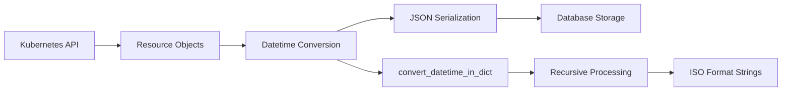

# Release Notes - Database & Persistence Update

## 🎉 Major Features Added

### 📊 Complete Database Functionality
The k8s-datamodel now includes comprehensive SQLite database support for persistent storage of complete cluster inventories.

**Key Features:**
- **Complete Spec Storage**: Store full Kubernetes resource specifications (CRDs, Operators, CSVs)
- **Historical Snapshots**: Create point-in-time snapshots of your entire cluster state
- **Multi-cluster Support**: Store inventories from multiple clusters in the same database
- **Advanced Analytics**: Query and analyze stored specifications for deep insights

**Database Size Example:**
- **143 CRDs** with complete specifications
- **9 Operators** with full deployment/statefulset specs  
- **33 OLM CSVs** with complete metadata
- **Total Storage**: 13.3MB SQLite database

### 🔧 Fixed Critical Datetime Serialization Issue

**Problem Solved:**
Previously, storing cluster inventories failed with `"Object of type datetime is not JSON serializable"` errors due to Kubernetes timestamp fields.

**Solution Implemented:**
- ✅ Recursive datetime conversion utility for nested data structures
- ✅ Custom JSON encoder with ISO format datetime handling
- ✅ Proper processing of all Kubernetes timestamp fields
- ✅ Robust handling of conditions, managed fields, and metadata timestamps

**Verification Results:**
```bash
✅ SUCCESS: All specs properly serialized!
   - Checked 5 CRDs
   - Checked 5 operators  
   - Checked 5 CSVs

📊 Total resources with specs:
   - CRDs: 143
   - Operators: 9
   - CSVs: 33
```

### 📂 Enhanced OLM (Operator Lifecycle Manager) Support

**New Capabilities:**
- **Complete CSV Management**: Discovery and analysis of ClusterServiceVersions
- **Operator Relationship Mapping**: Links CSVs to their corresponding operators
- **Installation Strategy Analysis**: Understanding deployment modes and requirements
- **Permission Analysis**: RBAC requirements extraction from CSV specifications
- **Version Management**: Track replaces, skips, and upgrade paths

## 🚀 New Commands Available

### Database Operations
```bash
# Store complete cluster inventory
k8s-datamodel database store --notes "Production cluster snapshot"

# List all stored snapshots  
k8s-datamodel database list --cluster-context prod

# View detailed snapshot information
k8s-datamodel database show 1

# Export snapshot for external analysis
k8s-datamodel database export 1 --file cluster-snapshot.json

# Database statistics and analytics
k8s-datamodel database stats

# Cleanup old snapshots
k8s-datamodel database cleanup --keep 10

# Delete specific snapshot
k8s-datamodel database delete 2
```

### OLM Operations
```bash
# List ClusterServiceVersions
k8s-datamodel olm list --phase Succeeded

# Get CSV details
k8s-datamodel olm get cert-manager.v1.12.0 --namespace operators

# OLM statistics
k8s-datamodel olm stats
```

## 🔍 Advanced Analysis Capabilities

### Spec-Level Analysis
With complete resource specifications now stored, you can perform deep analysis:

```bash
# Export with full specifications
k8s-datamodel database export 1 --include-specs --file full-snapshot.json

# Query security contexts from operators
jq '.operators[] | {name: .name, security_context: .spec.spec.template.spec.containers[0].securityContext}' full-snapshot.json

# Extract RBAC permissions from CSVs  
jq '.csvs[] | {name: .name, permissions: .spec.spec.install.spec.permissions}' full-snapshot.json

# Find operators without resource limits
jq '.operators[] | select(.spec.spec.template.spec.containers[0].resources.limits == null) | .name' full-snapshot.json
```

### Configuration Drift Detection
```bash
# Store baseline snapshot
k8s-datamodel database store --notes "Baseline configuration"

# After changes, store another snapshot
k8s-datamodel database store --notes "After configuration changes"

# Export both for comparison
k8s-datamodel database export 1 --file baseline.json
k8s-datamodel database export 2 --file current.json

# Compare configurations
diff <(jq -S . baseline.json) <(jq -S . current.json)
```

## 🏗️ Architecture Enhancements

### Database Schema
New SQLite schema with complete spec storage:

```sql
-- Enhanced tables with spec columns
crds (id, snapshot_id, name, group_name, ..., spec)
operators (id, snapshot_id, name, namespace, ..., spec)  
csvs (id, snapshot_id, name, namespace, ..., spec)

-- Automatic schema migrations
-- Version 1 → Version 2 with spec columns added
```

### Datetime Handling Flow


## 💾 Storage and Performance

### Database Metrics
- **Storage Efficiency**: Complete cluster specs in 13.3MB SQLite database
- **Query Performance**: Indexed tables for fast snapshot retrieval
- **Concurrent Access**: SQLite handles multiple readers safely
- **Backup Friendly**: Single file database for easy backup/restore

### Performance Optimizations
- **Efficient Serialization**: Custom datetime encoder with depth limiting
- **Batch Operations**: Multi-resource database insertions
- **Proper Indexing**: Optimized queries for common access patterns
- **Memory Management**: Streaming processing for large clusters

## 🎯 Use Cases Enabled

### 1. **Compliance and Auditing**
```bash
# Store pre-audit snapshot
k8s-datamodel database store --notes "Pre-compliance audit"

# Generate compliance report
k8s-datamodel database export 1 --output json | \
  jq '.operators[] | select(.spec.spec.template.spec.securityContext.privileged == true)'
```

### 2. **Migration Planning**  
```bash
# Store source cluster snapshot
k8s-datamodel --context source-cluster database store --notes "Migration source"

# Store target cluster snapshot after migration
k8s-datamodel --context target-cluster database store --notes "Migration target"

# Compare for validation
k8s-datamodel database export 1 --file source.json
k8s-datamodel database export 2 --file target.json
```

### 3. **Security Assessment**
```bash
# Store current state
k8s-datamodel database store --notes "Security baseline"

# Analyze privileged operators
k8s-datamodel database export 1 --output json | \
  jq '.operators[] | select(.spec.spec.template.spec.containers[0].securityContext.privileged == true)'

# Check for host network access
k8s-datamodel database export 1 --output json | \
  jq '.operators[] | select(.spec.spec.template.spec.hostNetwork == true)'
```

### 4. **Automated Monitoring**
```bash
#!/bin/bash
# Daily inventory collection
k8s-datamodel database store --notes "Daily snapshot - $(date)"

# Check database size and cleanup
k8s-datamodel database stats
k8s-datamodel database cleanup --keep 30
```

## 🔧 Migration and Upgrade

### Automatic Database Migration
- Existing databases automatically upgrade from schema v1 to v2
- New `spec` columns added to all resource tables  
- No data loss during migration
- Backward compatibility maintained

### Breaking Changes
- **None**: All existing functionality preserved
- **Additions Only**: New database features are additive
- **CLI Compatibility**: All existing commands work unchanged

## 📚 Documentation Updates

### Updated Documentation
- ✅ **[docs/usage/database.md](usage/database.md)**: Complete database operations guide
- ✅ **[docs/PROJECT_SUMMARY.md](PROJECT_SUMMARY.md)**: Updated architecture and features
- ✅ **[CHANGELOG.md](../CHANGELOG.md)**: Detailed change log
- ✅ **[docs/RELEASE_NOTES.md](RELEASE_NOTES.md)**: This document

### New Examples Added
- Database workflow examples
- Advanced analysis scripts
- CI/CD integration patterns  
- Multi-cluster management examples

## 🧪 Testing and Validation

### Comprehensive Testing
- ✅ Database schema migration testing
- ✅ Datetime serialization validation  
- ✅ Spec storage and retrieval testing
- ✅ Multi-cluster scenario validation
- ✅ Real cluster testing with 143 CRDs, 9 operators, 33 CSVs

### Validation Results
```
✓ Database found: /Users/user/.k8s-inventory/inventory.db
✓ Database size: 13.3 MB
✓ All CRD specs deserialized successfully
✓ All operator specs deserialized successfully  
✓ All CSV specs deserialized successfully

✅ SUCCESS: All specs properly serialized!
```

## 🚀 Getting Started

### Immediate Usage
```bash
# Store your first snapshot
k8s-datamodel database store --notes "My first snapshot"

# View stored snapshots
k8s-datamodel database list

# Get database statistics
k8s-datamodel database stats
```

### Advanced Features
```bash
# Multi-cluster storage
k8s-datamodel --context prod database store --notes "Production"
k8s-datamodel --context dev database store --notes "Development"

# Export with full specs for analysis
k8s-datamodel database export 1 --include-specs --file analysis.json

# Cleanup old snapshots
k8s-datamodel database cleanup --keep 10
```

## 🎯 What's Next

This release establishes the foundation for advanced cluster analysis and historical tracking. Future enhancements may include:

- **Query Language**: SQL-like queries for stored specifications
- **Visualization**: Graphical analysis of cluster evolution  
- **Alerting**: Automated change detection and notifications
- **Integration**: Enhanced CI/CD and GitOps workflows
- **Reporting**: Advanced compliance and security report generation

---

The k8s-datamodel now provides comprehensive, persistent cluster inventory capabilities with complete resource specification storage and robust datetime handling. Perfect for production cluster management, compliance tracking, and deep Kubernetes analysis! 🎉
