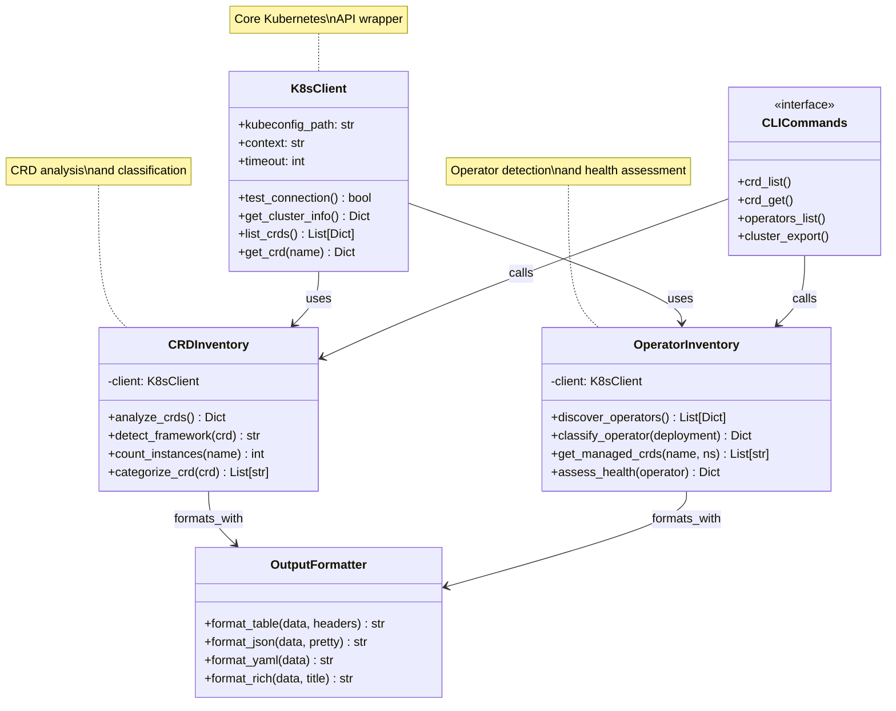
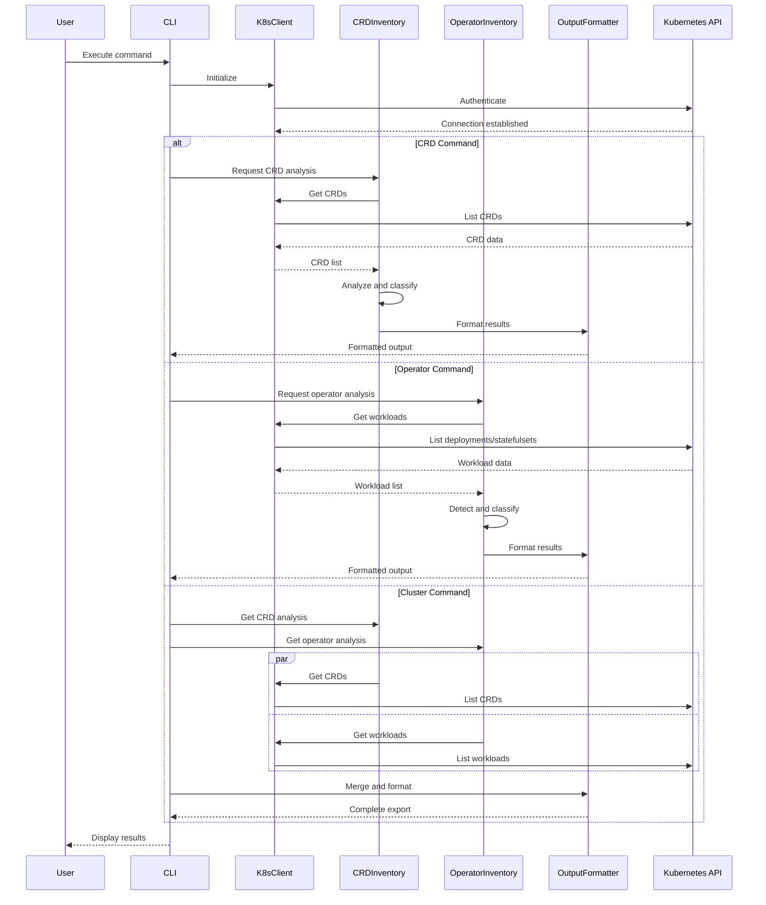

# Core Modules Reference

API reference for the core Python modules that power K8s Inventory CLI.

## Overview

The core modules provide the underlying functionality for Kubernetes cluster inventory and analysis. These modules can be imported and used directly in Python applications.

## Module Architecture

### Class Relationship Diagram



### Component Flow Diagram



```
src/k8s_inventory_cli/
├── core/
│   ├── k8s_client.py          # Kubernetes API client wrapper
│   ├── crd_inventory.py       # CRD discovery and analysis
│   └── operator_inventory.py  # Operator detection and classification
├── utils/
│   └── formatters.py          # Output formatting utilities
└── commands/
    ├── crd.py                 # CRD CLI commands
    ├── operators.py           # Operator CLI commands
    └── cluster.py             # Cluster CLI commands
```

## Core Modules

### k8s_client.py

Kubernetes API client wrapper with enhanced functionality.

#### Classes

##### `K8sClient`

Main client for Kubernetes API operations.

```python path=/Users/brun_s/Documents/veille-technologique/Personnel/kubernetes-datamodel/k8s-datamodel/src/k8s_inventory_cli/core/k8s_client.py start=null
from k8s_inventory_cli.core.k8s_client import K8sClient

# Initialize client
client = K8sClient(kubeconfig_path="~/.kube/config", context="my-context")

# Test connection
is_connected = await client.test_connection()

# Get cluster information
cluster_info = await client.get_cluster_info()
```

**Constructor Parameters:**
- `kubeconfig_path` (str, optional): Path to kubeconfig file
- `context` (str, optional): Kubernetes context to use
- `timeout` (int, optional): Request timeout in seconds (default: 30)

**Methods:**

###### `test_connection() -> bool`

Test connectivity to the Kubernetes cluster.

```python path=null start=null
try:
    connected = await client.test_connection()
    if connected:
        print("Successfully connected to cluster")
except Exception as e:
    print(f"Connection failed: {e}")
```

**Returns:** `bool` - True if connection successful

**Raises:** 
- `ConnectionError`: Network connectivity issues
- `AuthenticationError`: Authentication failures
- `PermissionError`: Insufficient RBAC permissions

###### `get_cluster_info() -> Dict`

Retrieve comprehensive cluster information.

```python path=null start=null
cluster_info = await client.get_cluster_info()
print(f"Kubernetes version: {cluster_info['version']}")
print(f"API server: {cluster_info['server']}")
print(f"Node count: {cluster_info['node_count']}")
```

**Returns:** Dictionary containing:
- `version`: Kubernetes version string
- `server`: API server endpoint
- `node_count`: Number of cluster nodes
- `api_resources`: Available API resources

###### `list_crds(group_filter=None, scope_filter=None) -> List[Dict]`

List Custom Resource Definitions with optional filtering.

```python path=null start=null
# List all CRDs
all_crds = await client.list_crds()

# Filter by group
cert_manager_crds = await client.list_crds(group_filter="cert-manager.io")

# Filter by scope
cluster_scoped = await client.list_crds(scope_filter="Cluster")
```

**Parameters:**
- `group_filter` (str, optional): Filter by API group
- `scope_filter` (str, optional): Filter by scope ("Namespaced" or "Cluster")

**Returns:** List of CRD dictionaries

###### `get_crd(name: str) -> Dict`

Get detailed information about a specific CRD.

```python path=null start=null
crd_details = await client.get_crd("certificates.cert-manager.io")
print(f"CRD versions: {crd_details['spec']['versions']}")
```

**Parameters:**
- `name` (str): Full CRD name

**Returns:** Complete CRD specification

**Raises:** `ResourceNotFoundError` if CRD doesn't exist

#### Configuration

The client automatically loads configuration from:

1. Explicit kubeconfig path parameter
2. `KUBECONFIG` environment variable  
3. Default location (`~/.kube/config`)

### crd_inventory.py

CRD discovery and analysis functionality.

#### Classes

##### `CRDInventory`

Comprehensive CRD analysis and categorization.

```python path=null start=null
from k8s_inventory_cli.core.crd_inventory import CRDInventory

# Initialize inventory
inventory = CRDInventory(client)

# Get comprehensive CRD analysis
analysis = await inventory.analyze_crds()
```

**Constructor Parameters:**
- `client` (K8sClient): Kubernetes client instance

**Methods:**

###### `analyze_crds(filters=None) -> Dict`

Perform comprehensive CRD analysis.

```python path=null start=null
analysis = await inventory.analyze_crds({
    "group": "cert-manager.io",
    "scope": "Namespaced"
})

print(f"Found {len(analysis['crds'])} CRDs")
print(f"Framework distribution: {analysis['frameworks']}")
```

**Parameters:**
- `filters` (dict, optional): Filtering criteria

**Returns:** Dictionary containing:
- `crds`: List of analyzed CRDs
- `summary`: Statistical summary
- `frameworks`: Framework distribution
- `categories`: Category breakdown

###### `detect_framework(crd: Dict) -> str`

Detect deployment framework for a CRD.

```python path=null start=null
framework = inventory.detect_framework(crd_definition)
# Returns: "Helm", "OLM", or "Manual"
```

**Parameters:**
- `crd` (dict): CRD definition

**Returns:** Framework name string

###### `count_instances(crd_name: str, namespace=None) -> int`

Count instances of a custom resource.

```python path=null start=null
# Count all instances
total_count = await inventory.count_instances("certificates.cert-manager.io")

# Count in specific namespace
ns_count = await inventory.count_instances(
    "certificates.cert-manager.io", 
    namespace="default"
)
```

**Parameters:**
- `crd_name` (str): CRD name
- `namespace` (str, optional): Specific namespace

**Returns:** Instance count

###### `categorize_crd(crd: Dict) -> List[str]`

Categorize CRD by functionality.

```python path=null start=null
categories = inventory.categorize_crd(crd_definition)
# Example: ["networking", "security", "ingress"]
```

**Parameters:**
- `crd` (dict): CRD definition

**Returns:** List of category strings

#### Data Structures

##### CRD Analysis Result

```python path=null start=null
{
    "name": "certificates.cert-manager.io",
    "group": "cert-manager.io", 
    "kind": "Certificate",
    "scope": "Namespaced",
    "versions": ["v1", "v1beta1"],
    "categories": ["cert-manager"],
    "short_names": ["cert", "certs"],
    "age_days": 30,
    "instance_count": 5,
    "framework": "Helm",
    "creation_timestamp": "2024-01-15T10:30:00Z",
    "status": {
        "conditions": [...],
        "accepted_names": {...}
    }
}
```

### operator_inventory.py

Operator detection and classification.

#### Classes

##### `OperatorInventory`

Kubernetes operator discovery and analysis.

```python path=null start=null
from k8s_inventory_cli.core.operator_inventory import OperatorInventory

# Initialize operator inventory
op_inventory = OperatorInventory(client)

# Discover operators
operators = await op_inventory.discover_operators()
```

**Constructor Parameters:**
- `client` (K8sClient): Kubernetes client instance

**Methods:**

###### `discover_operators(namespace=None, framework_filter=None) -> List[Dict]`

Discover and classify operators in the cluster.

```python path=null start=null
# Discover all operators
all_operators = await op_inventory.discover_operators()

# Filter by namespace
kube_system_ops = await op_inventory.discover_operators(namespace="kube-system")

# Filter by framework
olm_operators = await op_inventory.discover_operators(framework_filter="OLM")
```

**Parameters:**
- `namespace` (str, optional): Target namespace
- `framework_filter` (str, optional): Framework filter

**Returns:** List of operator dictionaries

###### `classify_operator(deployment: Dict) -> Dict`

Classify a deployment as an operator.

```python path=null start=null
operator_info = op_inventory.classify_operator(deployment_spec)
```

**Parameters:**
- `deployment` (dict): Deployment specification

**Returns:** Operator classification data

###### `get_managed_crds(operator_name: str, namespace: str) -> List[str]`

Get CRDs managed by a specific operator.

```python path=null start=null
managed_crds = await op_inventory.get_managed_crds("cert-manager", "cert-manager")
print(f"Managed CRDs: {managed_crds}")
```

**Parameters:**
- `operator_name` (str): Operator name
- `namespace` (str): Operator namespace

**Returns:** List of managed CRD names

###### `assess_health(operator: Dict) -> Dict`

Assess operator health status.

```python path=null start=null
health_status = await op_inventory.assess_health(operator_data)
print(f"Health: {health_status['status']}")  # "Healthy", "Degraded", "Failed"
```

**Parameters:**
- `operator` (dict): Operator data

**Returns:** Health assessment dictionary

#### Operator Detection Logic

The operator detection uses multiple criteria:

1. **Image Analysis**: Container images containing "operator", "controller"
2. **Label Analysis**: Standard operator labels and annotations
3. **CRD Ownership**: Controllers managing CRDs
4. **RBAC Patterns**: ServiceAccounts with elevated permissions
5. **Port Analysis**: Common operator ports (8080, 9443, etc.)

#### Data Structures

##### Operator Result

```python path=null start=null
{
    "name": "cert-manager",
    "namespace": "cert-manager",
    "framework": "Helm",
    "image": "quay.io/jetstack/cert-manager-controller:v1.11.0",
    "image_version": "v1.11.0",
    "replicas": {
        "desired": 1,
        "ready": 1,
        "available": 1
    },
    "health_status": "Healthy",
    "managed_crds": [
        "certificates.cert-manager.io",
        "issuers.cert-manager.io"
    ],
    "resources": {
        "requests": {"cpu": "10m", "memory": "32Mi"},
        "limits": {"cpu": "100m", "memory": "128Mi"}
    },
    "security_context": {
        "privileged": false,
        "run_as_non_root": true
    }
}
```

## Utility Modules

### formatters.py

Output formatting utilities for different formats.

#### Classes

##### `OutputFormatter`

Multi-format output formatting.

```python path=null start=null
from k8s_inventory_cli.utils.formatters import OutputFormatter

formatter = OutputFormatter()

# Format as table
table_output = formatter.format_table(data, headers=["Name", "Group", "Age"])

# Format as JSON
json_output = formatter.format_json(data, pretty=True)

# Format as YAML
yaml_output = formatter.format_yaml(data)
```

**Methods:**

###### `format_table(data: List[Dict], headers: List[str], **kwargs) -> str`

Format data as ASCII table.

**Parameters:**
- `data`: List of data dictionaries
- `headers`: Column headers
- `max_width`: Maximum column width
- `sort_by`: Sort column

###### `format_json(data: Any, pretty: bool = False) -> str`

Format data as JSON.

###### `format_yaml(data: Any) -> str`

Format data as YAML.

###### `format_rich(data: List[Dict], title: str = None) -> str`

Format data with rich styling and colors.

## Error Classes

### Custom Exceptions

```python path=null start=null
from k8s_inventory_cli.core.exceptions import (
    K8sInventoryError,
    ConnectionError, 
    AuthenticationError,
    PermissionError,
    ResourceNotFoundError
)
```

#### Exception Hierarchy

```python path=null start=null
K8sInventoryError
├── ConnectionError
├── AuthenticationError  
├── PermissionError
├── ResourceNotFoundError
└── ConfigurationError
```

## Usage Examples

### Basic Inventory Script

```python path=null start=null
#!/usr/bin/env python3
"""
Basic cluster inventory script using core modules.
"""
import asyncio
from k8s_inventory_cli.core import K8sClient, CRDInventory, OperatorInventory

async def main():
    # Initialize client
    client = K8sClient()
    
    # Test connection
    if not await client.test_connection():
        print("Failed to connect to cluster")
        return
    
    # Initialize inventories
    crd_inventory = CRDInventory(client)
    op_inventory = OperatorInventory(client)
    
    # Get CRD analysis
    crd_analysis = await crd_inventory.analyze_crds()
    print(f"Found {len(crd_analysis['crds'])} CRDs")
    
    # Discover operators
    operators = await op_inventory.discover_operators()
    print(f"Found {len(operators)} operators")
    
    # Framework breakdown
    frameworks = {}
    for op in operators:
        framework = op['framework']
        frameworks[framework] = frameworks.get(framework, 0) + 1
    
    print(f"Framework distribution: {frameworks}")

if __name__ == "__main__":
    asyncio.run(main())
```

### Custom Analysis Script

```python path=null start=null
#!/usr/bin/env python3
"""
Custom analysis focusing on security implications.
"""
import asyncio
from k8s_inventory_cli.core import K8sClient, OperatorInventory

async def security_analysis():
    client = K8sClient()
    op_inventory = OperatorInventory(client)
    
    operators = await op_inventory.discover_operators()
    
    # Find privileged operators
    privileged_ops = [
        op for op in operators 
        if op.get('security_context', {}).get('privileged', False)
    ]
    
    # Find cluster-scoped operators
    cluster_ops = [
        op for op in operators
        if any('cluster' in crd.lower() for crd in op.get('managed_crds', []))
    ]
    
    print(f"Privileged operators: {len(privileged_ops)}")
    print(f"Cluster-scoped operators: {len(cluster_ops)}")
    
    return {
        'privileged_operators': privileged_ops,
        'cluster_operators': cluster_ops
    }

if __name__ == "__main__":
    results = asyncio.run(security_analysis())
```

### Integration with Monitoring

```python path=null start=null
#!/usr/bin/env python3
"""
Generate metrics for monitoring systems.
"""
import asyncio
import json
from k8s_inventory_cli.core import K8sClient, CRDInventory, OperatorInventory

async def generate_metrics():
    client = K8sClient()
    crd_inventory = CRDInventory(client)
    op_inventory = OperatorInventory(client)
    
    # Get data
    crd_analysis = await crd_inventory.analyze_crds()
    operators = await op_inventory.discover_operators()
    
    # Calculate metrics
    metrics = {
        'k8s_inventory_crds_total': len(crd_analysis['crds']),
        'k8s_inventory_operators_total': len(operators),
        'k8s_inventory_operators_healthy': len([
            op for op in operators 
            if op['health_status'] == 'Healthy'
        ]),
        'k8s_inventory_frameworks': {
            framework: len([op for op in operators if op['framework'] == framework])
            for framework in set(op['framework'] for op in operators)
        }
    }
    
    return metrics

async def export_prometheus_metrics():
    metrics = await generate_metrics()
    
    # Export in Prometheus format
    for metric, value in metrics.items():
        if isinstance(value, dict):
            for label, count in value.items():
                print(f'{metric}{{framework="{label}"}} {count}')
        else:
            print(f'{metric} {value}')

if __name__ == "__main__":
    asyncio.run(export_prometheus_metrics())
```

## Configuration

### Environment Variables

The core modules respect these environment variables:

- `KUBECONFIG`: Path to kubeconfig file
- `K8S_INVENTORY_TIMEOUT`: Default request timeout
- `K8S_INVENTORY_CACHE_TTL`: Cache time-to-live in seconds

### Configuration File

Core modules can use configuration files:

```yaml path=null start=null
# ~/.k8s-inventory/config.yaml
client:
  timeout: 30
  retries: 3
  
inventory:
  cache_ttl: 300
  parallel_workers: 10
  
detection:
  operator_patterns:
    - "*operator*"
    - "*controller*" 
    - "*manager*"
```

## Performance Considerations

### Async Operations

All I/O operations are async for better performance:

```python path=null start=null
# Concurrent operations
import asyncio

async def parallel_analysis():
    client = K8sClient()
    crd_inventory = CRDInventory(client)
    op_inventory = OperatorInventory(client)
    
    # Run in parallel
    crd_task = asyncio.create_task(crd_inventory.analyze_crds())
    op_task = asyncio.create_task(op_inventory.discover_operators())
    
    crds, operators = await asyncio.gather(crd_task, op_task)
    
    return crds, operators
```

### Caching

Results are cached to improve performance:

```python path=null start=null
# Cache is automatically managed, but can be controlled
client = K8sClient(cache_ttl=600)  # 10-minute cache
```

## Testing

### Unit Tests

```python path=null start=null
import pytest
from unittest.mock import AsyncMock
from k8s_inventory_cli.core import K8sClient

@pytest.mark.asyncio
async def test_client_connection():
    client = K8sClient()
    client._api_client = AsyncMock()
    
    result = await client.test_connection()
    assert result is True
```

### Integration Tests

```python path=null start=null
@pytest.mark.integration
async def test_live_cluster():
    client = K8sClient()
    
    # Skip if no cluster available
    if not await client.test_connection():
        pytest.skip("No cluster available")
    
    crds = await client.list_crds()
    assert isinstance(crds, list)
```

## Related Documentation

- [CLI Commands](cli.md): CLI interface to these modules
- [Usage Examples](../usage/): Practical usage scenarios
- [Contributing](../contributing.md): Development guidelines
