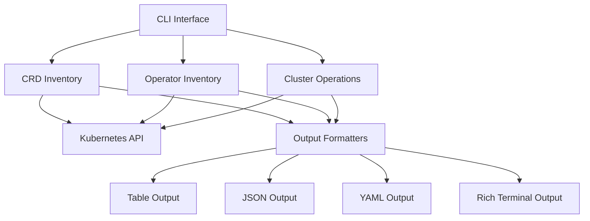

# K8s Inventory CLI

A comprehensive CLI tool to inventory Custom Resource Definitions (CRDs) and operators in Kubernetes clusters.

## Features

- **CRD Inventory**: List and analyze all Custom Resource Definitions in your cluster
- **Operator Detection**: Automatically identify and inventory operators (deployments, statefulsets)  
- **Framework Detection**: Detect operator frameworks (OLM, Helm, Manual)
- **Multiple Output Formats**: Support for table, JSON, YAML, and rich terminal output
- **Filtering & Search**: Filter resources by namespace, group, framework, and more
- **Export Capabilities**: Export complete inventories for analysis and reporting
- **Cluster Analysis**: Comprehensive cluster summaries and statistics

## Architecture



## Quick Start

### Installation

```bash
# Install with pipx (recommended)
pipx install k8s-inventory-cli

# Or install with pip
pip install k8s-inventory-cli
```

### Basic Usage

```bash
# List all CRDs in the cluster
k8s-inventory crd list

# List all operators
k8s-inventory operators list

# Get cluster summary
k8s-inventory cluster summary

# Export complete inventory
k8s-inventory cluster export --file inventory.json
```

## Use Cases

- **Cluster Auditing**: Understand what custom resources and operators are deployed
- **Migration Planning**: Inventory resources before cluster migrations
- **Security Assessment**: Identify all operators and their frameworks
- **Documentation**: Generate cluster documentation automatically
- **Monitoring**: Track changes in CRDs and operators over time

## Output Examples

### CRD Listing

```bash
$ k8s-inventory crd list --output rich
```

### Operator Inventory

```bash
$ k8s-inventory operators list --framework OLM
```

### Cluster Summary

```bash
$ k8s-inventory cluster summary
```

## Requirements

- Python 3.10+
- Access to a Kubernetes cluster
- Valid kubeconfig file

## License

This project is licensed under the MIT License - see the [LICENSE](LICENSE) file for details.

## Contributing

Contributions are welcome! Please see [Contributing](contributing.md) for guidelines.
