# K8s Inventory CLI

A comprehensive CLI tool to inventory Custom Resource Definitions (CRDs) and operators in Kubernetes clusters.

## Features

- **CRD Inventory**: List and analyze all Custom Resource Definitions in your cluster
- **Operator Detection**: Automatically identify and inventory operators (deployments, statefulsets)  
- **Framework Detection**: Detect operator frameworks (OLM, Helm, Manual)
- **Database Storage**: Persistent SQLite storage for historical tracking and snapshots
- **Snapshot Management**: Store, list, view, and compare inventory snapshots over time
- **Multiple Output Formats**: Support for table, JSON, YAML, and rich terminal output
- **Filtering & Search**: Filter resources by namespace, group, framework, and more
- **Export Capabilities**: Export complete inventories for analysis and reporting
- **Cluster Analysis**: Comprehensive cluster summaries and statistics

## Architecture

### System Overview

```mermaid
graph TB
    subgraph "User Interface"
        CLI["🖥️ CLI Commands"]
        CONFIG["⚙️ Configuration"]
    end
    
    subgraph "Core Engine"
        MAIN["🎯 Main Controller"]
        CLIENT["🔌 K8s Client"]
        
        subgraph "Inventory Modules"
            CRD_INV["📋 CRD Inventory"]
            OP_INV["🤖 Operator Inventory"]
            CLUSTER["🏗️ Cluster Operations"]
        end
        
        subgraph "Analysis Engine"
            DETECT["🔍 Framework Detection"]
            CLASSIFY["📊 Classification"]
            HEALTH["💚 Health Assessment"]
        end
    end
    
    subgraph "Output Layer"
        FORMATTER["🎨 Formatters"]
        
        subgraph "Output Formats"
            TABLE["📋 Table"]
            JSON["📄 JSON"]
            YAML["📝 YAML"]
            RICH["🌈 Rich"]
        end
    end
    
    subgraph "Storage Layer"
        DATABASE["💾 SQLite Database"]
        
        subgraph "Database Operations"
            SNAPSHOTS["📸 Snapshots"]
            HISTORY["📊 Historical Data"]
            EXPORT_DB["📤 Export"]
        end
    end
    
    subgraph "Kubernetes Cluster"
        API["⚡ API Server"]
        
        subgraph "Resources"
            CRDS["📦 CRDs"]
            DEPLOYS["🚀 Deployments"]
            PODS["🐳 Pods"]
            SVC["🌐 Services"]
        end
    end
    
    CLI --> CONFIG
    CLI --> MAIN
    MAIN --> CLIENT
    CLIENT --> CRD_INV
    CLIENT --> OP_INV
    CLIENT --> CLUSTER
    
    CRD_INV --> DETECT
    OP_INV --> DETECT
    OP_INV --> CLASSIFY
    OP_INV --> HEALTH
    
    CRD_INV --> FORMATTER
    OP_INV --> FORMATTER
    CLUSTER --> FORMATTER
    
    CRD_INV --> DATABASE
    OP_INV --> DATABASE
    CLUSTER --> DATABASE
    
    DATABASE --> SNAPSHOTS
    DATABASE --> HISTORY
    DATABASE --> EXPORT_DB
    
    FORMATTER --> TABLE
    FORMATTER --> JSON
    FORMATTER --> YAML
    FORMATTER --> RICH
    
    CLIENT --> API
    API --> CRDS
    API --> DEPLOYS
    API --> PODS
    API --> SVC
```



### Data Flow Architecture

```mermaid
flowchart LR
    subgraph "Input"
        USER["👤 User Command"]
        KUBECONFIG["🔐 Kubeconfig"]
    end
    
    subgraph "Processing Pipeline"
        AUTH["🔓 Authentication"]
        CONNECT["🔗 Connection"]
        DISCOVER["🔍 Discovery"]
        ANALYZE["📊 Analysis"]
        FORMAT["🎨 Formatting"]
    end
    
    subgraph "Output"
        DISPLAY["💻 Display"]
        EXPORT["📁 Export"]
    end
    
    USER --> AUTH
    KUBECONFIG --> AUTH
    AUTH --> CONNECT
    CONNECT --> DISCOVER
    DISCOVER --> ANALYZE
    ANALYZE --> FORMAT
    FORMAT --> DISPLAY
    FORMAT --> EXPORT
    
    style USER fill:#e1f5fe
    style DISPLAY fill:#e8f5e8
    style EXPORT fill:#e8f5e8
```



## Quick Start

### Installation

```bash
# Install with pipx (recommended)
pipx install k8s-inventory-cli

# Or install with pip
pip install k8s-inventory-cli
```

### Basic Usage

```bash
# List all CRDs in the cluster
k8s-inventory crd list

# List all operators
k8s-inventory operators list

# Get cluster summary
k8s-inventory cluster summary

# Export complete inventory
k8s-inventory cluster export --file inventory.json

# Store inventory snapshot in database
k8s-inventory database store --notes "Production cluster snapshot"

# List stored snapshots
k8s-inventory database list
```

## Common Workflows

### Cluster Analysis Workflow

```mermaid
flowchart TD
    START(["🚀 Start Analysis"]) --> CONNECT{"🔗 Test Connection"}
    CONNECT -->|"✅ Success"| INFO["ℹ️ Get Cluster Info"]
    CONNECT -->|"❌ Failed"| ERROR1["⚠️ Connection Error"]
    
    INFO --> SUMMARY["📊 Generate Summary"]
    SUMMARY --> CRD_LIST["📋 List CRDs"]
    CRD_LIST --> OP_LIST["🤖 List Operators"]
    OP_LIST --> ANALYZE["🔍 Analyze Relationships"]
    ANALYZE --> EXPORT["📤 Export Results"]
    EXPORT --> END(["✅ Analysis Complete")
    
    ERROR1 --> END
    
    style START fill:#e3f2fd
    style END fill:#e8f5e8
    style ERROR1 fill:#ffebee
```

### Operator Discovery Process


### Database Storage and Historical Tracking

```mermaid
flowchart TD
    subgraph "Data Collection"
        LIVE_CRDS["📦 Live CRDs"]
        LIVE_OPS["🤖 Live Operators"]
        LIVE_CLUSTER["🏗️ Live Cluster"]
    end
    
    subgraph "Database Storage"
        SNAPSHOT["📸 Create Snapshot"]
        DB[("💾 SQLite Database")]
        
        subgraph "Stored Data"
            SNAP_META["📋 Snapshot Metadata"]
            HIST_CRDS["📦 Historical CRDs"]
            HIST_OPS["🤖 Historical Operators"]
            HIST_CSVS["📜 Historical CSVs"]
        end
    end
    
    subgraph "Database Operations"
        LIST["📝 List Snapshots"]
        COMPARE["🔍 Compare"]
        EXPORT["📤 Export"]
        CLEANUP["🧹 Cleanup"]
    end
    
    subgraph "Analysis & Reporting"
        TRENDS["📈 Trend Analysis"]
        COMPLIANCE["🛡️ Compliance Reports"]
        AUDIT["📊 Audit Trails"]
        ALERTS["🚨 Change Alerts"]
    end
    
    LIVE_CRDS --> SNAPSHOT
    LIVE_OPS --> SNAPSHOT
    LIVE_CLUSTER --> SNAPSHOT
    
    SNAPSHOT --> DB
    DB --> SNAP_META
    DB --> HIST_CRDS
    DB --> HIST_OPS
    DB --> HIST_CSVS
    
    DB --> LIST
    DB --> COMPARE
    DB --> EXPORT
    DB --> CLEANUP
    
    LIST --> TRENDS
    COMPARE --> COMPLIANCE
    EXPORT --> AUDIT
    COMPARE --> ALERTS
    
    style DB fill:#e1f5fe
    style SNAPSHOT fill:#e8f5e8
    style TRENDS fill:#fff3e0
```



### Export and Integration Flow

```mermaid
graph LR
    subgraph "Data Sources"
        CRDS["📦 CRDs"]
        OPS["🤖 Operators"]
        CLUSTER["🏗️ Cluster Info"]
        DATABASE_SRC["💾 Database Snapshots"]
    end
    
    subgraph "Processing"
        COLLECT["📥 Collect Data"]
        ENRICH["✨ Enrich Metadata"]
        VALIDATE["✅ Validate"]
    end
    
    subgraph "Output Formats"
        JSON_OUT["📄 JSON"]
        YAML_OUT["📝 YAML"]
        CSV_OUT["📊 CSV"]
    end
    
    subgraph "Integration Targets"
        MONITORING["📈 Monitoring"]
        CICD["🔄 CI/CD"]
        DOCS["📚 Documentation"]
        COMPLIANCE["🛡️ Compliance"]
    end
    
    CRDS --> COLLECT
    OPS --> COLLECT
    CLUSTER --> COLLECT
    DATABASE_SRC --> COLLECT
    
    COLLECT --> ENRICH
    ENRICH --> VALIDATE
    
    VALIDATE --> JSON_OUT
    VALIDATE --> YAML_OUT
    VALIDATE --> CSV_OUT
    
    JSON_OUT --> MONITORING
    JSON_OUT --> CICD
    YAML_OUT --> DOCS
    JSON_OUT --> COMPLIANCE
```



## Use Cases

- **Cluster Auditing**: Understand what custom resources and operators are deployed
- **Historical Tracking**: Store and compare cluster inventories over time using database snapshots
- **Migration Planning**: Inventory resources before cluster migrations and track changes
- **Security Assessment**: Identify all operators and their frameworks with audit trails
- **Compliance Reporting**: Generate historical compliance reports from stored snapshots
- **Change Management**: Track and alert on changes to critical cluster resources
- **Documentation**: Generate cluster documentation automatically with historical context
- **Monitoring**: Track changes in CRDs and operators over time with persistent storage
- **Trend Analysis**: Analyze resource growth and changes across multiple time periods

## 📚 Comprehensive Examples

Explore our extensive collection of real-world examples and workflows:

- **[Database Workflows](examples/database-workflows.md)** - Complete database operations, CI/CD integration, and monitoring
- **[OLM Management](examples/olm-workflows.md)** - Operator Lifecycle Manager operations, RBAC analysis, and troubleshooting  
- **[Security & Compliance](examples/security-compliance.md)** - Enterprise security baselines, compliance reporting (SOC 2, PCI DSS), and automated monitoring

Each section includes ready-to-use scripts, detailed explanations, and enterprise-grade best practices.

## Output Examples

### CRD Listing

```bash
$ k8s-inventory crd list --output rich
```

### Operator Inventory

```bash
$ k8s-inventory operators list --framework OLM
```

### Cluster Summary

```bash
$ k8s-inventory cluster summary
```

## Requirements

- Python 3.10+
- Access to a Kubernetes cluster
- Valid kubeconfig file

## License

This project is licensed under the MIT License - see the [LICENSE](LICENSE) file for details.

## Contributing

Contributions are welcome! Please see [Contributing](contributing.md) for guidelines.
