# Cluster Operations

Comprehensive guide for cluster-wide operations and analysis using K8s Inventory CLI.

## Overview

Cluster operations provide high-level commands to analyze, test, and export complete inventory data from your Kubernetes cluster.

## Available Commands

### Test Connection

Verify connectivity to your Kubernetes cluster:

```bash
k8s-datamodel cluster test-connection
```

This command:
- Tests API server connectivity
- Validates authentication credentials  
- Checks basic RBAC permissions
- Reports cluster version and status
- Identifies connection issues

### Cluster Information

Get detailed information about your cluster:

```bash
k8s-datamodel cluster info
```

Provides:
- Kubernetes version information
- API server endpoint details
- Node count and status summary
- Available API resources
- Cluster configuration overview

### Cluster Summary

Generate a comprehensive statistical overview:

```bash
k8s-datamodel cluster summary
```

Includes:
- **CRD Statistics**: Total count, groups, scopes
- **Operator Analysis**: Framework breakdown, health status
- **Resource Utilization**: Instance counts, usage patterns
- **Deployment Patterns**: Framework distribution
- **Health Overview**: Cluster-wide health indicators

### Export Complete Inventory

Export comprehensive cluster inventory data:

```bash
k8s-datamodel cluster export
```

#### Export Options

Specify output file:
```bash
k8s-datamodel cluster export --file cluster-inventory.json
```

Choose output format:
```bash
k8s-datamodel cluster export --output json --file inventory.json
k8s-datamodel cluster export --output yaml --file inventory.yaml
```

Export to specific directory:
```bash
k8s-datamodel cluster export --file exports/full-inventory.json
```

## Cluster Analysis Workflow

```mermaid
flowchart TD
    subgraph "Initialization"
        START(["🚀 Start"]) --> AUTH["🔓 Authenticate"]
        AUTH --> CONNECT["🔗 Connect to Cluster"]
    end
    
    CONNECT --> TEST{"Connection OK?"}
    TEST -->|"❌ Failed"| ERROR["⚠️ Connection Error"]
    TEST -->|"✅ Success"| INFO["ℹ️ Gather Cluster Info"]
    
    subgraph "Data Collection"
        INFO --> PARALLEL_START["🔄 Start Parallel Collection"]
        
        PARALLEL_START --> CRD_COLLECT["📦 Collect CRDs"]
        PARALLEL_START --> OP_COLLECT["🤖 Collect Operators"]
        PARALLEL_START --> NODE_COLLECT["💻 Collect Nodes"]
        PARALLEL_START --> NS_COLLECT["🏷️ Collect Namespaces"]
    end
    
    subgraph "Analysis Phase"
        CRD_COLLECT --> CRD_ANALYZE["🔍 Analyze CRDs"]
        OP_COLLECT --> OP_ANALYZE["🔍 Analyze Operators"]
        NODE_COLLECT --> HEALTH_CHECK["💚 Health Assessment"]
        NS_COLLECT --> RESOURCE_COUNT["🔢 Resource Count"]
    end
    
    subgraph "Synthesis"
        CRD_ANALYZE --> MERGE["🔀 Merge Results"]
        OP_ANALYZE --> MERGE
        HEALTH_CHECK --> MERGE
        RESOURCE_COUNT --> MERGE
        
        MERGE --> SUMMARY["📊 Generate Summary"]
        SUMMARY --> RELATIONSHIPS["🔗 Map Relationships"]
    end
    
    subgraph "Output Generation"
        RELATIONSHIPS --> FORMAT{"🎨 Choose Format"}
        
        FORMAT -->|"📋 Table"| TABLE_OUT["📋 Table Output"]
        FORMAT -->|"📄 JSON"| JSON_OUT["📄 JSON Export"]
        FORMAT -->|"📝 YAML"| YAML_OUT["📝 YAML Export"]
        FORMAT -->|"🌈 Rich"| RICH_OUT["🌈 Rich Display"]
    end
    
    TABLE_OUT --> END(["✅ Complete"])
    JSON_OUT --> END
    YAML_OUT --> END
    RICH_OUT --> END
    ERROR --> END
    
    style START fill:#e3f2fd
    style END fill:#e8f5e8
    style ERROR fill:#ffebee
    style PARALLEL_START fill:#fff3e0
```



### Export Data Structure


## Understanding Cluster Data

### Export Contents

The cluster export includes:

#### CRD Information
- Complete CRD definitions and metadata
- Instance counts and distribution
- Framework classification
- Version and compatibility data
- Categories and capabilities

#### Operator Details  
- All detected operators and controllers
- Health status and replica information
- Image versions and deployment patterns
- Managed CRD relationships
- Resource requirements and constraints

#### Cluster Metadata
- Kubernetes version and build information
- Node architecture and capacity
- Available API groups and versions
- Authentication and authorization details
- Network and storage capabilities

### Data Relationships

The exported data maintains relationships between:
- Operators and their managed CRDs
- CRDs and their custom resource instances
- Namespaces and their contained resources
- Framework classifications and deployment patterns

## Output Formats

### JSON Format (Default)
```bash
k8s-datamodel cluster export --output json
```

Produces machine-readable JSON with complete structured data:
```json
{
  "cluster_info": {...},
  "crds": [...],
  "operators": [...],
  "summary": {...},
  "export_metadata": {...}
}
```

### YAML Format
```bash
k8s-datamodel cluster export --output yaml
```

Human-readable YAML format suitable for configuration management and GitOps workflows.

## Use Cases

### Cluster Migration

#### Pre-Migration Assessment
```bash
# Export complete inventory for migration planning
k8s-datamodel cluster export --file pre-migration-inventory.json

# Test connectivity to target cluster
k8s-datamodel cluster test-connection

# Compare cluster versions
k8s-datamodel cluster info
```

#### Migration Validation
```bash
# Export post-migration inventory
k8s-datamodel cluster export --file post-migration-inventory.json

# Compare inventories
diff <(jq '.crds | sort_by(.name)' pre-migration-inventory.json) \
     <(jq '.crds | sort_by(.name)' post-migration-inventory.json)
```

### Compliance and Auditing

#### Regular Compliance Exports
```bash
#!/bin/bash
DATE=$(date +%Y-%m-%d)
k8s-datamodel cluster export --file "compliance/inventory-$DATE.json"
```

#### Audit Trail Generation
```bash
# Generate audit summary
k8s-datamodel cluster summary --output json | \
  jq '{
    audit_date: now | strftime("%Y-%m-%d %H:%M:%S"),
    crd_count: .crds.total,
    operator_count: .operators.total,
    frameworks: .deployment_frameworks
  }'
```

### Disaster Recovery Planning

#### Backup Essential Data
```bash
# Export cluster inventory for DR documentation
k8s-datamodel cluster export --file dr-inventory.yaml --output yaml

# Document critical operators
k8s-datamodel operators list --output yaml > dr-operators.yaml
```

#### Recovery Validation
```bash
# Test cluster connectivity after recovery
k8s-datamodel cluster test-connection

# Validate operator health
k8s-datamodel cluster summary | grep -A 10 "Operator Health"
```

### Security Assessment

#### Security Audit Export
```bash
# Export for security analysis
k8s-datamodel cluster export --file security-audit.json

# Extract security-relevant information
jq '.operators[] | {
  name: .name,
  namespace: .namespace,
  privileged: .security_context.privileged,
  cluster_admin: .rbac.cluster_admin
}' security-audit.json
```

#### Privileged Resource Identification
```bash
# Find operators with elevated privileges
k8s-datamodel operators list --output json | \
  jq '.[] | select(.security_context.privileged == true)'
```

## Integration Patterns

### CI/CD Pipeline Integration

```bash
#!/bin/bash
# CI/CD cluster validation script

echo "Testing cluster connectivity..."
if ! k8s-datamodel cluster test-connection; then
  echo "Cluster connectivity failed"
  exit 1
fi

echo "Exporting cluster inventory..."
k8s-datamodel cluster export --file "artifacts/cluster-inventory-${BUILD_ID}.json"

echo "Validating critical operators..."
FAILED_OPERATORS=$(k8s-datamodel operators list --output json | \
  jq -r '.[] | select(.replicas.ready != .replicas.desired) | .name')

if [[ -n "$FAILED_OPERATORS" ]]; then
  echo "Failed operators detected: $FAILED_OPERATORS"
  exit 1
fi

echo "Cluster validation successful"
```

### Monitoring Integration

```bash
# Generate cluster metrics for monitoring
k8s-datamodel cluster summary --output json | \
  jq -r '
    "cluster_crd_count " + (.crds.total | tostring),
    "cluster_operator_count " + (.operators.total | tostring),
    "cluster_healthy_operators " + (.operators.healthy | tostring),
    "cluster_failed_operators " + (.operators.failed | tostring)
  '
```

### GitOps Workflow

```yaml
# .github/workflows/cluster-inventory.yml
name: Cluster Inventory Export
on:
  schedule:
    - cron: '0 6 * * *'  # Daily at 6 AM
  workflow_dispatch:

jobs:
  export-inventory:
    runs-on: ubuntu-latest
    steps:
      - uses: actions/checkout@v3
      
      - name: Setup kubectl
        uses: azure/setup-kubectl@v3
        
      - name: Test cluster connection
        run: k8s-datamodel cluster test-connection
        
      - name: Export cluster inventory
        run: |
          k8s-datamodel cluster export --file "inventory/$(date +%Y-%m-%d)-inventory.json"
          
      - name: Commit inventory
        run: |
          git config --local user.email "action@github.com"
          git config --local user.name "GitHub Action"
          git add inventory/
          git commit -m "chore: update cluster inventory $(date +%Y-%m-%d)" || exit 0
          git push
```

## Advanced Usage

### Multi-Cluster Management

```bash
# Export from multiple clusters
for context in $(kubectl config get-contexts -o name); do
  echo "Exporting from context: $context"
  KUBECONFIG=$HOME/.kube/config kubectl config use-context $context
  k8s-datamodel cluster export --file "exports/$context-inventory.json"
done
```

### Comparative Analysis

```bash
# Compare two cluster inventories
jq -n --slurpfile a cluster1.json --slurpfile b cluster2.json '
{
  cluster1_crds: $a[0].crds | length,
  cluster2_crds: $b[0].crds | length,
  common_crds: [$a[0].crds[].name] as $a_names |
               [$b[0].crds[].name] as $b_names |
               [$a_names[], $b_names[]] | group_by(.) | map(select(length > 1)) | flatten | unique,
  unique_to_cluster1: [$a[0].crds[].name] - [$b[0].crds[].name],
  unique_to_cluster2: [$b[0].crds[].name] - [$a[0].crds[].name]
}'
```

### Performance Monitoring

```bash
# Monitor export performance
time k8s-datamodel cluster export --file perf-test.json

# Analyze export size and content
ls -lh perf-test.json
jq 'keys' perf-test.json
```

## Troubleshooting

### Connection Issues

```bash
# Debug connection problems
k8s-datamodel cluster test-connection --verbose

# Check kubeconfig
kubectl config current-context
kubectl config view --minify
```

### Permission Problems

```bash
# Test required permissions
kubectl auth can-i get customresourcedefinitions
kubectl auth can-i get deployments --all-namespaces
kubectl auth can-i get statefulsets --all-namespaces
```

### Large Cluster Performance

```bash
# For clusters with many resources, consider filtering
k8s-datamodel operators list --namespace specific-namespace
k8s-datamodel crd list --group specific.domain.com

# Monitor memory usage during export
memory_before=$(ps -o rss= -p $$)
k8s-datamodel cluster export --file large-cluster.json
memory_after=$(ps -o rss= -p $$)
echo "Memory used: $((memory_after - memory_before)) KB"
```

### Export Validation

```bash
# Validate export integrity
if ! jq empty large-export.json; then
  echo "Export JSON is invalid"
  exit 1
fi

# Check export completeness
EXPECTED_SECTIONS=("cluster_info" "crds" "operators" "summary")
for section in "${EXPECTED_SECTIONS[@]}"; do
  if ! jq -e ".$section" large-export.json > /dev/null; then
    echo "Missing section: $section"
  fi
done
```

## Best Practices

### Regular Health Checks
- Schedule daily connection tests
- Monitor cluster summary trends over time
- Set up alerts for operator health changes
- Track CRD growth and deprecation patterns

### Data Management
- Implement retention policies for export files
- Compress large export files for storage
- Version control important inventory snapshots
- Archive pre-migration and post-migration exports

### Security Practices
- Secure export files containing sensitive cluster data
- Review RBAC permissions regularly
- Audit operator privilege escalations
- Monitor for unauthorized CRD installations

## Related Commands

- [CRDs](crds.md): Detailed CRD analysis and filtering
- [Operators](operators.md): Comprehensive operator management
- [Output Formats](output-formats.md): Format specifications and examples
