# CRD Commands

Comprehensive guide for working with Custom Resource Definitions (CRDs) using K8s Inventory CLI.

## Overview

The CRD commands provide powerful capabilities to discover, analyze, and inventory Custom Resource Definitions in your Kubernetes cluster.

## Available Commands

### List CRDs

Display all CRDs in your cluster with comprehensive metadata:

```bash
k8s-inventory crd list
```

#### Filtering Options

Filter CRDs by API group:
```bash
k8s-inventory crd list --group networking.k8s.io
k8s-inventory crd list --group operators.coreos.com
```

Filter by resource kind:
```bash
k8s-inventory crd list --kind VirtualService
k8s-inventory crd list --kind Subscription
```

Filter by scope (Namespaced/Cluster):
```bash
k8s-inventory crd list --scope Namespaced
k8s-inventory crd list --scope Cluster
```

### Get CRD Details

Retrieve detailed information about a specific CRD:

```bash
k8s-inventory crd get certificaterequests.cert-manager.io
```

This command provides:
- Complete CRD specification
- All available versions
- Conversion strategy
- Storage version
- Categories and short names
- Age and creation timestamp

### Count CRD Instances

Count how many custom resource instances exist for each CRD:

```bash
k8s-inventory crd count
```

With filtering:
```bash
k8s-inventory crd count --group cert-manager.io
k8s-inventory crd count --scope Cluster
```

## CRD Analysis Process

```mermaid
flowchart LR
    subgraph "Discovery Phase"
        API["⚡ K8s API"]
        FETCH["📥 Fetch CRDs"]
        FILTER["🔍 Apply Filters"]
    end
    
    subgraph "Analysis Phase"
        PARSE["🔍 Parse Spec"]
        FRAMEWORK["🏷️ Detect Framework"]
        CATEGORIZE["📊 Categorize"]
        COUNT["🔢 Count Instances"]
    end
    
    subgraph "Output Phase"
        FORMAT["🎨 Format Results"]
        DISPLAY["💻 Display"]
        EXPORT["📁 Export"]
    end
    
    API --> FETCH
    FETCH --> FILTER
    FILTER --> PARSE
    PARSE --> FRAMEWORK
    FRAMEWORK --> CATEGORIZE
    CATEGORIZE --> COUNT
    COUNT --> FORMAT
    FORMAT --> DISPLAY
    FORMAT --> EXPORT
    
    style API fill:#fff3e0
    style DISPLAY fill:#e8f5e8
    style EXPORT fill:#e8f5e8
```



## Understanding CRD Information

### Framework Detection

K8s Inventory CLI automatically detects how CRDs were deployed:

- **Helm**: CRDs installed via Helm charts
- **OLM**: CRDs managed by Operator Lifecycle Manager  
- **Manual**: CRDs applied directly via kubectl/API

### CRD Categories

CRDs are automatically categorized based on their metadata:
- API extensions
- Networking resources
- Security policies
- Storage classes
- Monitoring resources

### Instance Analysis

The tool can analyze actual custom resource instances:
- Count instances per namespace
- Identify unused CRDs
- Track resource creation patterns
- Monitor resource age distribution

### CRD Relationship Mapping


## Advanced Filtering

### Multiple Filters

Combine multiple filters for precise results:
```bash
k8s-inventory crd list --group networking.k8s.io --scope Namespaced
```

### Pattern Matching

Use wildcards in group names:
```bash
k8s-inventory crd list --group "*.coreos.com"
```

## Output Formats

All CRD commands support multiple output formats:

### Table Format (Default)
```bash
k8s-inventory crd list --output table
```
Human-readable grid with key information.

### Rich Format
```bash
k8s-inventory crd list --output rich
```
Enhanced terminal output with colors and styling.

### JSON Format
```bash
k8s-inventory crd list --output json
```
Machine-readable format perfect for scripting.

### YAML Format
```bash
k8s-inventory crd list --output yaml
```
Structured format for configuration management.

## Use Cases

### Cluster Migration Planning
```bash
# Identify all CRDs that need to be migrated
k8s-inventory crd list --output yaml > crds-inventory.yaml

# Check which CRDs have active instances
k8s-inventory crd count --output json > crd-usage.json
```

### Security Auditing
```bash
# List all cluster-scoped CRDs (potential security impact)
k8s-inventory crd list --scope Cluster

# Find CRDs from specific vendors
k8s-inventory crd list --group "*.example.com"
```

### Operator Management
```bash
# Find all OLM-managed CRDs
k8s-inventory crd list | grep "OLM"

# Analyze CRDs by framework
k8s-inventory crd list --output json | jq '.[] | select(.framework == "Helm")'
```

### Cleanup Operations
```bash
# Find CRDs with zero instances
k8s-inventory crd count | grep "0 instances"

# Identify old/deprecated CRDs
k8s-inventory crd list | sort -k6  # Sort by age
```

## Troubleshooting

### Permission Issues
If you encounter permission errors:
```bash
# Test cluster connection
k8s-inventory cluster test-connection

# Check your RBAC permissions
kubectl auth can-i get customresourcedefinitions
```

### Large Clusters
For clusters with many CRDs, use filtering to improve performance:
```bash
# Instead of listing all CRDs
k8s-inventory crd list --group specific.domain.com
```

### Output Formatting
Use `--verbose` flag for debugging:
```bash
k8s-inventory crd list --verbose
```

## Integration Examples

### CI/CD Pipeline Integration
```bash
#!/bin/bash
# Export CRD inventory for compliance reporting
k8s-inventory crd list --output json > artifacts/crd-inventory.json

# Check for unauthorized CRDs
UNAUTHORIZED=$(k8s-inventory crd list --group "untrusted.com" --output json)
if [[ "$UNAUTHORIZED" != "[]" ]]; then
  echo "Unauthorized CRDs detected!"
  exit 1
fi
```

### Monitoring Integration
```bash
# Generate metrics for monitoring systems
k8s-inventory crd count --output json | \
  jq -r '.[] | "\(.name) \(.instance_count)"' | \
  while read name count; do
    echo "crd_instances{name=\"$name\"} $count"
  done
```

## Related Commands

- [Operators](operators.md): Find operators managing these CRDs
- [Cluster Operations](cluster.md): Full cluster inventory including CRDs
- [Output Formats](output-formats.md): Detailed format specifications
