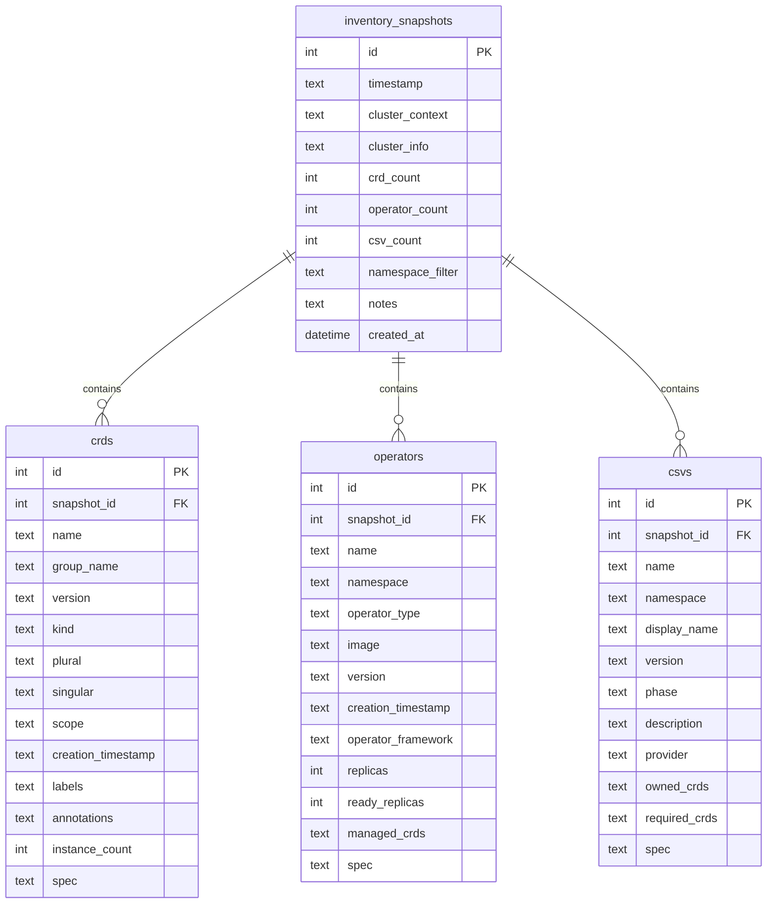

# Database Operations

The k8s-datamodel includes powerful database functionality for persistent storage and historical tracking of Kubernetes cluster inventories. This allows you to store complete snapshots of your cluster state, including the full specifications of all resources, compare changes over time, and maintain a comprehensive historical record of your Kubernetes resources.

## Overview

The database functionality provides:

- **Persistent Storage**: Store complete cluster inventories in SQLite database
- **Complete Spec Storage**: Store full Kubernetes resource specifications for deep analysis
- **Snapshot Management**: Create, list, view, and delete inventory snapshots
- **Historical Tracking**: Track changes in CRDs, operators, and OLM resources over time
- **Flexible Storage**: Choose what to include in each snapshot (CRDs, operators, OLM CSVs)
- **Multiple Cluster Support**: Store inventories from multiple clusters in the same database
- **Spec-level Analysis**: Query and analyze stored resource specifications

## Database Architecture

### Database Schema

The k8s-datamodel database uses SQLite and consists of the following main tables:



### Database Location

By default, the database is stored at:
- **Linux/macOS**: `~/.k8s-inventory/inventory.db`
- **Windows**: `%USERPROFILE%\.k8s-inventory\inventory.db`

You can specify a custom database location using the `--db-path` option.

## Storage Operations

### Storing Complete Inventory Snapshots

The primary way to store data is using the `database store` command, which creates a complete snapshot of your cluster's inventory:

```bash
# Store complete inventory snapshot
k8s-datamodel database store

# Store with descriptive notes
k8s-datamodel database store --notes "Production cluster before upgrade"

# Store only specific components
k8s-datamodel database store --no-crds --notes "Operators only"
k8s-datamodel database store --no-operators --no-olm --notes "CRDs only"
k8s-datamodel database store --no-crds --no-operators --notes "OLM CSVs only"
```

### Storing from Individual Commands

You can also store data while running individual inventory commands:

```bash
# Store CRDs while listing them
k8s-datamodel crd list --store-db --notes "CRD inventory snapshot"

# Store operators while listing them
k8s-datamodel operators list --store-db --notes "Operator inventory"

# Store OLM CSVs while listing them
k8s-datamodel olm list --store-db --notes "OLM snapshot"
```

### Custom Database Location

Use a custom database file:

```bash
# Use specific database file
k8s-datamodel --db-path /path/to/custom.db database store

# Store with custom location
k8s-datamodel crd list --store-db --db-path ./cluster-snapshots.db
```

### Multi-Cluster Storage

Store inventories from different clusters:

```bash
# Store from production cluster
k8s-datamodel --context prod-cluster database store --notes "Production inventory"

# Store from development cluster
k8s-datamodel --context dev-cluster database store --notes "Development inventory"

# Store from staging with specific namespace
k8s-datamodel --context staging --namespace app-namespace database store --notes "Staging app namespace"
```

## Querying and Viewing Data

### Listing Snapshots

View all stored snapshots:

```bash
# List all snapshots
k8s-datamodel database list

# List with rich formatting
k8s-datamodel database list --output rich

# Filter by cluster context
k8s-datamodel database list --cluster-context prod-cluster

# Limit number of results
k8s-datamodel database list --limit 10

# JSON output for scripting
k8s-datamodel database list --output json
```

Example output:
```
┏━━━━┳━━━━━━━━━━━━━━━━━━━━━┳━━━━━━━━━━━━━━━━┳━━━━━━━┳━━━━━━━━━━━┳━━━━━━━━━┳━━━━━━━━━━━━━━━━━━━━━━━━━━━━━━━━━━━━━━━━━━━━┓
┃ ID ┃ Timestamp           ┃ Cluster        ┃ CRDs  ┃ Operators ┃ CSVs    ┃ Notes                                    ┃
┡━━━━╇━━━━━━━━━━━━━━━━━━━━━╇━━━━━━━━━━━━━━━━╇━━━━━━━╇━━━━━━━━━━━╇━━━━━━━━━╇━━━━━━━━━━━━━━━━━━━━━━━━━━━━━━━━━━━━━━━━━━━━┩
│ 1  │ 2024-03-15 10:30:15 │ prod-cluster   │ 45    │ 12        │ 8       │ Production cluster before upgrade        │
│ 2  │ 2024-03-15 14:45:22 │ prod-cluster   │ 47    │ 12        │ 9       │ Production cluster after upgrade         │
│ 3  │ 2024-03-16 09:15:30 │ dev-cluster    │ 32    │ 8         │ 5       │ Development cluster inventory            │
└────┴─────────────────────┴────────────────┴───────┴───────────┴─────────┴──────────────────────────────────────────┘
```

### Viewing Snapshot Details

Get detailed information about a specific snapshot:

```bash
# Show snapshot details in YAML
k8s-datamodel database show 1

# Show in JSON format
k8s-datamodel database show 1 --output json
```

Example output:
```yaml
snapshot:
  id: 1
  timestamp: '2024-03-15 10:30:15'
  cluster_context: prod-cluster
  cluster_info:
    version: v1.28.3
    platform: eks
    nodes: 5
  crd_count: 45
  operator_count: 12
  csv_count: 8
  notes: Production cluster before upgrade
crds:
  - name: certificates.cert-manager.io
    group: cert-manager.io
    version: v1
    kind: Certificate
    scope: Namespaced
    instance_count: 23
  # ... more CRDs
operators:
  - name: cert-manager
    namespace: cert-manager
    type: Deployment
    framework: Helm
    version: v1.12.0
    replicas: 1
    ready_replicas: 1
  # ... more operators
csvs:
  - name: cert-manager.v1.12.0
    namespace: operators
    phase: Succeeded
    version: 1.12.0
    description: Certificate management for Kubernetes
  # ... more CSVs
```

### Exporting Snapshots

Export snapshots to files for external analysis:

```bash
# Export snapshot to JSON file
k8s-datamodel database export 1 --file snapshot-1.json

# Export to YAML
k8s-datamodel database export 1 --output yaml --file snapshot-1.yaml

# Export only specific components
k8s-datamodel database export 1 --crds-only --file crds-snapshot-1.json
k8s-datamodel database export 1 --operators-only --file operators-snapshot-1.json
```

## Database Management

### Database Statistics

View database statistics and storage information:

```bash
# Show database stats
k8s-datamodel database stats

# Rich formatted stats
k8s-datamodel database stats --output rich

# JSON output for monitoring
k8s-datamodel database stats --output json
```

Example output:
```
Database Statistics
━━━━━━━━━━━━━━━━━━━

📊 General Statistics:
  • Database Path: /Users/user/.k8s-inventory/inventory.db
  • Database Size: 2.4 MB
  • Total Snapshots: 15
  • Date Range: 2024-03-01 to 2024-03-20

📈 Content Statistics:
  • Total CRDs Stored: 678
  • Total Operators Stored: 156
  • Total CSVs Stored: 89
  • Unique Clusters: 3
  
🏗️ Cluster Breakdown:
  • prod-cluster: 8 snapshots
  • dev-cluster: 4 snapshots  
  • staging-cluster: 3 snapshots

💾 Storage Breakdown:
  • Snapshots: 45%
  • CRDs: 35%
  • Operators: 15%
  • CSVs: 5%
```

### Cleaning Up Old Snapshots

Manage database size by removing old snapshots:

```bash
# Delete specific snapshot
k8s-datamodel database delete 1

# Delete with confirmation skip
k8s-datamodel database delete 1 --yes

# Clean up old snapshots (keep most recent N)
k8s-datamodel database cleanup --keep 10

# Clean up by date
k8s-datamodel database cleanup --older-than "30 days"

# Clean up specific cluster
k8s-datamodel database cleanup --cluster-context dev-cluster --keep 5
```

### Database Backup and Restore

```bash
# Backup database
cp ~/.k8s-inventory/inventory.db ~/backups/inventory-backup-$(date +%Y%m%d).db

# Restore from backup
cp ~/backups/inventory-backup-20240315.db ~/.k8s-inventory/inventory.db

# Use custom database location for backup testing
k8s-datamodel --db-path ./test-restore.db database list
```

## Advanced Usage Patterns

### Automated Inventory Collection

Set up automated snapshot collection using cron or scheduled tasks:

```bash
#!/bin/bash
# daily-inventory.sh - Collect daily inventory snapshots

# Production cluster
k8s-datamodel --context prod-cluster database store --notes "Daily production snapshot - $(date)"

# Development cluster  
k8s-datamodel --context dev-cluster database store --notes "Daily development snapshot - $(date)"

# Cleanup old snapshots (keep 30 days)
k8s-datamodel database cleanup --keep 30
```

Add to crontab:
```bash
# Run daily at 2 AM
0 2 * * * /path/to/daily-inventory.sh
```

### Monitoring and Alerting

Extract metrics for monitoring systems:

```bash
# Get snapshot counts for monitoring
SNAPSHOT_COUNT=$(k8s-datamodel database stats --output json | jq '.total_snapshots')

# Get latest snapshot info
LATEST_SNAPSHOT=$(k8s-datamodel database list --limit 1 --output json | jq -r '.[0]')

# Check for recent snapshots (alert if none in 24 hours)
LATEST_TIME=$(k8s-datamodel database list --limit 1 --output json | jq -r '.[0].timestamp')
```

### Compliance and Auditing

Use database for compliance reporting:

```bash
# Generate compliance report for date range
k8s-datamodel database list --output json | jq '[.[] | select(.timestamp >= "2024-03-01" and .timestamp <= "2024-03-31")]' > march-compliance-report.json

# Export security-relevant operators
k8s-datamodel database show 1 --output json | jq '.operators[] | select(.framework == "OLM" and (.managed_crds | contains("security")))' > security-operators.json
```

### Multi-Environment Comparison

Compare inventories across environments:

```bash
# Store snapshots from different environments
k8s-datamodel --context prod database store --notes "Production baseline"
k8s-datamodel --context staging database store --notes "Staging baseline"
k8s-datamodel --context dev database store --notes "Development baseline"

# Export for comparison
k8s-datamodel database export 1 --file prod-inventory.json
k8s-datamodel database export 2 --file staging-inventory.json  
k8s-datamodel database export 3 --file dev-inventory.json

# Use external tools to diff the JSON files
diff <(jq -S . prod-inventory.json) <(jq -S . staging-inventory.json)
```

## Advanced Spec Analysis

With complete resource specifications stored in the database, you can perform deep analysis of your Kubernetes resources:

### Querying Resource Specifications

```bash
# Export snapshot with full specifications
k8s-datamodel database export 1 --include-specs --file full-snapshot.json

# Query CRD specifications from exported data
jq '.crds[] | select(.name == "certificates.cert-manager.io") | .spec' full-snapshot.json

# Query operator container configurations
jq '.operators[] | {name: .name, spec: .spec.spec.template.spec.containers[0]}' full-snapshot.json

# Extract security contexts from all operators
jq '.operators[] | {name: .name, security_context: .spec.spec.template.spec.containers[0].securityContext}' full-snapshot.json
```

### Configuration Drift Analysis

```bash
# Compare operator configurations between snapshots
k8s-datamodel database export 1 --file snapshot1.json
k8s-datamodel database export 2 --file snapshot2.json

# Extract and compare specific operator specs
jq '.operators[] | select(.name == "cert-manager") | .spec' snapshot1.json > op1.json
jq '.operators[] | select(.name == "cert-manager") | .spec' snapshot2.json > op2.json
diff op1.json op2.json

# Compare CRD schema changes
jq '.crds[] | select(.name == "certificates.cert-manager.io") | .spec.spec.versions[0].schema' snapshot1.json > crd1.json
jq '.crds[] | select(.name == "certificates.cert-manager.io") | .spec.spec.versions[0].schema' snapshot2.json > crd2.json
diff crd1.json crd2.json
```

### Security Analysis

```bash
# Find operators with privileged security contexts
k8s-datamodel database export-all --output json | \
  jq '.[] | .operators[] | select(.spec.spec.template.spec.containers[0].securityContext.privileged == true)'

# Extract RBAC permissions from CSVs
k8s-datamodel database export 1 --output json | \
  jq '.csvs[] | {name: .name, permissions: .spec.spec.install.spec.permissions}'

# Find operators with host network access
k8s-datamodel database export 1 --output json | \
  jq '.operators[] | select(.spec.spec.template.spec.hostNetwork == true)'
```

### Resource Requirements Analysis

```bash
# Analyze resource requests and limits
k8s-datamodel database export 1 --output json | \
  jq '.operators[] | {name: .name, resources: .spec.spec.template.spec.containers[0].resources}'

# Find operators without resource limits
k8s-datamodel database export 1 --output json | \
  jq '.operators[] | select(.spec.spec.template.spec.containers[0].resources.limits == null) | .name'

# Calculate total resource requests across snapshots
k8s-datamodel database list --output json | \
  jq -r '.[] | "\(.id) \(.timestamp)"' | \
  while read id timestamp; do
    echo "Snapshot $id ($timestamp):"
    k8s-datamodel database export $id --output json | \
      jq '[.operators[] | .spec.spec.template.spec.containers[0].resources.requests] | add'
  done
```

### Custom Analysis Scripts

Create custom analysis scripts using the stored specifications:

```bash
#!/bin/bash
# analyze-operator-images.sh - Analyze operator container images

SNAPSHOT_ID=${1:-"latest"}
if [ "$SNAPSHOT_ID" = "latest" ]; then
  SNAPSHOT_ID=$(k8s-datamodel database list --limit 1 --output json | jq -r '.[0].id')
fi

echo "Analyzing operator images in snapshot $SNAPSHOT_ID"
k8s-datamodel database export $SNAPSHOT_ID --output json | \
  jq -r '.operators[] | "\(.name),\(.namespace),\(.spec.spec.template.spec.containers[0].image)"' | \
  while IFS=, read name namespace image; do
    registry=$(echo $image | cut -d'/' -f1)
    echo "Operator: $name (ns: $namespace) - Registry: $registry - Image: $image"
  done
```

```python
#!/usr/bin/env python3
# analyze-crd-schemas.py - Analyze CRD schema complexity

import json
import sys
from collections import defaultdict

def count_schema_properties(schema, depth=0):
    """Count properties in a CRD schema recursively."""
    count = 0
    if isinstance(schema, dict) and 'properties' in schema:
        for prop_name, prop_def in schema['properties'].items():
            count += 1
            if isinstance(prop_def, dict) and 'properties' in prop_def:
                count += count_schema_properties(prop_def, depth + 1)
    return count

def main():
    if len(sys.argv) != 2:
        print("Usage: analyze-crd-schemas.py <snapshot-file.json>")
        sys.exit(1)
    
    with open(sys.argv[1]) as f:
        snapshot = json.load(f)
    
    complexity = defaultdict(int)
    
    for crd in snapshot.get('crds', []):
        if 'spec' in crd and 'spec' in crd['spec']:
            crd_spec = crd['spec']['spec']
            if 'versions' in crd_spec:
                for version in crd_spec['versions']:
                    if 'schema' in version and 'openAPIV3Schema' in version['schema']:
                        schema = version['schema']['openAPIV3Schema']
                        prop_count = count_schema_properties(schema)
                        complexity[crd['name']] = max(complexity[crd['name']], prop_count)
    
    print("CRD Schema Complexity Analysis:")
    print("===============================")
    for crd_name, count in sorted(complexity.items(), key=lambda x: x[1], reverse=True):
        print(f"{crd_name}: {count} properties")

if __name__ == '__main__':
    main()
```

## Integration Examples

### CI/CD Pipeline Integration

```yaml
# .github/workflows/inventory-tracking.yml
name: Track Cluster Inventory

on:
  schedule:
    - cron: '0 6 * * *'  # Daily at 6 AM
  workflow_dispatch:

jobs:
  inventory:
    runs-on: ubuntu-latest
    steps:
    - uses: actions/checkout@v4
    
    - name: Setup Python
      uses: actions/setup-python@v4
      with:
        python-version: '3.10'
    
    - name: Install k8s-datamodel
      run: pipx install k8s-datamodel
    
    - name: Configure kubectl
      run: |
        echo "${{ secrets.KUBECONFIG }}" | base64 -d > kubeconfig
        export KUBECONFIG=./kubeconfig
    
    - name: Store inventory snapshot
      run: |
        k8s-datamodel database store --notes "CI/CD automated snapshot - $(date)"
    
    - name: Upload database
      uses: actions/upload-artifact@v4
      with:
        name: inventory-database
        path: ~/.k8s-inventory/inventory.db
```

### Terraform Integration

```hcl
# terraform/inventory-snapshot.tf
resource "null_resource" "inventory_snapshot" {
  triggers = {
    cluster_version = var.cluster_version
  }
  
  provisioner "local-exec" {
    command = <<-EOT
      k8s-datamodel database store --notes "Terraform deployment - ${var.environment} - ${timestamp()}"
    EOT
  }
  
  depends_on = [kubernetes_deployment.applications]
}
```

## Troubleshooting

### Common Issues

**Database locked errors:**
```bash
# Check for running processes
ps aux | grep k8s-inventory

# Use different database file
k8s-datamodel --db-path ./temp.db database list
```

**Large database size:**
```bash
# Check database size
du -h ~/.k8s-inventory/inventory.db

# Clean up old snapshots
k8s-datamodel database cleanup --keep 10

# Vacuum database to reclaim space
sqlite3 ~/.k8s-inventory/inventory.db "VACUUM;"
```

**Missing snapshots:**
```bash
# Verify database integrity
sqlite3 ~/.k8s-inventory/inventory.db "PRAGMA integrity_check;"

# Check database schema
sqlite3 ~/.k8s-inventory/inventory.db ".schema"
```

### Performance Considerations

- **Large Clusters**: For clusters with hundreds of CRDs/operators, consider using namespace filters
- **Storage Space**: Monitor database growth and implement regular cleanup
- **Query Performance**: Database includes indexes for common query patterns
- **Concurrent Access**: SQLite handles concurrent reads but not concurrent writes

### Best Practices

1. **Regular Snapshots**: Set up automated daily/weekly snapshots
2. **Meaningful Notes**: Always include descriptive notes for snapshots
3. **Cleanup Strategy**: Implement regular cleanup to manage database size
4. **Backup Strategy**: Regular database backups for important environments
5. **Environment Separation**: Consider separate databases for different environments
6. **Security**: Protect database files containing cluster information

<citations>
<document>
<document_type>RULE</document_type>
<document_id>9aelDXM62tUDmHUQUL8XlE</document_id>
</document>
<document>
<document_type>RULE</document_type>
<document_id>FtUk1rgWdKE6veAClNpAqC</document_id>
</document>
<document>
<document_type>RULE</document_type>
<document_id>mHRxidOov0WLb90jeiS2uG</document_id>
</document>
</citations>
