# Operator Commands

Complete guide for discovering and analyzing Kubernetes operators using K8s Inventory CLI.

## Overview

The operator commands help you identify, classify, and analyze operators running in your Kubernetes cluster, including their managed CRDs and deployment patterns.

## Available Commands

### List Operators

Display all detected operators in your cluster:

```bash
k8s-datamodel operators list
```

#### Filtering Options

Filter operators by namespace:
```bash
k8s-datamodel operators list --namespace kube-system
k8s-datamodel operators list --namespace operators
```

Filter by deployment framework:
```bash
k8s-datamodel operators list --framework OLM
k8s-datamodel operators list --framework Helm  
k8s-datamodel operators list --framework Manual
```

### Get Operator Details

Retrieve comprehensive information about a specific operator:

```bash
k8s-datamodel operators get cert-manager --namespace cert-manager
```

This provides:
- Operator metadata and labels
- Container image information and versions
- Replica status and health
- Resource requirements and limits
- Deployment strategy
- Related ConfigMaps and Secrets

### Managed CRDs

Discover which CRDs are managed by a specific operator:

```bash
k8s-datamodel operators managed-crds cert-manager
```

This shows:
- All CRDs owned by the operator
- CRD versions and capabilities
- Resource relationships
- Instance counts per CRD

## Operator Detection Flow

```mermaid
flowchart TD
    START(["🔍 Start Detection"]) --> SCAN["📡 Scan Workloads"]
    
    SCAN --> DEPLOY{"🚀 Deployments"}
    SCAN --> STATEFUL{"📊 StatefulSets"}
    
    DEPLOY --> CHECK_IMAGE["🖼️ Check Image Name"]
    STATEFUL --> CHECK_IMAGE
    
    CHECK_IMAGE --> PATTERN{"Operator Pattern?"}
    PATTERN -->|"✅ Match"| CHECK_LABELS["🏷️ Check Labels"]
    PATTERN -->|"❌ No Match"| SKIP["⏭️ Skip"]
    
    CHECK_LABELS --> FRAMEWORK{"Framework Type?"}
    
    FRAMEWORK -->|"📦 OLM"| OLM_DETECT["🔍 OLM Detection"]
    FRAMEWORK -->|"⛵ Helm"| HELM_DETECT["🔍 Helm Detection"]
    FRAMEWORK -->|"✋ Manual"| MANUAL_DETECT["🔍 Manual Detection"]
    
    subgraph "OLM Analysis"
        OLM_DETECT --> CSV["📜 Check CSV"]
        CSV --> SUBSCRIPTION["📦 Check Subscription"]
        SUBSCRIPTION --> OLM_RESULT["📊 OLM Result"]
    end
    
    subgraph "Helm Analysis"
        HELM_DETECT --> CHART["📄 Check Chart"]
        CHART --> HELM_LABELS["🏷️ Helm Labels"]
        HELM_LABELS --> HELM_RESULT["📊 Helm Result"]
    end
    
    subgraph "Manual Analysis"
        MANUAL_DETECT --> RBAC["🔐 Check RBAC"]
        RBAC --> CRD_OWNER["📦 CRD Ownership"]
        CRD_OWNER --> MANUAL_RESULT["📊 Manual Result"]
    end
    
    OLM_RESULT --> HEALTH["💚 Health Check"]
    HELM_RESULT --> HEALTH
    MANUAL_RESULT --> HEALTH
    
    HEALTH --> CLASSIFY["📊 Classify"]
    CLASSIFY --> END(["✅ Detection Complete"])
    
    SKIP --> END
    
    style START fill:#e3f2fd
    style END fill:#e8f5e8
    style SKIP fill:#f5f5f5
```



## Operator Detection Logic

### Framework Classification

K8s Inventory CLI uses sophisticated detection logic:

#### OLM (Operator Lifecycle Manager)
- Detects operators managed by OLM
- Identifies CSV (ClusterServiceVersion) relationships
- Shows subscription and install plan status
- Tracks operator versions and upgrades

#### Helm-deployed Operators
- Identifies operators installed via Helm charts
- Shows Helm release information
- Tracks chart versions and repositories
- Displays Helm-specific annotations

#### Manual Deployments
- Catches operators deployed directly via kubectl
- Analyzes deployment patterns and labels
- Identifies common operator frameworks (Kubebuilder, Operator SDK)
- Detects custom deployment strategies

### Operator Identification

Operators are identified through multiple signals:
- Container image patterns (`*operator*`, `*controller*`)
- Common operator ports and health checks
- Standard operator labels and annotations
- CRD ownership references
- RBAC patterns (ServiceAccounts, Roles, ClusterRoles)

## Understanding Operator Information

### Health Status

Each operator's health is assessed through:
- **Replica Status**: Ready vs Desired replicas
- **Container Status**: Running, Waiting, or Terminated
- **Health Checks**: Liveness and readiness probe status
- **Resource Conditions**: Deployment and pod conditions

### Version Detection

K8s Inventory CLI extracts version information from:
- Container image tags
- Operator metadata labels
- OLM CSV specifications
- Helm chart annotations

### Resource Analysis

For each operator, the tool analyzes:
- CPU and memory requests/limits
- Storage requirements
- Network policies and service exposure
- Security contexts and privileges

## Advanced Filtering and Queries

### Multi-condition Filtering
```bash
# Find OLM operators in specific namespace
k8s-datamodel operators list --framework OLM --namespace operators

# Find unhealthy operators (combine with external tools)
k8s-datamodel operators list --output json | jq '.[] | select(.replicas.ready != .replicas.desired)'
```

### Cross-Reference with CRDs
```bash
# Find operators managing specific CRDs
k8s-datamodel operators list --output json | \
  jq '.[] | select(.managed_crds[] | contains("certificates"))'
```

## Output Formats

### Table Format (Default)
```bash
k8s-datamodel operators list --output table
```
Displays essential operator information in a readable grid.

### Rich Format
```bash
k8s-datamodel operators list --output rich
```
Enhanced output with color coding for health status and framework types.

### JSON Format
```bash
k8s-datamodel operators list --output json
```
Complete operator data for programmatic processing.

### YAML Format
```bash
k8s-datamodel operators list --output yaml
```
Structured format suitable for configuration and analysis.

## Use Cases

### Operator Auditing
```bash
# Get complete operator inventory
k8s-datamodel operators list --output yaml > operator-inventory.yaml

# Identify operators with elevated privileges
k8s-datamodel operators list --output json | \
  jq '.[] | select(.security_context.privileged == true)'
```

### Migration Planning
```bash
# List all operators that need to be migrated
k8s-datamodel operators list --output json > operators-to-migrate.json

# Check operator versions for compatibility
k8s-datamodel operators list | grep -E "v[0-9]+\.[0-9]+\.[0-9]+"
```

### Security Assessment
```bash
# Find operators with cluster-admin permissions
kubectl get clusterrolebindings -o json | \
  jq '.items[] | select(.roleRef.name == "cluster-admin") | .subjects[] | select(.kind == "ServiceAccount")'

# Cross-reference with operator list
k8s-datamodel operators list --namespace <namespace>
```

### Compliance Reporting
```bash
# Generate operator compliance report
k8s-datamodel operators list --output json | \
  jq '[.[] | {name, namespace, framework, version: .image_version, health: (.replicas.ready == .replicas.desired)}]'
```

### Troubleshooting Operators

#### Health Check Workflow
1. **List all operators**:
   ```bash
   k8s-datamodel operators list
   ```

2. **Identify unhealthy operators**:
   ```bash
   k8s-datamodel operators list --output json | jq '.[] | select(.replicas.ready != .replicas.desired)'
   ```

3. **Get detailed information**:
   ```bash
   k8s-datamodel operators get <operator-name> --namespace <namespace>
   ```

4. **Check managed CRDs**:
   ```bash
   k8s-datamodel operators managed-crds <operator-name>
   ```

#### Common Issues

**Permission Problems**:
```bash
# Check if operator service account has required permissions
kubectl auth can-i get customresourcedefinitions --as=system:serviceaccount:<namespace>:<operator-sa>
```

**Resource Constraints**:
```bash
# Check operator resource usage
k8s-datamodel operators list --output json | jq '.[] | {name, requests: .resources.requests, limits: .resources.limits}'
```

**CRD Conflicts**:
```bash
# Find operators managing the same CRDs
k8s-datamodel operators list --output json | \
  jq 'group_by(.managed_crds[]) | map(select(length > 1))'
```

## Integration Patterns

### Monitoring Integration
```bash
# Export operator metrics for monitoring
k8s-datamodel operators list --output json | \
  jq -r '.[] | "operator_healthy{name=\"\(.name)\",namespace=\"\(.namespace)\"} \(if .replicas.ready == .replicas.desired then 1 else 0 end)"'
```

### CI/CD Integration
```bash
#!/bin/bash
# Validate operator deployment in CI/CD
FAILED_OPERATORS=$(k8s-datamodel operators list --output json | jq -r '.[] | select(.replicas.ready != .replicas.desired) | .name')

if [[ -n "$FAILED_OPERATORS" ]]; then
  echo "Failed operators detected: $FAILED_OPERATORS"
  exit 1
fi
```

### GitOps Integration
```bash
# Generate operator state for GitOps comparison
k8s-datamodel operators list --output yaml | \
  yq eval 'sort_by(.name) | .[] | {"name": .name, "namespace": .namespace, "image": .image, "version": .image_version}' -
```

## Best Practices

### Regular Auditing
- Schedule periodic operator inventory exports
- Track operator version changes over time  
- Monitor for unauthorized operator deployments
- Validate operator health in monitoring systems

### Security Considerations
- Review operator RBAC permissions regularly
- Monitor operators with cluster-wide access
- Track operator image sources and registries
- Validate operator security contexts

### Operational Excellence
- Document operator dependencies and relationships
- Maintain operator version compatibility matrices
- Implement operator upgrade procedures
- Monitor operator resource consumption patterns

## Related Commands

- [CRDs](crds.md): Analyze CRDs managed by these operators
- [Cluster Operations](cluster.md): Complete cluster analysis including operators
- [Output Formats](output-formats.md): Detailed formatting options
