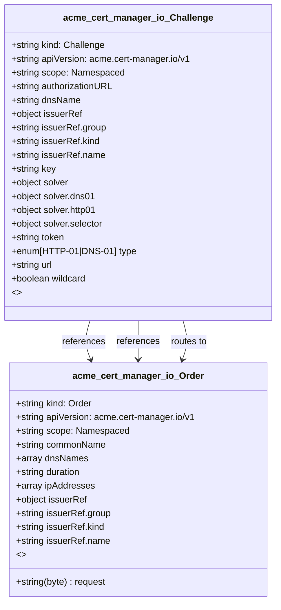

# CRD Schema Documentation - acme.cert-manager.io API Group

> **Generated:** 2025-09-07 17:05:14
> 
> **Total CRDs:** 2
> 
> **API Groups:** 1
> 
> **Description:** Complete schema documentation for Kubernetes Custom Resource Definitions (CRDs), including property definitions, types, relationships, and visual diagrams.

---

## 📋 Table of Contents

1. [Executive Summary](#-executive-summary)
2. [API Group Documentation](#-api-group-documentation)
   - [acme.cert-manager.io](#acmecertmanagerio) (2 CRDs)
3. [Appendices](#-appendices)
   - [CRD Index](#crd-index)
   - [Property Types Summary](#property-types-summary)
   - [Relationship Matrix](#relationship-matrix)

## 📊 Executive Summary

### Overview

This document provides comprehensive schema documentation for **2 Custom Resource Definitions** distributed across **1 API groups** in your Kubernetes cluster.

### Key Statistics

| Metric | Value |
|--------|-------|
| **Total CRDs** | 2 |
| **API Groups** | 1 |
| **Total Instances** | 0 |
| **Namespaced CRDs** | 2 (100.0%) |
| **Cluster-scoped CRDs** | 0 (0.0%) |
| **Schema Coverage** | 2/2 (100.0%) |

### Distribution Analysis

#### Largest API Groups (by CRD count)

1. **acme.cert-manager.io**: 2 CRDs

### Schema Analysis

**Most Complex CRDs (by property count):**

1. `Challenge` (acme.cert-manager.io): 9 properties
2. `Order` (acme.cert-manager.io): 6 properties

## 📁 acme.cert-manager.io

### Overview

**API Group:** `acme.cert-manager.io`  
**CRDs in Group:** 2  
**Total Instances:** 0

### CRDs in this Group

| Kind | Scope | Version | Instances | Description |
|------|-------|---------|-----------|-------------|
| `Challenge` | Namespaced | v1 | 0 | *No description available* |
| `Order` | Namespaced | v1 | 0 | *No description available* |

### Schema Diagram

### Detailed CRD Documentation

#### Challenge

**Full Name:** `challenges.acme.cert-manager.io`  
**API Version:** `acme.cert-manager.io/v1`  
**Scope:** Namespaced  
**Instances:** 0  
**Categories:** cert-manager, cert-manager-acme  

**Schema Properties:**

| Property | Type | Required | Description |
|----------|------|----------|-------------|
| `authorizationURL` | `string` | ✓ | The URL to the ACME Authorization resource that this
chal... |
| `dnsName` | `string` | ✓ | dnsName is the identifier that this challenge is for, e.g... |
| `issuerRef` | `object` | ✓ | References a properly configured ACME-type Issuer which s... |
| `key` | `string` | ✓ | The ACME challenge key for this challenge
For HTTP01 chal... |
| `solver` | `object` | ✓ | Contains the domain solving configuration that should be ... |
| `token` | `string` | ✓ | The ACME challenge token for this challenge.
This is the ... |
| `type` | `enum[HTTP-01|DNS-01]` | ✓ | The type of ACME challenge this resource represents.
One ... |
| `url` | `string` | ✓ | The URL of the ACME Challenge resource for this challenge... |
| `wildcard` | `boolean` |  | wildcard will be true if this challenge is for a wildcard... |

#### Order

**Full Name:** `orders.acme.cert-manager.io`  
**API Version:** `acme.cert-manager.io/v1`  
**Scope:** Namespaced  
**Instances:** 0  
**Categories:** cert-manager, cert-manager-acme  

**Schema Properties:**

| Property | Type | Required | Description |
|----------|------|----------|-------------|
| `issuerRef` | `object` | ✓ | IssuerRef references a properly configured ACME-type Issu... |
| `request` | `string(byte)` | ✓ | Certificate signing request bytes in DER encoding.
This w... |
| `commonName` | `string` |  | CommonName is the common name as specified on the DER enc... |
| `dnsNames` | `array<string>` |  | DNSNames is a list of DNS names that should be included a... |
| `duration` | `string` |  | Duration is the duration for the not after date for the r... |
| `ipAddresses` | `array<string>` |  | IPAddresses is a list of IP addresses that should be incl... |

## 📚 Appendices

### CRD Index

Complete alphabetical index of all Custom Resource Definitions:

| CRD Name | Kind | API Group | Scope | Instances |
|----------|------|-----------|-------|-----------|
| `challenges.acme.cert-manager.io` | `Challenge` | `acme.cert-manager.io` | Namespaced | 0 |
| `orders.acme.cert-manager.io` | `Order` | `acme.cert-manager.io` | Namespaced | 0 |

### Property Types Summary

Property type usage across all CRDs:

| Type | Usage Count |
|------|-------------|
| `string` | 9 |
| `object` | 3 |
| `array` | 2 |
| `boolean` | 1 |

### Relationship Matrix

Schema-based relationships detected between CRDs:

| Source CRD | Target CRD | API Group | Relationship Type |
|------------|------------|-----------|-------------------|
| `Challenge` | `Order` | `acme.cert-manager.io (intra-group)` | references |
| `Challenge` | `Order` | `acme.cert-manager.io (intra-group)` | references |
| `Challenge` | `Order` | `acme.cert-manager.io (intra-group)` | routes_to |

---

*Documentation generated by k8s-inventory-cli on 2025-09-07 17:05:14*