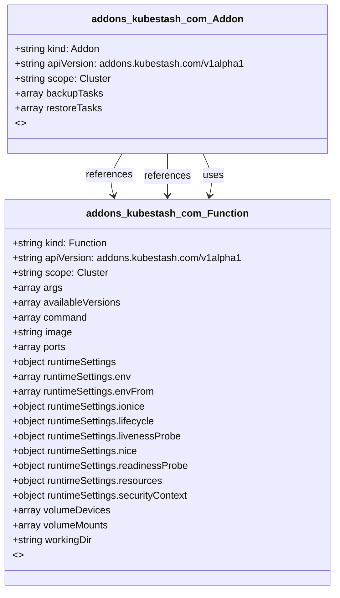

# CRD Schema Documentation - addons.kubestash.com API Group

> **Generated:** 2025-09-07 17:05:14
> 
> **Total CRDs:** 2
> 
> **API Groups:** 1
> 
> **Description:** Complete schema documentation for Kubernetes Custom Resource Definitions (CRDs), including property definitions, types, relationships, and visual diagrams.

---

## 📋 Table of Contents

1. [Executive Summary](#-executive-summary)
2. [API Group Documentation](#-api-group-documentation)
   - [addons.kubestash.com](#addonskubestashcom) (2 CRDs)
3. [Appendices](#-appendices)
   - [CRD Index](#crd-index)
   - [Property Types Summary](#property-types-summary)
   - [Relationship Matrix](#relationship-matrix)

## 📊 Executive Summary

### Overview

This document provides comprehensive schema documentation for **2 Custom Resource Definitions** distributed across **1 API groups** in your Kubernetes cluster.

### Key Statistics

| Metric | Value |
|--------|-------|
| **Total CRDs** | 2 |
| **API Groups** | 1 |
| **Total Instances** | 0 |
| **Namespaced CRDs** | 0 (0.0%) |
| **Cluster-scoped CRDs** | 2 (100.0%) |
| **Schema Coverage** | 2/2 (100.0%) |

### Distribution Analysis

#### Largest API Groups (by CRD count)

1. **addons.kubestash.com**: 2 CRDs

### Schema Analysis

**Most Complex CRDs (by property count):**

1. `Function` (addons.kubestash.com): 9 properties
2. `Addon` (addons.kubestash.com): 2 properties

## 📁 addons.kubestash.com

### Overview

**API Group:** `addons.kubestash.com`  
**CRDs in Group:** 2  
**Total Instances:** 0

### CRDs in this Group

| Kind | Scope | Version | Instances | Description |
|------|-------|---------|-----------|-------------|
| `Addon` | Cluster | v1alpha1 | 0 | *No description available* |
| `Function` | Cluster | v1alpha1 | 0 | *No description available* |

### Schema Diagram

### Detailed CRD Documentation

#### Addon

**Full Name:** `addons.addons.kubestash.com`  
**API Version:** `addons.kubestash.com/v1alpha1`  
**Scope:** Cluster  
**Instances:** 0  
**Categories:** kubestash, appscode, all  

**Schema Properties:**

| Property | Type | Required | Description |
|----------|------|----------|-------------|
| `backupTasks` | `array<object>` |  | *No description* |
| `restoreTasks` | `array<object>` |  | *No description* |

#### Function

**Full Name:** `functions.addons.kubestash.com`  
**API Version:** `addons.kubestash.com/v1alpha1`  
**Scope:** Cluster  
**Instances:** 0  
**Categories:** kubestash, appscode, all  
**Short Names:** fn  

**Schema Properties:**

| Property | Type | Required | Description |
|----------|------|----------|-------------|
| `args` | `array<string>` |  | *No description* |
| `availableVersions` | `array<string>` |  | *No description* |
| `command` | `array<string>` |  | *No description* |
| `image` | `string` |  | *No description* |
| `ports` | `array<object>` |  | *No description* |
| `runtimeSettings` | `object` |  | *No description* |
| `volumeDevices` | `array<object>` |  | *No description* |
| `volumeMounts` | `array<object>` |  | *No description* |
| `workingDir` | `string` |  | *No description* |

## 📚 Appendices

### CRD Index

Complete alphabetical index of all Custom Resource Definitions:

| CRD Name | Kind | API Group | Scope | Instances |
|----------|------|-----------|-------|-----------|
| `addons.addons.kubestash.com` | `Addon` | `addons.kubestash.com` | Cluster | 0 |
| `functions.addons.kubestash.com` | `Function` | `addons.kubestash.com` | Cluster | 0 |

### Property Types Summary

Property type usage across all CRDs:

| Type | Usage Count |
|------|-------------|
| `array` | 8 |
| `string` | 2 |
| `object` | 1 |

### Relationship Matrix

Schema-based relationships detected between CRDs:

| Source CRD | Target CRD | API Group | Relationship Type |
|------------|------------|-----------|-------------------|
| `Addon` | `Function` | `addons.kubestash.com (intra-group)` | references |
| `Addon` | `Function` | `addons.kubestash.com (intra-group)` | references |
| `Addon` | `Function` | `addons.kubestash.com (intra-group)` | uses |

---

*Documentation generated by k8s-inventory-cli on 2025-09-07 17:05:14*