# CRD Schema Documentation - archiver.kubedb.com API Group

> **Generated:** 2025-09-07 17:05:14
> 
> **Total CRDs:** 5
> 
> **API Groups:** 1
> 
> **Description:** Complete schema documentation for Kubernetes Custom Resource Definitions (CRDs), including property definitions, types, relationships, and visual diagrams.

---

## 📋 Table of Contents

1. [Executive Summary](#-executive-summary)
2. [API Group Documentation](#-api-group-documentation)
   - [archiver.kubedb.com](#archiverkubedbcom) (5 CRDs)
3. [Appendices](#-appendices)
   - [CRD Index](#crd-index)
   - [Property Types Summary](#property-types-summary)
   - [Relationship Matrix](#relationship-matrix)

## 📊 Executive Summary

### Overview

This document provides comprehensive schema documentation for **5 Custom Resource Definitions** distributed across **1 API groups** in your Kubernetes cluster.

### Key Statistics

| Metric | Value |
|--------|-------|
| **Total CRDs** | 5 |
| **API Groups** | 1 |
| **Total Instances** | 0 |
| **Namespaced CRDs** | 5 (100.0%) |
| **Cluster-scoped CRDs** | 0 (0.0%) |
| **Schema Coverage** | 5/5 (100.0%) |

### Distribution Analysis

#### Largest API Groups (by CRD count)

1. **archiver.kubedb.com**: 5 CRDs

### Schema Analysis

**Most Complex CRDs (by property count):**

1. `MariaDBArchiver` (archiver.kubedb.com): 9 properties
2. `MongoDBArchiver` (archiver.kubedb.com): 9 properties
3. `MSSQLServerArchiver` (archiver.kubedb.com): 9 properties

## 📁 archiver.kubedb.com

### Overview

**API Group:** `archiver.kubedb.com`  
**CRDs in Group:** 5  
**Total Instances:** 0

### CRDs in this Group

| Kind | Scope | Version | Instances | Description |
|------|-------|---------|-----------|-------------|
| `MSSQLServerArchiver` | Namespaced | v1alpha1 | 0 | *No description available* |
| `MariaDBArchiver` | Namespaced | v1alpha1 | 0 | *No description available* |
| `MongoDBArchiver` | Namespaced | v1alpha1 | 0 | *No description available* |
| `MySQLArchiver` | Namespaced | v1alpha1 | 0 | *No description available* |
| `PostgresArchiver` | Namespaced | v1alpha1 | 0 | *No description available* |

### Schema Diagram

```mermaid
classDiagram
    %% API Group: archiver.kubedb.com
    class archiver_kubedb_com_MSSQLServerArchiver {
        +string kind: MSSQLServerArchiver
        +string apiVersion: archiver.kubedb.com/v1alpha1
        +string scope: Namespaced
        +object backupStorage
        +object backupStorage.ref
        +string backupStorage.subDir
        +object databases
        +object databases.namespaces
        +object databases.selector
        +enum[Delete|WipeOut|Retain] deletionPolicy
        +object encryptionSecret
        +string encryptionSecret.name
        +string encryptionSecret.namespace
        +object fullBackup
        +object fullBackup.containerRuntimeSettings
        +enum[5 values] fullBackup.driver
        +object fullBackup.jobTemplate
        +object fullBackup.retryConfig
        +object fullBackup.scheduler
        +integer(int32) fullBackup.sessionHistoryLimit
        +object fullBackup.task
        +string fullBackup.timeout
        +object logBackup
        +object logBackup.configSecret
        +integer(int32) logBackup.failedLogHistoryLimit
        +object logBackup.runtimeSettings
        +integer(int32) logBackup.successfulLogHistoryLimit
        +object manifestBackup
        +object manifestBackup.containerRuntimeSettings
        +object manifestBackup.jobTemplate
        +object manifestBackup.retryConfig
        +object manifestBackup.scheduler
        +integer(int32) manifestBackup.sessionHistoryLimit
        +string manifestBackup.timeout
        +boolean pause
        +object retentionPolicy
        +string retentionPolicy.name
        +string retentionPolicy.namespace
    }
    archiver_kubedb_com_MSSQLServerArchiver : <<Namespaced>>
    class archiver_kubedb_com_MariaDBArchiver {
        +string kind: MariaDBArchiver
        +string apiVersion: archiver.kubedb.com/v1alpha1
        +string scope: Namespaced
        +object backupStorage
        +object backupStorage.ref
        +string backupStorage.subDir
        +object databases
        +object databases.namespaces
        +object databases.selector
        +enum[Delete|WipeOut|Retain] deletionPolicy
        +object encryptionSecret
        +string encryptionSecret.name
        +string encryptionSecret.namespace
        +object fullBackup
        +object fullBackup.containerRuntimeSettings
        +enum[5 values] fullBackup.driver
        +object fullBackup.jobTemplate
        +object fullBackup.retryConfig
        +object fullBackup.scheduler
        +integer(int32) fullBackup.sessionHistoryLimit
        +object fullBackup.task
        +string fullBackup.timeout
        +object logBackup
        +object logBackup.configSecret
        +integer(int32) logBackup.failedLogHistoryLimit
        +object logBackup.runtimeSettings
        +integer(int32) logBackup.successfulLogHistoryLimit
        +object manifestBackup
        +object manifestBackup.containerRuntimeSettings
        +object manifestBackup.jobTemplate
        +object manifestBackup.retryConfig
        +object manifestBackup.scheduler
        +integer(int32) manifestBackup.sessionHistoryLimit
        +string manifestBackup.timeout
        +boolean pause
        +object retentionPolicy
        +string retentionPolicy.name
        +string retentionPolicy.namespace
    }
    archiver_kubedb_com_MariaDBArchiver : <<Namespaced>>
    class archiver_kubedb_com_MongoDBArchiver {
        +string kind: MongoDBArchiver
        +string apiVersion: archiver.kubedb.com/v1alpha1
        +string scope: Namespaced
        +object backupStorage
        +object backupStorage.ref
        +string backupStorage.subDir
        +object databases
        +object databases.namespaces
        +object databases.selector
        +enum[Delete|WipeOut|Retain] deletionPolicy
        +object encryptionSecret
        +string encryptionSecret.name
        +string encryptionSecret.namespace
        +object fullBackup
        +object fullBackup.containerRuntimeSettings
        +enum[5 values] fullBackup.driver
        +object fullBackup.jobTemplate
        +object fullBackup.retryConfig
        +object fullBackup.scheduler
        +integer(int32) fullBackup.sessionHistoryLimit
        +object fullBackup.task
        +string fullBackup.timeout
        +object logBackup
        +object logBackup.configSecret
        +integer(int32) logBackup.failedLogHistoryLimit
        +object logBackup.runtimeSettings
        +integer(int32) logBackup.successfulLogHistoryLimit
        +object manifestBackup
        +object manifestBackup.containerRuntimeSettings
        +object manifestBackup.jobTemplate
        +object manifestBackup.retryConfig
        +object manifestBackup.scheduler
        +integer(int32) manifestBackup.sessionHistoryLimit
        +string manifestBackup.timeout
        +boolean pause
        +object retentionPolicy
        +string retentionPolicy.name
        +string retentionPolicy.namespace
    }
    archiver_kubedb_com_MongoDBArchiver : <<Namespaced>>
    class archiver_kubedb_com_MySQLArchiver {
        +string kind: MySQLArchiver
        +string apiVersion: archiver.kubedb.com/v1alpha1
        +string scope: Namespaced
        +object backupStorage
        +object backupStorage.ref
        +string backupStorage.subDir
        +object databases
        +object databases.namespaces
        +object databases.selector
        +enum[Delete|WipeOut|Retain] deletionPolicy
        +object encryptionSecret
        +string encryptionSecret.name
        +string encryptionSecret.namespace
        +object fullBackup
        +object fullBackup.containerRuntimeSettings
        +enum[5 values] fullBackup.driver
        +object fullBackup.jobTemplate
        +object fullBackup.retryConfig
        +object fullBackup.scheduler
        +integer(int32) fullBackup.sessionHistoryLimit
        +object fullBackup.task
        +string fullBackup.timeout
        +object logBackup
        +object logBackup.configSecret
        +integer(int32) logBackup.failedLogHistoryLimit
        +object logBackup.runtimeSettings
        +integer(int32) logBackup.successfulLogHistoryLimit
        +object manifestBackup
        +object manifestBackup.containerRuntimeSettings
        +object manifestBackup.jobTemplate
        +object manifestBackup.retryConfig
        +object manifestBackup.scheduler
        +integer(int32) manifestBackup.sessionHistoryLimit
        +string manifestBackup.timeout
        +boolean pause
        +object retentionPolicy
        +string retentionPolicy.name
        +string retentionPolicy.namespace
    }
    archiver_kubedb_com_MySQLArchiver : <<Namespaced>>
    class archiver_kubedb_com_PostgresArchiver {
        +string kind: PostgresArchiver
        +string apiVersion: archiver.kubedb.com/v1alpha1
        +string scope: Namespaced
        +object backupStorage
        +object backupStorage.ref
        +string backupStorage.subDir
        +object databases
        +object databases.namespaces
        +object databases.selector
        +enum[Delete|WipeOut|Retain] deletionPolicy
        +object encryptionSecret
        +string encryptionSecret.name
        +string encryptionSecret.namespace
        +object fullBackup
        +object fullBackup.containerRuntimeSettings
        +enum[5 values] fullBackup.driver
        +object fullBackup.jobTemplate
        +object fullBackup.retryConfig
        +object fullBackup.scheduler
        +integer(int32) fullBackup.sessionHistoryLimit
        +object fullBackup.task
        +string fullBackup.timeout
        +object logBackup
        +object logBackup.configSecret
        +integer(int32) logBackup.failedLogHistoryLimit
        +object logBackup.runtimeSettings
        +integer(int32) logBackup.successfulLogHistoryLimit
        +object manifestBackup
        +object manifestBackup.containerRuntimeSettings
        +object manifestBackup.jobTemplate
        +object manifestBackup.retryConfig
        +object manifestBackup.scheduler
        +integer(int32) manifestBackup.sessionHistoryLimit
        +string manifestBackup.timeout
        +boolean pause
        +object retentionPolicy
        +string retentionPolicy.name
        +string retentionPolicy.namespace
    }
    archiver_kubedb_com_PostgresArchiver : <<Namespaced>>
    archiver_kubedb_com_MariaDBArchiver --> archiver_kubedb_com_MongoDBArchiver : references
    archiver_kubedb_com_MariaDBArchiver --> archiver_kubedb_com_MongoDBArchiver : references
    archiver_kubedb_com_MariaDBArchiver --> archiver_kubedb_com_MongoDBArchiver : similar schema
    archiver_kubedb_com_MariaDBArchiver --> archiver_kubedb_com_MSSQLServerArchiver : references
    archiver_kubedb_com_MariaDBArchiver --> archiver_kubedb_com_MSSQLServerArchiver : references
    archiver_kubedb_com_MariaDBArchiver --> archiver_kubedb_com_MSSQLServerArchiver : similar schema
    archiver_kubedb_com_MariaDBArchiver --> archiver_kubedb_com_MySQLArchiver : references
    archiver_kubedb_com_MariaDBArchiver --> archiver_kubedb_com_MySQLArchiver : references
    archiver_kubedb_com_MariaDBArchiver --> archiver_kubedb_com_MySQLArchiver : similar schema
    archiver_kubedb_com_MariaDBArchiver --> archiver_kubedb_com_PostgresArchiver : references
    archiver_kubedb_com_MariaDBArchiver --> archiver_kubedb_com_PostgresArchiver : references
    archiver_kubedb_com_MariaDBArchiver --> archiver_kubedb_com_PostgresArchiver : similar schema
    archiver_kubedb_com_MongoDBArchiver --> archiver_kubedb_com_MSSQLServerArchiver : references
    archiver_kubedb_com_MongoDBArchiver --> archiver_kubedb_com_MSSQLServerArchiver : references
    archiver_kubedb_com_MongoDBArchiver --> archiver_kubedb_com_MSSQLServerArchiver : similar schema
    archiver_kubedb_com_MongoDBArchiver --> archiver_kubedb_com_MySQLArchiver : references
    archiver_kubedb_com_MongoDBArchiver --> archiver_kubedb_com_MySQLArchiver : references
    archiver_kubedb_com_MongoDBArchiver --> archiver_kubedb_com_MySQLArchiver : similar schema
    archiver_kubedb_com_MongoDBArchiver --> archiver_kubedb_com_PostgresArchiver : references
    archiver_kubedb_com_MongoDBArchiver --> archiver_kubedb_com_PostgresArchiver : references
    archiver_kubedb_com_MongoDBArchiver --> archiver_kubedb_com_PostgresArchiver : similar schema
    archiver_kubedb_com_MSSQLServerArchiver --> archiver_kubedb_com_MySQLArchiver : references
    archiver_kubedb_com_MSSQLServerArchiver --> archiver_kubedb_com_MySQLArchiver : references
    archiver_kubedb_com_MSSQLServerArchiver --> archiver_kubedb_com_MySQLArchiver : similar schema
    archiver_kubedb_com_MSSQLServerArchiver --> archiver_kubedb_com_PostgresArchiver : references
    archiver_kubedb_com_MSSQLServerArchiver --> archiver_kubedb_com_PostgresArchiver : references
    archiver_kubedb_com_MSSQLServerArchiver --> archiver_kubedb_com_PostgresArchiver : similar schema
    archiver_kubedb_com_MySQLArchiver --> archiver_kubedb_com_PostgresArchiver : references
    archiver_kubedb_com_MySQLArchiver --> archiver_kubedb_com_PostgresArchiver : references
    archiver_kubedb_com_MySQLArchiver --> archiver_kubedb_com_PostgresArchiver : similar schema
```

### Detailed CRD Documentation

#### MSSQLServerArchiver

**Full Name:** `mssqlserverarchivers.archiver.kubedb.com`  
**API Version:** `archiver.kubedb.com/v1alpha1`  
**Scope:** Namespaced  
**Instances:** 0  
**Categories:** archiver, kubedb, appscode  
**Short Names:** msarchiver  

**Schema Properties:**

| Property | Type | Required | Description |
|----------|------|----------|-------------|
| `databases` | `object` | ✓ | *No description* |
| `backupStorage` | `object` |  | *No description* |
| `deletionPolicy` | `enum[Delete|WipeOut|Retain]` |  | *No description* |
| `encryptionSecret` | `object` |  | *No description* |
| `fullBackup` | `object` |  | *No description* |
| `logBackup` | `object` |  | *No description* |
| `manifestBackup` | `object` |  | *No description* |
| `pause` | `boolean` |  | *No description* |
| `retentionPolicy` | `object` |  | *No description* |

#### MariaDBArchiver

**Full Name:** `mariadbarchivers.archiver.kubedb.com`  
**API Version:** `archiver.kubedb.com/v1alpha1`  
**Scope:** Namespaced  
**Instances:** 0  
**Categories:** archiver, kubedb, appscode  
**Short Names:** mdarchiver  

**Schema Properties:**

| Property | Type | Required | Description |
|----------|------|----------|-------------|
| `databases` | `object` | ✓ | *No description* |
| `backupStorage` | `object` |  | *No description* |
| `deletionPolicy` | `enum[Delete|WipeOut|Retain]` |  | *No description* |
| `encryptionSecret` | `object` |  | *No description* |
| `fullBackup` | `object` |  | *No description* |
| `logBackup` | `object` |  | *No description* |
| `manifestBackup` | `object` |  | *No description* |
| `pause` | `boolean` |  | *No description* |
| `retentionPolicy` | `object` |  | *No description* |

#### MongoDBArchiver

**Full Name:** `mongodbarchivers.archiver.kubedb.com`  
**API Version:** `archiver.kubedb.com/v1alpha1`  
**Scope:** Namespaced  
**Instances:** 0  
**Categories:** archiver, kubedb, appscode  
**Short Names:** mgarchiver  

**Schema Properties:**

| Property | Type | Required | Description |
|----------|------|----------|-------------|
| `databases` | `object` | ✓ | *No description* |
| `backupStorage` | `object` |  | *No description* |
| `deletionPolicy` | `enum[Delete|WipeOut|Retain]` |  | *No description* |
| `encryptionSecret` | `object` |  | *No description* |
| `fullBackup` | `object` |  | *No description* |
| `logBackup` | `object` |  | *No description* |
| `manifestBackup` | `object` |  | *No description* |
| `pause` | `boolean` |  | *No description* |
| `retentionPolicy` | `object` |  | *No description* |

#### MySQLArchiver

**Full Name:** `mysqlarchivers.archiver.kubedb.com`  
**API Version:** `archiver.kubedb.com/v1alpha1`  
**Scope:** Namespaced  
**Instances:** 0  
**Categories:** archiver, kubedb, appscode  
**Short Names:** myarchiver  

**Schema Properties:**

| Property | Type | Required | Description |
|----------|------|----------|-------------|
| `databases` | `object` | ✓ | *No description* |
| `backupStorage` | `object` |  | *No description* |
| `deletionPolicy` | `enum[Delete|WipeOut|Retain]` |  | *No description* |
| `encryptionSecret` | `object` |  | *No description* |
| `fullBackup` | `object` |  | *No description* |
| `logBackup` | `object` |  | *No description* |
| `manifestBackup` | `object` |  | *No description* |
| `pause` | `boolean` |  | *No description* |
| `retentionPolicy` | `object` |  | *No description* |

#### PostgresArchiver

**Full Name:** `postgresarchivers.archiver.kubedb.com`  
**API Version:** `archiver.kubedb.com/v1alpha1`  
**Scope:** Namespaced  
**Instances:** 0  
**Categories:** archiver, kubedb, appscode  
**Short Names:** pgarchiver  

**Schema Properties:**

| Property | Type | Required | Description |
|----------|------|----------|-------------|
| `databases` | `object` | ✓ | *No description* |
| `backupStorage` | `object` |  | *No description* |
| `deletionPolicy` | `enum[Delete|WipeOut|Retain]` |  | *No description* |
| `encryptionSecret` | `object` |  | *No description* |
| `fullBackup` | `object` |  | *No description* |
| `logBackup` | `object` |  | *No description* |
| `manifestBackup` | `object` |  | *No description* |
| `pause` | `boolean` |  | *No description* |
| `retentionPolicy` | `object` |  | *No description* |

## 📚 Appendices

### CRD Index

Complete alphabetical index of all Custom Resource Definitions:

| CRD Name | Kind | API Group | Scope | Instances |
|----------|------|-----------|-------|-----------|
| `mariadbarchivers.archiver.kubedb.com` | `MariaDBArchiver` | `archiver.kubedb.com` | Namespaced | 0 |
| `mongodbarchivers.archiver.kubedb.com` | `MongoDBArchiver` | `archiver.kubedb.com` | Namespaced | 0 |
| `mssqlserverarchivers.archiver.kubedb.com` | `MSSQLServerArchiver` | `archiver.kubedb.com` | Namespaced | 0 |
| `mysqlarchivers.archiver.kubedb.com` | `MySQLArchiver` | `archiver.kubedb.com` | Namespaced | 0 |
| `postgresarchivers.archiver.kubedb.com` | `PostgresArchiver` | `archiver.kubedb.com` | Namespaced | 0 |

### Property Types Summary

Property type usage across all CRDs:

| Type | Usage Count |
|------|-------------|
| `object` | 35 |
| `string` | 5 |
| `boolean` | 5 |

### Relationship Matrix

Schema-based relationships detected between CRDs:

| Source CRD | Target CRD | API Group | Relationship Type |
|------------|------------|-----------|-------------------|
| `MariaDBArchiver` | `MongoDBArchiver` | `archiver.kubedb.com (intra-group)` | references |
| `MariaDBArchiver` | `MongoDBArchiver` | `archiver.kubedb.com (intra-group)` | references |
| `MariaDBArchiver` | `MongoDBArchiver` | `archiver.kubedb.com (intra-group)` | similar_schema |
| `MariaDBArchiver` | `MSSQLServerArchiver` | `archiver.kubedb.com (intra-group)` | references |
| `MariaDBArchiver` | `MSSQLServerArchiver` | `archiver.kubedb.com (intra-group)` | references |
| `MariaDBArchiver` | `MSSQLServerArchiver` | `archiver.kubedb.com (intra-group)` | similar_schema |
| `MariaDBArchiver` | `MySQLArchiver` | `archiver.kubedb.com (intra-group)` | references |
| `MariaDBArchiver` | `MySQLArchiver` | `archiver.kubedb.com (intra-group)` | references |
| `MariaDBArchiver` | `MySQLArchiver` | `archiver.kubedb.com (intra-group)` | similar_schema |
| `MariaDBArchiver` | `PostgresArchiver` | `archiver.kubedb.com (intra-group)` | references |
| `MariaDBArchiver` | `PostgresArchiver` | `archiver.kubedb.com (intra-group)` | references |
| `MariaDBArchiver` | `PostgresArchiver` | `archiver.kubedb.com (intra-group)` | similar_schema |
| `MongoDBArchiver` | `MSSQLServerArchiver` | `archiver.kubedb.com (intra-group)` | references |
| `MongoDBArchiver` | `MSSQLServerArchiver` | `archiver.kubedb.com (intra-group)` | references |
| `MongoDBArchiver` | `MSSQLServerArchiver` | `archiver.kubedb.com (intra-group)` | similar_schema |
| `MongoDBArchiver` | `MySQLArchiver` | `archiver.kubedb.com (intra-group)` | references |
| `MongoDBArchiver` | `MySQLArchiver` | `archiver.kubedb.com (intra-group)` | references |
| `MongoDBArchiver` | `MySQLArchiver` | `archiver.kubedb.com (intra-group)` | similar_schema |
| `MongoDBArchiver` | `PostgresArchiver` | `archiver.kubedb.com (intra-group)` | references |
| `MongoDBArchiver` | `PostgresArchiver` | `archiver.kubedb.com (intra-group)` | references |
| `MongoDBArchiver` | `PostgresArchiver` | `archiver.kubedb.com (intra-group)` | similar_schema |
| `MSSQLServerArchiver` | `MySQLArchiver` | `archiver.kubedb.com (intra-group)` | references |
| `MSSQLServerArchiver` | `MySQLArchiver` | `archiver.kubedb.com (intra-group)` | references |
| `MSSQLServerArchiver` | `MySQLArchiver` | `archiver.kubedb.com (intra-group)` | similar_schema |
| `MSSQLServerArchiver` | `PostgresArchiver` | `archiver.kubedb.com (intra-group)` | references |
| `MSSQLServerArchiver` | `PostgresArchiver` | `archiver.kubedb.com (intra-group)` | references |
| `MSSQLServerArchiver` | `PostgresArchiver` | `archiver.kubedb.com (intra-group)` | similar_schema |
| `MySQLArchiver` | `PostgresArchiver` | `archiver.kubedb.com (intra-group)` | references |
| `MySQLArchiver` | `PostgresArchiver` | `archiver.kubedb.com (intra-group)` | references |
| `MySQLArchiver` | `PostgresArchiver` | `archiver.kubedb.com (intra-group)` | similar_schema |

---

*Documentation generated by k8s-inventory-cli on 2025-09-07 17:05:14*