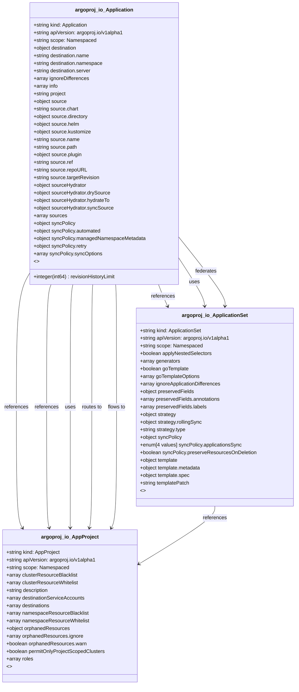

# CRD Schema Documentation - argoproj.io API Group

> **Generated:** 2025-09-07 17:05:14
> 
> **Total CRDs:** 3
> 
> **API Groups:** 1
> 
> **Description:** Complete schema documentation for Kubernetes Custom Resource Definitions (CRDs), including property definitions, types, relationships, and visual diagrams.

---

## 📋 Table of Contents

1. [Executive Summary](#-executive-summary)
2. [API Group Documentation](#-api-group-documentation)
   - [argoproj.io](#argoprojio) (3 CRDs)
3. [Appendices](#-appendices)
   - [CRD Index](#crd-index)
   - [Property Types Summary](#property-types-summary)
   - [Relationship Matrix](#relationship-matrix)

## 📊 Executive Summary

### Overview

This document provides comprehensive schema documentation for **3 Custom Resource Definitions** distributed across **1 API groups** in your Kubernetes cluster.

### Key Statistics

| Metric | Value |
|--------|-------|
| **Total CRDs** | 3 |
| **API Groups** | 1 |
| **Total Instances** | 0 |
| **Namespaced CRDs** | 3 (100.0%) |
| **Cluster-scoped CRDs** | 0 (0.0%) |
| **Schema Coverage** | 3/3 (100.0%) |

### Distribution Analysis

#### Largest API Groups (by CRD count)

1. **argoproj.io**: 3 CRDs

### Schema Analysis

**Most Complex CRDs (by property count):**

1. `AppProject` (argoproj.io): 14 properties
2. `ApplicationSet` (argoproj.io): 10 properties
3. `Application` (argoproj.io): 9 properties

## 📁 argoproj.io

### Overview

**API Group:** `argoproj.io`  
**CRDs in Group:** 3  
**Total Instances:** 0

### CRDs in this Group

| Kind | Scope | Version | Instances | Description |
|------|-------|---------|-----------|-------------|
| `AppProject` | Namespaced | v1alpha1 | 0 | *No description available* |
| `Application` | Namespaced | v1alpha1 | 0 | *No description available* |
| `ApplicationSet` | Namespaced | v1alpha1 | 0 | *No description available* |

### Schema Diagram

### Detailed CRD Documentation

#### AppProject

**Full Name:** `appprojects.argoproj.io`  
**API Version:** `argoproj.io/v1alpha1`  
**Scope:** Namespaced  
**Instances:** 0  
**Short Names:** appproj, appprojs  

**Schema Properties:**

| Property | Type | Required | Description |
|----------|------|----------|-------------|
| `clusterResourceBlacklist` | `array<object>` |  | ClusterResourceBlacklist contains list of blacklisted clu... |
| `clusterResourceWhitelist` | `array<object>` |  | ClusterResourceWhitelist contains list of whitelisted clu... |
| `description` | `string` |  | Description contains optional project description |
| `destinationServiceAccounts` | `array<object>` |  | DestinationServiceAccounts holds information about the se... |
| `destinations` | `array<object>` |  | Destinations contains list of destinations available for ... |
| `namespaceResourceBlacklist` | `array<object>` |  | NamespaceResourceBlacklist contains list of blacklisted n... |
| `namespaceResourceWhitelist` | `array<object>` |  | NamespaceResourceWhitelist contains list of whitelisted n... |
| `orphanedResources` | `object` |  | OrphanedResources specifies if controller should monitor ... |
| `permitOnlyProjectScopedClusters` | `boolean` |  | PermitOnlyProjectScopedClusters determines whether destin... |
| `roles` | `array<object>` |  | Roles are user defined RBAC roles associated with this pr... |
| `signatureKeys` | `array<object>` |  | SignatureKeys contains a list of PGP key IDs that commits... |
| `sourceNamespaces` | `array<string>` |  | SourceNamespaces defines the namespaces application resou... |
| `sourceRepos` | `array<string>` |  | SourceRepos contains list of repository URLs which can be... |
| `syncWindows` | `array<object>` |  | SyncWindows controls when syncs can be run for apps in th... |

#### Application

**Full Name:** `applications.argoproj.io`  
**API Version:** `argoproj.io/v1alpha1`  
**Scope:** Namespaced  
**Instances:** 0  
**Short Names:** app, apps  

**Schema Properties:**

| Property | Type | Required | Description |
|----------|------|----------|-------------|
| `destination` | `object` | ✓ | Destination is a reference to the target Kubernetes serve... |
| `project` | `string` | ✓ | Project is a reference to the project this application be... |
| `ignoreDifferences` | `array<object>` |  | IgnoreDifferences is a list of resources and their fields... |
| `info` | `array<object>` |  | Info contains a list of information (URLs, email addresse... |
| `revisionHistoryLimit` | `integer(int64)` |  | RevisionHistoryLimit limits the number of items kept in t... |
| `source` | `object` |  | Source is a reference to the location of the application'... |
| `sourceHydrator` | `object` |  | SourceHydrator provides a way to push hydrated manifests ... |
| `sources` | `array<object>` |  | Sources is a reference to the location of the application... |
| `syncPolicy` | `object` |  | SyncPolicy controls when and how a sync will be performed |

#### ApplicationSet

**Full Name:** `applicationsets.argoproj.io`  
**API Version:** `argoproj.io/v1alpha1`  
**Scope:** Namespaced  
**Instances:** 0  
**Short Names:** appset, appsets  

**Schema Properties:**

| Property | Type | Required | Description |
|----------|------|----------|-------------|
| `generators` | `array<object>` | ✓ | *No description* |
| `template` | `object` | ✓ | *No description* |
| `applyNestedSelectors` | `boolean` |  | *No description* |
| `goTemplate` | `boolean` |  | *No description* |
| `goTemplateOptions` | `array<string>` |  | *No description* |
| `ignoreApplicationDifferences` | `array<object>` |  | *No description* |
| `preservedFields` | `object` |  | *No description* |
| `strategy` | `object` |  | *No description* |
| `syncPolicy` | `object` |  | *No description* |
| `templatePatch` | `string` |  | *No description* |

## 📚 Appendices

### CRD Index

Complete alphabetical index of all Custom Resource Definitions:

| CRD Name | Kind | API Group | Scope | Instances |
|----------|------|-----------|-------|-----------|
| `applications.argoproj.io` | `Application` | `argoproj.io` | Namespaced | 0 |
| `applicationsets.argoproj.io` | `ApplicationSet` | `argoproj.io` | Namespaced | 0 |
| `appprojects.argoproj.io` | `AppProject` | `argoproj.io` | Namespaced | 0 |

### Property Types Summary

Property type usage across all CRDs:

| Type | Usage Count |
|------|-------------|
| `array` | 17 |
| `object` | 9 |
| `string` | 3 |
| `boolean` | 3 |
| `integer` | 1 |

### Relationship Matrix

Schema-based relationships detected between CRDs:

| Source CRD | Target CRD | API Group | Relationship Type |
|------------|------------|-----------|-------------------|
| `Application` | `ApplicationSet` | `argoproj.io (intra-group)` | references |
| `Application` | `ApplicationSet` | `argoproj.io (intra-group)` | uses |
| `Application` | `ApplicationSet` | `argoproj.io (intra-group)` | federates |
| `Application` | `AppProject` | `argoproj.io (intra-group)` | references |
| `Application` | `AppProject` | `argoproj.io (intra-group)` | references |
| `Application` | `AppProject` | `argoproj.io (intra-group)` | uses |
| `Application` | `AppProject` | `argoproj.io (intra-group)` | routes_to |
| `Application` | `AppProject` | `argoproj.io (intra-group)` | flows_to |
| `ApplicationSet` | `AppProject` | `argoproj.io (intra-group)` | references |

---

*Documentation generated by k8s-inventory-cli on 2025-09-07 17:05:14*