# CRD Schema Documentation - catalog.appscode.com API Group

> **Generated:** 2025-09-07 17:05:14
> 
> **Total CRDs:** 8
> 
> **API Groups:** 1
> 
> **Description:** Complete schema documentation for Kubernetes Custom Resource Definitions (CRDs), including property definitions, types, relationships, and visual diagrams.

---

## 📋 Table of Contents

1. [Executive Summary](#-executive-summary)
2. [API Group Documentation](#-api-group-documentation)
   - [catalog.appscode.com](#catalogappscodecom) (8 CRDs)
3. [Appendices](#-appendices)
   - [CRD Index](#crd-index)
   - [Property Types Summary](#property-types-summary)
   - [Relationship Matrix](#relationship-matrix)

## 📊 Executive Summary

### Overview

This document provides comprehensive schema documentation for **8 Custom Resource Definitions** distributed across **1 API groups** in your Kubernetes cluster.

### Key Statistics

| Metric | Value |
|--------|-------|
| **Total CRDs** | 8 |
| **API Groups** | 1 |
| **Total Instances** | 0 |
| **Namespaced CRDs** | 8 (100.0%) |
| **Cluster-scoped CRDs** | 0 (0.0%) |
| **Schema Coverage** | 8/8 (100.0%) |

### Distribution Analysis

#### Largest API Groups (by CRD count)

1. **catalog.appscode.com**: 8 CRDs

### Schema Analysis

**Most Complex CRDs (by property count):**

1. `ElasticsearchBinding` (catalog.appscode.com): 1 properties
2. `KafkaBinding` (catalog.appscode.com): 1 properties
3. `MariaDBBinding` (catalog.appscode.com): 1 properties

## 📁 catalog.appscode.com

### Overview

**API Group:** `catalog.appscode.com`  
**CRDs in Group:** 8  
**Total Instances:** 0

### CRDs in this Group

| Kind | Scope | Version | Instances | Description |
|------|-------|---------|-----------|-------------|
| `ElasticsearchBinding` | Namespaced | v1alpha1 | 0 | *No description available* |
| `KafkaBinding` | Namespaced | v1alpha1 | 0 | *No description available* |
| `MSSQLServerBinding` | Namespaced | v1alpha1 | 0 | *No description available* |
| `MariaDBBinding` | Namespaced | v1alpha1 | 0 | *No description available* |
| `MongoDBBinding` | Namespaced | v1alpha1 | 0 | *No description available* |
| `MySQLBinding` | Namespaced | v1alpha1 | 0 | *No description available* |
| `PostgresBinding` | Namespaced | v1alpha1 | 0 | *No description available* |
| `RedisBinding` | Namespaced | v1alpha1 | 0 | *No description available* |

### Schema Diagram

```mermaid
classDiagram
    %% API Group: catalog.appscode.com
    class catalog_appscode_com_ElasticsearchBinding {
        +string kind: ElasticsearchBinding
        +string apiVersion: catalog.appscode.com/v1alpha1
        +string scope: Namespaced
        +object sourceRef
        +string sourceRef.name
        +string sourceRef.namespace
    }
    catalog_appscode_com_ElasticsearchBinding : <<Namespaced>>
    class catalog_appscode_com_KafkaBinding {
        +string kind: KafkaBinding
        +string apiVersion: catalog.appscode.com/v1alpha1
        +string scope: Namespaced
        +object sourceRef
        +string sourceRef.name
        +string sourceRef.namespace
    }
    catalog_appscode_com_KafkaBinding : <<Namespaced>>
    class catalog_appscode_com_MSSQLServerBinding {
        +string kind: MSSQLServerBinding
        +string apiVersion: catalog.appscode.com/v1alpha1
        +string scope: Namespaced
        +object sourceRef
        +string sourceRef.name
        +string sourceRef.namespace
    }
    catalog_appscode_com_MSSQLServerBinding : <<Namespaced>>
    class catalog_appscode_com_MariaDBBinding {
        +string kind: MariaDBBinding
        +string apiVersion: catalog.appscode.com/v1alpha1
        +string scope: Namespaced
        +object sourceRef
        +string sourceRef.name
        +string sourceRef.namespace
    }
    catalog_appscode_com_MariaDBBinding : <<Namespaced>>
    class catalog_appscode_com_MongoDBBinding {
        +string kind: MongoDBBinding
        +string apiVersion: catalog.appscode.com/v1alpha1
        +string scope: Namespaced
        +object sourceRef
        +string sourceRef.name
        +string sourceRef.namespace
    }
    catalog_appscode_com_MongoDBBinding : <<Namespaced>>
    class catalog_appscode_com_MySQLBinding {
        +string kind: MySQLBinding
        +string apiVersion: catalog.appscode.com/v1alpha1
        +string scope: Namespaced
        +object sourceRef
        +string sourceRef.name
        +string sourceRef.namespace
    }
    catalog_appscode_com_MySQLBinding : <<Namespaced>>
    class catalog_appscode_com_PostgresBinding {
        +string kind: PostgresBinding
        +string apiVersion: catalog.appscode.com/v1alpha1
        +string scope: Namespaced
        +object sourceRef
        +string sourceRef.name
        +string sourceRef.namespace
    }
    catalog_appscode_com_PostgresBinding : <<Namespaced>>
    class catalog_appscode_com_RedisBinding {
        +string kind: RedisBinding
        +string apiVersion: catalog.appscode.com/v1alpha1
        +string scope: Namespaced
        +object sourceRef
        +string sourceRef.name
        +string sourceRef.namespace
    }
    catalog_appscode_com_RedisBinding : <<Namespaced>>
    catalog_appscode_com_ElasticsearchBinding --> catalog_appscode_com_KafkaBinding : references
    catalog_appscode_com_ElasticsearchBinding --> catalog_appscode_com_KafkaBinding : references
    catalog_appscode_com_ElasticsearchBinding --> catalog_appscode_com_KafkaBinding : similar schema
    catalog_appscode_com_ElasticsearchBinding --> catalog_appscode_com_MariaDBBinding : references
    catalog_appscode_com_ElasticsearchBinding --> catalog_appscode_com_MariaDBBinding : references
    catalog_appscode_com_ElasticsearchBinding --> catalog_appscode_com_MariaDBBinding : similar schema
    catalog_appscode_com_ElasticsearchBinding --> catalog_appscode_com_MongoDBBinding : references
    catalog_appscode_com_ElasticsearchBinding --> catalog_appscode_com_MongoDBBinding : references
    catalog_appscode_com_ElasticsearchBinding --> catalog_appscode_com_MongoDBBinding : similar schema
    catalog_appscode_com_ElasticsearchBinding --> catalog_appscode_com_MSSQLServerBinding : references
    catalog_appscode_com_ElasticsearchBinding --> catalog_appscode_com_MSSQLServerBinding : references
    catalog_appscode_com_ElasticsearchBinding --> catalog_appscode_com_MSSQLServerBinding : similar schema
    catalog_appscode_com_ElasticsearchBinding --> catalog_appscode_com_MySQLBinding : references
    catalog_appscode_com_ElasticsearchBinding --> catalog_appscode_com_MySQLBinding : references
    catalog_appscode_com_ElasticsearchBinding --> catalog_appscode_com_MySQLBinding : similar schema
    catalog_appscode_com_ElasticsearchBinding --> catalog_appscode_com_PostgresBinding : references
    catalog_appscode_com_ElasticsearchBinding --> catalog_appscode_com_PostgresBinding : references
    catalog_appscode_com_ElasticsearchBinding --> catalog_appscode_com_PostgresBinding : similar schema
    catalog_appscode_com_ElasticsearchBinding --> catalog_appscode_com_RedisBinding : references
    catalog_appscode_com_ElasticsearchBinding --> catalog_appscode_com_RedisBinding : references
    catalog_appscode_com_ElasticsearchBinding --> catalog_appscode_com_RedisBinding : similar schema
    catalog_appscode_com_KafkaBinding --> catalog_appscode_com_MariaDBBinding : references
    catalog_appscode_com_KafkaBinding --> catalog_appscode_com_MariaDBBinding : references
    catalog_appscode_com_KafkaBinding --> catalog_appscode_com_MariaDBBinding : similar schema
    catalog_appscode_com_KafkaBinding --> catalog_appscode_com_MongoDBBinding : references
    catalog_appscode_com_KafkaBinding --> catalog_appscode_com_MongoDBBinding : references
    catalog_appscode_com_KafkaBinding --> catalog_appscode_com_MongoDBBinding : similar schema
    catalog_appscode_com_KafkaBinding --> catalog_appscode_com_MSSQLServerBinding : references
    catalog_appscode_com_KafkaBinding --> catalog_appscode_com_MSSQLServerBinding : references
    catalog_appscode_com_KafkaBinding --> catalog_appscode_com_MSSQLServerBinding : similar schema
    catalog_appscode_com_KafkaBinding --> catalog_appscode_com_MySQLBinding : references
    catalog_appscode_com_KafkaBinding --> catalog_appscode_com_MySQLBinding : references
    catalog_appscode_com_KafkaBinding --> catalog_appscode_com_MySQLBinding : similar schema
    catalog_appscode_com_KafkaBinding --> catalog_appscode_com_PostgresBinding : references
    catalog_appscode_com_KafkaBinding --> catalog_appscode_com_PostgresBinding : references
    catalog_appscode_com_KafkaBinding --> catalog_appscode_com_PostgresBinding : similar schema
    catalog_appscode_com_KafkaBinding --> catalog_appscode_com_RedisBinding : references
    catalog_appscode_com_KafkaBinding --> catalog_appscode_com_RedisBinding : references
    catalog_appscode_com_KafkaBinding --> catalog_appscode_com_RedisBinding : similar schema
    catalog_appscode_com_MariaDBBinding --> catalog_appscode_com_MongoDBBinding : references
    catalog_appscode_com_MariaDBBinding --> catalog_appscode_com_MongoDBBinding : references
    catalog_appscode_com_MariaDBBinding --> catalog_appscode_com_MongoDBBinding : similar schema
    catalog_appscode_com_MariaDBBinding --> catalog_appscode_com_MSSQLServerBinding : references
    catalog_appscode_com_MariaDBBinding --> catalog_appscode_com_MSSQLServerBinding : references
    catalog_appscode_com_MariaDBBinding --> catalog_appscode_com_MSSQLServerBinding : similar schema
    catalog_appscode_com_MariaDBBinding --> catalog_appscode_com_MySQLBinding : references
    catalog_appscode_com_MariaDBBinding --> catalog_appscode_com_MySQLBinding : references
    catalog_appscode_com_MariaDBBinding --> catalog_appscode_com_MySQLBinding : similar schema
    catalog_appscode_com_MariaDBBinding --> catalog_appscode_com_PostgresBinding : references
    catalog_appscode_com_MariaDBBinding --> catalog_appscode_com_PostgresBinding : references
    catalog_appscode_com_MariaDBBinding --> catalog_appscode_com_PostgresBinding : similar schema
    catalog_appscode_com_MariaDBBinding --> catalog_appscode_com_RedisBinding : references
    catalog_appscode_com_MariaDBBinding --> catalog_appscode_com_RedisBinding : references
    catalog_appscode_com_MariaDBBinding --> catalog_appscode_com_RedisBinding : similar schema
    catalog_appscode_com_MongoDBBinding --> catalog_appscode_com_MSSQLServerBinding : references
    catalog_appscode_com_MongoDBBinding --> catalog_appscode_com_MSSQLServerBinding : references
    catalog_appscode_com_MongoDBBinding --> catalog_appscode_com_MSSQLServerBinding : similar schema
    catalog_appscode_com_MongoDBBinding --> catalog_appscode_com_MySQLBinding : references
    catalog_appscode_com_MongoDBBinding --> catalog_appscode_com_MySQLBinding : references
    catalog_appscode_com_MongoDBBinding --> catalog_appscode_com_MySQLBinding : similar schema
    catalog_appscode_com_MongoDBBinding --> catalog_appscode_com_PostgresBinding : references
    catalog_appscode_com_MongoDBBinding --> catalog_appscode_com_PostgresBinding : references
    catalog_appscode_com_MongoDBBinding --> catalog_appscode_com_PostgresBinding : similar schema
    catalog_appscode_com_MongoDBBinding --> catalog_appscode_com_RedisBinding : references
    catalog_appscode_com_MongoDBBinding --> catalog_appscode_com_RedisBinding : references
    catalog_appscode_com_MongoDBBinding --> catalog_appscode_com_RedisBinding : similar schema
    catalog_appscode_com_MSSQLServerBinding --> catalog_appscode_com_MySQLBinding : references
    catalog_appscode_com_MSSQLServerBinding --> catalog_appscode_com_MySQLBinding : references
    catalog_appscode_com_MSSQLServerBinding --> catalog_appscode_com_MySQLBinding : similar schema
    catalog_appscode_com_MSSQLServerBinding --> catalog_appscode_com_PostgresBinding : references
    catalog_appscode_com_MSSQLServerBinding --> catalog_appscode_com_PostgresBinding : references
    catalog_appscode_com_MSSQLServerBinding --> catalog_appscode_com_PostgresBinding : similar schema
    catalog_appscode_com_MSSQLServerBinding --> catalog_appscode_com_RedisBinding : references
    catalog_appscode_com_MSSQLServerBinding --> catalog_appscode_com_RedisBinding : references
    catalog_appscode_com_MSSQLServerBinding --> catalog_appscode_com_RedisBinding : similar schema
    catalog_appscode_com_MySQLBinding --> catalog_appscode_com_PostgresBinding : references
    catalog_appscode_com_MySQLBinding --> catalog_appscode_com_PostgresBinding : references
    catalog_appscode_com_MySQLBinding --> catalog_appscode_com_PostgresBinding : similar schema
    catalog_appscode_com_MySQLBinding --> catalog_appscode_com_RedisBinding : references
    catalog_appscode_com_MySQLBinding --> catalog_appscode_com_RedisBinding : references
    catalog_appscode_com_MySQLBinding --> catalog_appscode_com_RedisBinding : similar schema
    catalog_appscode_com_PostgresBinding --> catalog_appscode_com_RedisBinding : references
    catalog_appscode_com_PostgresBinding --> catalog_appscode_com_RedisBinding : references
    catalog_appscode_com_PostgresBinding --> catalog_appscode_com_RedisBinding : similar schema
```

### Detailed CRD Documentation

#### ElasticsearchBinding

**Full Name:** `elasticsearchbindings.catalog.appscode.com`  
**API Version:** `catalog.appscode.com/v1alpha1`  
**Scope:** Namespaced  
**Instances:** 0  
**Categories:** binding, kubedb, appscode  
**Short Names:** esbinding  

**Schema Properties:**

| Property | Type | Required | Description |
|----------|------|----------|-------------|
| `sourceRef` | `object` | ✓ | SourceRef refers to the source app instance. |

#### KafkaBinding

**Full Name:** `kafkabindings.catalog.appscode.com`  
**API Version:** `catalog.appscode.com/v1alpha1`  
**Scope:** Namespaced  
**Instances:** 0  
**Categories:** binding, kubedb, appscode  
**Short Names:** kfbinding  

**Schema Properties:**

| Property | Type | Required | Description |
|----------|------|----------|-------------|
| `sourceRef` | `object` | ✓ | SourceRef refers to the source app instance. |

#### MSSQLServerBinding

**Full Name:** `mssqlserverbindings.catalog.appscode.com`  
**API Version:** `catalog.appscode.com/v1alpha1`  
**Scope:** Namespaced  
**Instances:** 0  
**Categories:** binding, kubedb, appscode  
**Short Names:** msbinding  

**Schema Properties:**

| Property | Type | Required | Description |
|----------|------|----------|-------------|
| `sourceRef` | `object` | ✓ | SourceRef refers to the source app instance. |

#### MariaDBBinding

**Full Name:** `mariadbbindings.catalog.appscode.com`  
**API Version:** `catalog.appscode.com/v1alpha1`  
**Scope:** Namespaced  
**Instances:** 0  
**Categories:** binding, kubedb, appscode  
**Short Names:** mdbinding  

**Schema Properties:**

| Property | Type | Required | Description |
|----------|------|----------|-------------|
| `sourceRef` | `object` | ✓ | SourceRef refers to the source app instance. |

#### MongoDBBinding

**Full Name:** `mongodbbindings.catalog.appscode.com`  
**API Version:** `catalog.appscode.com/v1alpha1`  
**Scope:** Namespaced  
**Instances:** 0  
**Categories:** binding, kubedb, appscode  
**Short Names:** mgbinding  

**Schema Properties:**

| Property | Type | Required | Description |
|----------|------|----------|-------------|
| `sourceRef` | `object` | ✓ | SourceRef refers to the source app instance. |

#### MySQLBinding

**Full Name:** `mysqlbindings.catalog.appscode.com`  
**API Version:** `catalog.appscode.com/v1alpha1`  
**Scope:** Namespaced  
**Instances:** 0  
**Categories:** binding, kubedb, appscode  
**Short Names:** mybinding  

**Schema Properties:**

| Property | Type | Required | Description |
|----------|------|----------|-------------|
| `sourceRef` | `object` | ✓ | SourceRef refers to the source app instance. |

#### PostgresBinding

**Full Name:** `postgresbindings.catalog.appscode.com`  
**API Version:** `catalog.appscode.com/v1alpha1`  
**Scope:** Namespaced  
**Instances:** 0  
**Categories:** binding, kubedb, appscode  
**Short Names:** pgbinding  

**Schema Properties:**

| Property | Type | Required | Description |
|----------|------|----------|-------------|
| `sourceRef` | `object` | ✓ | SourceRef refers to the source app instance. |

#### RedisBinding

**Full Name:** `redisbindings.catalog.appscode.com`  
**API Version:** `catalog.appscode.com/v1alpha1`  
**Scope:** Namespaced  
**Instances:** 0  
**Categories:** binding, kubedb, appscode  
**Short Names:** rdbinding  

**Schema Properties:**

| Property | Type | Required | Description |
|----------|------|----------|-------------|
| `sourceRef` | `object` | ✓ | SourceRef refers to the source app instance. |

## 📚 Appendices

### CRD Index

Complete alphabetical index of all Custom Resource Definitions:

| CRD Name | Kind | API Group | Scope | Instances |
|----------|------|-----------|-------|-----------|
| `elasticsearchbindings.catalog.appscode.com` | `ElasticsearchBinding` | `catalog.appscode.com` | Namespaced | 0 |
| `kafkabindings.catalog.appscode.com` | `KafkaBinding` | `catalog.appscode.com` | Namespaced | 0 |
| `mariadbbindings.catalog.appscode.com` | `MariaDBBinding` | `catalog.appscode.com` | Namespaced | 0 |
| `mongodbbindings.catalog.appscode.com` | `MongoDBBinding` | `catalog.appscode.com` | Namespaced | 0 |
| `mssqlserverbindings.catalog.appscode.com` | `MSSQLServerBinding` | `catalog.appscode.com` | Namespaced | 0 |
| `mysqlbindings.catalog.appscode.com` | `MySQLBinding` | `catalog.appscode.com` | Namespaced | 0 |
| `postgresbindings.catalog.appscode.com` | `PostgresBinding` | `catalog.appscode.com` | Namespaced | 0 |
| `redisbindings.catalog.appscode.com` | `RedisBinding` | `catalog.appscode.com` | Namespaced | 0 |

### Property Types Summary

Property type usage across all CRDs:

| Type | Usage Count |
|------|-------------|
| `object` | 8 |

### Relationship Matrix

Schema-based relationships detected between CRDs:

| Source CRD | Target CRD | API Group | Relationship Type |
|------------|------------|-----------|-------------------|
| `ElasticsearchBinding` | `KafkaBinding` | `catalog.appscode.com (intra-group)` | references |
| `ElasticsearchBinding` | `KafkaBinding` | `catalog.appscode.com (intra-group)` | references |
| `ElasticsearchBinding` | `KafkaBinding` | `catalog.appscode.com (intra-group)` | similar_schema |
| `ElasticsearchBinding` | `MariaDBBinding` | `catalog.appscode.com (intra-group)` | references |
| `ElasticsearchBinding` | `MariaDBBinding` | `catalog.appscode.com (intra-group)` | references |
| `ElasticsearchBinding` | `MariaDBBinding` | `catalog.appscode.com (intra-group)` | similar_schema |
| `ElasticsearchBinding` | `MongoDBBinding` | `catalog.appscode.com (intra-group)` | references |
| `ElasticsearchBinding` | `MongoDBBinding` | `catalog.appscode.com (intra-group)` | references |
| `ElasticsearchBinding` | `MongoDBBinding` | `catalog.appscode.com (intra-group)` | similar_schema |
| `ElasticsearchBinding` | `MSSQLServerBinding` | `catalog.appscode.com (intra-group)` | references |
| `ElasticsearchBinding` | `MSSQLServerBinding` | `catalog.appscode.com (intra-group)` | references |
| `ElasticsearchBinding` | `MSSQLServerBinding` | `catalog.appscode.com (intra-group)` | similar_schema |
| `ElasticsearchBinding` | `MySQLBinding` | `catalog.appscode.com (intra-group)` | references |
| `ElasticsearchBinding` | `MySQLBinding` | `catalog.appscode.com (intra-group)` | references |
| `ElasticsearchBinding` | `MySQLBinding` | `catalog.appscode.com (intra-group)` | similar_schema |
| `ElasticsearchBinding` | `PostgresBinding` | `catalog.appscode.com (intra-group)` | references |
| `ElasticsearchBinding` | `PostgresBinding` | `catalog.appscode.com (intra-group)` | references |
| `ElasticsearchBinding` | `PostgresBinding` | `catalog.appscode.com (intra-group)` | similar_schema |
| `ElasticsearchBinding` | `RedisBinding` | `catalog.appscode.com (intra-group)` | references |
| `ElasticsearchBinding` | `RedisBinding` | `catalog.appscode.com (intra-group)` | references |
| `ElasticsearchBinding` | `RedisBinding` | `catalog.appscode.com (intra-group)` | similar_schema |
| `KafkaBinding` | `MariaDBBinding` | `catalog.appscode.com (intra-group)` | references |
| `KafkaBinding` | `MariaDBBinding` | `catalog.appscode.com (intra-group)` | references |
| `KafkaBinding` | `MariaDBBinding` | `catalog.appscode.com (intra-group)` | similar_schema |
| `KafkaBinding` | `MongoDBBinding` | `catalog.appscode.com (intra-group)` | references |
| `KafkaBinding` | `MongoDBBinding` | `catalog.appscode.com (intra-group)` | references |
| `KafkaBinding` | `MongoDBBinding` | `catalog.appscode.com (intra-group)` | similar_schema |
| `KafkaBinding` | `MSSQLServerBinding` | `catalog.appscode.com (intra-group)` | references |
| `KafkaBinding` | `MSSQLServerBinding` | `catalog.appscode.com (intra-group)` | references |
| `KafkaBinding` | `MSSQLServerBinding` | `catalog.appscode.com (intra-group)` | similar_schema |
| `KafkaBinding` | `MySQLBinding` | `catalog.appscode.com (intra-group)` | references |
| `KafkaBinding` | `MySQLBinding` | `catalog.appscode.com (intra-group)` | references |
| `KafkaBinding` | `MySQLBinding` | `catalog.appscode.com (intra-group)` | similar_schema |
| `KafkaBinding` | `PostgresBinding` | `catalog.appscode.com (intra-group)` | references |
| `KafkaBinding` | `PostgresBinding` | `catalog.appscode.com (intra-group)` | references |
| `KafkaBinding` | `PostgresBinding` | `catalog.appscode.com (intra-group)` | similar_schema |
| `KafkaBinding` | `RedisBinding` | `catalog.appscode.com (intra-group)` | references |
| `KafkaBinding` | `RedisBinding` | `catalog.appscode.com (intra-group)` | references |
| `KafkaBinding` | `RedisBinding` | `catalog.appscode.com (intra-group)` | similar_schema |
| `MariaDBBinding` | `MongoDBBinding` | `catalog.appscode.com (intra-group)` | references |
| `MariaDBBinding` | `MongoDBBinding` | `catalog.appscode.com (intra-group)` | references |
| `MariaDBBinding` | `MongoDBBinding` | `catalog.appscode.com (intra-group)` | similar_schema |
| `MariaDBBinding` | `MSSQLServerBinding` | `catalog.appscode.com (intra-group)` | references |
| `MariaDBBinding` | `MSSQLServerBinding` | `catalog.appscode.com (intra-group)` | references |
| `MariaDBBinding` | `MSSQLServerBinding` | `catalog.appscode.com (intra-group)` | similar_schema |
| `MariaDBBinding` | `MySQLBinding` | `catalog.appscode.com (intra-group)` | references |
| `MariaDBBinding` | `MySQLBinding` | `catalog.appscode.com (intra-group)` | references |
| `MariaDBBinding` | `MySQLBinding` | `catalog.appscode.com (intra-group)` | similar_schema |
| `MariaDBBinding` | `PostgresBinding` | `catalog.appscode.com (intra-group)` | references |
| `MariaDBBinding` | `PostgresBinding` | `catalog.appscode.com (intra-group)` | references |
| `MariaDBBinding` | `PostgresBinding` | `catalog.appscode.com (intra-group)` | similar_schema |
| `MariaDBBinding` | `RedisBinding` | `catalog.appscode.com (intra-group)` | references |
| `MariaDBBinding` | `RedisBinding` | `catalog.appscode.com (intra-group)` | references |
| `MariaDBBinding` | `RedisBinding` | `catalog.appscode.com (intra-group)` | similar_schema |
| `MongoDBBinding` | `MSSQLServerBinding` | `catalog.appscode.com (intra-group)` | references |
| `MongoDBBinding` | `MSSQLServerBinding` | `catalog.appscode.com (intra-group)` | references |
| `MongoDBBinding` | `MSSQLServerBinding` | `catalog.appscode.com (intra-group)` | similar_schema |
| `MongoDBBinding` | `MySQLBinding` | `catalog.appscode.com (intra-group)` | references |
| `MongoDBBinding` | `MySQLBinding` | `catalog.appscode.com (intra-group)` | references |
| `MongoDBBinding` | `MySQLBinding` | `catalog.appscode.com (intra-group)` | similar_schema |
| `MongoDBBinding` | `PostgresBinding` | `catalog.appscode.com (intra-group)` | references |
| `MongoDBBinding` | `PostgresBinding` | `catalog.appscode.com (intra-group)` | references |
| `MongoDBBinding` | `PostgresBinding` | `catalog.appscode.com (intra-group)` | similar_schema |
| `MongoDBBinding` | `RedisBinding` | `catalog.appscode.com (intra-group)` | references |
| `MongoDBBinding` | `RedisBinding` | `catalog.appscode.com (intra-group)` | references |
| `MongoDBBinding` | `RedisBinding` | `catalog.appscode.com (intra-group)` | similar_schema |
| `MSSQLServerBinding` | `MySQLBinding` | `catalog.appscode.com (intra-group)` | references |
| `MSSQLServerBinding` | `MySQLBinding` | `catalog.appscode.com (intra-group)` | references |
| `MSSQLServerBinding` | `MySQLBinding` | `catalog.appscode.com (intra-group)` | similar_schema |
| `MSSQLServerBinding` | `PostgresBinding` | `catalog.appscode.com (intra-group)` | references |
| `MSSQLServerBinding` | `PostgresBinding` | `catalog.appscode.com (intra-group)` | references |
| `MSSQLServerBinding` | `PostgresBinding` | `catalog.appscode.com (intra-group)` | similar_schema |
| `MSSQLServerBinding` | `RedisBinding` | `catalog.appscode.com (intra-group)` | references |
| `MSSQLServerBinding` | `RedisBinding` | `catalog.appscode.com (intra-group)` | references |
| `MSSQLServerBinding` | `RedisBinding` | `catalog.appscode.com (intra-group)` | similar_schema |
| `MySQLBinding` | `PostgresBinding` | `catalog.appscode.com (intra-group)` | references |
| `MySQLBinding` | `PostgresBinding` | `catalog.appscode.com (intra-group)` | references |
| `MySQLBinding` | `PostgresBinding` | `catalog.appscode.com (intra-group)` | similar_schema |
| `MySQLBinding` | `RedisBinding` | `catalog.appscode.com (intra-group)` | references |
| `MySQLBinding` | `RedisBinding` | `catalog.appscode.com (intra-group)` | references |
| `MySQLBinding` | `RedisBinding` | `catalog.appscode.com (intra-group)` | similar_schema |
| `PostgresBinding` | `RedisBinding` | `catalog.appscode.com (intra-group)` | references |
| `PostgresBinding` | `RedisBinding` | `catalog.appscode.com (intra-group)` | references |
| `PostgresBinding` | `RedisBinding` | `catalog.appscode.com (intra-group)` | similar_schema |

---

*Documentation generated by k8s-inventory-cli on 2025-09-07 17:05:14*