# CRD Schema Documentation - cdi.kubevirt.io API Group

> **Generated:** 2025-09-07 17:05:14
> 
> **Total CRDs:** 10
> 
> **API Groups:** 1
> 
> **Description:** Complete schema documentation for Kubernetes Custom Resource Definitions (CRDs), including property definitions, types, relationships, and visual diagrams.

---

## 📋 Table of Contents

1. [Executive Summary](#-executive-summary)
2. [API Group Documentation](#-api-group-documentation)
   - [cdi.kubevirt.io](#cdikubevirtio) (10 CRDs)
3. [Appendices](#-appendices)
   - [CRD Index](#crd-index)
   - [Property Types Summary](#property-types-summary)
   - [Relationship Matrix](#relationship-matrix)

## 📊 Executive Summary

### Overview

This document provides comprehensive schema documentation for **10 Custom Resource Definitions** distributed across **1 API groups** in your Kubernetes cluster.

### Key Statistics

| Metric | Value |
|--------|-------|
| **Total CRDs** | 10 |
| **API Groups** | 1 |
| **Total Instances** | 0 |
| **Namespaced CRDs** | 6 (60.0%) |
| **Cluster-scoped CRDs** | 4 (40.0%) |
| **Schema Coverage** | 10/10 (100.0%) |

### Distribution Analysis

#### Largest API Groups (by CRD count)

1. **cdi.kubevirt.io**: 10 CRDs

### Schema Analysis

**Most Complex CRDs (by property count):**

1. `CDIConfig` (cdi.kubevirt.io): 12 properties
2. `CDI` (cdi.kubevirt.io): 9 properties
3. `DataVolume` (cdi.kubevirt.io): 9 properties

## 📁 cdi.kubevirt.io

### Overview

**API Group:** `cdi.kubevirt.io`  
**CRDs in Group:** 10  
**Total Instances:** 0

### CRDs in this Group

| Kind | Scope | Version | Instances | Description |
|------|-------|---------|-----------|-------------|
| `CDI` | Cluster | v1beta1 | 0 | *No description available* |
| `CDIConfig` | Cluster | v1beta1 | 0 | *No description available* |
| `DataImportCron` | Namespaced | v1beta1 | 0 | *No description available* |
| `DataSource` | Namespaced | v1beta1 | 0 | *No description available* |
| `DataVolume` | Namespaced | v1beta1 | 0 | *No description available* |
| `ObjectTransfer` | Cluster | v1beta1 | 0 | *No description available* |
| `StorageProfile` | Cluster | v1beta1 | 0 | *No description available* |
| `VolumeCloneSource` | Namespaced | v1beta1 | 0 | *No description available* |
| `VolumeImportSource` | Namespaced | v1beta1 | 0 | *No description available* |
| `VolumeUploadSource` | Namespaced | v1beta1 | 0 | *No description available* |

### Schema Diagram

```mermaid
classDiagram
    %% API Group: cdi.kubevirt.io
    class cdi_kubevirt_io_CDI {
        +string kind: CDI
        +string apiVersion: cdi.kubevirt.io/v1beta1
        +string scope: Cluster
        +object certConfig
        +object certConfig.ca
        +object certConfig.client
        +object certConfig.server
        +enum[copy|snapshot|csi-clone] cloneStrategyOverride
        +object config
        +integer(int32) config.dataVolumeTTLSeconds
        +array<string> config.featureGates
        +object config.filesystemOverhead
        +array<object> config.imagePullSecrets
        +object config.importProxy
        +array<string> config.insecureRegistries
        +integer(int32) config.logVerbosity
        +object config.podResourceRequirements
        +boolean config.preallocation
        +string config.scratchSpaceStorageClass
        +object customizeComponents
        +object customizeComponents.flags
        +array<object> customizeComponents.patches
        +enum[Always|IfNotPresent|Never] imagePullPolicy
        +object infra
        +object infra.affinity
        +integer(int32) infra.apiServerReplicas
        +integer(int32) infra.deploymentReplicas
        +object infra.nodeSelector
        +array<object> infra.tolerations
        +integer(int32) infra.uploadProxyReplicas
        +string priorityClass
        +enum[RemoveWorkloads|BlockUninstallIfWorkloadsExist] uninstallStrategy
        +object workload
        +object workload.affinity
        +object workload.nodeSelector
        +array<object> workload.tolerations
    }
    cdi_kubevirt_io_CDI : <<Cluster>>
    class cdi_kubevirt_io_CDIConfig {
        +string kind: CDIConfig
        +string apiVersion: cdi.kubevirt.io/v1beta1
        +string scope: Cluster
        +integer(int32) dataVolumeTTLSeconds
        +array<string> featureGates
        +object filesystemOverhead
        +string filesystemOverhead.global
        +object filesystemOverhead.storageClass
        +array<object> imagePullSecrets
        +object importProxy
        +string importProxy.HTTPProxy
        +string importProxy.HTTPSProxy
        +string importProxy.noProxy
        +string importProxy.trustedCAProxy
        +array<string> insecureRegistries
        +integer(int32) logVerbosity
        +object podResourceRequirements
        +array<object> podResourceRequirements.claims
        +object podResourceRequirements.limits
        +object podResourceRequirements.requests
        +boolean preallocation
        +string scratchSpaceStorageClass
    }
    cdi_kubevirt_io_CDIConfig : <<Cluster>>
    class cdi_kubevirt_io_DataImportCron {
        +string kind: DataImportCron
        +string apiVersion: cdi.kubevirt.io/v1beta1
        +string scope: Namespaced
        +string garbageCollect
        +integer(int32) importsToKeep
        +string managedDataSource
        +string retentionPolicy
        +string schedule
        +object template
        +string template.apiVersion
        +string template.kind
        +object template.metadata
        +object template.spec
        +object template.status
    }
    cdi_kubevirt_io_DataImportCron : <<Namespaced>>
    class cdi_kubevirt_io_DataSource {
        +string kind: DataSource
        +string apiVersion: cdi.kubevirt.io/v1beta1
        +string scope: Namespaced
        +object source
        +object source.dataSource
        +object source.pvc
        +object source.snapshot
    }
    cdi_kubevirt_io_DataSource : <<Namespaced>>
    class cdi_kubevirt_io_DataVolume {
        +string kind: DataVolume
        +string apiVersion: cdi.kubevirt.io/v1beta1
        +string scope: Namespaced
        +array<object> checkpoints
        +enum[kubevirt|archive] contentType
        +boolean finalCheckpoint
        +boolean preallocation
        +string priorityClassName
        +object pvc
        +array<string> pvc.accessModes
        +object pvc.dataSource
        +object pvc.dataSourceRef
        +object pvc.resources
        +object pvc.selector
        +string pvc.storageClassName
        +string pvc.volumeAttributesClassName
        +string pvc.volumeMode
        +string pvc.volumeName
        +object source
        +object source.blank
        +object source.gcs
        +object source.http
        +object source.imageio
        +object source.pvc
        +object source.registry
        +object source.s3
        +object source.snapshot
        +object source.upload
        +object source.vddk
        +object sourceRef
        +string sourceRef.kind
        +string sourceRef.name
        +string sourceRef.namespace
        +object storage
        +array<string> storage.accessModes
        +object storage.dataSource
        +object storage.dataSourceRef
        +object storage.resources
        +object storage.selector
        +string storage.storageClassName
        +string storage.volumeMode
        +string storage.volumeName
    }
    cdi_kubevirt_io_DataVolume : <<Namespaced>>
    class cdi_kubevirt_io_ObjectTransfer {
        +string kind: ObjectTransfer
        +string apiVersion: cdi.kubevirt.io/v1beta1
        +string scope: Cluster
        +string parentName
        +object source
        +string source.apiVersion
        +string source.kind
        +string source.name
        +string source.namespace
        +object source.requiredAnnotations
        +object target
        +string target.name
        +string target.namespace
    }
    cdi_kubevirt_io_ObjectTransfer : <<Cluster>>
    class cdi_kubevirt_io_StorageProfile {
        +string kind: StorageProfile
        +string apiVersion: cdi.kubevirt.io/v1beta1
        +string scope: Cluster
        +array<object> claimPropertySets
        +string cloneStrategy
        +string dataImportCronSourceFormat
        +string snapshotClass
    }
    cdi_kubevirt_io_StorageProfile : <<Cluster>>
    class cdi_kubevirt_io_VolumeCloneSource {
        +string kind: VolumeCloneSource
        +string apiVersion: cdi.kubevirt.io/v1beta1
        +string scope: Namespaced
        +boolean preallocation
        +string priorityClassName
        +object source
        +string source.apiGroup
        +string source.kind
        +string source.name
    }
    cdi_kubevirt_io_VolumeCloneSource : <<Namespaced>>
    class cdi_kubevirt_io_VolumeImportSource {
        +string kind: VolumeImportSource
        +string apiVersion: cdi.kubevirt.io/v1beta1
        +string scope: Namespaced
        +array<object> checkpoints
        +string contentType
        +boolean finalCheckpoint
        +boolean preallocation
        +object source
        +object source.blank
        +object source.gcs
        +object source.http
        +object source.imageio
        +object source.registry
        +object source.s3
        +object source.vddk
        +string targetClaim
    }
    cdi_kubevirt_io_VolumeImportSource : <<Namespaced>>
    class cdi_kubevirt_io_VolumeUploadSource {
        +string kind: VolumeUploadSource
        +string apiVersion: cdi.kubevirt.io/v1beta1
        +string scope: Namespaced
        +string contentType
        +boolean preallocation
    }
    cdi_kubevirt_io_VolumeUploadSource : <<Namespaced>>
    cdi_kubevirt_io_CDIConfig --> cdi_kubevirt_io_CDI : references
    cdi_kubevirt_io_CDIConfig --> cdi_kubevirt_io_CDI : references
    cdi_kubevirt_io_CDIConfig --> cdi_kubevirt_io_CDI : configures
    cdi_kubevirt_io_CDIConfig --> cdi_kubevirt_io_CDI : routes to
    cdi_kubevirt_io_CDIConfig --> cdi_kubevirt_io_DataImportCron : references
    cdi_kubevirt_io_CDIConfig --> cdi_kubevirt_io_DataImportCron : references
    cdi_kubevirt_io_CDIConfig --> cdi_kubevirt_io_DataImportCron : routes to
    cdi_kubevirt_io_CDIConfig --> cdi_kubevirt_io_DataVolume : references
    cdi_kubevirt_io_CDIConfig --> cdi_kubevirt_io_DataVolume : references
    cdi_kubevirt_io_CDIConfig --> cdi_kubevirt_io_DataVolume : uses
    cdi_kubevirt_io_CDIConfig --> cdi_kubevirt_io_DataVolume : routes to
    cdi_kubevirt_io_CDI --> cdi_kubevirt_io_DataImportCron : references
    cdi_kubevirt_io_CDI --> cdi_kubevirt_io_DataImportCron : references
    cdi_kubevirt_io_CDI --> cdi_kubevirt_io_DataImportCron : routes to
    cdi_kubevirt_io_CDI --> cdi_kubevirt_io_DataVolume : references
    cdi_kubevirt_io_CDI --> cdi_kubevirt_io_DataVolume : references
    cdi_kubevirt_io_CDI --> cdi_kubevirt_io_DataVolume : uses
    cdi_kubevirt_io_CDI --> cdi_kubevirt_io_DataVolume : routes to
    cdi_kubevirt_io_CDI --> cdi_kubevirt_io_StorageProfile : references
    cdi_kubevirt_io_DataImportCron --> cdi_kubevirt_io_DataSource : references
    cdi_kubevirt_io_DataImportCron --> cdi_kubevirt_io_DataSource : uses
    cdi_kubevirt_io_DataImportCron --> cdi_kubevirt_io_DataSource : flows to
    cdi_kubevirt_io_DataImportCron --> cdi_kubevirt_io_DataVolume : references
    cdi_kubevirt_io_DataImportCron --> cdi_kubevirt_io_DataVolume : references
    cdi_kubevirt_io_DataImportCron --> cdi_kubevirt_io_DataVolume : uses
    cdi_kubevirt_io_DataImportCron --> cdi_kubevirt_io_DataVolume : templates
    cdi_kubevirt_io_DataImportCron --> cdi_kubevirt_io_DataVolume : flows to
    cdi_kubevirt_io_DataImportCron --> cdi_kubevirt_io_ObjectTransfer : references
    cdi_kubevirt_io_DataImportCron --> cdi_kubevirt_io_StorageProfile : references
    cdi_kubevirt_io_DataImportCron --> cdi_kubevirt_io_StorageProfile : references
    cdi_kubevirt_io_DataImportCron --> cdi_kubevirt_io_StorageProfile : uses
    cdi_kubevirt_io_DataImportCron --> cdi_kubevirt_io_StorageProfile : routes to
    cdi_kubevirt_io_DataImportCron --> cdi_kubevirt_io_StorageProfile : flows to
    cdi_kubevirt_io_DataImportCron --> cdi_kubevirt_io_VolumeCloneSource : references
    cdi_kubevirt_io_DataImportCron --> cdi_kubevirt_io_VolumeImportSource : references
    cdi_kubevirt_io_DataImportCron --> cdi_kubevirt_io_VolumeUploadSource : references
    cdi_kubevirt_io_DataSource --> cdi_kubevirt_io_DataVolume : references
    cdi_kubevirt_io_DataSource --> cdi_kubevirt_io_DataVolume : references
    cdi_kubevirt_io_DataSource --> cdi_kubevirt_io_DataVolume : uses
    cdi_kubevirt_io_DataSource --> cdi_kubevirt_io_DataVolume : flows to
    cdi_kubevirt_io_DataSource --> cdi_kubevirt_io_ObjectTransfer : similar schema
    cdi_kubevirt_io_DataSource --> cdi_kubevirt_io_VolumeCloneSource : similar schema
    cdi_kubevirt_io_DataVolume --> cdi_kubevirt_io_ObjectTransfer : references
    cdi_kubevirt_io_DataVolume --> cdi_kubevirt_io_StorageProfile : references
    cdi_kubevirt_io_DataVolume --> cdi_kubevirt_io_VolumeCloneSource : references
    cdi_kubevirt_io_DataVolume --> cdi_kubevirt_io_VolumeCloneSource : similar schema
    cdi_kubevirt_io_DataVolume --> cdi_kubevirt_io_VolumeImportSource : references
    cdi_kubevirt_io_DataVolume --> cdi_kubevirt_io_VolumeImportSource : references
    cdi_kubevirt_io_DataVolume --> cdi_kubevirt_io_VolumeImportSource : similar schema
    cdi_kubevirt_io_DataVolume --> cdi_kubevirt_io_VolumeUploadSource : references
    cdi_kubevirt_io_VolumeImportSource --> cdi_kubevirt_io_VolumeUploadSource : similar schema
```

### Detailed CRD Documentation

#### CDI

**Full Name:** `cdis.cdi.kubevirt.io`  
**API Version:** `cdi.kubevirt.io/v1beta1`  
**Scope:** Cluster  
**Instances:** 0  
**Short Names:** cdi, cdis  

**Schema Properties:**

| Property | Type | Required | Description |
|----------|------|----------|-------------|
| `certConfig` | `object` |  | certificate configuration |
| `cloneStrategyOverride` | `enum[copy|snapshot|csi-clone]` |  | Clone strategy override: should we use a host-assisted co... |
| `config` | `object` |  | CDIConfig at CDI level |
| `customizeComponents` | `object` |  | CustomizeComponents defines patches for components deploy... |
| `imagePullPolicy` | `enum[Always|IfNotPresent|Never]` |  | PullPolicy describes a policy for if/when to pull a conta... |
| `infra` | `object` |  | Selectors and tolerations that should apply to cdi infras... |
| `priorityClass` | `string` |  | PriorityClass of the CDI control plane |
| `uninstallStrategy` | `enum[RemoveWorkloads|BlockUninstallIfWorkloadsExist]` |  | CDIUninstallStrategy defines the state to leave CDI on un... |
| `workload` | `object` |  | Restrict on which nodes CDI workload pods will be scheduled |

#### CDIConfig

**Full Name:** `cdiconfigs.cdi.kubevirt.io`  
**API Version:** `cdi.kubevirt.io/v1beta1`  
**Scope:** Cluster  
**Instances:** 0  

**Schema Properties:**

| Property | Type | Required | Description |
|----------|------|----------|-------------|
| `dataVolumeTTLSeconds` | `integer(int32)` |  | DataVolumeTTLSeconds is the time in seconds after DataVol... |
| `featureGates` | `array<string>` |  | FeatureGates are a list of specific enabled feature gates |
| `filesystemOverhead` | `object` |  | FilesystemOverhead describes the space reserved for overh... |
| `imagePullSecrets` | `array<object>` |  | The imagePullSecrets used to pull the container images |
| `importProxy` | `object` |  | ImportProxy contains importer pod proxy configuration. |
| `insecureRegistries` | `array<string>` |  | InsecureRegistries is a list of TLS disabled registries |
| `logVerbosity` | `integer(int32)` |  | LogVerbosity overrides the default verbosity level used t... |
| `podResourceRequirements` | `object` |  | ResourceRequirements describes the compute resource requi... |
| `preallocation` | `boolean` |  | Preallocation controls whether storage for DataVolumes sh... |
| `scratchSpaceStorageClass` | `string` |  | Override the storage class to used for scratch space duri... |
| `tlsSecurityProfile` | `object` |  | TLSSecurityProfile is used by operators to apply cluster-... |
| `uploadProxyURLOverride` | `string` |  | Override the URL used when uploading to a DataVolume |

#### DataImportCron

**Full Name:** `dataimportcrons.cdi.kubevirt.io`  
**API Version:** `cdi.kubevirt.io/v1beta1`  
**Scope:** Namespaced  
**Instances:** 0  
**Categories:** all  
**Short Names:** dic, dics  

**Schema Properties:**

| Property | Type | Required | Description |
|----------|------|----------|-------------|
| `managedDataSource` | `string` | ✓ | ManagedDataSource specifies the name of the corresponding... |
| `schedule` | `string` | ✓ | Schedule specifies in cron format when and how often to l... |
| `template` | `object` | ✓ | Template specifies template for the DVs to be created |
| `garbageCollect` | `string` |  | GarbageCollect specifies whether old PVCs should be clean... |
| `importsToKeep` | `integer(int32)` |  | Number of import PVCs to keep when garbage collecting. De... |
| `retentionPolicy` | `string` |  | RetentionPolicy specifies whether the created DataVolumes... |

#### DataSource

**Full Name:** `datasources.cdi.kubevirt.io`  
**API Version:** `cdi.kubevirt.io/v1beta1`  
**Scope:** Namespaced  
**Instances:** 0  
**Categories:** all  
**Short Names:** das  

**Schema Properties:**

| Property | Type | Required | Description |
|----------|------|----------|-------------|
| `source` | `object` | ✓ | Source is the source of the data referenced by the DataSo... |

#### DataVolume

**Full Name:** `datavolumes.cdi.kubevirt.io`  
**API Version:** `cdi.kubevirt.io/v1beta1`  
**Scope:** Namespaced  
**Instances:** 0  
**Categories:** all  
**Short Names:** dv, dvs  

**Schema Properties:**

| Property | Type | Required | Description |
|----------|------|----------|-------------|
| `checkpoints` | `array<object>` |  | Checkpoints is a list of DataVolumeCheckpoints, represent... |
| `contentType` | `enum[kubevirt|archive]` |  | DataVolumeContentType options: "kubevirt", "archive" |
| `finalCheckpoint` | `boolean` |  | FinalCheckpoint indicates whether the current DataVolumeC... |
| `preallocation` | `boolean` |  | Preallocation controls whether storage for DataVolumes sh... |
| `priorityClassName` | `string` |  | PriorityClassName for Importer, Cloner and Uploader pod |
| `pvc` | `object` |  | PVC is the PVC specification |
| `source` | `object` |  | Source is the src of the data for the requested DataVolume |
| `sourceRef` | `object` |  | SourceRef is an indirect reference to the source of data ... |
| `storage` | `object` |  | Storage is the requested storage specification |

#### ObjectTransfer

**Full Name:** `objecttransfers.cdi.kubevirt.io`  
**API Version:** `cdi.kubevirt.io/v1beta1`  
**Scope:** Cluster  
**Instances:** 0  
**Short Names:** ot, ots  

**Schema Properties:**

| Property | Type | Required | Description |
|----------|------|----------|-------------|
| `source` | `object` | ✓ | TransferSource is the source of a ObjectTransfer |
| `target` | `object` | ✓ | TransferTarget is the target of an ObjectTransfer |
| `parentName` | `string` |  | *No description* |

#### StorageProfile

**Full Name:** `storageprofiles.cdi.kubevirt.io`  
**API Version:** `cdi.kubevirt.io/v1beta1`  
**Scope:** Cluster  
**Instances:** 0  

**Schema Properties:**

| Property | Type | Required | Description |
|----------|------|----------|-------------|
| `claimPropertySets` | `array<object>` |  | ClaimPropertySets is a provided set of properties applica... |
| `cloneStrategy` | `string` |  | CloneStrategy defines the preferred method for performing... |
| `dataImportCronSourceFormat` | `string` |  | DataImportCronSourceFormat defines the format of the Data... |
| `snapshotClass` | `string` |  | SnapshotClass is optional specific VolumeSnapshotClass fo... |

#### VolumeCloneSource

**Full Name:** `volumeclonesources.cdi.kubevirt.io`  
**API Version:** `cdi.kubevirt.io/v1beta1`  
**Scope:** Namespaced  
**Instances:** 0  

**Schema Properties:**

| Property | Type | Required | Description |
|----------|------|----------|-------------|
| `source` | `object` | ✓ | Source is the src of the data to be cloned to the target PVC |
| `preallocation` | `boolean` |  | Preallocation controls whether storage for the target PVC... |
| `priorityClassName` | `string` |  | PriorityClassName is the priorityclass for the claim |

#### VolumeImportSource

**Full Name:** `volumeimportsources.cdi.kubevirt.io`  
**API Version:** `cdi.kubevirt.io/v1beta1`  
**Scope:** Namespaced  
**Instances:** 0  

**Schema Properties:**

| Property | Type | Required | Description |
|----------|------|----------|-------------|
| `checkpoints` | `array<object>` |  | Checkpoints is a list of DataVolumeCheckpoints, represent... |
| `contentType` | `string` |  | ContentType represents the type of the imported data (Kub... |
| `finalCheckpoint` | `boolean` |  | FinalCheckpoint indicates whether the current DataVolumeC... |
| `preallocation` | `boolean` |  | Preallocation controls whether storage for the target PVC... |
| `source` | `object` |  | Source is the src of the data to be imported in the targe... |
| `targetClaim` | `string` |  | TargetClaim the name of the specific claim to be populate... |

#### VolumeUploadSource

**Full Name:** `volumeuploadsources.cdi.kubevirt.io`  
**API Version:** `cdi.kubevirt.io/v1beta1`  
**Scope:** Namespaced  
**Instances:** 0  

**Schema Properties:**

| Property | Type | Required | Description |
|----------|------|----------|-------------|
| `contentType` | `string` |  | ContentType represents the type of the upload data (Kubev... |
| `preallocation` | `boolean` |  | Preallocation controls whether storage for the target PVC... |

## 📚 Appendices

### CRD Index

Complete alphabetical index of all Custom Resource Definitions:

| CRD Name | Kind | API Group | Scope | Instances |
|----------|------|-----------|-------|-----------|
| `cdiconfigs.cdi.kubevirt.io` | `CDIConfig` | `cdi.kubevirt.io` | Cluster | 0 |
| `cdis.cdi.kubevirt.io` | `CDI` | `cdi.kubevirt.io` | Cluster | 0 |
| `dataimportcrons.cdi.kubevirt.io` | `DataImportCron` | `cdi.kubevirt.io` | Namespaced | 0 |
| `datasources.cdi.kubevirt.io` | `DataSource` | `cdi.kubevirt.io` | Namespaced | 0 |
| `datavolumes.cdi.kubevirt.io` | `DataVolume` | `cdi.kubevirt.io` | Namespaced | 0 |
| `objecttransfers.cdi.kubevirt.io` | `ObjectTransfer` | `cdi.kubevirt.io` | Cluster | 0 |
| `storageprofiles.cdi.kubevirt.io` | `StorageProfile` | `cdi.kubevirt.io` | Cluster | 0 |
| `volumeclonesources.cdi.kubevirt.io` | `VolumeCloneSource` | `cdi.kubevirt.io` | Namespaced | 0 |
| `volumeimportsources.cdi.kubevirt.io` | `VolumeImportSource` | `cdi.kubevirt.io` | Namespaced | 0 |
| `volumeuploadsources.cdi.kubevirt.io` | `VolumeUploadSource` | `cdi.kubevirt.io` | Namespaced | 0 |

### Property Types Summary

Property type usage across all CRDs:

| Type | Usage Count |
|------|-------------|
| `string` | 20 |
| `object` | 19 |
| `boolean` | 7 |
| `array` | 6 |
| `integer` | 3 |

### Relationship Matrix

Schema-based relationships detected between CRDs:

| Source CRD | Target CRD | API Group | Relationship Type |
|------------|------------|-----------|-------------------|
| `CDIConfig` | `CDI` | `cdi.kubevirt.io (intra-group)` | references |
| `CDIConfig` | `CDI` | `cdi.kubevirt.io (intra-group)` | references |
| `CDIConfig` | `CDI` | `cdi.kubevirt.io (intra-group)` | configures |
| `CDIConfig` | `CDI` | `cdi.kubevirt.io (intra-group)` | routes_to |
| `CDIConfig` | `DataImportCron` | `cdi.kubevirt.io (intra-group)` | references |
| `CDIConfig` | `DataImportCron` | `cdi.kubevirt.io (intra-group)` | references |
| `CDIConfig` | `DataImportCron` | `cdi.kubevirt.io (intra-group)` | routes_to |
| `CDIConfig` | `DataVolume` | `cdi.kubevirt.io (intra-group)` | references |
| `CDIConfig` | `DataVolume` | `cdi.kubevirt.io (intra-group)` | references |
| `CDIConfig` | `DataVolume` | `cdi.kubevirt.io (intra-group)` | uses |
| `CDIConfig` | `DataVolume` | `cdi.kubevirt.io (intra-group)` | routes_to |
| `CDI` | `DataImportCron` | `cdi.kubevirt.io (intra-group)` | references |
| `CDI` | `DataImportCron` | `cdi.kubevirt.io (intra-group)` | references |
| `CDI` | `DataImportCron` | `cdi.kubevirt.io (intra-group)` | routes_to |
| `CDI` | `DataVolume` | `cdi.kubevirt.io (intra-group)` | references |
| `CDI` | `DataVolume` | `cdi.kubevirt.io (intra-group)` | references |
| `CDI` | `DataVolume` | `cdi.kubevirt.io (intra-group)` | uses |
| `CDI` | `DataVolume` | `cdi.kubevirt.io (intra-group)` | routes_to |
| `CDI` | `StorageProfile` | `cdi.kubevirt.io (intra-group)` | references |
| `DataImportCron` | `DataSource` | `cdi.kubevirt.io (intra-group)` | references |
| `DataImportCron` | `DataSource` | `cdi.kubevirt.io (intra-group)` | uses |
| `DataImportCron` | `DataSource` | `cdi.kubevirt.io (intra-group)` | flows_to |
| `DataImportCron` | `DataVolume` | `cdi.kubevirt.io (intra-group)` | references |
| `DataImportCron` | `DataVolume` | `cdi.kubevirt.io (intra-group)` | references |
| `DataImportCron` | `DataVolume` | `cdi.kubevirt.io (intra-group)` | uses |
| `DataImportCron` | `DataVolume` | `cdi.kubevirt.io (intra-group)` | templates |
| `DataImportCron` | `DataVolume` | `cdi.kubevirt.io (intra-group)` | flows_to |
| `DataImportCron` | `ObjectTransfer` | `cdi.kubevirt.io (intra-group)` | references |
| `DataImportCron` | `StorageProfile` | `cdi.kubevirt.io (intra-group)` | references |
| `DataImportCron` | `StorageProfile` | `cdi.kubevirt.io (intra-group)` | references |
| `DataImportCron` | `StorageProfile` | `cdi.kubevirt.io (intra-group)` | uses |
| `DataImportCron` | `StorageProfile` | `cdi.kubevirt.io (intra-group)` | routes_to |
| `DataImportCron` | `StorageProfile` | `cdi.kubevirt.io (intra-group)` | flows_to |
| `DataImportCron` | `VolumeCloneSource` | `cdi.kubevirt.io (intra-group)` | references |
| `DataImportCron` | `VolumeImportSource` | `cdi.kubevirt.io (intra-group)` | references |
| `DataImportCron` | `VolumeUploadSource` | `cdi.kubevirt.io (intra-group)` | references |
| `DataSource` | `DataVolume` | `cdi.kubevirt.io (intra-group)` | references |
| `DataSource` | `DataVolume` | `cdi.kubevirt.io (intra-group)` | references |
| `DataSource` | `DataVolume` | `cdi.kubevirt.io (intra-group)` | uses |
| `DataSource` | `DataVolume` | `cdi.kubevirt.io (intra-group)` | flows_to |
| `DataSource` | `ObjectTransfer` | `cdi.kubevirt.io (intra-group)` | similar_schema |
| `DataSource` | `VolumeCloneSource` | `cdi.kubevirt.io (intra-group)` | similar_schema |
| `DataVolume` | `ObjectTransfer` | `cdi.kubevirt.io (intra-group)` | references |
| `DataVolume` | `StorageProfile` | `cdi.kubevirt.io (intra-group)` | references |
| `DataVolume` | `VolumeCloneSource` | `cdi.kubevirt.io (intra-group)` | references |
| `DataVolume` | `VolumeCloneSource` | `cdi.kubevirt.io (intra-group)` | similar_schema |
| `DataVolume` | `VolumeImportSource` | `cdi.kubevirt.io (intra-group)` | references |
| `DataVolume` | `VolumeImportSource` | `cdi.kubevirt.io (intra-group)` | references |
| `DataVolume` | `VolumeImportSource` | `cdi.kubevirt.io (intra-group)` | similar_schema |
| `DataVolume` | `VolumeUploadSource` | `cdi.kubevirt.io (intra-group)` | references |
| `VolumeImportSource` | `VolumeUploadSource` | `cdi.kubevirt.io (intra-group)` | similar_schema |

---

*Documentation generated by k8s-inventory-cli on 2025-09-07 17:05:14*