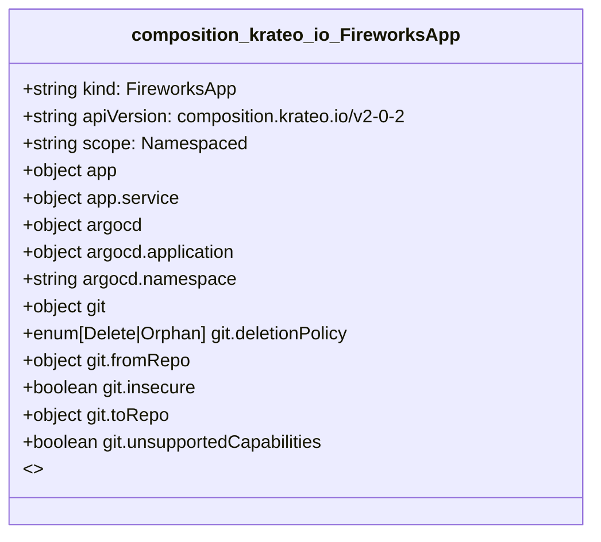

# CRD Schema Documentation - composition.krateo.io API Group

> **Generated:** 2025-09-07 17:05:14
> 
> **Total CRDs:** 1
> 
> **API Groups:** 1
> 
> **Description:** Complete schema documentation for Kubernetes Custom Resource Definitions (CRDs), including property definitions, types, relationships, and visual diagrams.

---

## 📋 Table of Contents

1. [Executive Summary](#-executive-summary)
2. [API Group Documentation](#-api-group-documentation)
   - [composition.krateo.io](#compositionkrateoio) (1 CRDs)
3. [Appendices](#-appendices)
   - [CRD Index](#crd-index)
   - [Property Types Summary](#property-types-summary)
   - [Relationship Matrix](#relationship-matrix)

## 📊 Executive Summary

### Overview

This document provides comprehensive schema documentation for **1 Custom Resource Definitions** distributed across **1 API groups** in your Kubernetes cluster.

### Key Statistics

| Metric | Value |
|--------|-------|
| **Total CRDs** | 1 |
| **API Groups** | 1 |
| **Total Instances** | 0 |
| **Namespaced CRDs** | 1 (100.0%) |
| **Cluster-scoped CRDs** | 0 (0.0%) |
| **Schema Coverage** | 1/1 (100.0%) |

### Distribution Analysis

#### Largest API Groups (by CRD count)

1. **composition.krateo.io**: 1 CRDs

### Schema Analysis

**Most Complex CRDs (by property count):**

1. `FireworksApp` (composition.krateo.io): 3 properties

## 📁 composition.krateo.io

### Overview

**API Group:** `composition.krateo.io`  
**CRDs in Group:** 1  
**Total Instances:** 0

### CRDs in this Group

| Kind | Scope | Version | Instances | Description |
|------|-------|---------|-----------|-------------|
| `FireworksApp` | Namespaced | v2-0-2 | 0 | *No description available* |

### Schema Diagram

### Detailed CRD Documentation

#### FireworksApp

**Full Name:** `fireworksapps.composition.krateo.io`  
**API Version:** `composition.krateo.io/v2-0-2`  
**Scope:** Namespaced  
**Instances:** 0  
**Categories:** compositions, comps  

**Schema Properties:**

| Property | Type | Required | Description |
|----------|------|----------|-------------|
| `git` | `object` | ✓ | Git Repository parameters section |
| `app` | `object` |  | Helm Chart parameters section |
| `argocd` | `object` |  | ArgoCD parameters section |

## 📚 Appendices

### CRD Index

Complete alphabetical index of all Custom Resource Definitions:

| CRD Name | Kind | API Group | Scope | Instances |
|----------|------|-----------|-------|-----------|
| `fireworksapps.composition.krateo.io` | `FireworksApp` | `composition.krateo.io` | Namespaced | 0 |

### Property Types Summary

Property type usage across all CRDs:

| Type | Usage Count |
|------|-------------|
| `object` | 3 |

### Relationship Matrix

Schema-based relationships detected between CRDs:

*No schema-based relationships detected*

---

*Documentation generated by k8s-inventory-cli on 2025-09-07 17:05:14*