# CRD Schema Documentation - database.oracle.com API Group

> **Generated:** 2025-09-07 17:05:14
> 
> **Total CRDs:** 14
> 
> **API Groups:** 1
> 
> **Description:** Complete schema documentation for Kubernetes Custom Resource Definitions (CRDs), including property definitions, types, relationships, and visual diagrams.

---

## 📋 Table of Contents

1. [Executive Summary](#-executive-summary)
2. [API Group Documentation](#-api-group-documentation)
   - [database.oracle.com](#databaseoraclecom) (14 CRDs)
3. [Appendices](#-appendices)
   - [CRD Index](#crd-index)
   - [Property Types Summary](#property-types-summary)
   - [Relationship Matrix](#relationship-matrix)

## 📊 Executive Summary

### Overview

This document provides comprehensive schema documentation for **14 Custom Resource Definitions** distributed across **1 API groups** in your Kubernetes cluster.

### Key Statistics

| Metric | Value |
|--------|-------|
| **Total CRDs** | 14 |
| **API Groups** | 1 |
| **Total Instances** | 0 |
| **Namespaced CRDs** | 14 (100.0%) |
| **Cluster-scoped CRDs** | 0 (0.0%) |
| **Schema Coverage** | 14/14 (100.0%) |

### Distribution Analysis

#### Largest API Groups (by CRD count)

1. **database.oracle.com**: 14 CRDs

### Schema Analysis

**Most Complex CRDs (by property count):**

1. `LRPDB` (database.oracle.com): 41 properties
2. `ShardingDatabase` (database.oracle.com): 37 properties
3. `ShardingDatabase` (database.oracle.com): 37 properties

## 📁 database.oracle.com

### Overview

**API Group:** `database.oracle.com`  
**CRDs in Group:** 14  
**Total Instances:** 0

### CRDs in this Group

| Kind | Scope | Version | Instances | Description |
|------|-------|---------|-----------|-------------|
| `AutonomousContainerDatabase` | Namespaced | v4 | 0 | *No description available* |
| `AutonomousDatabase` | Namespaced | v4 | 0 | *No description available* |
| `AutonomousDatabaseBackup` | Namespaced | v4 | 0 | *No description available* |
| `AutonomousDatabaseRestore` | Namespaced | v4 | 0 | *No description available* |
| `CDB` | Namespaced | v4 | 0 | *No description available* |
| `DataguardBroker` | Namespaced | v4 | 0 | *No description available* |
| `DbcsSystem` | Namespaced | v4 | 0 | *No description available* |
| `LREST` | Namespaced | v4 | 0 | *No description available* |
| `LRPDB` | Namespaced | v4 | 0 | *No description available* |
| `OracleRestDataService` | Namespaced | v4 | 0 | *No description available* |
| `OrdsSrvs` | Namespaced | v4 | 0 | *No description available* |
| `PDB` | Namespaced | v4 | 0 | *No description available* |
| `ShardingDatabase` | Namespaced | v4 | 0 | *No description available* |
| `SingleInstanceDatabase` | Namespaced | v4 | 0 | *No description available* |

### Schema Diagram

```mermaid
classDiagram
    %% API Group: database.oracle.com
    class database_oracle_com_AutonomousContainerDatabase {
        +string kind: AutonomousContainerDatabase
        +string apiVersion: database.oracle.com/v4
        +string scope: Namespaced
        +enum[SYNC|RESTART|TERMINATE] action
        +string autonomousContainerDatabaseOCID
        +string autonomousExadataVMClusterOCID
        +string compartmentOCID
        +string displayName
        +object freeformTags
        +boolean hardLink
        +object ociConfig
        +string ociConfig.configMapName
        +string ociConfig.secretName
        +enum[RELEASE_UPDATES|RELEASE_UPDATE_REVISIONS] patchModel
    }
    database_oracle_com_AutonomousContainerDatabase : <<Namespaced>>
    class database_oracle_com_AutonomousDatabase {
        +string kind: AutonomousDatabase
        +string apiVersion: database.oracle.com/v4
        +string scope: Namespaced
        +enum[8 values] action
        +object clone
        +object clone.adminPassword
        +object clone.autonomousContainerDatabase
        +enum[FULL|METADATA] clone.cloneType
        +string clone.compartmentId
        +number clone.computeCount
        +enum[ECPU|OCPU] clone.computeModel
        +integer clone.cpuCoreCount
        +integer clone.dataStorageSizeInTBs
        +string clone.dbName
        +string clone.dbVersion
        +object details
        +object details.adminPassword
        +object details.autonomousContainerDatabase
        +string details.compartmentId
        +number details.computeCount
        +enum[ECPU|OCPU] details.computeModel
        +integer details.cpuCoreCount
        +integer details.dataStorageSizeInTBs
        +string details.dbName
        +string details.dbVersion
        +enum[4 values] details.dbWorkload
        +boolean hardLink
        +object ociConfig
        +string ociConfig.configMapName
        +string ociConfig.secretName
        +object wallet
        +string wallet.name
        +object wallet.password
    }
    database_oracle_com_AutonomousDatabase : <<Namespaced>>
    class database_oracle_com_AutonomousDatabaseBackup {
        +string kind: AutonomousDatabaseBackup
        +string apiVersion: database.oracle.com/v4
        +string scope: Namespaced
        +string autonomousDatabaseBackupOCID
        +string displayName
        +boolean isLongTermBackup
        +object ociConfig
        +string ociConfig.configMapName
        +string ociConfig.secretName
        +integer retentionPeriodInDays
        +object target
        +object target.k8sADB
        +object target.ociADB
    }
    database_oracle_com_AutonomousDatabaseBackup : <<Namespaced>>
    class database_oracle_com_AutonomousDatabaseRestore {
        +string kind: AutonomousDatabaseRestore
        +string apiVersion: database.oracle.com/v4
        +string scope: Namespaced
        +object ociConfig
        +string ociConfig.configMapName
        +string ociConfig.secretName
        +object source
        +object source.k8sADBBackup
        +object source.pointInTime
        +object target
        +object target.k8sADB
        +object target.ociADB
    }
    database_oracle_com_AutonomousDatabaseRestore : <<Namespaced>>
    class database_oracle_com_CDB {
        +string kind: CDB
        +string apiVersion: database.oracle.com/v4
        +string scope: Namespaced
        +object cdbAdminPwd
        +object cdbAdminPwd.secret
        +object cdbAdminUser
        +object cdbAdminUser.secret
        +string cdbName
        +object cdbOrdsPrvKey
        +object cdbOrdsPrvKey.secret
        +object cdbOrdsPubKey
        +object cdbOrdsPubKey.secret
        +object cdbTlsCrt
        +object cdbTlsCrt.secret
        +object cdbTlsKey
        +object cdbTlsKey.secret
        +integer dbPort
        +string dbServer
        +string dbTnsurl
    }
    database_oracle_com_CDB : <<Namespaced>>
    class database_oracle_com_DataguardBroker {
        +string kind: DataguardBroker
        +string apiVersion: database.oracle.com/v4
        +string scope: Namespaced
        +boolean fastStartFailover
        +boolean loadBalancer
        +object nodeSelector
        +string primaryDatabaseRef
        +enum[MaxPerformance|MaxAvailability] protectionMode
        +object serviceAnnotations
        +string setAsPrimaryDatabase
        +array<string> standbyDatabaseRefs
    }
    database_oracle_com_DataguardBroker : <<Namespaced>>
    class database_oracle_com_DbcsSystem {
        +string kind: DbcsSystem
        +string apiVersion: database.oracle.com/v4
        +string scope: Namespaced
        +string databaseId
        +string dbBackupId
        +object dbClone
        +string dbClone.dbAdminPasswordSecret
        +string dbClone.dbDbUniqueName
        +string dbClone.dbName
        +string dbClone.displayName
        +string dbClone.domain
        +string dbClone.hostName
        +integer dbClone.initialDataStorageSizeInGB
        +string dbClone.kmsKeyId
        +string dbClone.kmsKeyVersionId
        +string dbClone.licenseModel
        +object dbSystem
        +string dbSystem.availabilityDomain
        +string dbSystem.backupSubnetId
        +string dbSystem.clusterName
        +string dbSystem.compartmentId
        +integer dbSystem.cpuCoreCount
        +string dbSystem.dbAdminPasswordSecret
        +object dbSystem.dbBackupConfig
        +string dbSystem.dbDomain
        +string dbSystem.dbEdition
        +string dbSystem.dbName
        +boolean hardLink
        +string id
        +object kmsConfig
        +string kmsConfig.compartmentId
        +string kmsConfig.encryptionAlgo
        +string kmsConfig.keyName
        +string kmsConfig.vaultName
        +string kmsConfig.vaultType
        +string ociConfigMap
        +string ociSecret
        +array<object> pdbConfigs
    }
    database_oracle_com_DbcsSystem : <<Namespaced>>
    class database_oracle_com_LREST {
        +string kind: LREST
        +string apiVersion: database.oracle.com/v4
        +string scope: Namespaced
        +object cdbAdminPwd
        +object cdbAdminPwd.secret
        +object cdbAdminUser
        +object cdbAdminUser.secret
        +string cdbName
        +object cdbPrvKey
        +object cdbPrvKey.secret
        +object cdbPubKey
        +object cdbPubKey.secret
        +object cdbTlsCrt
        +object cdbTlsCrt.secret
        +object cdbTlsKey
        +object cdbTlsKey.secret
        +integer dbPort
        +string dbServer
        +string dbTnsurl
    }
    database_oracle_com_LREST : <<Namespaced>>
    class database_oracle_com_LRPDB {
        +string kind: LRPDB
        +string apiVersion: database.oracle.com/v4
        +string scope: Namespaced
        +enum[10 values] action
        +object adminName
        +object adminName.secret
        +object adminPwd
        +object adminPwd.secret
        +object adminpdbPass
        +object adminpdbPass.secret
        +object adminpdbUser
        +object adminpdbUser.secret
        +string alterSystem
        +string alterSystemParameter
        +string alterSystemValue
        +boolean asClone
        +boolean assertiveLrpdbDeletion
    }
    database_oracle_com_LRPDB : <<Namespaced>>
    class database_oracle_com_OracleRestDataService {
        +string kind: OracleRestDataService
        +string apiVersion: database.oracle.com/v4
        +string scope: Namespaced
        +object adminPassword
        +boolean adminPassword.keepSecret
        +string adminPassword.secretKey
        +string adminPassword.secretName
        +string databaseRef
        +object image
        +string image.pullFrom
        +string image.pullSecrets
        +string image.version
        +boolean loadBalancer
        +boolean mongoDbApi
        +object nodeSelector
        +string oracleService
        +object ordsPassword
        +boolean ordsPassword.keepSecret
        +string ordsPassword.secretKey
        +string ordsPassword.secretName
        +string ordsUser
        +object persistence
        +enum[ReadWriteOnce|ReadWriteMany] persistence.accessMode
        +boolean persistence.setWritePermissions
        +string persistence.size
        +string persistence.storageClass
        +string persistence.volumeName
    }
    database_oracle_com_OracleRestDataService : <<Namespaced>>
    class database_oracle_com_OrdsSrvs {
        +string kind: OrdsSrvs
        +string apiVersion: database.oracle.com/v4
        +string scope: Namespaced
        +object encPrivKey
        +string encPrivKey.passwordKey
        +string encPrivKey.secretName
        +boolean forceRestart
        +object globalSettings
        +boolean globalSettings.cache.metadata.enabled
        +integer(int64) globalSettings.cache.metadata.graphql.expireAfterAccess
        +integer(int64) globalSettings.cache.metadata.graphql.expireAfterWrite
        +boolean globalSettings.cache.metadata.jwks.enabled
        +integer(int64) globalSettings.cache.metadata.jwks.expireAfterAccess
        +integer(int64) globalSettings.cache.metadata.jwks.expireAfterWrite
        +integer(int32) globalSettings.cache.metadata.jwks.initialCapacity
        +integer(int32) globalSettings.cache.metadata.jwks.maximumSize
        +integer(int64) globalSettings.cache.metadata.timeout
        +object globalSettings.certSecret
        +string image
        +enum[IfNotPresent|Always|Never] imagePullPolicy
        +string imagePullSecrets
        +array<object> poolSettings
        +integer(int32) replicas
        +enum[Deployment|StatefulSet|DaemonSet] workloadType
    }
    database_oracle_com_OrdsSrvs : <<Namespaced>>
    class database_oracle_com_PDB {
        +string kind: PDB
        +string apiVersion: database.oracle.com/v4
        +string scope: Namespaced
        +enum[8 values] action
        +object adminName
        +object adminName.secret
        +object adminPwd
        +object adminPwd.secret
        +boolean asClone
        +boolean assertivePdbDeletion
        +string cdbName
        +string cdbNamespace
        +string cdbResName
        +enum[COPY|NOCOPY|MOVE] copyAction
        +enum[INCLUDING|KEEP] dropAction
    }
    database_oracle_com_PDB : <<Namespaced>>
    class database_oracle_com_ShardingDatabase {
        +string kind: ShardingDatabase
        +string apiVersion: database.oracle.com/v4
        +string scope: Namespaced
        +string InvitedNodeSubnet
        +array<object> catalog
        +string dbEdition
        +string dbImage
        +string dbImagePullSecret
        +object dbSecret
        +string dbSecret.encryptionType
        +string dbSecret.keyFileMountLocation
        +string dbSecret.keyFileName
        +string dbSecret.keySecretName
        +string dbSecret.name
        +string dbSecret.nsConfigMap
        +string dbSecret.nsSecret
        +string dbSecret.pwdFileMountLocation
        +string dbSecret.pwdFileName
        +string fssStorageClass
        +array<object> gsm
        +string gsmDevMode
        +string gsmImage
    }
    database_oracle_com_ShardingDatabase : <<Namespaced>>
    class database_oracle_com_SingleInstanceDatabase {
        +string kind: SingleInstanceDatabase
        +string apiVersion: database.oracle.com/v4
        +string scope: Namespaced
        +object adminPassword
        +boolean adminPassword.keepSecret
        +string adminPassword.secretKey
        +string adminPassword.secretName
        +boolean archiveLog
        +string charset
        +boolean convertToSnapshotStandby
        +enum[4 values] createAs
        +enum[4 values] edition
        +boolean enableTCPS
        +boolean flashBack
        +boolean forceLog
        +object image
        +boolean image.prebuiltDB
        +string image.pullFrom
        +string image.pullSecrets
        +string image.version
    }
    database_oracle_com_SingleInstanceDatabase : <<Namespaced>>
    database_oracle_com_AutonomousContainerDatabase --> database_oracle_com_AutonomousDatabase : references
    database_oracle_com_AutonomousContainerDatabase --> database_oracle_com_AutonomousDatabase : uses
    database_oracle_com_AutonomousDatabaseBackup --> database_oracle_com_AutonomousDatabase : references
    database_oracle_com_AutonomousDatabaseBackup --> database_oracle_com_AutonomousDatabase : uses
    database_oracle_com_CDB --> database_oracle_com_LREST : references
    database_oracle_com_CDB --> database_oracle_com_LREST : uses
    database_oracle_com_CDB --> database_oracle_com_LREST : similar schema
    database_oracle_com_CDB --> database_oracle_com_LREST : routes to
    database_oracle_com_CDB --> database_oracle_com_LRPDB : references
    database_oracle_com_CDB --> database_oracle_com_LRPDB : uses
    database_oracle_com_CDB --> database_oracle_com_OrdsSrvs : references
    database_oracle_com_CDB --> database_oracle_com_OrdsSrvs : uses
    database_oracle_com_CDB --> database_oracle_com_PDB : references
    database_oracle_com_CDB --> database_oracle_com_PDB : references
    database_oracle_com_CDB --> database_oracle_com_PDB : uses
    database_oracle_com_DbcsSystem --> database_oracle_com_PDB : references
    database_oracle_com_DbcsSystem --> database_oracle_com_PDB : uses
    database_oracle_com_DbcsSystem --> database_oracle_com_PDB : configures
    database_oracle_com_LREST --> database_oracle_com_PDB : references
    database_oracle_com_LREST --> database_oracle_com_PDB : uses
    database_oracle_com_LRPDB --> database_oracle_com_PDB : references
    database_oracle_com_LRPDB --> database_oracle_com_PDB : uses
    database_oracle_com_LRPDB --> database_oracle_com_PDB : configures
    database_oracle_com_LRPDB --> database_oracle_com_PDB : similar schema
    database_oracle_com_LRPDB --> database_oracle_com_PDB : routes to
    database_oracle_com_OracleRestDataService --> database_oracle_com_PDB : references
    database_oracle_com_OracleRestDataService --> database_oracle_com_PDB : uses
    database_oracle_com_PDB --> database_oracle_com_ShardingDatabase : references
    database_oracle_com_PDB --> database_oracle_com_ShardingDatabase : uses
    database_oracle_com_PDB --> database_oracle_com_SingleInstanceDatabase : references
    database_oracle_com_PDB --> database_oracle_com_SingleInstanceDatabase : uses
```

### Detailed CRD Documentation

#### AutonomousContainerDatabase

**Full Name:** `autonomouscontainerdatabases.database.oracle.com`  
**API Version:** `database.oracle.com/v4`  
**Scope:** Namespaced  
**Instances:** 0  
**Short Names:** acd, acds  

**Schema Properties:**

| Property | Type | Required | Description |
|----------|------|----------|-------------|
| `action` | `enum[SYNC|RESTART|TERMINATE]` |  | *No description* |
| `autonomousContainerDatabaseOCID` | `string` |  | *No description* |
| `autonomousExadataVMClusterOCID` | `string` |  | *No description* |
| `compartmentOCID` | `string` |  | *No description* |
| `displayName` | `string` |  | *No description* |
| `freeformTags` | `object` |  | *No description* |
| `hardLink` | `boolean` |  | *No description* |
| `ociConfig` | `object` |  | *No description* |
| `patchModel` | `enum[RELEASE_UPDATES|RELEASE_UPDATE_REVISIONS]` |  | *No description* |

#### AutonomousDatabase

**Full Name:** `autonomousdatabases.database.oracle.com`  
**API Version:** `database.oracle.com/v4`  
**Scope:** Namespaced  
**Instances:** 0  
**Short Names:** adb, adbs  

**Schema Properties:**

| Property | Type | Required | Description |
|----------|------|----------|-------------|
| `action` | `enum[8 values]` | ✓ | *No description* |
| `clone` | `object` |  | *No description* |
| `details` | `object` |  | *No description* |
| `hardLink` | `boolean` |  | *No description* |
| `ociConfig` | `object` |  | *No description* |
| `wallet` | `object` |  | *No description* |

#### AutonomousDatabaseBackup

**Full Name:** `autonomousdatabasebackups.database.oracle.com`  
**API Version:** `database.oracle.com/v4`  
**Scope:** Namespaced  
**Instances:** 0  
**Short Names:** adbbu, adbbus  

**Schema Properties:**

| Property | Type | Required | Description |
|----------|------|----------|-------------|
| `autonomousDatabaseBackupOCID` | `string` |  | *No description* |
| `displayName` | `string` |  | *No description* |
| `isLongTermBackup` | `boolean` |  | *No description* |
| `ociConfig` | `object` |  | *No description* |
| `retentionPeriodInDays` | `integer` |  | *No description* |
| `target` | `object` |  | *No description* |

#### AutonomousDatabaseRestore

**Full Name:** `autonomousdatabaserestores.database.oracle.com`  
**API Version:** `database.oracle.com/v4`  
**Scope:** Namespaced  
**Instances:** 0  
**Short Names:** adbr, adbrs  

**Schema Properties:**

| Property | Type | Required | Description |
|----------|------|----------|-------------|
| `source` | `object` | ✓ | *No description* |
| `target` | `object` | ✓ | *No description* |
| `ociConfig` | `object` |  | *No description* |

#### CDB

**Full Name:** `cdbs.database.oracle.com`  
**API Version:** `database.oracle.com/v4`  
**Scope:** Namespaced  
**Instances:** 0  

**Schema Properties:**

| Property | Type | Required | Description |
|----------|------|----------|-------------|
| `cdbAdminPwd` | `object` |  | *No description* |
| `cdbAdminUser` | `object` |  | *No description* |
| `cdbName` | `string` |  | *No description* |
| `cdbOrdsPrvKey` | `object` |  | *No description* |
| `cdbOrdsPubKey` | `object` |  | *No description* |
| `cdbTlsCrt` | `object` |  | *No description* |
| `cdbTlsKey` | `object` |  | *No description* |
| `dbPort` | `integer` |  | *No description* |
| `dbServer` | `string` |  | *No description* |
| `dbTnsurl` | `string` |  | *No description* |
| `deletePdbCascade` | `boolean` |  | *No description* |
| `nodeSelector` | `object` |  | *No description* |
| `ordsImage` | `string` |  | *No description* |
| `ordsImagePullPolicy` | `enum[Always|Never]` |  | *No description* |
| `ordsImagePullSecret` | `string` |  | *No description* |
| `ordsPort` | `integer` |  | *No description* |
| `ordsPwd` | `object` |  | *No description* |
| `replicas` | `integer` |  | *No description* |
| `serviceName` | `string` |  | *No description* |
| `sysAdminPwd` | `object` |  | *No description* |

*... and 2 more properties*

#### DataguardBroker

**Full Name:** `dataguardbrokers.database.oracle.com`  
**API Version:** `database.oracle.com/v4`  
**Scope:** Namespaced  
**Instances:** 0  

**Schema Properties:**

| Property | Type | Required | Description |
|----------|------|----------|-------------|
| `primaryDatabaseRef` | `string` | ✓ | *No description* |
| `protectionMode` | `enum[MaxPerformance|MaxAvailability]` | ✓ | *No description* |
| `standbyDatabaseRefs` | `array<string>` | ✓ | *No description* |
| `fastStartFailover` | `boolean` |  | *No description* |
| `loadBalancer` | `boolean` |  | *No description* |
| `nodeSelector` | `object` |  | *No description* |
| `serviceAnnotations` | `object` |  | *No description* |
| `setAsPrimaryDatabase` | `string` |  | *No description* |

#### DbcsSystem

**Full Name:** `dbcssystems.database.oracle.com`  
**API Version:** `database.oracle.com/v4`  
**Scope:** Namespaced  
**Instances:** 0  

**Schema Properties:**

| Property | Type | Required | Description |
|----------|------|----------|-------------|
| `ociConfigMap` | `string` | ✓ | *No description* |
| `databaseId` | `string` |  | *No description* |
| `dbBackupId` | `string` |  | *No description* |
| `dbClone` | `object` |  | *No description* |
| `dbSystem` | `object` |  | *No description* |
| `hardLink` | `boolean` |  | *No description* |
| `id` | `string` |  | *No description* |
| `kmsConfig` | `object` |  | *No description* |
| `ociSecret` | `string` |  | *No description* |
| `pdbConfigs` | `array<object>` |  | *No description* |
| `setupDBCloning` | `boolean` |  | *No description* |

#### LREST

**Full Name:** `lrests.database.oracle.com`  
**API Version:** `database.oracle.com/v4`  
**Scope:** Namespaced  
**Instances:** 0  

**Schema Properties:**

| Property | Type | Required | Description |
|----------|------|----------|-------------|
| `cdbAdminPwd` | `object` |  | *No description* |
| `cdbAdminUser` | `object` |  | *No description* |
| `cdbName` | `string` |  | *No description* |
| `cdbPrvKey` | `object` |  | *No description* |
| `cdbPubKey` | `object` |  | *No description* |
| `cdbTlsCrt` | `object` |  | *No description* |
| `cdbTlsKey` | `object` |  | *No description* |
| `dbPort` | `integer` |  | *No description* |
| `dbServer` | `string` |  | *No description* |
| `dbTnsurl` | `string` |  | *No description* |
| `deletePdbCascade` | `boolean` |  | *No description* |
| `lrestImage` | `string` |  | *No description* |
| `lrestImagePullPolicy` | `enum[Always|Never]` |  | *No description* |
| `lrestImagePullSecret` | `string` |  | *No description* |
| `lrestPort` | `integer` |  | *No description* |
| `lrestPwd` | `object` |  | *No description* |
| `nodeSelector` | `object` |  | *No description* |
| `replicas` | `integer` |  | *No description* |
| `serviceName` | `string` |  | *No description* |
| `sysAdminPwd` | `object` |  | *No description* |

*... and 2 more properties*

#### LRPDB

**Full Name:** `lrpdbs.database.oracle.com`  
**API Version:** `database.oracle.com/v4`  
**Scope:** Namespaced  
**Instances:** 0  

**Schema Properties:**

| Property | Type | Required | Description |
|----------|------|----------|-------------|
| `action` | `enum[10 values]` | ✓ | *No description* |
| `alterSystemParameter` | `string` | ✓ | *No description* |
| `alterSystemValue` | `string` | ✓ | *No description* |
| `webServerPwd` | `object` | ✓ | *No description* |
| `adminName` | `object` |  | *No description* |
| `adminPwd` | `object` |  | *No description* |
| `adminpdbPass` | `object` |  | *No description* |
| `adminpdbUser` | `object` |  | *No description* |
| `alterSystem` | `string` |  | *No description* |
| `asClone` | `boolean` |  | *No description* |
| `assertiveLrpdbDeletion` | `boolean` |  | *No description* |
| `cdbName` | `string` |  | *No description* |
| `cdbNamespace` | `string` |  | *No description* |
| `cdbPrvKey` | `object` |  | *No description* |
| `cdbResName` | `string` |  | *No description* |
| `copyAction` | `enum[COPY|NOCOPY|MOVE]` |  | *No description* |
| `dropAction` | `enum[INCLUDING|KEEP]` |  | *No description* |
| `fileNameConversions` | `string` |  | *No description* |
| `getScript` | `boolean` |  | *No description* |
| `lrpdbTlsCat` | `object` |  | *No description* |

*... and 21 more properties*

#### OracleRestDataService

**Full Name:** `oraclerestdataservices.database.oracle.com`  
**API Version:** `database.oracle.com/v4`  
**Scope:** Namespaced  
**Instances:** 0  

**Schema Properties:**

| Property | Type | Required | Description |
|----------|------|----------|-------------|
| `adminPassword` | `object` | ✓ | *No description* |
| `databaseRef` | `string` | ✓ | *No description* |
| `ordsPassword` | `object` | ✓ | *No description* |
| `image` | `object` |  | *No description* |
| `loadBalancer` | `boolean` |  | *No description* |
| `mongoDbApi` | `boolean` |  | *No description* |
| `nodeSelector` | `object` |  | *No description* |
| `oracleService` | `string` |  | *No description* |
| `ordsUser` | `string` |  | *No description* |
| `persistence` | `object` |  | *No description* |
| `readinessCheckPeriod` | `integer` |  | *No description* |
| `replicas` | `integer` |  | *No description* |
| `restEnableSchemas` | `array<object>` |  | *No description* |
| `serviceAccountName` | `string` |  | *No description* |
| `serviceAnnotations` | `object` |  | *No description* |

#### OrdsSrvs

**Full Name:** `ordssrvs.database.oracle.com`  
**API Version:** `database.oracle.com/v4`  
**Scope:** Namespaced  
**Instances:** 0  

**Schema Properties:**

| Property | Type | Required | Description |
|----------|------|----------|-------------|
| `globalSettings` | `object` | ✓ | *No description* |
| `image` | `string` | ✓ | *No description* |
| `encPrivKey` | `object` |  | *No description* |
| `forceRestart` | `boolean` |  | *No description* |
| `imagePullPolicy` | `enum[IfNotPresent|Always|Never]` |  | *No description* |
| `imagePullSecrets` | `string` |  | *No description* |
| `poolSettings` | `array<object>` |  | *No description* |
| `replicas` | `integer(int32)` |  | *No description* |
| `workloadType` | `enum[Deployment|StatefulSet|DaemonSet]` |  | *No description* |

#### PDB

**Full Name:** `pdbs.database.oracle.com`  
**API Version:** `database.oracle.com/v4`  
**Scope:** Namespaced  
**Instances:** 0  

**Schema Properties:**

| Property | Type | Required | Description |
|----------|------|----------|-------------|
| `action` | `enum[8 values]` | ✓ | *No description* |
| `adminName` | `object` |  | *No description* |
| `adminPwd` | `object` |  | *No description* |
| `asClone` | `boolean` |  | *No description* |
| `assertivePdbDeletion` | `boolean` |  | *No description* |
| `cdbName` | `string` |  | *No description* |
| `cdbNamespace` | `string` |  | *No description* |
| `cdbResName` | `string` |  | *No description* |
| `copyAction` | `enum[COPY|NOCOPY|MOVE]` |  | *No description* |
| `dropAction` | `enum[INCLUDING|KEEP]` |  | *No description* |
| `fileNameConversions` | `string` |  | *No description* |
| `getScript` | `boolean` |  | *No description* |
| `modifyOption` | `enum[5 values]` |  | *No description* |
| `pdbName` | `string` |  | *No description* |
| `pdbOrdsPrvKey` | `object` |  | *No description* |
| `pdbOrdsPubKey` | `object` |  | *No description* |
| `pdbState` | `enum[OPEN|CLOSE]` |  | *No description* |
| `pdbTlsCat` | `object` |  | *No description* |
| `pdbTlsCrt` | `object` |  | *No description* |
| `pdbTlsKey` | `object` |  | *No description* |

*... and 15 more properties*

#### ShardingDatabase

**Full Name:** `shardingdatabases.database.oracle.com`  
**API Version:** `database.oracle.com/v4`  
**Scope:** Namespaced  
**Instances:** 0  

**Schema Properties:**

| Property | Type | Required | Description |
|----------|------|----------|-------------|
| `catalog` | `array<object>` | ✓ | *No description* |
| `dbImage` | `string` | ✓ | *No description* |
| `gsm` | `array<object>` | ✓ | *No description* |
| `gsmImage` | `string` | ✓ | *No description* |
| `shard` | `array<object>` | ✓ | *No description* |
| `InvitedNodeSubnet` | `string` |  | *No description* |
| `dbEdition` | `string` |  | *No description* |
| `dbImagePullSecret` | `string` |  | *No description* |
| `dbSecret` | `object` |  | *No description* |
| `fssStorageClass` | `string` |  | *No description* |
| `gsmDevMode` | `string` |  | *No description* |
| `gsmImagePullSecret` | `string` |  | *No description* |
| `gsmService` | `array<object>` |  | *No description* |
| `gsmShardGroup` | `array<object>` |  | *No description* |
| `gsmShardSpace` | `array<object>` |  | *No description* |
| `invitedNodeSubnetFlag` | `string` |  | *No description* |
| `isClone` | `boolean` |  | *No description* |
| `isDataGuard` | `boolean` |  | *No description* |
| `isDebug` | `boolean` |  | *No description* |
| `isDeleteOraPvc` | `boolean` |  | *No description* |

*... and 17 more properties*

#### SingleInstanceDatabase

**Full Name:** `singleinstancedatabases.database.oracle.com`  
**API Version:** `database.oracle.com/v4`  
**Scope:** Namespaced  
**Instances:** 0  

**Schema Properties:**

| Property | Type | Required | Description |
|----------|------|----------|-------------|
| `image` | `object` | ✓ | *No description* |
| `adminPassword` | `object` |  | *No description* |
| `archiveLog` | `boolean` |  | *No description* |
| `charset` | `string` |  | *No description* |
| `convertToSnapshotStandby` | `boolean` |  | *No description* |
| `createAs` | `enum[4 values]` |  | *No description* |
| `edition` | `enum[4 values]` |  | *No description* |
| `enableTCPS` | `boolean` |  | *No description* |
| `flashBack` | `boolean` |  | *No description* |
| `forceLog` | `boolean` |  | *No description* |
| `initParams` | `object` |  | *No description* |
| `listenerPort` | `integer` |  | *No description* |
| `loadBalancer` | `boolean` |  | *No description* |
| `nodeSelector` | `object` |  | *No description* |
| `pdbName` | `string` |  | *No description* |
| `persistence` | `object` |  | *No description* |
| `primaryDatabaseRef` | `string` |  | *No description* |
| `readinessCheckPeriod` | `integer` |  | *No description* |
| `replicas` | `integer` |  | *No description* |
| `resources` | `object` |  | *No description* |

*... and 7 more properties*

## 📚 Appendices

### CRD Index

Complete alphabetical index of all Custom Resource Definitions:

| CRD Name | Kind | API Group | Scope | Instances |
|----------|------|-----------|-------|-----------|
| `autonomouscontainerdatabases.database.oracle.com` | `AutonomousContainerDatabase` | `database.oracle.com` | Namespaced | 0 |
| `autonomousdatabasebackups.database.oracle.com` | `AutonomousDatabaseBackup` | `database.oracle.com` | Namespaced | 0 |
| `autonomousdatabaserestores.database.oracle.com` | `AutonomousDatabaseRestore` | `database.oracle.com` | Namespaced | 0 |
| `autonomousdatabases.database.oracle.com` | `AutonomousDatabase` | `database.oracle.com` | Namespaced | 0 |
| `cdbs.database.oracle.com` | `CDB` | `database.oracle.com` | Namespaced | 0 |
| `dataguardbrokers.database.oracle.com` | `DataguardBroker` | `database.oracle.com` | Namespaced | 0 |
| `dbcssystems.database.oracle.com` | `DbcsSystem` | `database.oracle.com` | Namespaced | 0 |
| `lrests.database.oracle.com` | `LREST` | `database.oracle.com` | Namespaced | 0 |
| `lrpdbs.database.oracle.com` | `LRPDB` | `database.oracle.com` | Namespaced | 0 |
| `oraclerestdataservices.database.oracle.com` | `OracleRestDataService` | `database.oracle.com` | Namespaced | 0 |
| `ordssrvs.database.oracle.com` | `OrdsSrvs` | `database.oracle.com` | Namespaced | 0 |
| `pdbs.database.oracle.com` | `PDB` | `database.oracle.com` | Namespaced | 0 |
| `shardingdatabases.database.oracle.com` | `ShardingDatabase` | `database.oracle.com` | Namespaced | 0 |
| `singleinstancedatabases.database.oracle.com` | `SingleInstanceDatabase` | `database.oracle.com` | Namespaced | 0 |

### Property Types Summary

Property type usage across all CRDs:

| Type | Usage Count |
|------|-------------|
| `string` | 181 |
| `object` | 129 |
| `boolean` | 67 |
| `integer` | 28 |
| `array` | 25 |

### Relationship Matrix

Schema-based relationships detected between CRDs:

| Source CRD | Target CRD | API Group | Relationship Type |
|------------|------------|-----------|-------------------|
| `AutonomousContainerDatabase` | `AutonomousDatabase` | `database.oracle.com (intra-group)` | references |
| `AutonomousContainerDatabase` | `AutonomousDatabase` | `database.oracle.com (intra-group)` | uses |
| `AutonomousDatabaseBackup` | `AutonomousDatabase` | `database.oracle.com (intra-group)` | references |
| `AutonomousDatabaseBackup` | `AutonomousDatabase` | `database.oracle.com (intra-group)` | uses |
| `CDB` | `LREST` | `database.oracle.com (intra-group)` | references |
| `CDB` | `LREST` | `database.oracle.com (intra-group)` | uses |
| `CDB` | `LREST` | `database.oracle.com (intra-group)` | similar_schema |
| `CDB` | `LREST` | `database.oracle.com (intra-group)` | routes_to |
| `CDB` | `LRPDB` | `database.oracle.com (intra-group)` | references |
| `CDB` | `LRPDB` | `database.oracle.com (intra-group)` | uses |
| `CDB` | `OrdsSrvs` | `database.oracle.com (intra-group)` | references |
| `CDB` | `OrdsSrvs` | `database.oracle.com (intra-group)` | uses |
| `CDB` | `PDB` | `database.oracle.com (intra-group)` | references |
| `CDB` | `PDB` | `database.oracle.com (intra-group)` | references |
| `CDB` | `PDB` | `database.oracle.com (intra-group)` | uses |
| `DbcsSystem` | `PDB` | `database.oracle.com (intra-group)` | references |
| `DbcsSystem` | `PDB` | `database.oracle.com (intra-group)` | uses |
| `DbcsSystem` | `PDB` | `database.oracle.com (intra-group)` | configures |
| `LREST` | `PDB` | `database.oracle.com (intra-group)` | references |
| `LREST` | `PDB` | `database.oracle.com (intra-group)` | uses |
| `LRPDB` | `PDB` | `database.oracle.com (intra-group)` | references |
| `LRPDB` | `PDB` | `database.oracle.com (intra-group)` | uses |
| `LRPDB` | `PDB` | `database.oracle.com (intra-group)` | configures |
| `LRPDB` | `PDB` | `database.oracle.com (intra-group)` | similar_schema |
| `LRPDB` | `PDB` | `database.oracle.com (intra-group)` | routes_to |
| `OracleRestDataService` | `PDB` | `database.oracle.com (intra-group)` | references |
| `OracleRestDataService` | `PDB` | `database.oracle.com (intra-group)` | uses |
| `PDB` | `ShardingDatabase` | `database.oracle.com (intra-group)` | references |
| `PDB` | `ShardingDatabase` | `database.oracle.com (intra-group)` | uses |
| `PDB` | `SingleInstanceDatabase` | `database.oracle.com (intra-group)` | references |
| `PDB` | `SingleInstanceDatabase` | `database.oracle.com (intra-group)` | uses |

---

*Documentation generated by k8s-inventory-cli on 2025-09-07 17:05:15*