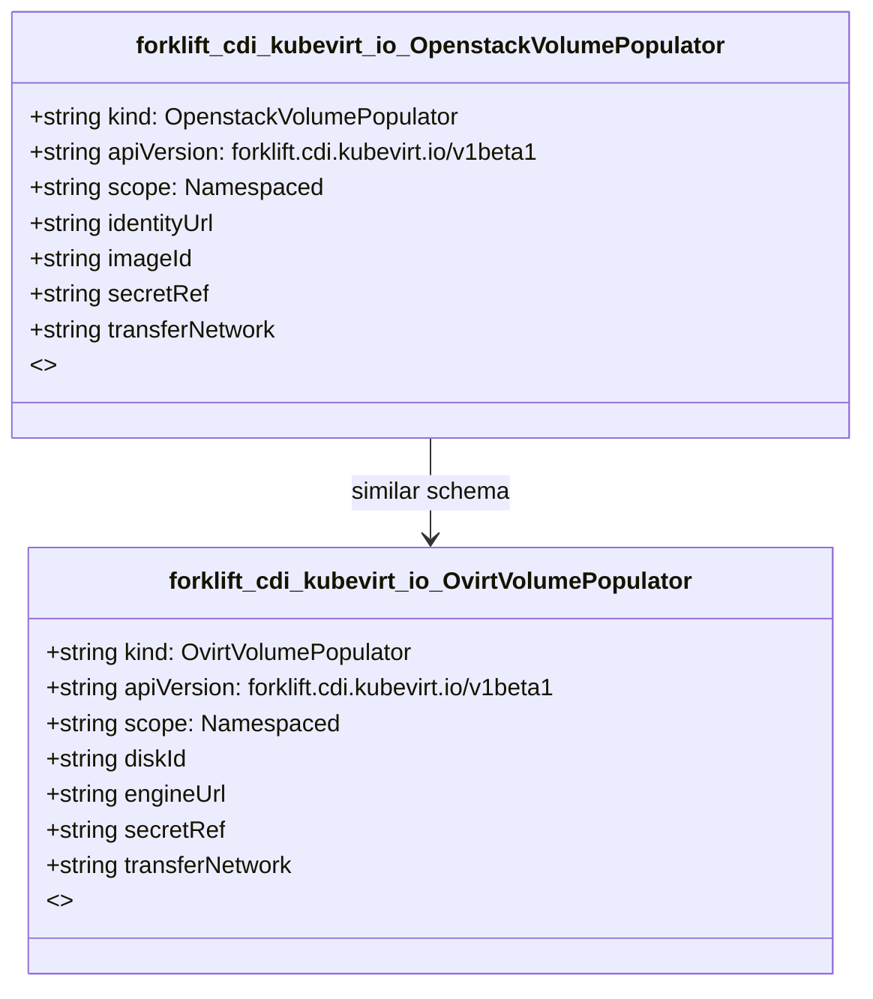

# CRD Schema Documentation - forklift.cdi.kubevirt.io API Group

> **Generated:** 2025-09-07 17:05:15
> 
> **Total CRDs:** 2
> 
> **API Groups:** 1
> 
> **Description:** Complete schema documentation for Kubernetes Custom Resource Definitions (CRDs), including property definitions, types, relationships, and visual diagrams.

---

## 📋 Table of Contents

1. [Executive Summary](#-executive-summary)
2. [API Group Documentation](#-api-group-documentation)
   - [forklift.cdi.kubevirt.io](#forkliftcdikubevirtio) (2 CRDs)
3. [Appendices](#-appendices)
   - [CRD Index](#crd-index)
   - [Property Types Summary](#property-types-summary)
   - [Relationship Matrix](#relationship-matrix)

## 📊 Executive Summary

### Overview

This document provides comprehensive schema documentation for **2 Custom Resource Definitions** distributed across **1 API groups** in your Kubernetes cluster.

### Key Statistics

| Metric | Value |
|--------|-------|
| **Total CRDs** | 2 |
| **API Groups** | 1 |
| **Total Instances** | 0 |
| **Namespaced CRDs** | 2 (100.0%) |
| **Cluster-scoped CRDs** | 0 (0.0%) |
| **Schema Coverage** | 2/2 (100.0%) |

### Distribution Analysis

#### Largest API Groups (by CRD count)

1. **forklift.cdi.kubevirt.io**: 2 CRDs

### Schema Analysis

**Most Complex CRDs (by property count):**

1. `OpenstackVolumePopulator` (forklift.cdi.kubevirt.io): 4 properties
2. `OvirtVolumePopulator` (forklift.cdi.kubevirt.io): 4 properties

## 📁 forklift.cdi.kubevirt.io

### Overview

**API Group:** `forklift.cdi.kubevirt.io`  
**CRDs in Group:** 2  
**Total Instances:** 0

### CRDs in this Group

| Kind | Scope | Version | Instances | Description |
|------|-------|---------|-----------|-------------|
| `OpenstackVolumePopulator` | Namespaced | v1beta1 | 0 | *No description available* |
| `OvirtVolumePopulator` | Namespaced | v1beta1 | 0 | *No description available* |

### Schema Diagram

### Detailed CRD Documentation

#### OpenstackVolumePopulator

**Full Name:** `openstackvolumepopulators.forklift.cdi.kubevirt.io`  
**API Version:** `forklift.cdi.kubevirt.io/v1beta1`  
**Scope:** Namespaced  
**Instances:** 0  
**Short Names:** osvp, osvps  

**Schema Properties:**

| Property | Type | Required | Description |
|----------|------|----------|-------------|
| `identityUrl` | `string` | ✓ | *No description* |
| `imageId` | `string` | ✓ | *No description* |
| `secretRef` | `string` | ✓ | *No description* |
| `transferNetwork` | `string` |  | The network attachment definition that should be used for... |

#### OvirtVolumePopulator

**Full Name:** `ovirtvolumepopulators.forklift.cdi.kubevirt.io`  
**API Version:** `forklift.cdi.kubevirt.io/v1beta1`  
**Scope:** Namespaced  
**Instances:** 0  
**Short Names:** ovvp, ovvps  

**Schema Properties:**

| Property | Type | Required | Description |
|----------|------|----------|-------------|
| `diskId` | `string` | ✓ | *No description* |
| `engineUrl` | `string` | ✓ | *No description* |
| `secretRef` | `string` | ✓ | *No description* |
| `transferNetwork` | `string` |  | The network attachment definition that should be used for... |

## 📚 Appendices

### CRD Index

Complete alphabetical index of all Custom Resource Definitions:

| CRD Name | Kind | API Group | Scope | Instances |
|----------|------|-----------|-------|-----------|
| `openstackvolumepopulators.forklift.cdi.kubevirt.io` | `OpenstackVolumePopulator` | `forklift.cdi.kubevirt.io` | Namespaced | 0 |
| `ovirtvolumepopulators.forklift.cdi.kubevirt.io` | `OvirtVolumePopulator` | `forklift.cdi.kubevirt.io` | Namespaced | 0 |

### Property Types Summary

Property type usage across all CRDs:

| Type | Usage Count |
|------|-------------|
| `string` | 8 |

### Relationship Matrix

Schema-based relationships detected between CRDs:

| Source CRD | Target CRD | API Group | Relationship Type |
|------------|------------|-----------|-------------------|
| `OpenstackVolumePopulator` | `OvirtVolumePopulator` | `forklift.cdi.kubevirt.io (intra-group)` | similar_schema |

---

*Documentation generated by k8s-inventory-cli on 2025-09-07 17:05:15*