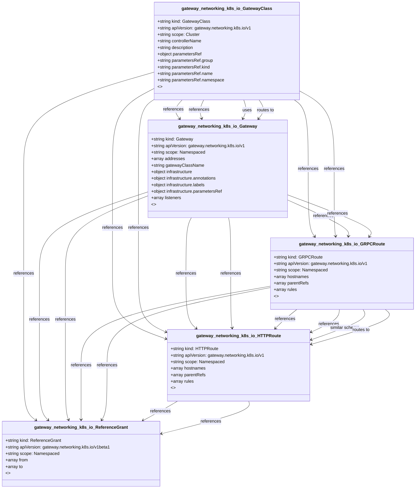

# CRD Schema Documentation - gateway.networking.k8s.io API Group

> **Generated:** 2025-09-07 17:05:15
> 
> **Total CRDs:** 5
> 
> **API Groups:** 1
> 
> **Description:** Complete schema documentation for Kubernetes Custom Resource Definitions (CRDs), including property definitions, types, relationships, and visual diagrams.

---

## 📋 Table of Contents

1. [Executive Summary](#-executive-summary)
2. [API Group Documentation](#-api-group-documentation)
   - [gateway.networking.k8s.io](#gatewaynetworkingk8sio) (5 CRDs)
3. [Appendices](#-appendices)
   - [CRD Index](#crd-index)
   - [Property Types Summary](#property-types-summary)
   - [Relationship Matrix](#relationship-matrix)

## 📊 Executive Summary

### Overview

This document provides comprehensive schema documentation for **5 Custom Resource Definitions** distributed across **1 API groups** in your Kubernetes cluster.

### Key Statistics

| Metric | Value |
|--------|-------|
| **Total CRDs** | 5 |
| **API Groups** | 1 |
| **Total Instances** | 0 |
| **Namespaced CRDs** | 4 (80.0%) |
| **Cluster-scoped CRDs** | 1 (20.0%) |
| **Schema Coverage** | 5/5 (100.0%) |

### Distribution Analysis

#### Largest API Groups (by CRD count)

1. **gateway.networking.k8s.io**: 5 CRDs

### Schema Analysis

**Most Complex CRDs (by property count):**

1. `Gateway` (gateway.networking.k8s.io): 4 properties
2. `Gateway` (gateway.networking.k8s.io): 4 properties
3. `GatewayClass` (gateway.networking.k8s.io): 3 properties

## 📁 gateway.networking.k8s.io

### Overview

**API Group:** `gateway.networking.k8s.io`  
**CRDs in Group:** 5  
**Total Instances:** 0

### CRDs in this Group

| Kind | Scope | Version | Instances | Description |
|------|-------|---------|-----------|-------------|
| `GRPCRoute` | Namespaced | v1 | 0 | *No description available* |
| `Gateway` | Namespaced | v1 | 0 | *No description available* |
| `GatewayClass` | Cluster | v1 | 0 | *No description available* |
| `HTTPRoute` | Namespaced | v1 | 0 | *No description available* |
| `ReferenceGrant` | Namespaced | v1beta1 | 0 | *No description available* |

### Schema Diagram

### Detailed CRD Documentation

#### GRPCRoute

**Full Name:** `grpcroutes.gateway.networking.k8s.io`  
**API Version:** `gateway.networking.k8s.io/v1`  
**Scope:** Namespaced  
**Instances:** 0  
**Categories:** gateway-api  

**Schema Properties:**

| Property | Type | Required | Description |
|----------|------|----------|-------------|
| `hostnames` | `array<string>` |  | Hostnames defines a set of hostnames to match against the... |
| `parentRefs` | `array<object>` |  | ParentRefs references the resources (usually Gateways) th... |
| `rules` | `array<object>` |  | Rules are a list of GRPC matchers, filters and actions.

 |

#### Gateway

**Full Name:** `gateways.gateway.networking.k8s.io`  
**API Version:** `gateway.networking.k8s.io/v1`  
**Scope:** Namespaced  
**Instances:** 0  
**Categories:** gateway-api  
**Short Names:** gtw  

**Schema Properties:**

| Property | Type | Required | Description |
|----------|------|----------|-------------|
| `gatewayClassName` | `string` | ✓ | GatewayClassName used for this Gateway. This is the name ... |
| `listeners` | `array<object>` | ✓ | Listeners associated with this Gateway. Listeners define
... |
| `addresses` | `array<object>` |  | Addresses requested for this Gateway. This is optional an... |
| `infrastructure` | `object` |  | Infrastructure defines infrastructure level attributes ab... |

#### GatewayClass

**Full Name:** `gatewayclasses.gateway.networking.k8s.io`  
**API Version:** `gateway.networking.k8s.io/v1`  
**Scope:** Cluster  
**Instances:** 0  
**Categories:** gateway-api  
**Short Names:** gc  

**Schema Properties:**

| Property | Type | Required | Description |
|----------|------|----------|-------------|
| `controllerName` | `string` | ✓ | ControllerName is the name of the controller that is mana... |
| `description` | `string` |  | Description helps describe a GatewayClass with more details. |
| `parametersRef` | `object` |  | ParametersRef is a reference to a resource that contains ... |

#### HTTPRoute

**Full Name:** `httproutes.gateway.networking.k8s.io`  
**API Version:** `gateway.networking.k8s.io/v1`  
**Scope:** Namespaced  
**Instances:** 0  
**Categories:** gateway-api  

**Schema Properties:**

| Property | Type | Required | Description |
|----------|------|----------|-------------|
| `hostnames` | `array<string>` |  | Hostnames defines a set of hostnames that should match ag... |
| `parentRefs` | `array<object>` |  | ParentRefs references the resources (usually Gateways) th... |
| `rules` | `array<object>` |  | Rules are a list of HTTP matchers, filters and actions.

 |

#### ReferenceGrant

**Full Name:** `referencegrants.gateway.networking.k8s.io`  
**API Version:** `gateway.networking.k8s.io/v1beta1`  
**Scope:** Namespaced  
**Instances:** 0  
**Categories:** gateway-api  
**Short Names:** refgrant  

**Schema Properties:**

| Property | Type | Required | Description |
|----------|------|----------|-------------|
| `from` | `array<object>` | ✓ | From describes the trusted namespaces and kinds that can ... |
| `to` | `array<object>` | ✓ | To describes the resources that may be referenced by the ... |

## 📚 Appendices

### CRD Index

Complete alphabetical index of all Custom Resource Definitions:

| CRD Name | Kind | API Group | Scope | Instances |
|----------|------|-----------|-------|-----------|
| `gatewayclasses.gateway.networking.k8s.io` | `GatewayClass` | `gateway.networking.k8s.io` | Cluster | 0 |
| `gateways.gateway.networking.k8s.io` | `Gateway` | `gateway.networking.k8s.io` | Namespaced | 0 |
| `grpcroutes.gateway.networking.k8s.io` | `GRPCRoute` | `gateway.networking.k8s.io` | Namespaced | 0 |
| `httproutes.gateway.networking.k8s.io` | `HTTPRoute` | `gateway.networking.k8s.io` | Namespaced | 0 |
| `referencegrants.gateway.networking.k8s.io` | `ReferenceGrant` | `gateway.networking.k8s.io` | Namespaced | 0 |

### Property Types Summary

Property type usage across all CRDs:

| Type | Usage Count |
|------|-------------|
| `array` | 15 |
| `string` | 6 |
| `object` | 4 |

### Relationship Matrix

Schema-based relationships detected between CRDs:

| Source CRD | Target CRD | API Group | Relationship Type |
|------------|------------|-----------|-------------------|
| `GatewayClass` | `Gateway` | `gateway.networking.k8s.io (intra-group)` | references |
| `GatewayClass` | `Gateway` | `gateway.networking.k8s.io (intra-group)` | references |
| `GatewayClass` | `Gateway` | `gateway.networking.k8s.io (intra-group)` | uses |
| `GatewayClass` | `Gateway` | `gateway.networking.k8s.io (intra-group)` | routes_to |
| `GatewayClass` | `GRPCRoute` | `gateway.networking.k8s.io (intra-group)` | references |
| `GatewayClass` | `GRPCRoute` | `gateway.networking.k8s.io (intra-group)` | references |
| `GatewayClass` | `HTTPRoute` | `gateway.networking.k8s.io (intra-group)` | references |
| `GatewayClass` | `HTTPRoute` | `gateway.networking.k8s.io (intra-group)` | references |
| `GatewayClass` | `ReferenceGrant` | `gateway.networking.k8s.io (intra-group)` | references |
| `Gateway` | `GRPCRoute` | `gateway.networking.k8s.io (intra-group)` | references |
| `Gateway` | `GRPCRoute` | `gateway.networking.k8s.io (intra-group)` | references |
| `Gateway` | `HTTPRoute` | `gateway.networking.k8s.io (intra-group)` | references |
| `Gateway` | `HTTPRoute` | `gateway.networking.k8s.io (intra-group)` | references |
| `Gateway` | `ReferenceGrant` | `gateway.networking.k8s.io (intra-group)` | references |
| `Gateway` | `ReferenceGrant` | `gateway.networking.k8s.io (intra-group)` | references |
| `GRPCRoute` | `HTTPRoute` | `gateway.networking.k8s.io (intra-group)` | references |
| `GRPCRoute` | `HTTPRoute` | `gateway.networking.k8s.io (intra-group)` | references |
| `GRPCRoute` | `HTTPRoute` | `gateway.networking.k8s.io (intra-group)` | similar_schema |
| `GRPCRoute` | `HTTPRoute` | `gateway.networking.k8s.io (intra-group)` | routes_to |
| `GRPCRoute` | `ReferenceGrant` | `gateway.networking.k8s.io (intra-group)` | references |
| `GRPCRoute` | `ReferenceGrant` | `gateway.networking.k8s.io (intra-group)` | references |
| `HTTPRoute` | `ReferenceGrant` | `gateway.networking.k8s.io (intra-group)` | references |
| `HTTPRoute` | `ReferenceGrant` | `gateway.networking.k8s.io (intra-group)` | references |

---

*Documentation generated by k8s-inventory-cli on 2025-09-07 17:05:15*