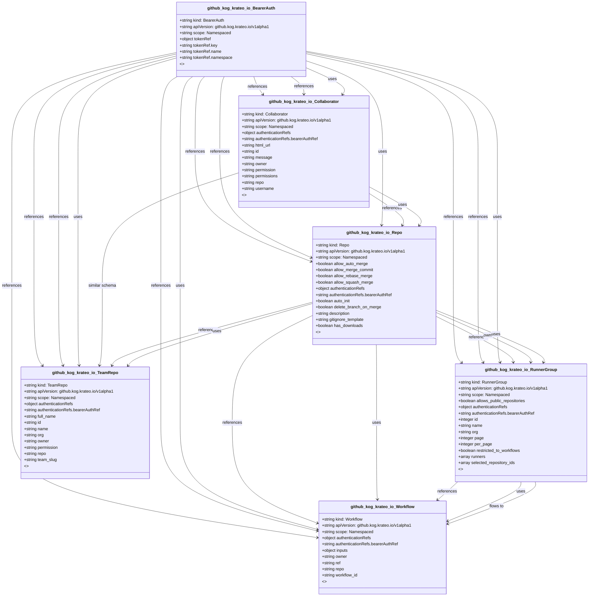

# CRD Schema Documentation - github.kog.krateo.io API Group

> **Generated:** 2025-09-07 17:05:15
> 
> **Total CRDs:** 6
> 
> **API Groups:** 1
> 
> **Description:** Complete schema documentation for Kubernetes Custom Resource Definitions (CRDs), including property definitions, types, relationships, and visual diagrams.

---

## 📋 Table of Contents

1. [Executive Summary](#-executive-summary)
2. [API Group Documentation](#-api-group-documentation)
   - [github.kog.krateo.io](#githubkogkrateoio) (6 CRDs)
3. [Appendices](#-appendices)
   - [CRD Index](#crd-index)
   - [Property Types Summary](#property-types-summary)
   - [Relationship Matrix](#relationship-matrix)

## 📊 Executive Summary

### Overview

This document provides comprehensive schema documentation for **6 Custom Resource Definitions** distributed across **1 API groups** in your Kubernetes cluster.

### Key Statistics

| Metric | Value |
|--------|-------|
| **Total CRDs** | 6 |
| **API Groups** | 1 |
| **Total Instances** | 0 |
| **Namespaced CRDs** | 6 (100.0%) |
| **Cluster-scoped CRDs** | 0 (0.0%) |
| **Schema Coverage** | 6/6 (100.0%) |

### Distribution Analysis

#### Largest API Groups (by CRD count)

1. **github.kog.krateo.io**: 6 CRDs

### Schema Analysis

**Most Complex CRDs (by property count):**

1. `Repo` (github.kog.krateo.io): 28 properties
2. `RunnerGroup` (github.kog.krateo.io): 13 properties
3. `Collaborator` (github.kog.krateo.io): 9 properties

## 📁 github.kog.krateo.io

### Overview

**API Group:** `github.kog.krateo.io`  
**CRDs in Group:** 6  
**Total Instances:** 0

### CRDs in this Group

| Kind | Scope | Version | Instances | Description |
|------|-------|---------|-----------|-------------|
| `BearerAuth` | Namespaced | v1alpha1 | 0 | *No description available* |
| `Collaborator` | Namespaced | v1alpha1 | 0 | *No description available* |
| `Repo` | Namespaced | v1alpha1 | 0 | *No description available* |
| `RunnerGroup` | Namespaced | v1alpha1 | 0 | *No description available* |
| `TeamRepo` | Namespaced | v1alpha1 | 0 | *No description available* |
| `Workflow` | Namespaced | v1alpha1 | 0 | *No description available* |

### Schema Diagram

### Detailed CRD Documentation

#### BearerAuth

**Full Name:** `bearerauths.github.kog.krateo.io`  
**API Version:** `github.kog.krateo.io/v1alpha1`  
**Scope:** Namespaced  
**Instances:** 0  
**Categories:** runnergroup, restauths, ra  

**Schema Properties:**

| Property | Type | Required | Description |
|----------|------|----------|-------------|
| `tokenRef` | `object` | ✓ | *No description* |

#### Collaborator

**Full Name:** `collaborators.github.kog.krateo.io`  
**API Version:** `github.kog.krateo.io/v1alpha1`  
**Scope:** Namespaced  
**Instances:** 0  
**Categories:** collaborator, restresources, rr  

**Schema Properties:**

| Property | Type | Required | Description |
|----------|------|----------|-------------|
| `authenticationRefs` | `object` | ✓ | AuthenticationRefs represent the reference to a CR contai... |
| `html_url` | `string` |  | IDENTIFIER: html_url |
| `id` | `string` |  | IDENTIFIER: id |
| `message` | `string` |  | IDENTIFIER: message |
| `owner` | `string` |  | PARAMETER: path, VERB: Post - Owner of the repository |
| `permission` | `string` |  | *No description* |
| `permissions` | `string` |  | IDENTIFIER: permissions |
| `repo` | `string` |  | PARAMETER: path, VERB: Post - Name of the repository |
| `username` | `string` |  | PARAMETER: path, VERB: Post - Username of the collaborato... |

#### Repo

**Full Name:** `repoes.github.kog.krateo.io`  
**API Version:** `github.kog.krateo.io/v1alpha1`  
**Scope:** Namespaced  
**Instances:** 0  
**Categories:** repo, restresources, rr  

**Schema Properties:**

| Property | Type | Required | Description |
|----------|------|----------|-------------|
| `authenticationRefs` | `object` | ✓ | AuthenticationRefs represent the reference to a CR contai... |
| `allow_auto_merge` | `boolean` |  | Either `true` to allow auto-merge on pull requests, or `f... |
| `allow_merge_commit` | `boolean` |  | Either `true` to allow merging pull requests with a merge... |
| `allow_rebase_merge` | `boolean` |  | Either `true` to allow rebase-merging pull requests, or `... |
| `allow_squash_merge` | `boolean` |  | Either `true` to allow squash-merging pull requests, or `... |
| `auto_init` | `boolean` |  | Pass `true` to create an initial commit with empty README. |
| `delete_branch_on_merge` | `boolean` |  | Either `true` to allow automatically deleting head branch... |
| `description` | `string` |  | A short description of the repository. |
| `gitignore_template` | `string` |  | Desired language or platform [.gitignore template](https:... |
| `has_downloads` | `boolean` |  | Whether downloads are enabled. |
| `has_issues` | `boolean` |  | Either `true` to enable issues for this repository or `fa... |
| `has_projects` | `boolean` |  | Either `true` to enable projects for this repository or `... |
| `has_wiki` | `boolean` |  | Either `true` to enable the wiki for this repository or `... |
| `homepage` | `string` |  | A URL with more information about the repository. |
| `html_url` | `string` |  | IDENTIFIER: html_url |
| `id` | `string` |  | IDENTIFIER: id |
| `is_template` | `boolean` |  | Either `true` to make this repo available as a template r... |
| `license_template` | `string` |  | Choose an [open source license template](https://chooseal... |
| `merge_commit_message` | `enum[PR_BODY|PR_TITLE|BLANK]` |  | The default value for a merge commit message.

- `PR_TITL... |
| `merge_commit_title` | `enum[PR_TITLE|MERGE_MESSAGE]` |  | Required when using `merge_commit_message`.

The default ... |

*... and 8 more properties*

#### RunnerGroup

**Full Name:** `runnergroups.github.kog.krateo.io`  
**API Version:** `github.kog.krateo.io/v1alpha1`  
**Scope:** Namespaced  
**Instances:** 0  
**Categories:** runnergroup, restresources, rr  

**Schema Properties:**

| Property | Type | Required | Description |
|----------|------|----------|-------------|
| `authenticationRefs` | `object` | ✓ | AuthenticationRefs represent the reference to a CR contai... |
| `allows_public_repositories` | `boolean` |  | Whether the runner group can be used by `public` reposito... |
| `id` | `integer` |  | PARAMETER: path, VERB: Get - Unique identifier of the sel... |
| `name` | `string` |  | Name of the runner group. |
| `org` | `string` |  | PARAMETER: path, VERB: Get - The organization name. The n... |
| `page` | `integer` |  | PARAMETER: query, VERB: Get - The page number of the resu... |
| `per_page` | `integer` |  | PARAMETER: query, VERB: Get - The number of results per p... |
| `restricted_to_workflows` | `boolean` |  | If `true`, the runner group will be restricted to running... |
| `runners` | `array<integer>` |  | List of runner IDs to add to the runner group. |
| `selected_repository_ids` | `array<integer>` |  | List of repository IDs that can access the runner group. |
| `selected_workflows` | `array<string>` |  | List of workflows the runner group should be allowed to r... |
| `visibility` | `enum[selected|all|private]` |  | Visibility of a runner group. You can select all reposito... |
| `visible_to_repository` | `string` |  | PARAMETER: query, VERB: Get - Only return runner groups t... |

#### TeamRepo

**Full Name:** `teamrepoes.github.kog.krateo.io`  
**API Version:** `github.kog.krateo.io/v1alpha1`  
**Scope:** Namespaced  
**Instances:** 0  
**Categories:** teamrepo, restresources, rr  

**Schema Properties:**

| Property | Type | Required | Description |
|----------|------|----------|-------------|
| `authenticationRefs` | `object` | ✓ | AuthenticationRefs represent the reference to a CR contai... |
| `full_name` | `string` |  | IDENTIFIER: full_name |
| `id` | `string` |  | IDENTIFIER: id |
| `name` | `string` |  | IDENTIFIER: name |
| `org` | `string` |  | PARAMETER: path, VERB: Put - The organization name. The n... |
| `owner` | `string` |  | PARAMETER: path, VERB: Put - The account owner of the rep... |
| `permission` | `string` |  | The permission to grant the team on this repository. We a... |
| `repo` | `string` |  | PARAMETER: path, VERB: Put - The name of the repository w... |
| `team_slug` | `string` |  | PARAMETER: path, VERB: Put - The slug of the team name. |

#### Workflow

**Full Name:** `workflows.github.kog.krateo.io`  
**API Version:** `github.kog.krateo.io/v1alpha1`  
**Scope:** Namespaced  
**Instances:** 0  
**Categories:** workflow, restresources, rr  

**Schema Properties:**

| Property | Type | Required | Description |
|----------|------|----------|-------------|
| `authenticationRefs` | `object` | ✓ | AuthenticationRefs represent the reference to a CR contai... |
| `inputs` | `object` |  | Input keys and values configured in the workflow file. Th... |
| `owner` | `string` |  | PARAMETER: path, VERB: Post - The account owner of the re... |
| `ref` | `string` |  | The git reference for the workflow. The reference can be ... |
| `repo` | `string` |  | PARAMETER: path, VERB: Post - The name of the repository ... |
| `workflow_id` | `string` |  | PARAMETER: path, VERB: Post - The ID of the workflow. You... |

## 📚 Appendices

### CRD Index

Complete alphabetical index of all Custom Resource Definitions:

| CRD Name | Kind | API Group | Scope | Instances |
|----------|------|-----------|-------|-----------|
| `bearerauths.github.kog.krateo.io` | `BearerAuth` | `github.kog.krateo.io` | Namespaced | 0 |
| `collaborators.github.kog.krateo.io` | `Collaborator` | `github.kog.krateo.io` | Namespaced | 0 |
| `repoes.github.kog.krateo.io` | `Repo` | `github.kog.krateo.io` | Namespaced | 0 |
| `runnergroups.github.kog.krateo.io` | `RunnerGroup` | `github.kog.krateo.io` | Namespaced | 0 |
| `teamrepoes.github.kog.krateo.io` | `TeamRepo` | `github.kog.krateo.io` | Namespaced | 0 |
| `workflows.github.kog.krateo.io` | `Workflow` | `github.kog.krateo.io` | Namespaced | 0 |

### Property Types Summary

Property type usage across all CRDs:

| Type | Usage Count |
|------|-------------|
| `string` | 37 |
| `boolean` | 15 |
| `object` | 7 |
| `integer` | 4 |
| `array` | 3 |

### Relationship Matrix

Schema-based relationships detected between CRDs:

| Source CRD | Target CRD | API Group | Relationship Type |
|------------|------------|-----------|-------------------|
| `BearerAuth` | `Collaborator` | `github.kog.krateo.io (intra-group)` | references |
| `BearerAuth` | `Collaborator` | `github.kog.krateo.io (intra-group)` | references |
| `BearerAuth` | `Collaborator` | `github.kog.krateo.io (intra-group)` | uses |
| `BearerAuth` | `Repo` | `github.kog.krateo.io (intra-group)` | references |
| `BearerAuth` | `Repo` | `github.kog.krateo.io (intra-group)` | references |
| `BearerAuth` | `Repo` | `github.kog.krateo.io (intra-group)` | uses |
| `BearerAuth` | `RunnerGroup` | `github.kog.krateo.io (intra-group)` | references |
| `BearerAuth` | `RunnerGroup` | `github.kog.krateo.io (intra-group)` | references |
| `BearerAuth` | `RunnerGroup` | `github.kog.krateo.io (intra-group)` | uses |
| `BearerAuth` | `TeamRepo` | `github.kog.krateo.io (intra-group)` | references |
| `BearerAuth` | `TeamRepo` | `github.kog.krateo.io (intra-group)` | references |
| `BearerAuth` | `TeamRepo` | `github.kog.krateo.io (intra-group)` | uses |
| `BearerAuth` | `Workflow` | `github.kog.krateo.io (intra-group)` | references |
| `BearerAuth` | `Workflow` | `github.kog.krateo.io (intra-group)` | references |
| `BearerAuth` | `Workflow` | `github.kog.krateo.io (intra-group)` | uses |
| `Collaborator` | `Repo` | `github.kog.krateo.io (intra-group)` | references |
| `Collaborator` | `Repo` | `github.kog.krateo.io (intra-group)` | uses |
| `Collaborator` | `TeamRepo` | `github.kog.krateo.io (intra-group)` | similar_schema |
| `Repo` | `RunnerGroup` | `github.kog.krateo.io (intra-group)` | references |
| `Repo` | `RunnerGroup` | `github.kog.krateo.io (intra-group)` | owns |
| `Repo` | `RunnerGroup` | `github.kog.krateo.io (intra-group)` | uses |
| `Repo` | `TeamRepo` | `github.kog.krateo.io (intra-group)` | references |
| `Repo` | `TeamRepo` | `github.kog.krateo.io (intra-group)` | uses |
| `Repo` | `Workflow` | `github.kog.krateo.io (intra-group)` | references |
| `Repo` | `Workflow` | `github.kog.krateo.io (intra-group)` | uses |
| `RunnerGroup` | `Workflow` | `github.kog.krateo.io (intra-group)` | references |
| `RunnerGroup` | `Workflow` | `github.kog.krateo.io (intra-group)` | uses |
| `RunnerGroup` | `Workflow` | `github.kog.krateo.io (intra-group)` | flows_to |

---

*Documentation generated by k8s-inventory-cli on 2025-09-07 17:05:15*