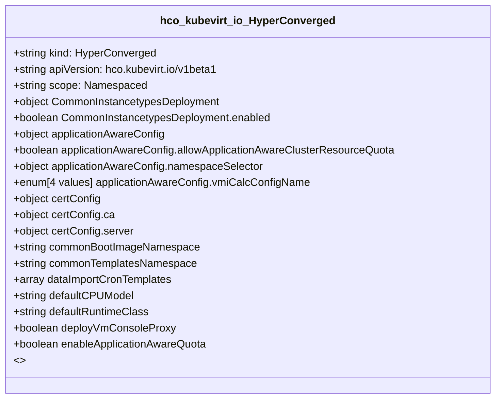

# CRD Schema Documentation - hco.kubevirt.io API Group

> **Generated:** 2025-09-07 17:05:15
> 
> **Total CRDs:** 1
> 
> **API Groups:** 1
> 
> **Description:** Complete schema documentation for Kubernetes Custom Resource Definitions (CRDs), including property definitions, types, relationships, and visual diagrams.

---

## 📋 Table of Contents

1. [Executive Summary](#-executive-summary)
2. [API Group Documentation](#-api-group-documentation)
   - [hco.kubevirt.io](#hcokubevirtio) (1 CRDs)
3. [Appendices](#-appendices)
   - [CRD Index](#crd-index)
   - [Property Types Summary](#property-types-summary)
   - [Relationship Matrix](#relationship-matrix)

## 📊 Executive Summary

### Overview

This document provides comprehensive schema documentation for **1 Custom Resource Definitions** distributed across **1 API groups** in your Kubernetes cluster.

### Key Statistics

| Metric | Value |
|--------|-------|
| **Total CRDs** | 1 |
| **API Groups** | 1 |
| **Total Instances** | 0 |
| **Namespaced CRDs** | 1 (100.0%) |
| **Cluster-scoped CRDs** | 0 (0.0%) |
| **Schema Coverage** | 1/1 (100.0%) |

### Distribution Analysis

#### Largest API Groups (by CRD count)

1. **hco.kubevirt.io**: 1 CRDs

### Schema Analysis

**Most Complex CRDs (by property count):**

1. `HyperConverged` (hco.kubevirt.io): 40 properties

## 📁 hco.kubevirt.io

### Overview

**API Group:** `hco.kubevirt.io`  
**CRDs in Group:** 1  
**Total Instances:** 0

### CRDs in this Group

| Kind | Scope | Version | Instances | Description |
|------|-------|---------|-----------|-------------|
| `HyperConverged` | Namespaced | v1beta1 | 0 | *No description available* |

### Schema Diagram

### Detailed CRD Documentation

#### HyperConverged

**Full Name:** `hyperconvergeds.hco.kubevirt.io`  
**API Version:** `hco.kubevirt.io/v1beta1`  
**Scope:** Namespaced  
**Instances:** 0  
**Categories:** all  
**Short Names:** hco, hcos  

**Schema Properties:**

| Property | Type | Required | Description |
|----------|------|----------|-------------|
| `CommonInstancetypesDeployment` | `object` |  | CommonInstancetypesDeployment holds the configuration of ... |
| `applicationAwareConfig` | `object` |  | ApplicationAwareConfig set the AAQ configurations |
| `certConfig` | `object` |  | certConfig holds the rotation policy for internal, self-s... |
| `commonBootImageNamespace` | `string` |  | CommonBootImageNamespace override the default namespace o... |
| `commonTemplatesNamespace` | `string` |  | CommonTemplatesNamespace defines namespace in which commo... |
| `dataImportCronTemplates` | `array<object>` |  | DataImportCronTemplates holds list of data import cron te... |
| `defaultCPUModel` | `string` |  | DefaultCPUModel defines a cluster default for CPU model: ... |
| `defaultRuntimeClass` | `string` |  | DefaultRuntimeClass defines a cluster default for the Run... |
| `deployVmConsoleProxy` | `boolean` |  | deploy VM console proxy resources in SSP operator |
| `enableApplicationAwareQuota` | `boolean` |  | EnableApplicationAwareQuota if true, enables the Applicat... |
| `enableCommonBootImageImport` | `boolean` |  | Opt-in to automatic delivery/updates of the common data i... |
| `evictionStrategy` | `enum[4 values]` |  | EvictionStrategy defines at the cluster level if the Virt... |
| `featureGates` | `object` |  | featureGates is a map of feature gate flags. Setting a fl... |
| `filesystemOverhead` | `object` |  | FilesystemOverhead describes the space reserved for overh... |
| `higherWorkloadDensity` | `object` |  | HigherWorkloadDensity holds configurataion aimed to incre... |
| `infra` | `object` |  | infra HyperConvergedConfig influences the pod configurati... |
| `instancetypeConfig` | `object` |  | InstancetypeConfig holds the configuration of instance ty... |
| `ksmConfiguration` | `object` |  | KSMConfiguration holds the information regarding
the enab... |
| `kubeSecondaryDNSNameServerIP` | `string` |  | KubeSecondaryDNSNameServerIP defines name server IP used ... |
| `liveMigrationConfig` | `object` |  | Live migration limits and timeouts are applied so that mi... |

*... and 20 more properties*

## 📚 Appendices

### CRD Index

Complete alphabetical index of all Custom Resource Definitions:

| CRD Name | Kind | API Group | Scope | Instances |
|----------|------|-----------|-------|-----------|
| `hyperconvergeds.hco.kubevirt.io` | `HyperConverged` | `hco.kubevirt.io` | Namespaced | 0 |

### Property Types Summary

Property type usage across all CRDs:

| Type | Usage Count |
|------|-------------|
| `object` | 22 |
| `string` | 14 |
| `boolean` | 3 |
| `array` | 1 |

### Relationship Matrix

Schema-based relationships detected between CRDs:

*No schema-based relationships detected*

---

*Documentation generated by k8s-inventory-cli on 2025-09-07 17:05:15*