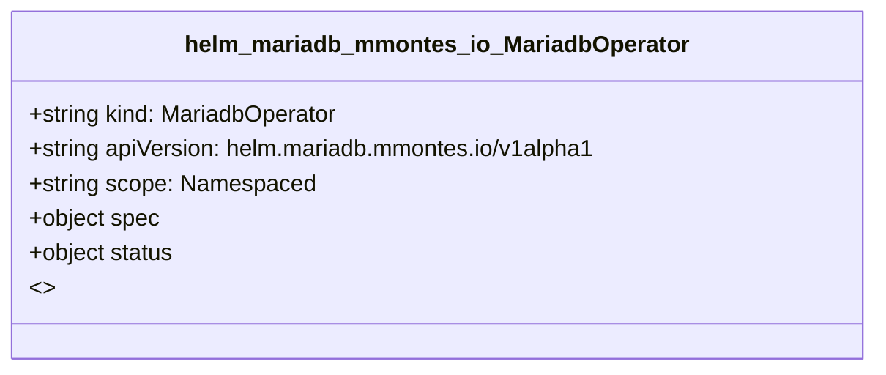

# CRD Schema Documentation - helm.mariadb.mmontes.io API Group

> **Generated:** 2025-09-07 17:05:15
> 
> **Total CRDs:** 1
> 
> **API Groups:** 1
> 
> **Description:** Complete schema documentation for Kubernetes Custom Resource Definitions (CRDs), including property definitions, types, relationships, and visual diagrams.

---

## 📋 Table of Contents

1. [Executive Summary](#-executive-summary)
2. [API Group Documentation](#-api-group-documentation)
   - [helm.mariadb.mmontes.io](#helmmariadbmmontesio) (1 CRDs)
3. [Appendices](#-appendices)
   - [CRD Index](#crd-index)
   - [Property Types Summary](#property-types-summary)
   - [Relationship Matrix](#relationship-matrix)

## 📊 Executive Summary

### Overview

This document provides comprehensive schema documentation for **1 Custom Resource Definitions** distributed across **1 API groups** in your Kubernetes cluster.

### Key Statistics

| Metric | Value |
|--------|-------|
| **Total CRDs** | 1 |
| **API Groups** | 1 |
| **Total Instances** | 0 |
| **Namespaced CRDs** | 1 (100.0%) |
| **Cluster-scoped CRDs** | 0 (0.0%) |
| **Schema Coverage** | 0/1 (0.0%) |

### Distribution Analysis

#### Largest API Groups (by CRD count)

1. **helm.mariadb.mmontes.io**: 1 CRDs

### Schema Analysis

⚠️ **Note**: No OpenAPI schemas found for the CRDs. Diagrams will show basic CRD metadata only.

## 📁 helm.mariadb.mmontes.io

### Overview

**API Group:** `helm.mariadb.mmontes.io`  
**CRDs in Group:** 1  
**Total Instances:** 0

### CRDs in this Group

| Kind | Scope | Version | Instances | Description |
|------|-------|---------|-----------|-------------|
| `MariadbOperator` | Namespaced | v1alpha1 | 0 | *No description available* |

### Schema Diagram

### Detailed CRD Documentation

#### MariadbOperator

**Full Name:** `mariadboperators.helm.mariadb.mmontes.io`  
**API Version:** `helm.mariadb.mmontes.io/v1alpha1`  
**Scope:** Namespaced  
**Instances:** 0  

*No OpenAPI schema available*

## 📚 Appendices

### CRD Index

Complete alphabetical index of all Custom Resource Definitions:

| CRD Name | Kind | API Group | Scope | Instances |
|----------|------|-----------|-------|-----------|
| `mariadboperators.helm.mariadb.mmontes.io` | `MariadbOperator` | `helm.mariadb.mmontes.io` | Namespaced | 0 |

### Property Types Summary

*No property type information available*

### Relationship Matrix

Schema-based relationships detected between CRDs:

*No schema-based relationships detected*

---

*Documentation generated by k8s-inventory-cli on 2025-09-07 17:05:15*