# CRD Schema Documentation - hub.traefik.io API Group

> **Generated:** 2025-09-07 17:05:15
> 
> **Total CRDs:** 11
> 
> **API Groups:** 1
> 
> **Description:** Complete schema documentation for Kubernetes Custom Resource Definitions (CRDs), including property definitions, types, relationships, and visual diagrams.

---

## 📋 Table of Contents

1. [Executive Summary](#-executive-summary)
2. [API Group Documentation](#-api-group-documentation)
   - [hub.traefik.io](#hubtraefikio) (11 CRDs)
3. [Appendices](#-appendices)
   - [CRD Index](#crd-index)
   - [Property Types Summary](#property-types-summary)
   - [Relationship Matrix](#relationship-matrix)

## 📊 Executive Summary

### Overview

This document provides comprehensive schema documentation for **11 Custom Resource Definitions** distributed across **1 API groups** in your Kubernetes cluster.

### Key Statistics

| Metric | Value |
|--------|-------|
| **Total CRDs** | 11 |
| **API Groups** | 1 |
| **Total Instances** | 0 |
| **Namespaced CRDs** | 10 (90.9%) |
| **Cluster-scoped CRDs** | 1 (9.1%) |
| **Schema Coverage** | 11/11 (100.0%) |

### Distribution Analysis

#### Largest API Groups (by CRD count)

1. **hub.traefik.io**: 11 CRDs

### Schema Analysis

**Most Complex CRDs (by property count):**

1. `AIService` (hub.traefik.io): 10 properties
2. `ManagedSubscription` (hub.traefik.io): 9 properties
3. `APICatalogItem` (hub.traefik.io): 7 properties

## 📁 hub.traefik.io

### Overview

**API Group:** `hub.traefik.io`  
**CRDs in Group:** 11  
**Total Instances:** 0

### CRDs in this Group

| Kind | Scope | Version | Instances | Description |
|------|-------|---------|-----------|-------------|
| `AIService` | Namespaced | v1alpha1 | 0 | *No description available* |
| `API` | Namespaced | v1alpha1 | 0 | *No description available* |
| `APIBundle` | Namespaced | v1alpha1 | 0 | *No description available* |
| `APICatalogItem` | Namespaced | v1alpha1 | 0 | *No description available* |
| `APIPlan` | Namespaced | v1alpha1 | 0 | *No description available* |
| `APIPortal` | Namespaced | v1alpha1 | 0 | *No description available* |
| `APIRateLimit` | Namespaced | v1alpha1 | 0 | *No description available* |
| `APIVersion` | Namespaced | v1alpha1 | 0 | *No description available* |
| `AccessControlPolicy` | Cluster | v1alpha1 | 0 | *No description available* |
| `ManagedApplication` | Namespaced | v1alpha1 | 0 | *No description available* |
| `ManagedSubscription` | Namespaced | v1alpha1 | 0 | *No description available* |

### Schema Diagram

```mermaid
classDiagram
    %% API Group: hub.traefik.io
    class hub_traefik_io_AIService {
        +string kind: AIService
        +string apiVersion: hub.traefik.io/v1alpha1
        +string scope: Namespaced
        +object anthropic
        +string anthropic.model
        +object anthropic.params
        +object anthropic.token
        +object azureOpenai
        +object azureOpenai.apiKeySecret
        +string azureOpenai.baseUrl
        +string azureOpenai.deploymentName
        +string azureOpenai.model
        +object azureOpenai.params
        +object bedrock
        +string bedrock.model
        +object bedrock.params
        +string bedrock.region
        +boolean bedrock.systemMessage
        +object cohere
        +string cohere.model
        +object cohere.params
        +object cohere.token
        +object deepSeek
        +string deepSeek.baseUrl
        +string deepSeek.model
        +object deepSeek.params
        +object deepSeek.token
        +object gemini
        +object gemini.apiKey
        +string gemini.model
        +object gemini.params
        +object mistral
        +object mistral.apiKey
        +string mistral.model
        +object mistral.params
        +object ollama
        +string ollama.baseUrl
        +string ollama.model
        +object ollama.params
        +object openai
        +string openai.baseUrl
        +string openai.model
        +object openai.params
        +object openai.token
        +object qWen
        +string qWen.baseUrl
        +string qWen.model
        +object qWen.params
        +object qWen.token
    }
    hub_traefik_io_AIService : <<Namespaced>>
    class hub_traefik_io_API {
        +string kind: API
        +string apiVersion: hub.traefik.io/v1alpha1
        +string scope: Namespaced
        +object cors
        +boolean cors.addVaryHeader
        +boolean cors.allowCredentials
        +array<string> cors.allowHeadersList
        +array<string> cors.allowMethodsList
        +array<string> cors.allowOriginListRegex
        +array<string> cors.allowOriginsList
        +array<string> cors.exposeHeadersList
        +integer(int64) cors.maxAge
        +string description
        +object openApiSpec
        +array<object> openApiSpec.operationSets
        +object openApiSpec.override
        +string openApiSpec.path
        +string openApiSpec.url
        +boolean openApiSpec.validateRequestMethodAndPath
        +string title
        +array<object> versions
    }
    hub_traefik_io_API : <<Namespaced>>
    class hub_traefik_io_APIBundle {
        +string kind: APIBundle
        +string apiVersion: hub.traefik.io/v1alpha1
        +string scope: Namespaced
        +object apiSelector
        +array<object> apiSelector.matchExpressions
        +object apiSelector.matchLabels
        +array<object> apis
        +string title
    }
    hub_traefik_io_APIBundle : <<Namespaced>>
    class hub_traefik_io_APICatalogItem {
        +string kind: APICatalogItem
        +string apiVersion: hub.traefik.io/v1alpha1
        +string scope: Namespaced
        +array<object> apiBundles
        +object apiPlan
        +string apiPlan.name
        +object apiSelector
        +array<object> apiSelector.matchExpressions
        +object apiSelector.matchLabels
        +array<object> apis
        +boolean everyone
        +array<string> groups
        +object operationFilter
        +array<string> operationFilter.include
    }
    hub_traefik_io_APICatalogItem : <<Namespaced>>
    class hub_traefik_io_APIPlan {
        +string kind: APIPlan
        +string apiVersion: hub.traefik.io/v1alpha1
        +string scope: Namespaced
        +string description
        +object quota
        +integer quota.limit
        +string(duration) quota.period
        +object rateLimit
        +integer rateLimit.limit
        +string(duration) rateLimit.period
        +string title
    }
    hub_traefik_io_APIPlan : <<Namespaced>>
    class hub_traefik_io_APIPortal {
        +string kind: APIPortal
        +string apiVersion: hub.traefik.io/v1alpha1
        +string scope: Namespaced
        +string description
        +string title
        +array<string> trustedUrls
        +object ui
        +string ui.logoUrl
    }
    hub_traefik_io_APIPortal : <<Namespaced>>
    class hub_traefik_io_APIRateLimit {
        +string kind: APIRateLimit
        +string apiVersion: hub.traefik.io/v1alpha1
        +string scope: Namespaced
        +object apiSelector
        +array<object> apiSelector.matchExpressions
        +object apiSelector.matchLabels
        +array<object> apis
        +boolean everyone
        +array<string> groups
        +integer limit
        +string(duration) period
        +enum[local|distributed] strategy
    }
    hub_traefik_io_APIRateLimit : <<Namespaced>>
    class hub_traefik_io_APIVersion {
        +string kind: APIVersion
        +string apiVersion: hub.traefik.io/v1alpha1
        +string scope: Namespaced
        +object cors
        +boolean cors.addVaryHeader
        +boolean cors.allowCredentials
        +array<string> cors.allowHeadersList
        +array<string> cors.allowMethodsList
        +array<string> cors.allowOriginListRegex
        +array<string> cors.allowOriginsList
        +array<string> cors.exposeHeadersList
        +integer(int64) cors.maxAge
        +string description
        +object openApiSpec
        +array<object> openApiSpec.operationSets
        +object openApiSpec.override
        +string openApiSpec.path
        +string openApiSpec.url
        +boolean openApiSpec.validateRequestMethodAndPath
        +string release
        +string title
    }
    hub_traefik_io_APIVersion : <<Namespaced>>
    class hub_traefik_io_AccessControlPolicy {
        +string kind: AccessControlPolicy
        +string apiVersion: hub.traefik.io/v1alpha1
        +string scope: Cluster
        +object apiKey
        +object apiKey.forwardHeaders
        +object apiKey.keySource
        +array<object> apiKey.keys
        +object basicAuth
        +string basicAuth.forwardUsernameHeader
        +string basicAuth.realm
        +boolean basicAuth.stripAuthorizationHeader
        +array<string> basicAuth.users
        +object jwt
        +string jwt.claims
        +object jwt.forwardHeaders
        +string jwt.jwksFile
        +string jwt.jwksUrl
        +string jwt.publicKey
        +string jwt.signingSecret
        +boolean jwt.signingSecretBase64Encoded
        +boolean jwt.stripAuthorizationHeader
        +string jwt.tokenQueryKey
        +object oAuthIntro
        +string oAuthIntro.claims
        +object oAuthIntro.clientConfig
        +object oAuthIntro.forwardHeaders
        +object oAuthIntro.tokenSource
        +object oidc
        +object oidc.authParams
        +string oidc.claims
        +string oidc.clientId
        +array<string> oidc.disableAuthRedirectionPaths
        +object oidc.forwardHeaders
        +string oidc.issuer
        +string oidc.logoutUrl
        +string oidc.redirectUrl
        +array<string> oidc.scopes
        +object oidc.secret
        +object oidcGoogle
        +object oidcGoogle.authParams
        +string oidcGoogle.clientId
        +array<string> oidcGoogle.emails
        +object oidcGoogle.forwardHeaders
        +string oidcGoogle.logoutUrl
        +string oidcGoogle.redirectUrl
        +object oidcGoogle.secret
        +object oidcGoogle.session
        +object oidcGoogle.stateCookie
    }
    hub_traefik_io_AccessControlPolicy : <<Cluster>>
    class hub_traefik_io_ManagedApplication {
        +string kind: ManagedApplication
        +string apiVersion: hub.traefik.io/v1alpha1
        +string scope: Namespaced
        +array<object> apiKeys
        +string appId
        +string notes
        +string owner
    }
    hub_traefik_io_ManagedApplication : <<Namespaced>>
    class hub_traefik_io_ManagedSubscription {
        +string kind: ManagedSubscription
        +string apiVersion: hub.traefik.io/v1alpha1
        +string scope: Namespaced
        +array<object> apiBundles
        +object apiPlan
        +string apiPlan.name
        +object apiSelector
        +array<object> apiSelector.matchExpressions
        +object apiSelector.matchLabels
        +array<object> apis
        +array<object> applications
        +string claims
        +array<object> managedApplications
        +object operationFilter
        +array<string> operationFilter.include
        +integer weight
    }
    hub_traefik_io_ManagedSubscription : <<Namespaced>>
    hub_traefik_io_AccessControlPolicy --> hub_traefik_io_API : references
    hub_traefik_io_AccessControlPolicy --> hub_traefik_io_API : uses
    hub_traefik_io_AccessControlPolicy --> hub_traefik_io_API : flows to
    hub_traefik_io_AIService --> hub_traefik_io_API : references
    hub_traefik_io_AIService --> hub_traefik_io_API : uses
    hub_traefik_io_APIBundle --> hub_traefik_io_APICatalogItem : references
    hub_traefik_io_APIBundle --> hub_traefik_io_APICatalogItem : uses
    hub_traefik_io_APIBundle --> hub_traefik_io_API : references
    hub_traefik_io_APIBundle --> hub_traefik_io_API : uses
    hub_traefik_io_APIBundle --> hub_traefik_io_ManagedSubscription : references
    hub_traefik_io_APIBundle --> hub_traefik_io_ManagedSubscription : uses
    hub_traefik_io_APICatalogItem --> hub_traefik_io_APIPlan : references
    hub_traefik_io_APICatalogItem --> hub_traefik_io_APIPlan : uses
    hub_traefik_io_APICatalogItem --> hub_traefik_io_APIRateLimit : similar schema
    hub_traefik_io_APICatalogItem --> hub_traefik_io_API : references
    hub_traefik_io_APICatalogItem --> hub_traefik_io_API : references
    hub_traefik_io_APICatalogItem --> hub_traefik_io_API : uses
    hub_traefik_io_APICatalogItem --> hub_traefik_io_API : flows to
    hub_traefik_io_APICatalogItem --> hub_traefik_io_APIVersion : references
    hub_traefik_io_APICatalogItem --> hub_traefik_io_APIVersion : references
    hub_traefik_io_APICatalogItem --> hub_traefik_io_APIVersion : flows to
    hub_traefik_io_APICatalogItem --> hub_traefik_io_ManagedSubscription : similar schema
    hub_traefik_io_APIPlan --> hub_traefik_io_APIPortal : similar schema
    hub_traefik_io_APIPlan --> hub_traefik_io_ManagedSubscription : references
    hub_traefik_io_APIPlan --> hub_traefik_io_ManagedSubscription : uses
    hub_traefik_io_APIPortal --> hub_traefik_io_API : references
    hub_traefik_io_APIRateLimit --> hub_traefik_io_API : references
    hub_traefik_io_APIRateLimit --> hub_traefik_io_API : uses
    hub_traefik_io_API --> hub_traefik_io_APIVersion : references
    hub_traefik_io_API --> hub_traefik_io_APIVersion : references
    hub_traefik_io_API --> hub_traefik_io_APIVersion : owns
    hub_traefik_io_API --> hub_traefik_io_APIVersion : uses
    hub_traefik_io_API --> hub_traefik_io_APIVersion : templates
    hub_traefik_io_API --> hub_traefik_io_APIVersion : similar schema
    hub_traefik_io_API --> hub_traefik_io_ManagedApplication : references
    hub_traefik_io_API --> hub_traefik_io_ManagedApplication : uses
    hub_traefik_io_API --> hub_traefik_io_ManagedSubscription : references
    hub_traefik_io_API --> hub_traefik_io_ManagedSubscription : references
    hub_traefik_io_API --> hub_traefik_io_ManagedSubscription : uses
    hub_traefik_io_API --> hub_traefik_io_ManagedSubscription : flows to
    hub_traefik_io_APIVersion --> hub_traefik_io_ManagedSubscription : references
    hub_traefik_io_APIVersion --> hub_traefik_io_ManagedSubscription : references
    hub_traefik_io_APIVersion --> hub_traefik_io_ManagedSubscription : flows to
    hub_traefik_io_ManagedApplication --> hub_traefik_io_ManagedSubscription : references
    hub_traefik_io_ManagedApplication --> hub_traefik_io_ManagedSubscription : uses
```

### Detailed CRD Documentation

#### AIService

**Full Name:** `aiservices.hub.traefik.io`  
**API Version:** `hub.traefik.io/v1alpha1`  
**Scope:** Namespaced  
**Instances:** 0  

**Schema Properties:**

| Property | Type | Required | Description |
|----------|------|----------|-------------|
| `anthropic` | `object` |  | Anthropic configures Anthropic backend. |
| `azureOpenai` | `object` |  | AzureOpenAI configures AzureOpenAI. |
| `bedrock` | `object` |  | Bedrock configures Bedrock backend. |
| `cohere` | `object` |  | Cohere configures Cohere backend. |
| `deepSeek` | `object` |  | DeepSeek configures DeepSeek. |
| `gemini` | `object` |  | Gemini configures Gemini backend. |
| `mistral` | `object` |  | Mistral configures Mistral AI backend. |
| `ollama` | `object` |  | Ollama configures Ollama backend. |
| `openai` | `object` |  | OpenAI configures OpenAI. |
| `qWen` | `object` |  | QWen configures QWen. |

#### API

**Full Name:** `apis.hub.traefik.io`  
**API Version:** `hub.traefik.io/v1alpha1`  
**Scope:** Namespaced  
**Instances:** 0  

**Schema Properties:**

| Property | Type | Required | Description |
|----------|------|----------|-------------|
| `cors` | `object` |  | Cors defines the Cross-Origin Resource Sharing configurat... |
| `description` | `string` |  | Description explains what the API does. |
| `openApiSpec` | `object` |  | OpenAPISpec defines the API contract as an OpenAPI specif... |
| `title` | `string` |  | Title is the human-readable name of the API that will be ... |
| `versions` | `array<object>` |  | Versions are the different APIVersions available. |

#### APIBundle

**Full Name:** `apibundles.hub.traefik.io`  
**API Version:** `hub.traefik.io/v1alpha1`  
**Scope:** Namespaced  
**Instances:** 0  

**Schema Properties:**

| Property | Type | Required | Description |
|----------|------|----------|-------------|
| `apiSelector` | `object` |  | APISelector selects the APIs that will be accessible to t... |
| `apis` | `array<object>` |  | APIs defines a set of APIs that will be accessible to the... |
| `title` | `string` |  | Title is the human-readable name of the APIBundle that wi... |

#### APICatalogItem

**Full Name:** `apicatalogitems.hub.traefik.io`  
**API Version:** `hub.traefik.io/v1alpha1`  
**Scope:** Namespaced  
**Instances:** 0  

**Schema Properties:**

| Property | Type | Required | Description |
|----------|------|----------|-------------|
| `apiBundles` | `array<object>` |  | APIBundles defines a set of APIBundle that will be visibl... |
| `apiPlan` | `object` |  | APIPlan defines which APIPlan will be available.
If multi... |
| `apiSelector` | `object` |  | APISelector selects the APIs that will be visible to the ... |
| `apis` | `array<object>` |  | APIs defines a set of APIs that will be visible to the co... |
| `everyone` | `boolean` |  | Everyone indicates that all users will see these APIs. |
| `groups` | `array<string>` |  | Groups are the consumer groups that will see the APIs. |
| `operationFilter` | `object` |  | OperationFilter specifies the visible operations on APIs ... |

#### APIPlan

**Full Name:** `apiplans.hub.traefik.io`  
**API Version:** `hub.traefik.io/v1alpha1`  
**Scope:** Namespaced  
**Instances:** 0  

**Schema Properties:**

| Property | Type | Required | Description |
|----------|------|----------|-------------|
| `title` | `string` | ✓ | Title is the human-readable name of the plan. |
| `description` | `string` |  | Description describes the plan. |
| `quota` | `object` |  | Quota defines the quota policy. |
| `rateLimit` | `object` |  | RateLimit defines the rate limit policy. |

#### APIPortal

**Full Name:** `apiportals.hub.traefik.io`  
**API Version:** `hub.traefik.io/v1alpha1`  
**Scope:** Namespaced  
**Instances:** 0  

**Schema Properties:**

| Property | Type | Required | Description |
|----------|------|----------|-------------|
| `trustedUrls` | `array<string>` | ✓ | TrustedURLs are the urls that are trusted by the OAuth 2.... |
| `description` | `string` |  | Description of the APIPortal. |
| `title` | `string` |  | Title is the public facing name of the APIPortal. |
| `ui` | `object` |  | UI holds the UI customization options. |

#### APIRateLimit

**Full Name:** `apiratelimits.hub.traefik.io`  
**API Version:** `hub.traefik.io/v1alpha1`  
**Scope:** Namespaced  
**Instances:** 0  

**Schema Properties:**

| Property | Type | Required | Description |
|----------|------|----------|-------------|
| `limit` | `integer` | ✓ | Limit is the maximum number of token in the bucket. |
| `apiSelector` | `object` |  | APISelector selects the APIs that will be rate limited.
M... |
| `apis` | `array<object>` |  | APIs defines a set of APIs that will be rate limited.
Mul... |
| `everyone` | `boolean` |  | Everyone indicates that all users will, by default, be ra... |
| `groups` | `array<string>` |  | Groups are the consumer groups that will be rate limited.... |
| `period` | `string(duration)` |  | Period is the unit of time for the Limit. |
| `strategy` | `enum[local|distributed]` |  | Strategy defines how the bucket state will be synchronize... |

#### APIVersion

**Full Name:** `apiversions.hub.traefik.io`  
**API Version:** `hub.traefik.io/v1alpha1`  
**Scope:** Namespaced  
**Instances:** 0  

**Schema Properties:**

| Property | Type | Required | Description |
|----------|------|----------|-------------|
| `release` | `string` | ✓ | Release is the version number of the API.
This value must... |
| `cors` | `object` |  | Cors defines the Cross-Origin Resource Sharing configurat... |
| `description` | `string` |  | Description explains what the APIVersion does. |
| `openApiSpec` | `object` |  | OpenAPISpec defines the API contract as an OpenAPI specif... |
| `title` | `string` |  | Title is the public facing name of the APIVersion. |

#### AccessControlPolicy

**Full Name:** `accesscontrolpolicies.hub.traefik.io`  
**API Version:** `hub.traefik.io/v1alpha1`  
**Scope:** Cluster  
**Instances:** 0  

**Schema Properties:**

| Property | Type | Required | Description |
|----------|------|----------|-------------|
| `apiKey` | `object` |  | AccessControlPolicyAPIKey configure an APIKey control pol... |
| `basicAuth` | `object` |  | AccessControlPolicyBasicAuth holds the HTTP basic authent... |
| `jwt` | `object` |  | AccessControlPolicyJWT configures a JWT access control po... |
| `oAuthIntro` | `object` |  | AccessControlOAuthIntro configures an OAuth 2.0 Token Int... |
| `oidc` | `object` |  | AccessControlPolicyOIDC holds the OIDC authentication con... |
| `oidcGoogle` | `object` |  | AccessControlPolicyOIDCGoogle holds the Google OIDC authe... |

#### ManagedApplication

**Full Name:** `managedapplications.hub.traefik.io`  
**API Version:** `hub.traefik.io/v1alpha1`  
**Scope:** Namespaced  
**Instances:** 0  

**Schema Properties:**

| Property | Type | Required | Description |
|----------|------|----------|-------------|
| `appId` | `string` | ✓ | AppID is the identifier of the ManagedApplication.
It sho... |
| `owner` | `string` | ✓ | Owner represents the owner of the ManagedApplication.
It ... |
| `apiKeys` | `array<object>` |  | APIKeys references the API keys used to authenticate the ... |
| `notes` | `string` |  | Notes contains notes about application. |

#### ManagedSubscription

**Full Name:** `managedsubscriptions.hub.traefik.io`  
**API Version:** `hub.traefik.io/v1alpha1`  
**Scope:** Namespaced  
**Instances:** 0  

**Schema Properties:**

| Property | Type | Required | Description |
|----------|------|----------|-------------|
| `apiPlan` | `object` | ✓ | APIPlan defines which APIPlan will be used. |
| `apiBundles` | `array<object>` |  | APIBundles defines a set of APIBundle that will be access... |
| `apiSelector` | `object` |  | APISelector selects the APIs that will be accessible.
Mul... |
| `apis` | `array<object>` |  | APIs defines a set of APIs that will be accessible.
Multi... |
| `applications` | `array<object>` |  | Applications references the Applications that will gain a... |
| `claims` | `string` |  | Claims specifies an expression that validate claims in or... |
| `managedApplications` | `array<object>` |  | ManagedApplications references the ManagedApplications th... |
| `operationFilter` | `object` |  | OperationFilter specifies the allowed operations on APIs ... |
| `weight` | `integer` |  | Weight specifies the evaluation order of the APIPlan.
Whe... |

## 📚 Appendices

### CRD Index

Complete alphabetical index of all Custom Resource Definitions:

| CRD Name | Kind | API Group | Scope | Instances |
|----------|------|-----------|-------|-----------|
| `accesscontrolpolicies.hub.traefik.io` | `AccessControlPolicy` | `hub.traefik.io` | Cluster | 0 |
| `aiservices.hub.traefik.io` | `AIService` | `hub.traefik.io` | Namespaced | 0 |
| `apibundles.hub.traefik.io` | `APIBundle` | `hub.traefik.io` | Namespaced | 0 |
| `apicatalogitems.hub.traefik.io` | `APICatalogItem` | `hub.traefik.io` | Namespaced | 0 |
| `apiplans.hub.traefik.io` | `APIPlan` | `hub.traefik.io` | Namespaced | 0 |
| `apiportals.hub.traefik.io` | `APIPortal` | `hub.traefik.io` | Namespaced | 0 |
| `apiratelimits.hub.traefik.io` | `APIRateLimit` | `hub.traefik.io` | Namespaced | 0 |
| `apis.hub.traefik.io` | `API` | `hub.traefik.io` | Namespaced | 0 |
| `apiversions.hub.traefik.io` | `APIVersion` | `hub.traefik.io` | Namespaced | 0 |
| `managedapplications.hub.traefik.io` | `ManagedApplication` | `hub.traefik.io` | Namespaced | 0 |
| `managedsubscriptions.hub.traefik.io` | `ManagedSubscription` | `hub.traefik.io` | Namespaced | 0 |

### Property Types Summary

Property type usage across all CRDs:

| Type | Usage Count |
|------|-------------|
| `object` | 31 |
| `string` | 16 |
| `array` | 13 |
| `boolean` | 2 |
| `integer` | 2 |

### Relationship Matrix

Schema-based relationships detected between CRDs:

| Source CRD | Target CRD | API Group | Relationship Type |
|------------|------------|-----------|-------------------|
| `AccessControlPolicy` | `API` | `hub.traefik.io (intra-group)` | references |
| `AccessControlPolicy` | `API` | `hub.traefik.io (intra-group)` | uses |
| `AccessControlPolicy` | `API` | `hub.traefik.io (intra-group)` | flows_to |
| `AIService` | `API` | `hub.traefik.io (intra-group)` | references |
| `AIService` | `API` | `hub.traefik.io (intra-group)` | uses |
| `APIBundle` | `APICatalogItem` | `hub.traefik.io (intra-group)` | references |
| `APIBundle` | `APICatalogItem` | `hub.traefik.io (intra-group)` | uses |
| `APIBundle` | `API` | `hub.traefik.io (intra-group)` | references |
| `APIBundle` | `API` | `hub.traefik.io (intra-group)` | uses |
| `APIBundle` | `ManagedSubscription` | `hub.traefik.io (intra-group)` | references |
| `APIBundle` | `ManagedSubscription` | `hub.traefik.io (intra-group)` | uses |
| `APICatalogItem` | `APIPlan` | `hub.traefik.io (intra-group)` | references |
| `APICatalogItem` | `APIPlan` | `hub.traefik.io (intra-group)` | uses |
| `APICatalogItem` | `APIRateLimit` | `hub.traefik.io (intra-group)` | similar_schema |
| `APICatalogItem` | `API` | `hub.traefik.io (intra-group)` | references |
| `APICatalogItem` | `API` | `hub.traefik.io (intra-group)` | references |
| `APICatalogItem` | `API` | `hub.traefik.io (intra-group)` | uses |
| `APICatalogItem` | `API` | `hub.traefik.io (intra-group)` | flows_to |
| `APICatalogItem` | `APIVersion` | `hub.traefik.io (intra-group)` | references |
| `APICatalogItem` | `APIVersion` | `hub.traefik.io (intra-group)` | references |
| `APICatalogItem` | `APIVersion` | `hub.traefik.io (intra-group)` | flows_to |
| `APICatalogItem` | `ManagedSubscription` | `hub.traefik.io (intra-group)` | similar_schema |
| `APIPlan` | `APIPortal` | `hub.traefik.io (intra-group)` | similar_schema |
| `APIPlan` | `ManagedSubscription` | `hub.traefik.io (intra-group)` | references |
| `APIPlan` | `ManagedSubscription` | `hub.traefik.io (intra-group)` | uses |
| `APIPortal` | `API` | `hub.traefik.io (intra-group)` | references |
| `APIRateLimit` | `API` | `hub.traefik.io (intra-group)` | references |
| `APIRateLimit` | `API` | `hub.traefik.io (intra-group)` | uses |
| `API` | `APIVersion` | `hub.traefik.io (intra-group)` | references |
| `API` | `APIVersion` | `hub.traefik.io (intra-group)` | references |
| `API` | `APIVersion` | `hub.traefik.io (intra-group)` | owns |
| `API` | `APIVersion` | `hub.traefik.io (intra-group)` | uses |
| `API` | `APIVersion` | `hub.traefik.io (intra-group)` | templates |
| `API` | `APIVersion` | `hub.traefik.io (intra-group)` | similar_schema |
| `API` | `ManagedApplication` | `hub.traefik.io (intra-group)` | references |
| `API` | `ManagedApplication` | `hub.traefik.io (intra-group)` | uses |
| `API` | `ManagedSubscription` | `hub.traefik.io (intra-group)` | references |
| `API` | `ManagedSubscription` | `hub.traefik.io (intra-group)` | references |
| `API` | `ManagedSubscription` | `hub.traefik.io (intra-group)` | uses |
| `API` | `ManagedSubscription` | `hub.traefik.io (intra-group)` | flows_to |
| `APIVersion` | `ManagedSubscription` | `hub.traefik.io (intra-group)` | references |
| `APIVersion` | `ManagedSubscription` | `hub.traefik.io (intra-group)` | references |
| `APIVersion` | `ManagedSubscription` | `hub.traefik.io (intra-group)` | flows_to |
| `ManagedApplication` | `ManagedSubscription` | `hub.traefik.io (intra-group)` | references |
| `ManagedApplication` | `ManagedSubscription` | `hub.traefik.io (intra-group)` | uses |

---

*Documentation generated by k8s-inventory-cli on 2025-09-07 17:05:15*