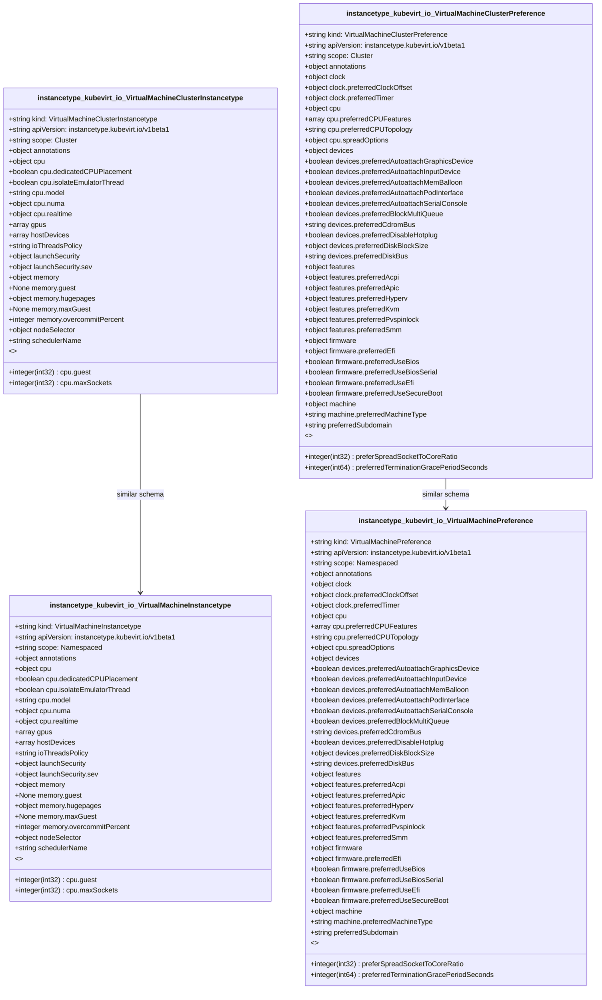

# CRD Schema Documentation - instancetype.kubevirt.io API Group

> **Generated:** 2025-09-07 17:05:15
> 
> **Total CRDs:** 4
> 
> **API Groups:** 1
> 
> **Description:** Complete schema documentation for Kubernetes Custom Resource Definitions (CRDs), including property definitions, types, relationships, and visual diagrams.

---

## 📋 Table of Contents

1. [Executive Summary](#-executive-summary)
2. [API Group Documentation](#-api-group-documentation)
   - [instancetype.kubevirt.io](#instancetypekubevirtio) (4 CRDs)
3. [Appendices](#-appendices)
   - [CRD Index](#crd-index)
   - [Property Types Summary](#property-types-summary)
   - [Relationship Matrix](#relationship-matrix)

## 📊 Executive Summary

### Overview

This document provides comprehensive schema documentation for **4 Custom Resource Definitions** distributed across **1 API groups** in your Kubernetes cluster.

### Key Statistics

| Metric | Value |
|--------|-------|
| **Total CRDs** | 4 |
| **API Groups** | 1 |
| **Total Instances** | 0 |
| **Namespaced CRDs** | 2 (50.0%) |
| **Cluster-scoped CRDs** | 2 (50.0%) |
| **Schema Coverage** | 4/4 (100.0%) |

### Distribution Analysis

#### Largest API Groups (by CRD count)

1. **instancetype.kubevirt.io**: 4 CRDs

### Schema Analysis

**Most Complex CRDs (by property count):**

1. `VirtualMachineClusterPreference` (instancetype.kubevirt.io): 12 properties
2. `VirtualMachineClusterPreference` (instancetype.kubevirt.io): 12 properties
3. `VirtualMachineClusterPreference` (instancetype.kubevirt.io): 12 properties

## 📁 instancetype.kubevirt.io

### Overview

**API Group:** `instancetype.kubevirt.io`  
**CRDs in Group:** 4  
**Total Instances:** 0

### CRDs in this Group

| Kind | Scope | Version | Instances | Description |
|------|-------|---------|-----------|-------------|
| `VirtualMachineClusterInstancetype` | Cluster | v1beta1 | 0 | *No description available* |
| `VirtualMachineClusterPreference` | Cluster | v1beta1 | 0 | *No description available* |
| `VirtualMachineInstancetype` | Namespaced | v1beta1 | 0 | *No description available* |
| `VirtualMachinePreference` | Namespaced | v1beta1 | 0 | *No description available* |

### Schema Diagram

### Detailed CRD Documentation

#### VirtualMachineClusterInstancetype

**Full Name:** `virtualmachineclusterinstancetypes.instancetype.kubevirt.io`  
**API Version:** `instancetype.kubevirt.io/v1beta1`  
**Scope:** Cluster  
**Instances:** 0  
**Short Names:** vmclusterinstancetype, vmclusterinstancetypes, vmcf, vmcfs  

**Schema Properties:**

| Property | Type | Required | Description |
|----------|------|----------|-------------|
| `cpu` | `object` | ✓ | Required CPU related attributes of the instancetype. |
| `memory` | `object` | ✓ | Required Memory related attributes of the instancetype. |
| `annotations` | `object` |  | Optionally defines the required Annotations to be used by... |
| `gpus` | `array<object>` |  | Optionally defines any GPU devices associated with the in... |
| `hostDevices` | `array<object>` |  | Optionally defines any HostDevices associated with the in... |
| `ioThreadsPolicy` | `string` |  | Optionally defines the IOThreadsPolicy to be used by the ... |
| `launchSecurity` | `object` |  | Optionally defines the LaunchSecurity to be used by the i... |
| `nodeSelector` | `object` |  | NodeSelector is a selector which must be true for the vmi... |
| `schedulerName` | `string` |  | If specified, the VMI will be dispatched by specified sch... |

#### VirtualMachineClusterPreference

**Full Name:** `virtualmachineclusterpreferences.instancetype.kubevirt.io`  
**API Version:** `instancetype.kubevirt.io/v1beta1`  
**Scope:** Cluster  
**Instances:** 0  
**Short Names:** vmcp, vmcps  

**Schema Properties:**

| Property | Type | Required | Description |
|----------|------|----------|-------------|
| `annotations` | `object` |  | Optionally defines preferred Annotations to be applied to... |
| `clock` | `object` |  | Clock optionally defines preferences associated with the ... |
| `cpu` | `object` |  | CPU optionally defines preferences associated with the CP... |
| `devices` | `object` |  | Devices optionally defines preferences associated with th... |
| `features` | `object` |  | Features optionally defines preferences associated with t... |
| `firmware` | `object` |  | Firmware optionally defines preferences associated with t... |
| `machine` | `object` |  | Machine optionally defines preferences associated with th... |
| `preferSpreadSocketToCoreRatio` | `integer(int32)` |  | PreferSpreadSocketToCoreRatio defines the ratio to spread... |
| `preferredSubdomain` | `string` |  | Subdomain of the VirtualMachineInstance |
| `preferredTerminationGracePeriodSeconds` | `integer(int64)` |  | Grace period observed after signalling a VirtualMachineIn... |
| `requirements` | `object` |  | Requirements defines the minium amount of instance type d... |
| `volumes` | `object` |  | Volumes optionally defines preferences associated with th... |

#### VirtualMachineInstancetype

**Full Name:** `virtualmachineinstancetypes.instancetype.kubevirt.io`  
**API Version:** `instancetype.kubevirt.io/v1beta1`  
**Scope:** Namespaced  
**Instances:** 0  
**Categories:** all  
**Short Names:** vminstancetype, vminstancetypes, vmf, vmfs  

**Schema Properties:**

| Property | Type | Required | Description |
|----------|------|----------|-------------|
| `cpu` | `object` | ✓ | Required CPU related attributes of the instancetype. |
| `memory` | `object` | ✓ | Required Memory related attributes of the instancetype. |
| `annotations` | `object` |  | Optionally defines the required Annotations to be used by... |
| `gpus` | `array<object>` |  | Optionally defines any GPU devices associated with the in... |
| `hostDevices` | `array<object>` |  | Optionally defines any HostDevices associated with the in... |
| `ioThreadsPolicy` | `string` |  | Optionally defines the IOThreadsPolicy to be used by the ... |
| `launchSecurity` | `object` |  | Optionally defines the LaunchSecurity to be used by the i... |
| `nodeSelector` | `object` |  | NodeSelector is a selector which must be true for the vmi... |
| `schedulerName` | `string` |  | If specified, the VMI will be dispatched by specified sch... |

#### VirtualMachinePreference

**Full Name:** `virtualmachinepreferences.instancetype.kubevirt.io`  
**API Version:** `instancetype.kubevirt.io/v1beta1`  
**Scope:** Namespaced  
**Instances:** 0  
**Categories:** all  
**Short Names:** vmpref, vmprefs, vmp, vmps  

**Schema Properties:**

| Property | Type | Required | Description |
|----------|------|----------|-------------|
| `annotations` | `object` |  | Optionally defines preferred Annotations to be applied to... |
| `clock` | `object` |  | Clock optionally defines preferences associated with the ... |
| `cpu` | `object` |  | CPU optionally defines preferences associated with the CP... |
| `devices` | `object` |  | Devices optionally defines preferences associated with th... |
| `features` | `object` |  | Features optionally defines preferences associated with t... |
| `firmware` | `object` |  | Firmware optionally defines preferences associated with t... |
| `machine` | `object` |  | Machine optionally defines preferences associated with th... |
| `preferSpreadSocketToCoreRatio` | `integer(int32)` |  | PreferSpreadSocketToCoreRatio defines the ratio to spread... |
| `preferredSubdomain` | `string` |  | Subdomain of the VirtualMachineInstance |
| `preferredTerminationGracePeriodSeconds` | `integer(int64)` |  | Grace period observed after signalling a VirtualMachineIn... |
| `requirements` | `object` |  | Requirements defines the minium amount of instance type d... |
| `volumes` | `object` |  | Volumes optionally defines preferences associated with th... |

## 📚 Appendices

### CRD Index

Complete alphabetical index of all Custom Resource Definitions:

| CRD Name | Kind | API Group | Scope | Instances |
|----------|------|-----------|-------|-----------|
| `virtualmachineclusterinstancetypes.instancetype.kubevirt.io` | `VirtualMachineClusterInstancetype` | `instancetype.kubevirt.io` | Cluster | 0 |
| `virtualmachineclusterpreferences.instancetype.kubevirt.io` | `VirtualMachineClusterPreference` | `instancetype.kubevirt.io` | Cluster | 0 |
| `virtualmachineinstancetypes.instancetype.kubevirt.io` | `VirtualMachineInstancetype` | `instancetype.kubevirt.io` | Namespaced | 0 |
| `virtualmachinepreferences.instancetype.kubevirt.io` | `VirtualMachinePreference` | `instancetype.kubevirt.io` | Namespaced | 0 |

### Property Types Summary

Property type usage across all CRDs:

| Type | Usage Count |
|------|-------------|
| `object` | 84 |
| `string` | 18 |
| `array` | 12 |
| `integer` | 12 |

### Relationship Matrix

Schema-based relationships detected between CRDs:

| Source CRD | Target CRD | API Group | Relationship Type |
|------------|------------|-----------|-------------------|
| `VirtualMachineClusterInstancetype` | `VirtualMachineInstancetype` | `instancetype.kubevirt.io (intra-group)` | similar_schema |
| `VirtualMachineClusterPreference` | `VirtualMachinePreference` | `instancetype.kubevirt.io (intra-group)` | similar_schema |

---

*Documentation generated by k8s-inventory-cli on 2025-09-07 17:05:15*