# CRD Schema Documentation - kafka.kubedb.com API Group

> **Generated:** 2025-09-07 17:05:15
> 
> **Total CRDs:** 4
> 
> **API Groups:** 1
> 
> **Description:** Complete schema documentation for Kubernetes Custom Resource Definitions (CRDs), including property definitions, types, relationships, and visual diagrams.

---

## 📋 Table of Contents

1. [Executive Summary](#-executive-summary)
2. [API Group Documentation](#-api-group-documentation)
   - [kafka.kubedb.com](#kafkakubedbcom) (4 CRDs)
3. [Appendices](#-appendices)
   - [CRD Index](#crd-index)
   - [Property Types Summary](#property-types-summary)
   - [Relationship Matrix](#relationship-matrix)

## 📊 Executive Summary

### Overview

This document provides comprehensive schema documentation for **4 Custom Resource Definitions** distributed across **1 API groups** in your Kubernetes cluster.

### Key Statistics

| Metric | Value |
|--------|-------|
| **Total CRDs** | 4 |
| **API Groups** | 1 |
| **Total Instances** | 0 |
| **Namespaced CRDs** | 4 (100.0%) |
| **Cluster-scoped CRDs** | 0 (0.0%) |
| **Schema Coverage** | 4/4 (100.0%) |

### Distribution Analysis

#### Largest API Groups (by CRD count)

1. **kafka.kubedb.com**: 4 CRDs

### Schema Analysis

**Most Complex CRDs (by property count):**

1. `ConnectCluster` (kafka.kubedb.com): 15 properties
2. `RestProxy` (kafka.kubedb.com): 8 properties
3. `SchemaRegistry` (kafka.kubedb.com): 7 properties

## 📁 kafka.kubedb.com

### Overview

**API Group:** `kafka.kubedb.com`  
**CRDs in Group:** 4  
**Total Instances:** 0

### CRDs in this Group

| Kind | Scope | Version | Instances | Description |
|------|-------|---------|-----------|-------------|
| `ConnectCluster` | Namespaced | v1alpha1 | 0 | *No description available* |
| `Connector` | Namespaced | v1alpha1 | 0 | *No description available* |
| `RestProxy` | Namespaced | v1alpha1 | 0 | *No description available* |
| `SchemaRegistry` | Namespaced | v1alpha1 | 0 | *No description available* |

### Schema Diagram

```mermaid
classDiagram
    %% API Group: kafka.kubedb.com
    class kafka_kubedb_com_ConnectCluster {
        +string kind: ConnectCluster
        +string apiVersion: kafka.kubedb.com/v1alpha1
        +string scope: Namespaced
        +object authSecret
        +string(date-time) authSecret.activeFrom
        +string authSecret.apiGroup
        +boolean authSecret.externallyManaged
        +string authSecret.name
        +string authSecret.rotateAfter
        +string authSecret.secretStoreName
        +object configSecret
        +string configSecret.name
        +array<string> connectorPlugins
        +enum[4 values] deletionPolicy
        +boolean disableSecurity
        +boolean enableSSL
        +object healthChecker
        +boolean healthChecker.disableWriteCheck
        +integer(int32) healthChecker.failureThreshold
        +integer(int32) healthChecker.periodSeconds
        +integer(int32) healthChecker.timeoutSeconds
        +object kafkaRef
        +string kafkaRef.name
        +string kafkaRef.namespace
        +object keystoreCredSecret
        +string(date-time) keystoreCredSecret.activeFrom
        +string keystoreCredSecret.apiGroup
        +boolean keystoreCredSecret.externallyManaged
        +string keystoreCredSecret.name
        +string keystoreCredSecret.rotateAfter
        +string keystoreCredSecret.secretStoreName
        +object monitor
        +enum[prometheus.io/operator|prometheus.io|prometheus.io/builtin] monitor.agent
        +object monitor.prometheus
    }
    kafka_kubedb_com_ConnectCluster : <<Namespaced>>
    class kafka_kubedb_com_Connector {
        +string kind: Connector
        +string apiVersion: kafka.kubedb.com/v1alpha1
        +string scope: Namespaced
        +object configSecret
        +string configSecret.name
        +object connectClusterRef
        +string connectClusterRef.name
        +string connectClusterRef.namespace
        +enum[4 values] deletionPolicy
    }
    kafka_kubedb_com_Connector : <<Namespaced>>
    class kafka_kubedb_com_RestProxy {
        +string kind: RestProxy
        +string apiVersion: kafka.kubedb.com/v1alpha1
        +string scope: Namespaced
        +enum[4 values] deletionPolicy
        +object healthChecker
        +boolean healthChecker.disableWriteCheck
        +integer(int32) healthChecker.failureThreshold
        +integer(int32) healthChecker.periodSeconds
        +integer(int32) healthChecker.timeoutSeconds
        +object kafkaRef
        +string kafkaRef.name
        +string kafkaRef.namespace
        +object podTemplate
        +object podTemplate.controller
        +object podTemplate.metadata
        +object podTemplate.spec
        +integer(int32) replicas
        +object schemaRegistryRef
        +boolean schemaRegistryRef.internallyManaged
        +string schemaRegistryRef.name
        +string schemaRegistryRef.namespace
        +array<object> serviceTemplates
        +string version
    }
    kafka_kubedb_com_RestProxy : <<Namespaced>>
    class kafka_kubedb_com_SchemaRegistry {
        +string kind: SchemaRegistry
        +string apiVersion: kafka.kubedb.com/v1alpha1
        +string scope: Namespaced
        +enum[4 values] deletionPolicy
        +object healthChecker
        +boolean healthChecker.disableWriteCheck
        +integer(int32) healthChecker.failureThreshold
        +integer(int32) healthChecker.periodSeconds
        +integer(int32) healthChecker.timeoutSeconds
        +object kafkaRef
        +string kafkaRef.name
        +string kafkaRef.namespace
        +object podTemplate
        +object podTemplate.controller
        +object podTemplate.metadata
        +object podTemplate.spec
        +integer(int32) replicas
        +array<object> serviceTemplates
        +string version
    }
    kafka_kubedb_com_SchemaRegistry : <<Namespaced>>
    kafka_kubedb_com_ConnectCluster --> kafka_kubedb_com_Connector : references
    kafka_kubedb_com_ConnectCluster --> kafka_kubedb_com_Connector : references
    kafka_kubedb_com_ConnectCluster --> kafka_kubedb_com_Connector : uses
    kafka_kubedb_com_ConnectCluster --> kafka_kubedb_com_RestProxy : references
    kafka_kubedb_com_ConnectCluster --> kafka_kubedb_com_RestProxy : references
    kafka_kubedb_com_ConnectCluster --> kafka_kubedb_com_RestProxy : similar schema
    kafka_kubedb_com_ConnectCluster --> kafka_kubedb_com_SchemaRegistry : references
    kafka_kubedb_com_ConnectCluster --> kafka_kubedb_com_SchemaRegistry : references
    kafka_kubedb_com_ConnectCluster --> kafka_kubedb_com_SchemaRegistry : similar schema
    kafka_kubedb_com_Connector --> kafka_kubedb_com_RestProxy : references
    kafka_kubedb_com_Connector --> kafka_kubedb_com_RestProxy : references
    kafka_kubedb_com_Connector --> kafka_kubedb_com_SchemaRegistry : references
    kafka_kubedb_com_Connector --> kafka_kubedb_com_SchemaRegistry : references
    kafka_kubedb_com_RestProxy --> kafka_kubedb_com_SchemaRegistry : references
    kafka_kubedb_com_RestProxy --> kafka_kubedb_com_SchemaRegistry : references
    kafka_kubedb_com_RestProxy --> kafka_kubedb_com_SchemaRegistry : uses
    kafka_kubedb_com_RestProxy --> kafka_kubedb_com_SchemaRegistry : similar schema
```

### Detailed CRD Documentation

#### ConnectCluster

**Full Name:** `connectclusters.kafka.kubedb.com`  
**API Version:** `kafka.kubedb.com/v1alpha1`  
**Scope:** Namespaced  
**Instances:** 0  
**Categories:** kfstore, kubedb, appscode  
**Short Names:** kcc  

**Schema Properties:**

| Property | Type | Required | Description |
|----------|------|----------|-------------|
| `kafkaRef` | `object` | ✓ | *No description* |
| `version` | `string` | ✓ | *No description* |
| `authSecret` | `object` |  | *No description* |
| `configSecret` | `object` |  | *No description* |
| `connectorPlugins` | `array<string>` |  | *No description* |
| `deletionPolicy` | `enum[4 values]` |  | *No description* |
| `disableSecurity` | `boolean` |  | *No description* |
| `enableSSL` | `boolean` |  | *No description* |
| `healthChecker` | `object` |  | *No description* |
| `keystoreCredSecret` | `object` |  | *No description* |
| `monitor` | `object` |  | *No description* |
| `podTemplate` | `object` |  | *No description* |
| `replicas` | `integer(int32)` |  | *No description* |
| `serviceTemplates` | `array<object>` |  | *No description* |
| `tls` | `object` |  | *No description* |

#### Connector

**Full Name:** `connectors.kafka.kubedb.com`  
**API Version:** `kafka.kubedb.com/v1alpha1`  
**Scope:** Namespaced  
**Instances:** 0  
**Categories:** kfstore, kubedb, appscode  
**Short Names:** kc  

**Schema Properties:**

| Property | Type | Required | Description |
|----------|------|----------|-------------|
| `configSecret` | `object` | ✓ | *No description* |
| `connectClusterRef` | `object` | ✓ | *No description* |
| `deletionPolicy` | `enum[4 values]` |  | *No description* |

#### RestProxy

**Full Name:** `restproxies.kafka.kubedb.com`  
**API Version:** `kafka.kubedb.com/v1alpha1`  
**Scope:** Namespaced  
**Instances:** 0  
**Categories:** kfstore, kubedb, appscode  
**Short Names:** krp  

**Schema Properties:**

| Property | Type | Required | Description |
|----------|------|----------|-------------|
| `kafkaRef` | `object` | ✓ | *No description* |
| `version` | `string` | ✓ | *No description* |
| `deletionPolicy` | `enum[4 values]` |  | *No description* |
| `healthChecker` | `object` |  | *No description* |
| `podTemplate` | `object` |  | *No description* |
| `replicas` | `integer(int32)` |  | *No description* |
| `schemaRegistryRef` | `object` |  | *No description* |
| `serviceTemplates` | `array<object>` |  | *No description* |

#### SchemaRegistry

**Full Name:** `schemaregistries.kafka.kubedb.com`  
**API Version:** `kafka.kubedb.com/v1alpha1`  
**Scope:** Namespaced  
**Instances:** 0  
**Categories:** kfstore, kubedb, appscode  
**Short Names:** ksr  

**Schema Properties:**

| Property | Type | Required | Description |
|----------|------|----------|-------------|
| `version` | `string` | ✓ | *No description* |
| `deletionPolicy` | `enum[4 values]` |  | *No description* |
| `healthChecker` | `object` |  | *No description* |
| `kafkaRef` | `object` |  | *No description* |
| `podTemplate` | `object` |  | *No description* |
| `replicas` | `integer(int32)` |  | *No description* |
| `serviceTemplates` | `array<object>` |  | *No description* |

## 📚 Appendices

### CRD Index

Complete alphabetical index of all Custom Resource Definitions:

| CRD Name | Kind | API Group | Scope | Instances |
|----------|------|-----------|-------|-----------|
| `connectclusters.kafka.kubedb.com` | `ConnectCluster` | `kafka.kubedb.com` | Namespaced | 0 |
| `connectors.kafka.kubedb.com` | `Connector` | `kafka.kubedb.com` | Namespaced | 0 |
| `restproxies.kafka.kubedb.com` | `RestProxy` | `kafka.kubedb.com` | Namespaced | 0 |
| `schemaregistries.kafka.kubedb.com` | `SchemaRegistry` | `kafka.kubedb.com` | Namespaced | 0 |

### Property Types Summary

Property type usage across all CRDs:

| Type | Usage Count |
|------|-------------|
| `object` | 17 |
| `string` | 7 |
| `array` | 4 |
| `integer` | 3 |
| `boolean` | 2 |

### Relationship Matrix

Schema-based relationships detected between CRDs:

| Source CRD | Target CRD | API Group | Relationship Type |
|------------|------------|-----------|-------------------|
| `ConnectCluster` | `Connector` | `kafka.kubedb.com (intra-group)` | references |
| `ConnectCluster` | `Connector` | `kafka.kubedb.com (intra-group)` | references |
| `ConnectCluster` | `Connector` | `kafka.kubedb.com (intra-group)` | uses |
| `ConnectCluster` | `RestProxy` | `kafka.kubedb.com (intra-group)` | references |
| `ConnectCluster` | `RestProxy` | `kafka.kubedb.com (intra-group)` | references |
| `ConnectCluster` | `RestProxy` | `kafka.kubedb.com (intra-group)` | similar_schema |
| `ConnectCluster` | `SchemaRegistry` | `kafka.kubedb.com (intra-group)` | references |
| `ConnectCluster` | `SchemaRegistry` | `kafka.kubedb.com (intra-group)` | references |
| `ConnectCluster` | `SchemaRegistry` | `kafka.kubedb.com (intra-group)` | similar_schema |
| `Connector` | `RestProxy` | `kafka.kubedb.com (intra-group)` | references |
| `Connector` | `RestProxy` | `kafka.kubedb.com (intra-group)` | references |
| `Connector` | `SchemaRegistry` | `kafka.kubedb.com (intra-group)` | references |
| `Connector` | `SchemaRegistry` | `kafka.kubedb.com (intra-group)` | references |
| `RestProxy` | `SchemaRegistry` | `kafka.kubedb.com (intra-group)` | references |
| `RestProxy` | `SchemaRegistry` | `kafka.kubedb.com (intra-group)` | references |
| `RestProxy` | `SchemaRegistry` | `kafka.kubedb.com (intra-group)` | uses |
| `RestProxy` | `SchemaRegistry` | `kafka.kubedb.com (intra-group)` | similar_schema |

---

*Documentation generated by k8s-inventory-cli on 2025-09-07 17:05:15*