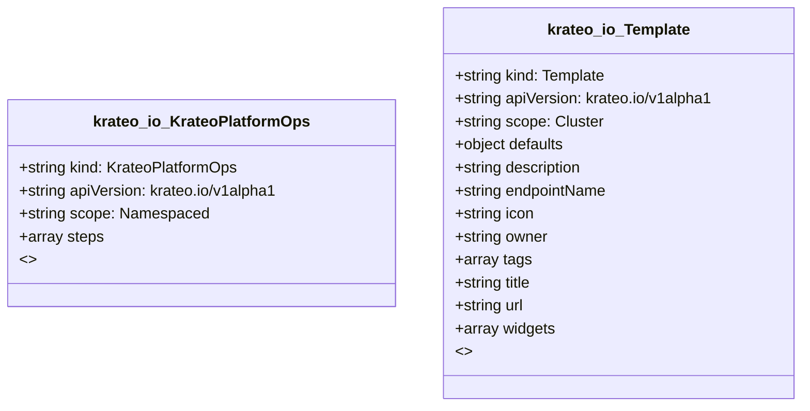

# CRD Schema Documentation - krateo.io API Group

> **Generated:** 2025-09-07 17:05:15
> 
> **Total CRDs:** 2
> 
> **API Groups:** 1
> 
> **Description:** Complete schema documentation for Kubernetes Custom Resource Definitions (CRDs), including property definitions, types, relationships, and visual diagrams.

---

## 📋 Table of Contents

1. [Executive Summary](#-executive-summary)
2. [API Group Documentation](#-api-group-documentation)
   - [krateo.io](#krateoio) (2 CRDs)
3. [Appendices](#-appendices)
   - [CRD Index](#crd-index)
   - [Property Types Summary](#property-types-summary)
   - [Relationship Matrix](#relationship-matrix)

## 📊 Executive Summary

### Overview

This document provides comprehensive schema documentation for **2 Custom Resource Definitions** distributed across **1 API groups** in your Kubernetes cluster.

### Key Statistics

| Metric | Value |
|--------|-------|
| **Total CRDs** | 2 |
| **API Groups** | 1 |
| **Total Instances** | 0 |
| **Namespaced CRDs** | 1 (50.0%) |
| **Cluster-scoped CRDs** | 1 (50.0%) |
| **Schema Coverage** | 2/2 (100.0%) |

### Distribution Analysis

#### Largest API Groups (by CRD count)

1. **krateo.io**: 2 CRDs

### Schema Analysis

**Most Complex CRDs (by property count):**

1. `Template` (krateo.io): 9 properties
2. `KrateoPlatformOps` (krateo.io): 1 properties

## 📁 krateo.io

### Overview

**API Group:** `krateo.io`  
**CRDs in Group:** 2  
**Total Instances:** 0

### CRDs in this Group

| Kind | Scope | Version | Instances | Description |
|------|-------|---------|-----------|-------------|
| `KrateoPlatformOps` | Namespaced | v1alpha1 | 0 | *No description available* |
| `Template` | Cluster | v1alpha1 | 0 | *No description available* |

### Schema Diagram

### Detailed CRD Documentation

#### KrateoPlatformOps

**Full Name:** `krateoplatformops.krateo.io`  
**API Version:** `krateo.io/v1alpha1`  
**Scope:** Namespaced  
**Instances:** 0  
**Categories:** krateo  

**Schema Properties:**

| Property | Type | Required | Description |
|----------|------|----------|-------------|
| `steps` | `array<object>` |  | *No description* |

#### Template

**Full Name:** `templates.krateo.io`  
**API Version:** `krateo.io/v1alpha1`  
**Scope:** Cluster  
**Instances:** 0  
**Categories:** managed, krateo, templates  

**Schema Properties:**

| Property | Type | Required | Description |
|----------|------|----------|-------------|
| `title` | `string` | ✓ | Title: template title |
| `widgets` | `array<object>` | ✓ | Widgets: |
| `defaults` | `object` |  | Defaults: |
| `description` | `string` |  | Description: template description |
| `endpointName` | `string` |  | EndpointName: endpoint name for this template |
| `icon` | `string` |  | Icon: template icon |
| `owner` | `string` |  | Owner: template owner |
| `tags` | `array<string>` |  | Tags: template tags |
| `url` | `string` |  | Url: template file location |

## 📚 Appendices

### CRD Index

Complete alphabetical index of all Custom Resource Definitions:

| CRD Name | Kind | API Group | Scope | Instances |
|----------|------|-----------|-------|-----------|
| `krateoplatformops.krateo.io` | `KrateoPlatformOps` | `krateo.io` | Namespaced | 0 |
| `templates.krateo.io` | `Template` | `krateo.io` | Cluster | 0 |

### Property Types Summary

Property type usage across all CRDs:

| Type | Usage Count |
|------|-------------|
| `string` | 6 |
| `array` | 3 |
| `object` | 1 |

### Relationship Matrix

Schema-based relationships detected between CRDs:

*No schema-based relationships detected*

---

*Documentation generated by k8s-inventory-cli on 2025-09-07 17:05:15*