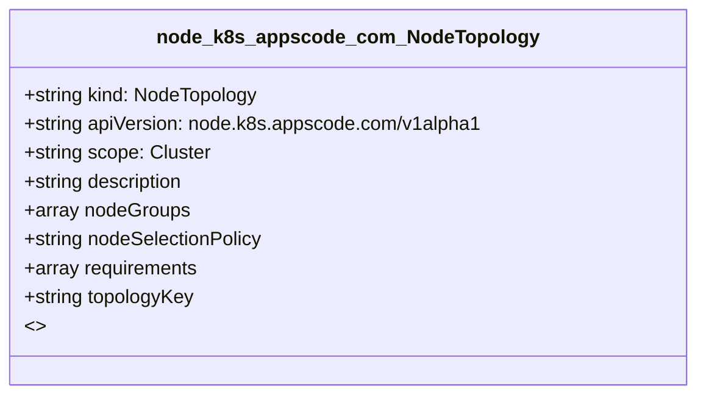

# CRD Schema Documentation - node.k8s.appscode.com API Group

> **Generated:** 2025-09-07 17:05:16
> 
> **Total CRDs:** 1
> 
> **API Groups:** 1
> 
> **Description:** Complete schema documentation for Kubernetes Custom Resource Definitions (CRDs), including property definitions, types, relationships, and visual diagrams.

---

## 📋 Table of Contents

1. [Executive Summary](#-executive-summary)
2. [API Group Documentation](#-api-group-documentation)
   - [node.k8s.appscode.com](#nodek8sappscodecom) (1 CRDs)
3. [Appendices](#-appendices)
   - [CRD Index](#crd-index)
   - [Property Types Summary](#property-types-summary)
   - [Relationship Matrix](#relationship-matrix)

## 📊 Executive Summary

### Overview

This document provides comprehensive schema documentation for **1 Custom Resource Definitions** distributed across **1 API groups** in your Kubernetes cluster.

### Key Statistics

| Metric | Value |
|--------|-------|
| **Total CRDs** | 1 |
| **API Groups** | 1 |
| **Total Instances** | 0 |
| **Namespaced CRDs** | 0 (0.0%) |
| **Cluster-scoped CRDs** | 1 (100.0%) |
| **Schema Coverage** | 1/1 (100.0%) |

### Distribution Analysis

#### Largest API Groups (by CRD count)

1. **node.k8s.appscode.com**: 1 CRDs

### Schema Analysis

**Most Complex CRDs (by property count):**

1. `NodeTopology` (node.k8s.appscode.com): 5 properties

## 📁 node.k8s.appscode.com

### Overview

**API Group:** `node.k8s.appscode.com`  
**CRDs in Group:** 1  
**Total Instances:** 0

### CRDs in this Group

| Kind | Scope | Version | Instances | Description |
|------|-------|---------|-----------|-------------|
| `NodeTopology` | Cluster | v1alpha1 | 0 | *No description available* |

### Schema Diagram

### Detailed CRD Documentation

#### NodeTopology

**Full Name:** `nodetopologies.node.k8s.appscode.com`  
**API Version:** `node.k8s.appscode.com/v1alpha1`  
**Scope:** Cluster  
**Instances:** 0  

**Schema Properties:**

| Property | Type | Required | Description |
|----------|------|----------|-------------|
| `nodeSelectionPolicy` | `string` | ✓ | *No description* |
| `description` | `string` |  | *No description* |
| `nodeGroups` | `array<object>` |  | *No description* |
| `requirements` | `array<object>` |  | *No description* |
| `topologyKey` | `string` |  | *No description* |

## 📚 Appendices

### CRD Index

Complete alphabetical index of all Custom Resource Definitions:

| CRD Name | Kind | API Group | Scope | Instances |
|----------|------|-----------|-------|-----------|
| `nodetopologies.node.k8s.appscode.com` | `NodeTopology` | `node.k8s.appscode.com` | Cluster | 0 |

### Property Types Summary

Property type usage across all CRDs:

| Type | Usage Count |
|------|-------------|
| `string` | 3 |
| `array` | 2 |

### Relationship Matrix

Schema-based relationships detected between CRDs:

*No schema-based relationships detected*

---

*Documentation generated by k8s-inventory-cli on 2025-09-07 17:05:16*