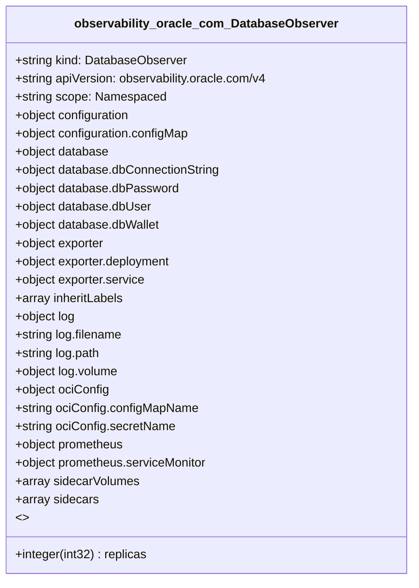

# CRD Schema Documentation - observability.oracle.com API Group

> **Generated:** 2025-09-07 17:05:16
> 
> **Total CRDs:** 1
> 
> **API Groups:** 1
> 
> **Description:** Complete schema documentation for Kubernetes Custom Resource Definitions (CRDs), including property definitions, types, relationships, and visual diagrams.

---

## 📋 Table of Contents

1. [Executive Summary](#-executive-summary)
2. [API Group Documentation](#-api-group-documentation)
   - [observability.oracle.com](#observabilityoraclecom) (1 CRDs)
3. [Appendices](#-appendices)
   - [CRD Index](#crd-index)
   - [Property Types Summary](#property-types-summary)
   - [Relationship Matrix](#relationship-matrix)

## 📊 Executive Summary

### Overview

This document provides comprehensive schema documentation for **1 Custom Resource Definitions** distributed across **1 API groups** in your Kubernetes cluster.

### Key Statistics

| Metric | Value |
|--------|-------|
| **Total CRDs** | 1 |
| **API Groups** | 1 |
| **Total Instances** | 0 |
| **Namespaced CRDs** | 1 (100.0%) |
| **Cluster-scoped CRDs** | 0 (0.0%) |
| **Schema Coverage** | 1/1 (100.0%) |

### Distribution Analysis

#### Largest API Groups (by CRD count)

1. **observability.oracle.com**: 1 CRDs

### Schema Analysis

**Most Complex CRDs (by property count):**

1. `DatabaseObserver` (observability.oracle.com): 10 properties
2. `DatabaseObserver` (observability.oracle.com): 10 properties
3. `DatabaseObserver` (observability.oracle.com): 10 properties

## 📁 observability.oracle.com

### Overview

**API Group:** `observability.oracle.com`  
**CRDs in Group:** 1  
**Total Instances:** 0

### CRDs in this Group

| Kind | Scope | Version | Instances | Description |
|------|-------|---------|-----------|-------------|
| `DatabaseObserver` | Namespaced | v4 | 0 | *No description available* |

### Schema Diagram

### Detailed CRD Documentation

#### DatabaseObserver

**Full Name:** `databaseobservers.observability.oracle.com`  
**API Version:** `observability.oracle.com/v4`  
**Scope:** Namespaced  
**Instances:** 0  
**Short Names:** dbobserver, dbobservers  

**Schema Properties:**

| Property | Type | Required | Description |
|----------|------|----------|-------------|
| `configuration` | `object` |  | *No description* |
| `database` | `object` |  | *No description* |
| `exporter` | `object` |  | *No description* |
| `inheritLabels` | `array<string>` |  | *No description* |
| `log` | `object` |  | *No description* |
| `ociConfig` | `object` |  | *No description* |
| `prometheus` | `object` |  | *No description* |
| `replicas` | `integer(int32)` |  | *No description* |
| `sidecarVolumes` | `array<object>` |  | *No description* |
| `sidecars` | `array<object>` |  | *No description* |

## 📚 Appendices

### CRD Index

Complete alphabetical index of all Custom Resource Definitions:

| CRD Name | Kind | API Group | Scope | Instances |
|----------|------|-----------|-------|-----------|
| `databaseobservers.observability.oracle.com` | `DatabaseObserver` | `observability.oracle.com` | Namespaced | 0 |

### Property Types Summary

Property type usage across all CRDs:

| Type | Usage Count |
|------|-------------|
| `object` | 18 |
| `array` | 9 |
| `integer` | 3 |

### Relationship Matrix

Schema-based relationships detected between CRDs:

*No schema-based relationships detected*

---

*Documentation generated by k8s-inventory-cli on 2025-09-07 17:05:16*