# CRD Schema Documentation - postgresql.cnpg.io API Group

> **Generated:** 2025-09-07 17:05:16
> 
> **Total CRDs:** 10
> 
> **API Groups:** 1
> 
> **Description:** Complete schema documentation for Kubernetes Custom Resource Definitions (CRDs), including property definitions, types, relationships, and visual diagrams.

---

## 📋 Table of Contents

1. [Executive Summary](#-executive-summary)
2. [API Group Documentation](#-api-group-documentation)
   - [postgresql.cnpg.io](#postgresqlcnpgio) (10 CRDs)
3. [Appendices](#-appendices)
   - [CRD Index](#crd-index)
   - [Property Types Summary](#property-types-summary)
   - [Relationship Matrix](#relationship-matrix)

## 📊 Executive Summary

### Overview

This document provides comprehensive schema documentation for **10 Custom Resource Definitions** distributed across **1 API groups** in your Kubernetes cluster.

### Key Statistics

| Metric | Value |
|--------|-------|
| **Total CRDs** | 10 |
| **API Groups** | 1 |
| **Total Instances** | 0 |
| **Namespaced CRDs** | 9 (90.0%) |
| **Cluster-scoped CRDs** | 1 (10.0%) |
| **Schema Coverage** | 10/10 (100.0%) |

### Distribution Analysis

#### Largest API Groups (by CRD count)

1. **postgresql.cnpg.io**: 10 CRDs

### Schema Analysis

**Most Complex CRDs (by property count):**

1. `Cluster` (postgresql.cnpg.io): 50 properties
2. `Database` (postgresql.cnpg.io): 21 properties
3. `ScheduledBackup` (postgresql.cnpg.io): 10 properties

## 📁 postgresql.cnpg.io

### Overview

**API Group:** `postgresql.cnpg.io`  
**CRDs in Group:** 10  
**Total Instances:** 0

### CRDs in this Group

| Kind | Scope | Version | Instances | Description |
|------|-------|---------|-----------|-------------|
| `Backup` | Namespaced | v1 | 0 | *No description available* |
| `Cluster` | Namespaced | v1 | 0 | *No description available* |
| `ClusterImageCatalog` | Cluster | v1 | 0 | *No description available* |
| `Database` | Namespaced | v1 | 0 | *No description available* |
| `FailoverQuorum` | Namespaced | v1 | 0 | *No description available* |
| `ImageCatalog` | Namespaced | v1 | 0 | *No description available* |
| `Pooler` | Namespaced | v1 | 0 | *No description available* |
| `Publication` | Namespaced | v1 | 0 | *No description available* |
| `ScheduledBackup` | Namespaced | v1 | 0 | *No description available* |
| `Subscription` | Namespaced | v1 | 0 | *No description available* |

### Schema Diagram

```mermaid
classDiagram
    %% API Group: postgresql.cnpg.io
    class postgresql_cnpg_io_Backup {
        +string kind: Backup
        +string apiVersion: postgresql.cnpg.io/v1
        +string scope: Namespaced
        +object cluster
        +string cluster.name
        +enum[barmanObjectStore|volumeSnapshot|plugin] method
        +boolean online
        +object onlineConfiguration
        +boolean onlineConfiguration.immediateCheckpoint
        +boolean onlineConfiguration.waitForArchive
        +object pluginConfiguration
        +string pluginConfiguration.name
        +object pluginConfiguration.parameters
        +enum[primary|prefer-standby] target
    }
    postgresql_cnpg_io_Backup : <<Namespaced>>
    class postgresql_cnpg_io_Cluster {
        +string kind: Cluster
        +string apiVersion: postgresql.cnpg.io/v1
        +string scope: Namespaced
        +object affinity
        +object affinity.additionalPodAffinity
        +object affinity.additionalPodAntiAffinity
        +boolean affinity.enablePodAntiAffinity
        +object affinity.nodeAffinity
        +object affinity.nodeSelector
        +string affinity.podAntiAffinityType
        +array<object> affinity.tolerations
        +string affinity.topologyKey
        +object backup
        +object backup.barmanObjectStore
        +string backup.retentionPolicy
        +enum[primary|prefer-standby] backup.target
        +object backup.volumeSnapshot
        +object bootstrap
        +object bootstrap.initdb
        +object bootstrap.pg_basebackup
        +object bootstrap.recovery
        +object certificates
        +string certificates.clientCASecret
        +string certificates.replicationTLSSecret
        +array<string> certificates.serverAltDNSNames
        +string certificates.serverCASecret
        +string certificates.serverTLSSecret
        +string description
        +boolean enablePDB
        +boolean enableSuperuserAccess
        +array<object> env
        +array<object> envFrom
        +object ephemeralVolumeSource
        +object ephemeralVolumeSource.volumeClaimTemplate
    }
    postgresql_cnpg_io_Cluster : <<Namespaced>>
    class postgresql_cnpg_io_ClusterImageCatalog {
        +string kind: ClusterImageCatalog
        +string apiVersion: postgresql.cnpg.io/v1
        +string scope: Cluster
        +array<object> images
    }
    postgresql_cnpg_io_ClusterImageCatalog : <<Cluster>>
    class postgresql_cnpg_io_Database {
        +string kind: Database
        +string apiVersion: postgresql.cnpg.io/v1
        +string scope: Namespaced
        +boolean allowConnections
        +string builtinLocale
        +object cluster
        +string cluster.name
        +string collationVersion
        +integer connectionLimit
        +enum[delete|retain] databaseReclaimPolicy
        +string encoding
        +enum[present|absent] ensure
        +array<object> extensions
        +string icuLocale
    }
    postgresql_cnpg_io_Database : <<Namespaced>>
    class postgresql_cnpg_io_FailoverQuorum {
        +string kind: FailoverQuorum
        +string apiVersion: postgresql.cnpg.io/v1
        +string scope: Namespaced
        +string apiVersion
        +string kind
        +object metadata
        +object status
        +string status.method
        +string status.primary
        +array<string> status.standbyNames
        +integer status.standbyNumber
    }
    postgresql_cnpg_io_FailoverQuorum : <<Namespaced>>
    class postgresql_cnpg_io_ImageCatalog {
        +string kind: ImageCatalog
        +string apiVersion: postgresql.cnpg.io/v1
        +string scope: Namespaced
        +array<object> images
    }
    postgresql_cnpg_io_ImageCatalog : <<Namespaced>>
    class postgresql_cnpg_io_Pooler {
        +string kind: Pooler
        +string apiVersion: postgresql.cnpg.io/v1
        +string scope: Namespaced
        +object cluster
        +string cluster.name
        +object deploymentStrategy
        +object deploymentStrategy.rollingUpdate
        +string deploymentStrategy.type
        +integer(int32) instances
        +object monitoring
        +boolean monitoring.enablePodMonitor
        +array<object> monitoring.podMonitorMetricRelabelings
        +array<object> monitoring.podMonitorRelabelings
        +object pgbouncer
        +string pgbouncer.authQuery
        +object pgbouncer.authQuerySecret
        +object pgbouncer.parameters
        +boolean pgbouncer.paused
        +array<string> pgbouncer.pg_hba
        +enum[session|transaction] pgbouncer.poolMode
        +object serviceTemplate
        +object serviceTemplate.metadata
        +object serviceTemplate.spec
        +object template
        +object template.metadata
        +object template.spec
        +enum[rw|ro|r] type
    }
    postgresql_cnpg_io_Pooler : <<Namespaced>>
    class postgresql_cnpg_io_Publication {
        +string kind: Publication
        +string apiVersion: postgresql.cnpg.io/v1
        +string scope: Namespaced
        +object cluster
        +string cluster.name
        +string dbname
        +string name
        +object parameters
        +enum[delete|retain] publicationReclaimPolicy
        +object target
        +boolean target.allTables
        +array<object> target.objects
    }
    postgresql_cnpg_io_Publication : <<Namespaced>>
    class postgresql_cnpg_io_ScheduledBackup {
        +string kind: ScheduledBackup
        +string apiVersion: postgresql.cnpg.io/v1
        +string scope: Namespaced
        +enum[none|self|cluster] backupOwnerReference
        +object cluster
        +string cluster.name
        +boolean immediate
        +enum[barmanObjectStore|volumeSnapshot|plugin] method
        +boolean online
        +object onlineConfiguration
        +boolean onlineConfiguration.immediateCheckpoint
        +boolean onlineConfiguration.waitForArchive
        +object pluginConfiguration
        +string pluginConfiguration.name
        +object pluginConfiguration.parameters
        +string schedule
        +boolean suspend
        +enum[primary|prefer-standby] target
    }
    postgresql_cnpg_io_ScheduledBackup : <<Namespaced>>
    class postgresql_cnpg_io_Subscription {
        +string kind: Subscription
        +string apiVersion: postgresql.cnpg.io/v1
        +string scope: Namespaced
        +object cluster
        +string cluster.name
        +string dbname
        +string externalClusterName
        +string name
        +object parameters
        +string publicationDBName
        +string publicationName
        +enum[delete|retain] subscriptionReclaimPolicy
    }
    postgresql_cnpg_io_Subscription : <<Namespaced>>
    postgresql_cnpg_io_Backup --> postgresql_cnpg_io_Cluster : references
    postgresql_cnpg_io_Backup --> postgresql_cnpg_io_Cluster : references
    postgresql_cnpg_io_Backup --> postgresql_cnpg_io_Cluster : uses
    postgresql_cnpg_io_Backup --> postgresql_cnpg_io_Cluster : configures
    postgresql_cnpg_io_Backup --> postgresql_cnpg_io_Cluster : routes to
    postgresql_cnpg_io_Backup --> postgresql_cnpg_io_Cluster : flows to
    postgresql_cnpg_io_Backup --> postgresql_cnpg_io_Pooler : references
    postgresql_cnpg_io_Backup --> postgresql_cnpg_io_ScheduledBackup : references
    postgresql_cnpg_io_Backup --> postgresql_cnpg_io_ScheduledBackup : uses
    postgresql_cnpg_io_Backup --> postgresql_cnpg_io_ScheduledBackup : configures
    postgresql_cnpg_io_Backup --> postgresql_cnpg_io_ScheduledBackup : similar schema
    postgresql_cnpg_io_Backup --> postgresql_cnpg_io_ScheduledBackup : routes to
    postgresql_cnpg_io_ClusterImageCatalog --> postgresql_cnpg_io_Cluster : references
    postgresql_cnpg_io_ClusterImageCatalog --> postgresql_cnpg_io_ImageCatalog : similar schema
    postgresql_cnpg_io_ClusterImageCatalog --> postgresql_cnpg_io_Pooler : references
    postgresql_cnpg_io_Cluster --> postgresql_cnpg_io_Database : references
    postgresql_cnpg_io_Cluster --> postgresql_cnpg_io_Database : references
    postgresql_cnpg_io_Cluster --> postgresql_cnpg_io_Database : uses
    postgresql_cnpg_io_Cluster --> postgresql_cnpg_io_Database : templates
    postgresql_cnpg_io_Cluster --> postgresql_cnpg_io_FailoverQuorum : references
    postgresql_cnpg_io_Cluster --> postgresql_cnpg_io_ImageCatalog : references
    postgresql_cnpg_io_Cluster --> postgresql_cnpg_io_ImageCatalog : uses
    postgresql_cnpg_io_Cluster --> postgresql_cnpg_io_Pooler : references
    postgresql_cnpg_io_Cluster --> postgresql_cnpg_io_Pooler : references
    postgresql_cnpg_io_Cluster --> postgresql_cnpg_io_Pooler : uses
    postgresql_cnpg_io_Cluster --> postgresql_cnpg_io_Pooler : templates
    postgresql_cnpg_io_Cluster --> postgresql_cnpg_io_Pooler : federates
    postgresql_cnpg_io_Cluster --> postgresql_cnpg_io_Pooler : routes to
    postgresql_cnpg_io_Cluster --> postgresql_cnpg_io_Pooler : flows to
    postgresql_cnpg_io_Cluster --> postgresql_cnpg_io_Publication : references
    postgresql_cnpg_io_Cluster --> postgresql_cnpg_io_Publication : references
    postgresql_cnpg_io_Cluster --> postgresql_cnpg_io_Publication : uses
    postgresql_cnpg_io_Cluster --> postgresql_cnpg_io_ScheduledBackup : references
    postgresql_cnpg_io_Cluster --> postgresql_cnpg_io_ScheduledBackup : references
    postgresql_cnpg_io_Cluster --> postgresql_cnpg_io_ScheduledBackup : uses
    postgresql_cnpg_io_Cluster --> postgresql_cnpg_io_ScheduledBackup : configures
    postgresql_cnpg_io_Cluster --> postgresql_cnpg_io_ScheduledBackup : routes to
    postgresql_cnpg_io_Cluster --> postgresql_cnpg_io_Subscription : references
    postgresql_cnpg_io_Cluster --> postgresql_cnpg_io_Subscription : references
    postgresql_cnpg_io_Cluster --> postgresql_cnpg_io_Subscription : uses
    postgresql_cnpg_io_Cluster --> postgresql_cnpg_io_Subscription : federates
    postgresql_cnpg_io_Database --> postgresql_cnpg_io_Pooler : references
    postgresql_cnpg_io_Database --> postgresql_cnpg_io_Publication : references
    postgresql_cnpg_io_Database --> postgresql_cnpg_io_Subscription : references
    postgresql_cnpg_io_FailoverQuorum --> postgresql_cnpg_io_Pooler : references
    postgresql_cnpg_io_ImageCatalog --> postgresql_cnpg_io_Pooler : references
    postgresql_cnpg_io_Pooler --> postgresql_cnpg_io_Publication : references
    postgresql_cnpg_io_Pooler --> postgresql_cnpg_io_ScheduledBackup : references
    postgresql_cnpg_io_Pooler --> postgresql_cnpg_io_Subscription : references
    postgresql_cnpg_io_Publication --> postgresql_cnpg_io_Subscription : references
    postgresql_cnpg_io_Publication --> postgresql_cnpg_io_Subscription : uses
    postgresql_cnpg_io_Publication --> postgresql_cnpg_io_Subscription : similar schema
    postgresql_cnpg_io_Publication --> postgresql_cnpg_io_Subscription : federates
```

### Detailed CRD Documentation

#### Backup

**Full Name:** `backups.postgresql.cnpg.io`  
**API Version:** `postgresql.cnpg.io/v1`  
**Scope:** Namespaced  
**Instances:** 0  

**Schema Properties:**

| Property | Type | Required | Description |
|----------|------|----------|-------------|
| `cluster` | `object` | ✓ | The cluster to backup |
| `method` | `enum[barmanObjectStore|volumeSnapshot|plugin]` |  | The backup method to be used, possible options are `barma... |
| `online` | `boolean` |  | Whether the default type of backup with volume snapshots ... |
| `onlineConfiguration` | `object` |  | Configuration parameters to control the online/hot backup... |
| `pluginConfiguration` | `object` |  | Configuration parameters passed to the plugin managing th... |
| `target` | `enum[primary|prefer-standby]` |  | The policy to decide which instance should perform this b... |

#### Cluster

**Full Name:** `clusters.postgresql.cnpg.io`  
**API Version:** `postgresql.cnpg.io/v1`  
**Scope:** Namespaced  
**Instances:** 0  

**Schema Properties:**

| Property | Type | Required | Description |
|----------|------|----------|-------------|
| `instances` | `integer` | ✓ | Number of instances required in the cluster |
| `affinity` | `object` |  | Affinity/Anti-affinity rules for Pods |
| `backup` | `object` |  | The configuration to be used for backups |
| `bootstrap` | `object` |  | Instructions to bootstrap this cluster |
| `certificates` | `object` |  | The configuration for the CA and related certificates |
| `description` | `string` |  | Description of this PostgreSQL cluster |
| `enablePDB` | `boolean` |  | Manage the `PodDisruptionBudget` resources within the clu... |
| `enableSuperuserAccess` | `boolean` |  | When this option is enabled, the operator will use the `S... |
| `env` | `array<object>` |  | Env follows the Env format to pass environment variables
... |
| `envFrom` | `array<object>` |  | EnvFrom follows the EnvFrom format to pass environment va... |
| `ephemeralVolumeSource` | `object` |  | EphemeralVolumeSource allows the user to configure the so... |
| `ephemeralVolumesSizeLimit` | `object` |  | EphemeralVolumesSizeLimit allows the user to set the limi... |
| `externalClusters` | `array<object>` |  | The list of external clusters which are used in the confi... |
| `failoverDelay` | `integer(int32)` |  | The amount of time (in seconds) to wait before triggering... |
| `imageCatalogRef` | `object` |  | Defines the major PostgreSQL version we want to use withi... |
| `imageName` | `string` |  | Name of the container image, supporting both tags (`<imag... |
| `imagePullPolicy` | `string` |  | Image pull policy.
One of `Always`, `Never` or `IfNotPres... |
| `imagePullSecrets` | `array<object>` |  | The list of pull secrets to be used to pull the images |
| `inheritedMetadata` | `object` |  | Metadata that will be inherited by all objects related to... |
| `livenessProbeTimeout` | `integer(int32)` |  | LivenessProbeTimeout is the time (in seconds) that is all... |

*... and 30 more properties*

#### ClusterImageCatalog

**Full Name:** `clusterimagecatalogs.postgresql.cnpg.io`  
**API Version:** `postgresql.cnpg.io/v1`  
**Scope:** Cluster  
**Instances:** 0  

**Schema Properties:**

| Property | Type | Required | Description |
|----------|------|----------|-------------|
| `images` | `array<object>` | ✓ | List of CatalogImages available in the catalog |

#### Database

**Full Name:** `databases.postgresql.cnpg.io`  
**API Version:** `postgresql.cnpg.io/v1`  
**Scope:** Namespaced  
**Instances:** 0  

**Schema Properties:**

| Property | Type | Required | Description |
|----------|------|----------|-------------|
| `cluster` | `object` | ✓ | The name of the PostgreSQL cluster hosting the database. |
| `name` | `string` | ✓ | The name of the database to create inside PostgreSQL. Thi... |
| `owner` | `string` | ✓ | Maps to the `OWNER` parameter of `CREATE DATABASE`.
Maps ... |
| `allowConnections` | `boolean` |  | Maps to the `ALLOW_CONNECTIONS` parameter of `CREATE DATA... |
| `builtinLocale` | `string` |  | Maps to the `BUILTIN_LOCALE` parameter of `CREATE DATABAS... |
| `collationVersion` | `string` |  | Maps to the `COLLATION_VERSION` parameter of `CREATE DATA... |
| `connectionLimit` | `integer` |  | Maps to the `CONNECTION LIMIT` clause of `CREATE DATABASE... |
| `databaseReclaimPolicy` | `enum[delete|retain]` |  | The policy for end-of-life maintenance of this database. |
| `encoding` | `string` |  | Maps to the `ENCODING` parameter of `CREATE DATABASE`. Th... |
| `ensure` | `enum[present|absent]` |  | Ensure the PostgreSQL database is `present` or `absent` -... |
| `extensions` | `array<object>` |  | The list of extensions to be managed in the database |
| `icuLocale` | `string` |  | Maps to the `ICU_LOCALE` parameter of `CREATE DATABASE`. ... |
| `icuRules` | `string` |  | Maps to the `ICU_RULES` parameter of `CREATE DATABASE`. T... |
| `isTemplate` | `boolean` |  | Maps to the `IS_TEMPLATE` parameter of `CREATE DATABASE` ... |
| `locale` | `string` |  | Maps to the `LOCALE` parameter of `CREATE DATABASE`. This... |
| `localeCType` | `string` |  | Maps to the `LC_CTYPE` parameter of `CREATE DATABASE`. Th... |
| `localeCollate` | `string` |  | Maps to the `LC_COLLATE` parameter of `CREATE DATABASE`. ... |
| `localeProvider` | `string` |  | Maps to the `LOCALE_PROVIDER` parameter of `CREATE DATABA... |
| `schemas` | `array<object>` |  | The list of schemas to be managed in the database |
| `tablespace` | `string` |  | Maps to the `TABLESPACE` parameter of `CREATE DATABASE`.
... |

*... and 1 more properties*

#### FailoverQuorum

**Full Name:** `failoverquorums.postgresql.cnpg.io`  
**API Version:** `postgresql.cnpg.io/v1`  
**Scope:** Namespaced  
**Instances:** 0  

**Schema Properties:**

| Property | Type | Required | Description |
|----------|------|----------|-------------|
| `metadata` | `object` | ✓ | *No description* |
| `apiVersion` | `string` |  | APIVersion defines the versioned schema of this represent... |
| `kind` | `string` |  | Kind is a string value representing the REST resource thi... |
| `status` | `object` |  | Most recently observed status of the failover quorum. |

#### ImageCatalog

**Full Name:** `imagecatalogs.postgresql.cnpg.io`  
**API Version:** `postgresql.cnpg.io/v1`  
**Scope:** Namespaced  
**Instances:** 0  

**Schema Properties:**

| Property | Type | Required | Description |
|----------|------|----------|-------------|
| `images` | `array<object>` | ✓ | List of CatalogImages available in the catalog |

#### Pooler

**Full Name:** `poolers.postgresql.cnpg.io`  
**API Version:** `postgresql.cnpg.io/v1`  
**Scope:** Namespaced  
**Instances:** 0  

**Schema Properties:**

| Property | Type | Required | Description |
|----------|------|----------|-------------|
| `cluster` | `object` | ✓ | This is the cluster reference on which the Pooler will wo... |
| `pgbouncer` | `object` | ✓ | The PgBouncer configuration |
| `deploymentStrategy` | `object` |  | The deployment strategy to use for pgbouncer to replace e... |
| `instances` | `integer(int32)` |  | The number of replicas we want. Default: 1. |
| `monitoring` | `object` |  | The configuration of the monitoring infrastructure of thi... |
| `serviceTemplate` | `object` |  | Template for the Service to be created |
| `template` | `object` |  | The template of the Pod to be created |
| `type` | `enum[rw|ro|r]` |  | Type of service to forward traffic to. Default: `rw`. |

#### Publication

**Full Name:** `publications.postgresql.cnpg.io`  
**API Version:** `postgresql.cnpg.io/v1`  
**Scope:** Namespaced  
**Instances:** 0  

**Schema Properties:**

| Property | Type | Required | Description |
|----------|------|----------|-------------|
| `cluster` | `object` | ✓ | The name of the PostgreSQL cluster that identifies the "p... |
| `dbname` | `string` | ✓ | The name of the database where the publication will be in... |
| `name` | `string` | ✓ | The name of the publication inside PostgreSQL |
| `target` | `object` | ✓ | Target of the publication as expected by PostgreSQL `CREA... |
| `parameters` | `object` |  | Publication parameters part of the `WITH` clause as expec... |
| `publicationReclaimPolicy` | `enum[delete|retain]` |  | The policy for end-of-life maintenance of this publication |

#### ScheduledBackup

**Full Name:** `scheduledbackups.postgresql.cnpg.io`  
**API Version:** `postgresql.cnpg.io/v1`  
**Scope:** Namespaced  
**Instances:** 0  

**Schema Properties:**

| Property | Type | Required | Description |
|----------|------|----------|-------------|
| `cluster` | `object` | ✓ | The cluster to backup |
| `schedule` | `string` | ✓ | The schedule does not follow the same format used in Kube... |
| `backupOwnerReference` | `enum[none|self|cluster]` |  | Indicates which ownerReference should be put inside the c... |
| `immediate` | `boolean` |  | If the first backup has to be immediately start after cre... |
| `method` | `enum[barmanObjectStore|volumeSnapshot|plugin]` |  | The backup method to be used, possible options are `barma... |
| `online` | `boolean` |  | Whether the default type of backup with volume snapshots ... |
| `onlineConfiguration` | `object` |  | Configuration parameters to control the online/hot backup... |
| `pluginConfiguration` | `object` |  | Configuration parameters passed to the plugin managing th... |
| `suspend` | `boolean` |  | If this backup is suspended or not |
| `target` | `enum[primary|prefer-standby]` |  | The policy to decide which instance should perform this b... |

#### Subscription

**Full Name:** `subscriptions.postgresql.cnpg.io`  
**API Version:** `postgresql.cnpg.io/v1`  
**Scope:** Namespaced  
**Instances:** 0  

**Schema Properties:**

| Property | Type | Required | Description |
|----------|------|----------|-------------|
| `cluster` | `object` | ✓ | The name of the PostgreSQL cluster that identifies the "s... |
| `dbname` | `string` | ✓ | The name of the database where the publication will be in... |
| `externalClusterName` | `string` | ✓ | The name of the external cluster with the publication ("p... |
| `name` | `string` | ✓ | The name of the subscription inside PostgreSQL |
| `publicationName` | `string` | ✓ | The name of the publication inside the PostgreSQL databas... |
| `parameters` | `object` |  | Subscription parameters included in the `WITH` clause of ... |
| `publicationDBName` | `string` |  | The name of the database containing the publication on th... |
| `subscriptionReclaimPolicy` | `enum[delete|retain]` |  | The policy for end-of-life maintenance of this subscription |

## 📚 Appendices

### CRD Index

Complete alphabetical index of all Custom Resource Definitions:

| CRD Name | Kind | API Group | Scope | Instances |
|----------|------|-----------|-------|-----------|
| `backups.postgresql.cnpg.io` | `Backup` | `postgresql.cnpg.io` | Namespaced | 0 |
| `clusterimagecatalogs.postgresql.cnpg.io` | `ClusterImageCatalog` | `postgresql.cnpg.io` | Cluster | 0 |
| `clusters.postgresql.cnpg.io` | `Cluster` | `postgresql.cnpg.io` | Namespaced | 0 |
| `databases.postgresql.cnpg.io` | `Database` | `postgresql.cnpg.io` | Namespaced | 0 |
| `failoverquorums.postgresql.cnpg.io` | `FailoverQuorum` | `postgresql.cnpg.io` | Namespaced | 0 |
| `imagecatalogs.postgresql.cnpg.io` | `ImageCatalog` | `postgresql.cnpg.io` | Namespaced | 0 |
| `poolers.postgresql.cnpg.io` | `Pooler` | `postgresql.cnpg.io` | Namespaced | 0 |
| `publications.postgresql.cnpg.io` | `Publication` | `postgresql.cnpg.io` | Namespaced | 0 |
| `scheduledbackups.postgresql.cnpg.io` | `ScheduledBackup` | `postgresql.cnpg.io` | Namespaced | 0 |
| `subscriptions.postgresql.cnpg.io` | `Subscription` | `postgresql.cnpg.io` | Namespaced | 0 |

### Property Types Summary

Property type usage across all CRDs:

| Type | Usage Count |
|------|-------------|
| `object` | 42 |
| `string` | 41 |
| `integer` | 13 |
| `array` | 11 |
| `boolean` | 8 |

### Relationship Matrix

Schema-based relationships detected between CRDs:

| Source CRD | Target CRD | API Group | Relationship Type |
|------------|------------|-----------|-------------------|
| `Backup` | `Cluster` | `postgresql.cnpg.io (intra-group)` | references |
| `Backup` | `Cluster` | `postgresql.cnpg.io (intra-group)` | references |
| `Backup` | `Cluster` | `postgresql.cnpg.io (intra-group)` | uses |
| `Backup` | `Cluster` | `postgresql.cnpg.io (intra-group)` | configures |
| `Backup` | `Cluster` | `postgresql.cnpg.io (intra-group)` | routes_to |
| `Backup` | `Cluster` | `postgresql.cnpg.io (intra-group)` | flows_to |
| `Backup` | `Pooler` | `postgresql.cnpg.io (intra-group)` | references |
| `Backup` | `ScheduledBackup` | `postgresql.cnpg.io (intra-group)` | references |
| `Backup` | `ScheduledBackup` | `postgresql.cnpg.io (intra-group)` | uses |
| `Backup` | `ScheduledBackup` | `postgresql.cnpg.io (intra-group)` | configures |
| `Backup` | `ScheduledBackup` | `postgresql.cnpg.io (intra-group)` | similar_schema |
| `Backup` | `ScheduledBackup` | `postgresql.cnpg.io (intra-group)` | routes_to |
| `ClusterImageCatalog` | `Cluster` | `postgresql.cnpg.io (intra-group)` | references |
| `ClusterImageCatalog` | `ImageCatalog` | `postgresql.cnpg.io (intra-group)` | similar_schema |
| `ClusterImageCatalog` | `Pooler` | `postgresql.cnpg.io (intra-group)` | references |
| `Cluster` | `Database` | `postgresql.cnpg.io (intra-group)` | references |
| `Cluster` | `Database` | `postgresql.cnpg.io (intra-group)` | references |
| `Cluster` | `Database` | `postgresql.cnpg.io (intra-group)` | uses |
| `Cluster` | `Database` | `postgresql.cnpg.io (intra-group)` | templates |
| `Cluster` | `FailoverQuorum` | `postgresql.cnpg.io (intra-group)` | references |
| `Cluster` | `ImageCatalog` | `postgresql.cnpg.io (intra-group)` | references |
| `Cluster` | `ImageCatalog` | `postgresql.cnpg.io (intra-group)` | uses |
| `Cluster` | `Pooler` | `postgresql.cnpg.io (intra-group)` | references |
| `Cluster` | `Pooler` | `postgresql.cnpg.io (intra-group)` | references |
| `Cluster` | `Pooler` | `postgresql.cnpg.io (intra-group)` | uses |
| `Cluster` | `Pooler` | `postgresql.cnpg.io (intra-group)` | templates |
| `Cluster` | `Pooler` | `postgresql.cnpg.io (intra-group)` | federates |
| `Cluster` | `Pooler` | `postgresql.cnpg.io (intra-group)` | routes_to |
| `Cluster` | `Pooler` | `postgresql.cnpg.io (intra-group)` | flows_to |
| `Cluster` | `Publication` | `postgresql.cnpg.io (intra-group)` | references |
| `Cluster` | `Publication` | `postgresql.cnpg.io (intra-group)` | references |
| `Cluster` | `Publication` | `postgresql.cnpg.io (intra-group)` | uses |
| `Cluster` | `ScheduledBackup` | `postgresql.cnpg.io (intra-group)` | references |
| `Cluster` | `ScheduledBackup` | `postgresql.cnpg.io (intra-group)` | references |
| `Cluster` | `ScheduledBackup` | `postgresql.cnpg.io (intra-group)` | uses |
| `Cluster` | `ScheduledBackup` | `postgresql.cnpg.io (intra-group)` | configures |
| `Cluster` | `ScheduledBackup` | `postgresql.cnpg.io (intra-group)` | routes_to |
| `Cluster` | `Subscription` | `postgresql.cnpg.io (intra-group)` | references |
| `Cluster` | `Subscription` | `postgresql.cnpg.io (intra-group)` | references |
| `Cluster` | `Subscription` | `postgresql.cnpg.io (intra-group)` | uses |
| `Cluster` | `Subscription` | `postgresql.cnpg.io (intra-group)` | federates |
| `Database` | `Pooler` | `postgresql.cnpg.io (intra-group)` | references |
| `Database` | `Publication` | `postgresql.cnpg.io (intra-group)` | references |
| `Database` | `Subscription` | `postgresql.cnpg.io (intra-group)` | references |
| `FailoverQuorum` | `Pooler` | `postgresql.cnpg.io (intra-group)` | references |
| `ImageCatalog` | `Pooler` | `postgresql.cnpg.io (intra-group)` | references |
| `Pooler` | `Publication` | `postgresql.cnpg.io (intra-group)` | references |
| `Pooler` | `ScheduledBackup` | `postgresql.cnpg.io (intra-group)` | references |
| `Pooler` | `Subscription` | `postgresql.cnpg.io (intra-group)` | references |
| `Publication` | `Subscription` | `postgresql.cnpg.io (intra-group)` | references |
| `Publication` | `Subscription` | `postgresql.cnpg.io (intra-group)` | uses |
| `Publication` | `Subscription` | `postgresql.cnpg.io (intra-group)` | similar_schema |
| `Publication` | `Subscription` | `postgresql.cnpg.io (intra-group)` | federates |

---

*Documentation generated by k8s-inventory-cli on 2025-09-07 17:05:16*