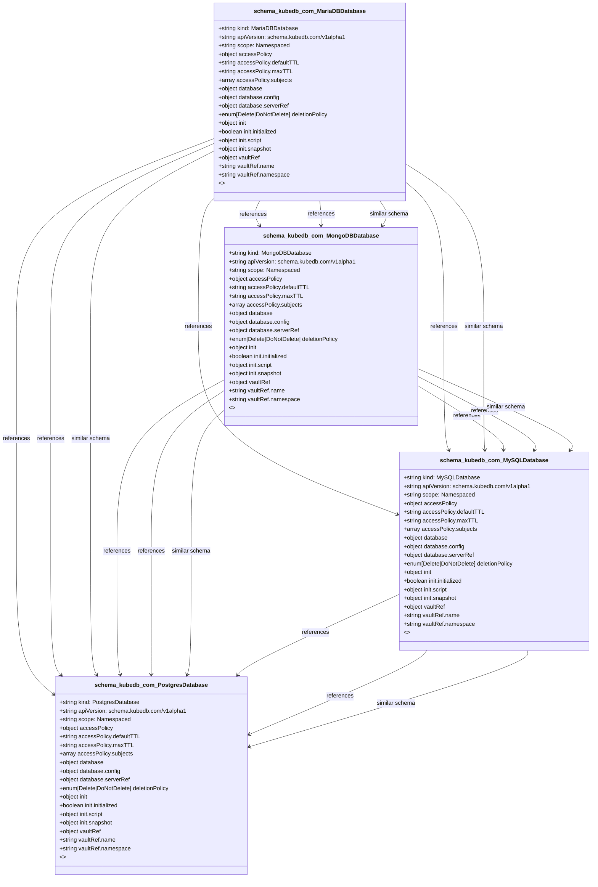

# CRD Schema Documentation - schema.kubedb.com API Group

> **Generated:** 2025-09-07 17:05:16
> 
> **Total CRDs:** 4
> 
> **API Groups:** 1
> 
> **Description:** Complete schema documentation for Kubernetes Custom Resource Definitions (CRDs), including property definitions, types, relationships, and visual diagrams.

---

## 📋 Table of Contents

1. [Executive Summary](#-executive-summary)
2. [API Group Documentation](#-api-group-documentation)
   - [schema.kubedb.com](#schemakubedbcom) (4 CRDs)
3. [Appendices](#-appendices)
   - [CRD Index](#crd-index)
   - [Property Types Summary](#property-types-summary)
   - [Relationship Matrix](#relationship-matrix)

## 📊 Executive Summary

### Overview

This document provides comprehensive schema documentation for **4 Custom Resource Definitions** distributed across **1 API groups** in your Kubernetes cluster.

### Key Statistics

| Metric | Value |
|--------|-------|
| **Total CRDs** | 4 |
| **API Groups** | 1 |
| **Total Instances** | 0 |
| **Namespaced CRDs** | 4 (100.0%) |
| **Cluster-scoped CRDs** | 0 (0.0%) |
| **Schema Coverage** | 4/4 (100.0%) |

### Distribution Analysis

#### Largest API Groups (by CRD count)

1. **schema.kubedb.com**: 4 CRDs

### Schema Analysis

**Most Complex CRDs (by property count):**

1. `MariaDBDatabase` (schema.kubedb.com): 5 properties
2. `MongoDBDatabase` (schema.kubedb.com): 5 properties
3. `MySQLDatabase` (schema.kubedb.com): 5 properties

## 📁 schema.kubedb.com

### Overview

**API Group:** `schema.kubedb.com`  
**CRDs in Group:** 4  
**Total Instances:** 0

### CRDs in this Group

| Kind | Scope | Version | Instances | Description |
|------|-------|---------|-----------|-------------|
| `MariaDBDatabase` | Namespaced | v1alpha1 | 0 | *No description available* |
| `MongoDBDatabase` | Namespaced | v1alpha1 | 0 | *No description available* |
| `MySQLDatabase` | Namespaced | v1alpha1 | 0 | *No description available* |
| `PostgresDatabase` | Namespaced | v1alpha1 | 0 | *No description available* |

### Schema Diagram

### Detailed CRD Documentation

#### MariaDBDatabase

**Full Name:** `mariadbdatabases.schema.kubedb.com`  
**API Version:** `schema.kubedb.com/v1alpha1`  
**Scope:** Namespaced  
**Instances:** 0  
**Categories:** schema, kubedb, appscode  
**Short Names:** mdschema  

**Schema Properties:**

| Property | Type | Required | Description |
|----------|------|----------|-------------|
| `accessPolicy` | `object` | ✓ | *No description* |
| `database` | `object` | ✓ | *No description* |
| `vaultRef` | `object` | ✓ | *No description* |
| `deletionPolicy` | `enum[Delete|DoNotDelete]` |  | *No description* |
| `init` | `object` |  | *No description* |

#### MongoDBDatabase

**Full Name:** `mongodbdatabases.schema.kubedb.com`  
**API Version:** `schema.kubedb.com/v1alpha1`  
**Scope:** Namespaced  
**Instances:** 0  
**Categories:** schema, kubedb, appscode  
**Short Names:** mgschema  

**Schema Properties:**

| Property | Type | Required | Description |
|----------|------|----------|-------------|
| `accessPolicy` | `object` | ✓ | *No description* |
| `database` | `object` | ✓ | *No description* |
| `vaultRef` | `object` | ✓ | *No description* |
| `deletionPolicy` | `enum[Delete|DoNotDelete]` |  | *No description* |
| `init` | `object` |  | *No description* |

#### MySQLDatabase

**Full Name:** `mysqldatabases.schema.kubedb.com`  
**API Version:** `schema.kubedb.com/v1alpha1`  
**Scope:** Namespaced  
**Instances:** 0  
**Categories:** schema, kubedb, appscode  
**Short Names:** myschema  

**Schema Properties:**

| Property | Type | Required | Description |
|----------|------|----------|-------------|
| `accessPolicy` | `object` | ✓ | *No description* |
| `database` | `object` | ✓ | *No description* |
| `vaultRef` | `object` | ✓ | *No description* |
| `deletionPolicy` | `enum[Delete|DoNotDelete]` |  | *No description* |
| `init` | `object` |  | *No description* |

#### PostgresDatabase

**Full Name:** `postgresdatabases.schema.kubedb.com`  
**API Version:** `schema.kubedb.com/v1alpha1`  
**Scope:** Namespaced  
**Instances:** 0  
**Categories:** schema, kubedb, appscode  
**Short Names:** pgschema  

**Schema Properties:**

| Property | Type | Required | Description |
|----------|------|----------|-------------|
| `accessPolicy` | `object` | ✓ | *No description* |
| `database` | `object` | ✓ | *No description* |
| `vaultRef` | `object` | ✓ | *No description* |
| `deletionPolicy` | `enum[Delete|DoNotDelete]` |  | *No description* |
| `init` | `object` |  | *No description* |

## 📚 Appendices

### CRD Index

Complete alphabetical index of all Custom Resource Definitions:

| CRD Name | Kind | API Group | Scope | Instances |
|----------|------|-----------|-------|-----------|
| `mariadbdatabases.schema.kubedb.com` | `MariaDBDatabase` | `schema.kubedb.com` | Namespaced | 0 |
| `mongodbdatabases.schema.kubedb.com` | `MongoDBDatabase` | `schema.kubedb.com` | Namespaced | 0 |
| `mysqldatabases.schema.kubedb.com` | `MySQLDatabase` | `schema.kubedb.com` | Namespaced | 0 |
| `postgresdatabases.schema.kubedb.com` | `PostgresDatabase` | `schema.kubedb.com` | Namespaced | 0 |

### Property Types Summary

Property type usage across all CRDs:

| Type | Usage Count |
|------|-------------|
| `object` | 16 |
| `string` | 4 |

### Relationship Matrix

Schema-based relationships detected between CRDs:

| Source CRD | Target CRD | API Group | Relationship Type |
|------------|------------|-----------|-------------------|
| `MariaDBDatabase` | `MongoDBDatabase` | `schema.kubedb.com (intra-group)` | references |
| `MariaDBDatabase` | `MongoDBDatabase` | `schema.kubedb.com (intra-group)` | references |
| `MariaDBDatabase` | `MongoDBDatabase` | `schema.kubedb.com (intra-group)` | similar_schema |
| `MariaDBDatabase` | `MySQLDatabase` | `schema.kubedb.com (intra-group)` | references |
| `MariaDBDatabase` | `MySQLDatabase` | `schema.kubedb.com (intra-group)` | references |
| `MariaDBDatabase` | `MySQLDatabase` | `schema.kubedb.com (intra-group)` | similar_schema |
| `MariaDBDatabase` | `PostgresDatabase` | `schema.kubedb.com (intra-group)` | references |
| `MariaDBDatabase` | `PostgresDatabase` | `schema.kubedb.com (intra-group)` | references |
| `MariaDBDatabase` | `PostgresDatabase` | `schema.kubedb.com (intra-group)` | similar_schema |
| `MongoDBDatabase` | `MySQLDatabase` | `schema.kubedb.com (intra-group)` | references |
| `MongoDBDatabase` | `MySQLDatabase` | `schema.kubedb.com (intra-group)` | references |
| `MongoDBDatabase` | `MySQLDatabase` | `schema.kubedb.com (intra-group)` | similar_schema |
| `MongoDBDatabase` | `PostgresDatabase` | `schema.kubedb.com (intra-group)` | references |
| `MongoDBDatabase` | `PostgresDatabase` | `schema.kubedb.com (intra-group)` | references |
| `MongoDBDatabase` | `PostgresDatabase` | `schema.kubedb.com (intra-group)` | similar_schema |
| `MySQLDatabase` | `PostgresDatabase` | `schema.kubedb.com (intra-group)` | references |
| `MySQLDatabase` | `PostgresDatabase` | `schema.kubedb.com (intra-group)` | references |
| `MySQLDatabase` | `PostgresDatabase` | `schema.kubedb.com (intra-group)` | similar_schema |

---

*Documentation generated by k8s-inventory-cli on 2025-09-07 17:05:16*