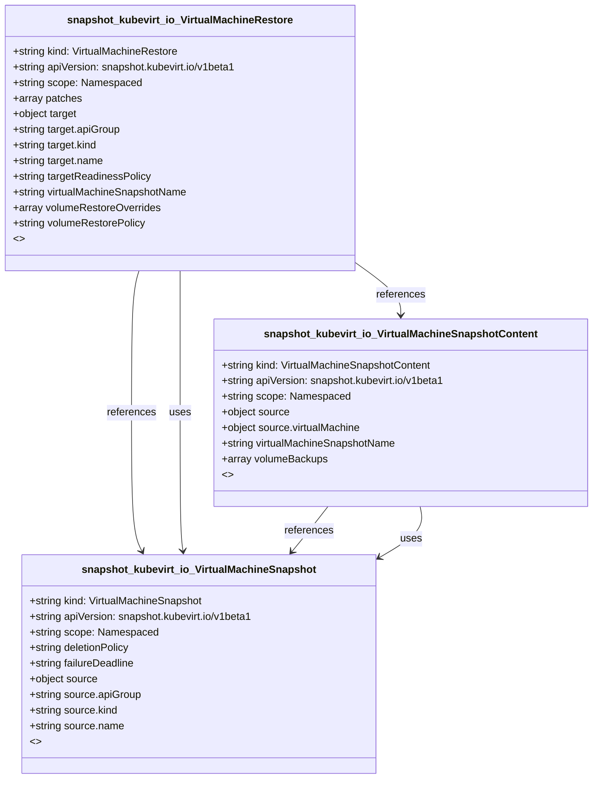

# CRD Schema Documentation - snapshot.kubevirt.io API Group

> **Generated:** 2025-09-07 17:05:16
> 
> **Total CRDs:** 3
> 
> **API Groups:** 1
> 
> **Description:** Complete schema documentation for Kubernetes Custom Resource Definitions (CRDs), including property definitions, types, relationships, and visual diagrams.

---

## 📋 Table of Contents

1. [Executive Summary](#-executive-summary)
2. [API Group Documentation](#-api-group-documentation)
   - [snapshot.kubevirt.io](#snapshotkubevirtio) (3 CRDs)
3. [Appendices](#-appendices)
   - [CRD Index](#crd-index)
   - [Property Types Summary](#property-types-summary)
   - [Relationship Matrix](#relationship-matrix)

## 📊 Executive Summary

### Overview

This document provides comprehensive schema documentation for **3 Custom Resource Definitions** distributed across **1 API groups** in your Kubernetes cluster.

### Key Statistics

| Metric | Value |
|--------|-------|
| **Total CRDs** | 3 |
| **API Groups** | 1 |
| **Total Instances** | 0 |
| **Namespaced CRDs** | 3 (100.0%) |
| **Cluster-scoped CRDs** | 0 (0.0%) |
| **Schema Coverage** | 3/3 (100.0%) |

### Distribution Analysis

#### Largest API Groups (by CRD count)

1. **snapshot.kubevirt.io**: 3 CRDs

### Schema Analysis

**Most Complex CRDs (by property count):**

1. `VirtualMachineRestore` (snapshot.kubevirt.io): 6 properties
2. `VirtualMachineRestore` (snapshot.kubevirt.io): 6 properties
3. `VirtualMachineSnapshotContent` (snapshot.kubevirt.io): 3 properties

## 📁 snapshot.kubevirt.io

### Overview

**API Group:** `snapshot.kubevirt.io`  
**CRDs in Group:** 3  
**Total Instances:** 0

### CRDs in this Group

| Kind | Scope | Version | Instances | Description |
|------|-------|---------|-----------|-------------|
| `VirtualMachineRestore` | Namespaced | v1beta1 | 0 | *No description available* |
| `VirtualMachineSnapshot` | Namespaced | v1beta1 | 0 | *No description available* |
| `VirtualMachineSnapshotContent` | Namespaced | v1beta1 | 0 | *No description available* |

### Schema Diagram

### Detailed CRD Documentation

#### VirtualMachineRestore

**Full Name:** `virtualmachinerestores.snapshot.kubevirt.io`  
**API Version:** `snapshot.kubevirt.io/v1beta1`  
**Scope:** Namespaced  
**Instances:** 0  
**Categories:** all  
**Short Names:** vmrestore, vmrestores  

**Schema Properties:**

| Property | Type | Required | Description |
|----------|------|----------|-------------|
| `target` | `object` | ✓ | initially only VirtualMachine type supported |
| `virtualMachineSnapshotName` | `string` | ✓ | *No description* |
| `patches` | `array<string>` |  | If the target for the restore does not exist, it will be ... |
| `targetReadinessPolicy` | `string` |  | TargetReadinessPolicy defines how to handle the restore i... |
| `volumeRestoreOverrides` | `array<object>` |  | VolumeRestoreOverrides gives the option to change propert... |
| `volumeRestorePolicy` | `string` |  | VolumeRestorePolicy defines how to handle the restore of ... |

#### VirtualMachineSnapshot

**Full Name:** `virtualmachinesnapshots.snapshot.kubevirt.io`  
**API Version:** `snapshot.kubevirt.io/v1beta1`  
**Scope:** Namespaced  
**Instances:** 0  
**Categories:** all  
**Short Names:** vmsnapshot, vmsnapshots  

**Schema Properties:**

| Property | Type | Required | Description |
|----------|------|----------|-------------|
| `source` | `object` | ✓ | TypedLocalObjectReference contains enough information to ... |
| `deletionPolicy` | `string` |  | DeletionPolicy defines that to do with VirtualMachineSnap... |
| `failureDeadline` | `string` |  | This time represents the number of seconds we permit the ... |

#### VirtualMachineSnapshotContent

**Full Name:** `virtualmachinesnapshotcontents.snapshot.kubevirt.io`  
**API Version:** `snapshot.kubevirt.io/v1beta1`  
**Scope:** Namespaced  
**Instances:** 0  
**Categories:** all  
**Short Names:** vmsnapshotcontent, vmsnapshotcontents  

**Schema Properties:**

| Property | Type | Required | Description |
|----------|------|----------|-------------|
| `source` | `object` | ✓ | SourceSpec contains the appropriate spec for the resource... |
| `virtualMachineSnapshotName` | `string` |  | *No description* |
| `volumeBackups` | `array<object>` |  | *No description* |

## 📚 Appendices

### CRD Index

Complete alphabetical index of all Custom Resource Definitions:

| CRD Name | Kind | API Group | Scope | Instances |
|----------|------|-----------|-------|-----------|
| `virtualmachinerestores.snapshot.kubevirt.io` | `VirtualMachineRestore` | `snapshot.kubevirt.io` | Namespaced | 0 |
| `virtualmachinesnapshotcontents.snapshot.kubevirt.io` | `VirtualMachineSnapshotContent` | `snapshot.kubevirt.io` | Namespaced | 0 |
| `virtualmachinesnapshots.snapshot.kubevirt.io` | `VirtualMachineSnapshot` | `snapshot.kubevirt.io` | Namespaced | 0 |

### Property Types Summary

Property type usage across all CRDs:

| Type | Usage Count |
|------|-------------|
| `string` | 12 |
| `array` | 6 |
| `object` | 6 |

### Relationship Matrix

Schema-based relationships detected between CRDs:

| Source CRD | Target CRD | API Group | Relationship Type |
|------------|------------|-----------|-------------------|
| `VirtualMachineRestore` | `VirtualMachineSnapshotContent` | `snapshot.kubevirt.io (intra-group)` | references |
| `VirtualMachineRestore` | `VirtualMachineSnapshot` | `snapshot.kubevirt.io (intra-group)` | references |
| `VirtualMachineRestore` | `VirtualMachineSnapshot` | `snapshot.kubevirt.io (intra-group)` | uses |
| `VirtualMachineSnapshotContent` | `VirtualMachineSnapshot` | `snapshot.kubevirt.io (intra-group)` | references |
| `VirtualMachineSnapshotContent` | `VirtualMachineSnapshot` | `snapshot.kubevirt.io (intra-group)` | uses |

---

*Documentation generated by k8s-inventory-cli on 2025-09-07 17:05:16*