# CRD Schema Documentation - traefik.io API Group

> **Generated:** 2025-09-07 17:05:16
> 
> **Total CRDs:** 10
> 
> **API Groups:** 1
> 
> **Description:** Complete schema documentation for Kubernetes Custom Resource Definitions (CRDs), including property definitions, types, relationships, and visual diagrams.

---

## 📋 Table of Contents

1. [Executive Summary](#-executive-summary)
2. [API Group Documentation](#-api-group-documentation)
   - [traefik.io](#traefikio) (10 CRDs)
3. [Appendices](#-appendices)
   - [CRD Index](#crd-index)
   - [Property Types Summary](#property-types-summary)
   - [Relationship Matrix](#relationship-matrix)

## 📊 Executive Summary

### Overview

This document provides comprehensive schema documentation for **10 Custom Resource Definitions** distributed across **1 API groups** in your Kubernetes cluster.

### Key Statistics

| Metric | Value |
|--------|-------|
| **Total CRDs** | 10 |
| **API Groups** | 1 |
| **Total Instances** | 0 |
| **Namespaced CRDs** | 10 (100.0%) |
| **Cluster-scoped CRDs** | 0 (0.0%) |
| **Schema Coverage** | 10/10 (100.0%) |

### Distribution Analysis

#### Largest API Groups (by CRD count)

1. **traefik.io**: 10 CRDs

### Schema Analysis

**Most Complex CRDs (by property count):**

1. `Middleware` (traefik.io): 25 properties
2. `ServersTransport` (traefik.io): 10 properties
3. `TLSOption` (traefik.io): 9 properties

## 📁 traefik.io

### Overview

**API Group:** `traefik.io`  
**CRDs in Group:** 10  
**Total Instances:** 0

### CRDs in this Group

| Kind | Scope | Version | Instances | Description |
|------|-------|---------|-----------|-------------|
| `IngressRoute` | Namespaced | v1alpha1 | 0 | *No description available* |
| `IngressRouteTCP` | Namespaced | v1alpha1 | 0 | *No description available* |
| `IngressRouteUDP` | Namespaced | v1alpha1 | 0 | *No description available* |
| `Middleware` | Namespaced | v1alpha1 | 0 | *No description available* |
| `MiddlewareTCP` | Namespaced | v1alpha1 | 0 | *No description available* |
| `ServersTransport` | Namespaced | v1alpha1 | 0 | *No description available* |
| `ServersTransportTCP` | Namespaced | v1alpha1 | 0 | *No description available* |
| `TLSOption` | Namespaced | v1alpha1 | 0 | *No description available* |
| `TLSStore` | Namespaced | v1alpha1 | 0 | *No description available* |
| `TraefikService` | Namespaced | v1alpha1 | 0 | *No description available* |

### Schema Diagram

```mermaid
classDiagram
    %% API Group: traefik.io
    class traefik_io_IngressRoute {
        +string kind: IngressRoute
        +string apiVersion: traefik.io/v1alpha1
        +string scope: Namespaced
        +array<string> entryPoints
        +array<object> routes
        +object tls
        +string tls.certResolver
        +array<object> tls.domains
        +object tls.options
        +string tls.secretName
        +object tls.store
    }
    traefik_io_IngressRoute : <<Namespaced>>
    class traefik_io_IngressRouteTCP {
        +string kind: IngressRouteTCP
        +string apiVersion: traefik.io/v1alpha1
        +string scope: Namespaced
        +array<string> entryPoints
        +array<object> routes
        +object tls
        +string tls.certResolver
        +array<object> tls.domains
        +object tls.options
        +boolean tls.passthrough
        +string tls.secretName
        +object tls.store
    }
    traefik_io_IngressRouteTCP : <<Namespaced>>
    class traefik_io_IngressRouteUDP {
        +string kind: IngressRouteUDP
        +string apiVersion: traefik.io/v1alpha1
        +string scope: Namespaced
        +array<string> entryPoints
        +array<object> routes
    }
    traefik_io_IngressRouteUDP : <<Namespaced>>
    class traefik_io_Middleware {
        +string kind: Middleware
        +string apiVersion: traefik.io/v1alpha1
        +string scope: Namespaced
        +object addPrefix
        +string addPrefix.prefix
        +object basicAuth
        +string basicAuth.headerField
        +string basicAuth.realm
        +boolean basicAuth.removeHeader
        +string basicAuth.secret
        +object buffering
        +integer(int64) buffering.maxRequestBodyBytes
        +integer(int64) buffering.maxResponseBodyBytes
        +integer(int64) buffering.memRequestBodyBytes
        +integer(int64) buffering.memResponseBodyBytes
        +string buffering.retryExpression
        +object chain
        +array<object> chain.middlewares
        +object circuitBreaker
        +None circuitBreaker.checkPeriod
        +string circuitBreaker.expression
        +None circuitBreaker.fallbackDuration
        +None circuitBreaker.recoveryDuration
        +integer circuitBreaker.responseCode
        +object compress
        +string compress.defaultEncoding
        +array<string> compress.encodings
        +array<string> compress.excludedContentTypes
        +array<string> compress.includedContentTypes
        +integer compress.minResponseBodyBytes
        +object contentType
        +boolean contentType.autoDetect
        +object digestAuth
        +string digestAuth.headerField
        +string digestAuth.realm
        +boolean digestAuth.removeHeader
        +string digestAuth.secret
        +object errors
        +string errors.query
        +object errors.service
        +array<string> errors.status
        +object errors.statusRewrites
        +object forwardAuth
        +array<string> forwardAuth.addAuthCookiesToResponse
        +string forwardAuth.address
        +array<string> forwardAuth.authRequestHeaders
        +array<string> forwardAuth.authResponseHeaders
        +string forwardAuth.authResponseHeadersRegex
        +boolean forwardAuth.forwardBody
        +string forwardAuth.headerField
        +integer(int64) forwardAuth.maxBodySize
        +boolean forwardAuth.preserveLocationHeader
        +boolean forwardAuth.preserveRequestMethod
    }
    traefik_io_Middleware : <<Namespaced>>
    class traefik_io_MiddlewareTCP {
        +string kind: MiddlewareTCP
        +string apiVersion: traefik.io/v1alpha1
        +string scope: Namespaced
        +object inFlightConn
        +integer(int64) inFlightConn.amount
        +object ipAllowList
        +array<string> ipAllowList.sourceRange
        +object ipWhiteList
        +array<string> ipWhiteList.sourceRange
    }
    traefik_io_MiddlewareTCP : <<Namespaced>>
    class traefik_io_ServersTransport {
        +string kind: ServersTransport
        +string apiVersion: traefik.io/v1alpha1
        +string scope: Namespaced
        +array<string> certificatesSecrets
        +boolean disableHTTP2
        +object forwardingTimeouts
        +None forwardingTimeouts.dialTimeout
        +None forwardingTimeouts.idleConnTimeout
        +None forwardingTimeouts.pingTimeout
        +None forwardingTimeouts.readIdleTimeout
        +None forwardingTimeouts.responseHeaderTimeout
        +boolean insecureSkipVerify
        +integer maxIdleConnsPerHost
        +string peerCertURI
        +array<object> rootCAs
        +array<string> rootCAsSecrets
        +string serverName
        +object spiffe
        +array<string> spiffe.ids
        +string spiffe.trustDomain
    }
    traefik_io_ServersTransport : <<Namespaced>>
    class traefik_io_ServersTransportTCP {
        +string kind: ServersTransportTCP
        +string apiVersion: traefik.io/v1alpha1
        +string scope: Namespaced
        +None dialKeepAlive
        +None dialTimeout
        +None terminationDelay
        +object tls
        +array<string> tls.certificatesSecrets
        +boolean tls.insecureSkipVerify
        +string tls.peerCertURI
        +array<object> tls.rootCAs
        +array<string> tls.rootCAsSecrets
        +string tls.serverName
        +object tls.spiffe
    }
    traefik_io_ServersTransportTCP : <<Namespaced>>
    class traefik_io_TLSOption {
        +string kind: TLSOption
        +string apiVersion: traefik.io/v1alpha1
        +string scope: Namespaced
        +array<string> alpnProtocols
        +array<string> cipherSuites
        +object clientAuth
        +enum[5 values] clientAuth.clientAuthType
        +array<string> clientAuth.secretNames
        +array<string> curvePreferences
        +boolean disableSessionTickets
        +string maxVersion
        +string minVersion
        +boolean preferServerCipherSuites
        +boolean sniStrict
    }
    traefik_io_TLSOption : <<Namespaced>>
    class traefik_io_TLSStore {
        +string kind: TLSStore
        +string apiVersion: traefik.io/v1alpha1
        +string scope: Namespaced
        +array<object> certificates
        +object defaultCertificate
        +string defaultCertificate.secretName
        +object defaultGeneratedCert
        +object defaultGeneratedCert.domain
        +string defaultGeneratedCert.resolver
    }
    traefik_io_TLSStore : <<Namespaced>>
    class traefik_io_TraefikService {
        +string kind: TraefikService
        +string apiVersion: traefik.io/v1alpha1
        +string scope: Namespaced
        +object mirroring
        +object mirroring.healthCheck
        +enum[Service|TraefikService] mirroring.kind
        +integer(int64) mirroring.maxBodySize
        +boolean mirroring.mirrorBody
        +array<object> mirroring.mirrors
        +string mirroring.name
        +string mirroring.namespace
        +boolean mirroring.nativeLB
        +boolean mirroring.nodePortLB
        +boolean mirroring.passHostHeader
        +object weighted
        +array<object> weighted.services
        +object weighted.sticky
    }
    traefik_io_TraefikService : <<Namespaced>>
    traefik_io_IngressRoute --> traefik_io_IngressRouteTCP : similar schema
    traefik_io_IngressRoute --> traefik_io_IngressRouteUDP : similar schema
    traefik_io_IngressRoute --> traefik_io_Middleware : references
    traefik_io_IngressRoute --> traefik_io_Middleware : uses
    traefik_io_IngressRoute --> traefik_io_ServersTransport : references
    traefik_io_IngressRoute --> traefik_io_ServersTransport : uses
    traefik_io_IngressRoute --> traefik_io_TLSOption : references
    traefik_io_IngressRoute --> traefik_io_TLSOption : configures
    traefik_io_IngressRoute --> traefik_io_TLSStore : references
    traefik_io_IngressRoute --> traefik_io_TraefikService : references
    traefik_io_IngressRouteTCP --> traefik_io_IngressRouteUDP : similar schema
    traefik_io_IngressRouteTCP --> traefik_io_Middleware : references
    traefik_io_IngressRouteTCP --> traefik_io_Middleware : uses
    traefik_io_IngressRouteTCP --> traefik_io_MiddlewareTCP : references
    traefik_io_IngressRouteTCP --> traefik_io_ServersTransport : references
    traefik_io_IngressRouteTCP --> traefik_io_ServersTransport : uses
    traefik_io_IngressRouteTCP --> traefik_io_ServersTransportTCP : references
    traefik_io_IngressRouteTCP --> traefik_io_TLSOption : references
    traefik_io_IngressRouteTCP --> traefik_io_TLSOption : configures
    traefik_io_IngressRouteTCP --> traefik_io_TLSStore : references
    traefik_io_Middleware --> traefik_io_MiddlewareTCP : references
    traefik_io_Middleware --> traefik_io_ServersTransport : references
    traefik_io_Middleware --> traefik_io_ServersTransport : uses
    traefik_io_Middleware --> traefik_io_ServersTransport : routes to
    traefik_io_Middleware --> traefik_io_TraefikService : references
    traefik_io_ServersTransport --> traefik_io_TraefikService : references
    traefik_io_ServersTransport --> traefik_io_TraefikService : uses
    traefik_io_ServersTransport --> traefik_io_TraefikService : routes to
```

### Detailed CRD Documentation

#### IngressRoute

**Full Name:** `ingressroutes.traefik.io`  
**API Version:** `traefik.io/v1alpha1`  
**Scope:** Namespaced  
**Instances:** 0  

**Schema Properties:**

| Property | Type | Required | Description |
|----------|------|----------|-------------|
| `routes` | `array<object>` | ✓ | Routes defines the list of routes. |
| `entryPoints` | `array<string>` |  | EntryPoints defines the list of entry point names to bind... |
| `tls` | `object` |  | TLS defines the TLS configuration.
More info: https://doc... |

#### IngressRouteTCP

**Full Name:** `ingressroutetcps.traefik.io`  
**API Version:** `traefik.io/v1alpha1`  
**Scope:** Namespaced  
**Instances:** 0  

**Schema Properties:**

| Property | Type | Required | Description |
|----------|------|----------|-------------|
| `routes` | `array<object>` | ✓ | Routes defines the list of routes. |
| `entryPoints` | `array<string>` |  | EntryPoints defines the list of entry point names to bind... |
| `tls` | `object` |  | TLS defines the TLS configuration on a layer 4 / TCP Rout... |

#### IngressRouteUDP

**Full Name:** `ingressrouteudps.traefik.io`  
**API Version:** `traefik.io/v1alpha1`  
**Scope:** Namespaced  
**Instances:** 0  

**Schema Properties:**

| Property | Type | Required | Description |
|----------|------|----------|-------------|
| `routes` | `array<object>` | ✓ | Routes defines the list of routes. |
| `entryPoints` | `array<string>` |  | EntryPoints defines the list of entry point names to bind... |

#### Middleware

**Full Name:** `middlewares.traefik.io`  
**API Version:** `traefik.io/v1alpha1`  
**Scope:** Namespaced  
**Instances:** 0  

**Schema Properties:**

| Property | Type | Required | Description |
|----------|------|----------|-------------|
| `addPrefix` | `object` |  | AddPrefix holds the add prefix middleware configuration.
... |
| `basicAuth` | `object` |  | BasicAuth holds the basic auth middleware configuration.
... |
| `buffering` | `object` |  | Buffering holds the buffering middleware configuration.
T... |
| `chain` | `object` |  | Chain holds the configuration of the chain middleware.
Th... |
| `circuitBreaker` | `object` |  | CircuitBreaker holds the circuit breaker configuration. |
| `compress` | `object` |  | Compress holds the compress middleware configuration.
Thi... |
| `contentType` | `object` |  | ContentType holds the content-type middleware configurati... |
| `digestAuth` | `object` |  | DigestAuth holds the digest auth middleware configuration... |
| `errors` | `object` |  | ErrorPage holds the custom error middleware configuration... |
| `forwardAuth` | `object` |  | ForwardAuth holds the forward auth middleware configurati... |
| `grpcWeb` | `object` |  | GrpcWeb holds the gRPC web middleware configuration.
This... |
| `headers` | `object` |  | Headers holds the headers middleware configuration.
This ... |
| `inFlightReq` | `object` |  | InFlightReq holds the in-flight request middleware config... |
| `ipAllowList` | `object` |  | IPAllowList holds the IP allowlist middleware configurati... |
| `ipWhiteList` | `object` |  | Deprecated: please use IPAllowList instead. |
| `passTLSClientCert` | `object` |  | PassTLSClientCert holds the pass TLS client cert middlewa... |
| `plugin` | `object` |  | Plugin defines the middleware plugin configuration.
More ... |
| `rateLimit` | `object` |  | RateLimit holds the rate limit configuration.
This middle... |
| `redirectRegex` | `object` |  | RedirectRegex holds the redirect regex middleware configu... |
| `redirectScheme` | `object` |  | RedirectScheme holds the redirect scheme middleware confi... |

*... and 5 more properties*

#### MiddlewareTCP

**Full Name:** `middlewaretcps.traefik.io`  
**API Version:** `traefik.io/v1alpha1`  
**Scope:** Namespaced  
**Instances:** 0  

**Schema Properties:**

| Property | Type | Required | Description |
|----------|------|----------|-------------|
| `inFlightConn` | `object` |  | InFlightConn defines the InFlightConn middleware configur... |
| `ipAllowList` | `object` |  | IPAllowList defines the IPAllowList middleware configurat... |
| `ipWhiteList` | `object` |  | IPWhiteList defines the IPWhiteList middleware configurat... |

#### ServersTransport

**Full Name:** `serverstransports.traefik.io`  
**API Version:** `traefik.io/v1alpha1`  
**Scope:** Namespaced  
**Instances:** 0  

**Schema Properties:**

| Property | Type | Required | Description |
|----------|------|----------|-------------|
| `certificatesSecrets` | `array<string>` |  | CertificatesSecrets defines a list of secret storing clie... |
| `disableHTTP2` | `boolean` |  | DisableHTTP2 disables HTTP/2 for connections with backend... |
| `forwardingTimeouts` | `object` |  | ForwardingTimeouts defines the timeouts for requests forw... |
| `insecureSkipVerify` | `boolean` |  | InsecureSkipVerify disables SSL certificate verification. |
| `maxIdleConnsPerHost` | `integer` |  | MaxIdleConnsPerHost controls the maximum idle (keep-alive... |
| `peerCertURI` | `string` |  | PeerCertURI defines the peer cert URI used to match again... |
| `rootCAs` | `array<object>` |  | RootCAs defines a list of CA certificate Secrets or Confi... |
| `rootCAsSecrets` | `array<string>` |  | RootCAsSecrets defines a list of CA secret used to valida... |
| `serverName` | `string` |  | ServerName defines the server name used to contact the se... |
| `spiffe` | `object` |  | Spiffe defines the SPIFFE configuration. |

#### ServersTransportTCP

**Full Name:** `serverstransporttcps.traefik.io`  
**API Version:** `traefik.io/v1alpha1`  
**Scope:** Namespaced  
**Instances:** 0  

**Schema Properties:**

| Property | Type | Required | Description |
|----------|------|----------|-------------|
| `dialKeepAlive` | `None` |  | DialKeepAlive is the interval between keep-alive probes f... |
| `dialTimeout` | `None` |  | DialTimeout is the amount of time to wait until a connect... |
| `terminationDelay` | `None` |  | TerminationDelay defines the delay to wait before fully t... |
| `tls` | `object` |  | TLS defines the TLS configuration |

#### TLSOption

**Full Name:** `tlsoptions.traefik.io`  
**API Version:** `traefik.io/v1alpha1`  
**Scope:** Namespaced  
**Instances:** 0  

**Schema Properties:**

| Property | Type | Required | Description |
|----------|------|----------|-------------|
| `alpnProtocols` | `array<string>` |  | ALPNProtocols defines the list of supported application l... |
| `cipherSuites` | `array<string>` |  | CipherSuites defines the list of supported cipher suites ... |
| `clientAuth` | `object` |  | ClientAuth defines the server's policy for TLS Client Aut... |
| `curvePreferences` | `array<string>` |  | CurvePreferences defines the preferred elliptic curves in... |
| `disableSessionTickets` | `boolean` |  | DisableSessionTickets disables TLS session resumption via... |
| `maxVersion` | `string` |  | MaxVersion defines the maximum TLS version that Traefik w... |
| `minVersion` | `string` |  | MinVersion defines the minimum TLS version that Traefik w... |
| `preferServerCipherSuites` | `boolean` |  | PreferServerCipherSuites defines whether the server choos... |
| `sniStrict` | `boolean` |  | SniStrict defines whether Traefik allows connections from... |

#### TLSStore

**Full Name:** `tlsstores.traefik.io`  
**API Version:** `traefik.io/v1alpha1`  
**Scope:** Namespaced  
**Instances:** 0  

**Schema Properties:**

| Property | Type | Required | Description |
|----------|------|----------|-------------|
| `certificates` | `array<object>` |  | Certificates is a list of secret names, each secret holdi... |
| `defaultCertificate` | `object` |  | DefaultCertificate defines the default certificate config... |
| `defaultGeneratedCert` | `object` |  | DefaultGeneratedCert defines the default generated certif... |

#### TraefikService

**Full Name:** `traefikservices.traefik.io`  
**API Version:** `traefik.io/v1alpha1`  
**Scope:** Namespaced  
**Instances:** 0  

**Schema Properties:**

| Property | Type | Required | Description |
|----------|------|----------|-------------|
| `mirroring` | `object` |  | Mirroring defines the Mirroring service configuration. |
| `weighted` | `object` |  | Weighted defines the Weighted Round Robin configuration. |

## 📚 Appendices

### CRD Index

Complete alphabetical index of all Custom Resource Definitions:

| CRD Name | Kind | API Group | Scope | Instances |
|----------|------|-----------|-------|-----------|
| `ingressroutes.traefik.io` | `IngressRoute` | `traefik.io` | Namespaced | 0 |
| `ingressroutetcps.traefik.io` | `IngressRouteTCP` | `traefik.io` | Namespaced | 0 |
| `ingressrouteudps.traefik.io` | `IngressRouteUDP` | `traefik.io` | Namespaced | 0 |
| `middlewares.traefik.io` | `Middleware` | `traefik.io` | Namespaced | 0 |
| `middlewaretcps.traefik.io` | `MiddlewareTCP` | `traefik.io` | Namespaced | 0 |
| `serverstransports.traefik.io` | `ServersTransport` | `traefik.io` | Namespaced | 0 |
| `serverstransporttcps.traefik.io` | `ServersTransportTCP` | `traefik.io` | Namespaced | 0 |
| `tlsoptions.traefik.io` | `TLSOption` | `traefik.io` | Namespaced | 0 |
| `tlsstores.traefik.io` | `TLSStore` | `traefik.io` | Namespaced | 0 |
| `traefikservices.traefik.io` | `TraefikService` | `traefik.io` | Namespaced | 0 |

### Property Types Summary

Property type usage across all CRDs:

| Type | Usage Count |
|------|-------------|
| `object` | 38 |
| `array` | 13 |
| `boolean` | 5 |
| `string` | 4 |
| `None` | 3 |
| `integer` | 1 |

### Relationship Matrix

Schema-based relationships detected between CRDs:

| Source CRD | Target CRD | API Group | Relationship Type |
|------------|------------|-----------|-------------------|
| `IngressRoute` | `IngressRouteTCP` | `traefik.io (intra-group)` | similar_schema |
| `IngressRoute` | `IngressRouteUDP` | `traefik.io (intra-group)` | similar_schema |
| `IngressRoute` | `Middleware` | `traefik.io (intra-group)` | references |
| `IngressRoute` | `Middleware` | `traefik.io (intra-group)` | uses |
| `IngressRoute` | `ServersTransport` | `traefik.io (intra-group)` | references |
| `IngressRoute` | `ServersTransport` | `traefik.io (intra-group)` | uses |
| `IngressRoute` | `TLSOption` | `traefik.io (intra-group)` | references |
| `IngressRoute` | `TLSOption` | `traefik.io (intra-group)` | configures |
| `IngressRoute` | `TLSStore` | `traefik.io (intra-group)` | references |
| `IngressRoute` | `TraefikService` | `traefik.io (intra-group)` | references |
| `IngressRouteTCP` | `IngressRouteUDP` | `traefik.io (intra-group)` | similar_schema |
| `IngressRouteTCP` | `Middleware` | `traefik.io (intra-group)` | references |
| `IngressRouteTCP` | `Middleware` | `traefik.io (intra-group)` | uses |
| `IngressRouteTCP` | `MiddlewareTCP` | `traefik.io (intra-group)` | references |
| `IngressRouteTCP` | `ServersTransport` | `traefik.io (intra-group)` | references |
| `IngressRouteTCP` | `ServersTransport` | `traefik.io (intra-group)` | uses |
| `IngressRouteTCP` | `ServersTransportTCP` | `traefik.io (intra-group)` | references |
| `IngressRouteTCP` | `TLSOption` | `traefik.io (intra-group)` | references |
| `IngressRouteTCP` | `TLSOption` | `traefik.io (intra-group)` | configures |
| `IngressRouteTCP` | `TLSStore` | `traefik.io (intra-group)` | references |
| `Middleware` | `MiddlewareTCP` | `traefik.io (intra-group)` | references |
| `Middleware` | `ServersTransport` | `traefik.io (intra-group)` | references |
| `Middleware` | `ServersTransport` | `traefik.io (intra-group)` | uses |
| `Middleware` | `ServersTransport` | `traefik.io (intra-group)` | routes_to |
| `Middleware` | `TraefikService` | `traefik.io (intra-group)` | references |
| `ServersTransport` | `TraefikService` | `traefik.io (intra-group)` | references |
| `ServersTransport` | `TraefikService` | `traefik.io (intra-group)` | uses |
| `ServersTransport` | `TraefikService` | `traefik.io (intra-group)` | routes_to |

---

*Documentation generated by k8s-inventory-cli on 2025-09-07 17:05:16*